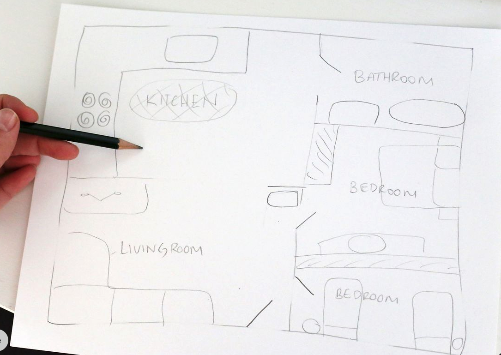

# Nutikodu Võrgulahenduse Planeerimine

## Võrgutopoloogia Alused

Võrgutopoloogia kirjeldab, kuidas võrguseadmed on omavahel ühendatud. IoT-lahenduste puhul on õige topoloogia valimine ülioluline, sest seadmete arv on suur ja nende paigutus varieeruv.

### Levinud Topoloogia Tüübid IoT-Võrkude jaoks

- **Täht-topoloogia** on koduvõrkudes kõige tavalisem, kus üks keskne seade (ruuter või kommutaator) ühendab kõik teised seadmed otse. See pakub lihtsat seadistust ja haldust, kuid loob ühe tõrkepunkti.
  
- **Mesh-võrk** koosneb mitmest võrdsest sõlmpunktist, mis suhtlevad omavahel otse. Kui üks sõlm rikneb, leiab võrk automaatselt uue marsruudi. See topoloogia toimib eriti hästi suurtes kodudes või mitmekorruselistes hoonetes, kus üks ruuter ei suuda tagada piisavat leviala.
  
- **Hübriid-topoloogia** kombineerib elemente erinevatest topoloogiatest. Näiteks võib põhivõrk kasutada täht-konfiguratsiooni, samas kui kaugemad punktid ühenduvad mesh-süsteemi kaudu.

## WiFi Levi Planeerimine

Optimaalne WiFi levi sõltub mitmest tegurist. Tavaline kodune ruuter katab umbes 80-100m² avatud ruumi, kuid betoonist seinad võivad leviala vähendada kuni 50%, samas kui puit või kipsplaat vähendab seda 10-20%. Metallpinnad ja mikrolaineahju tüüpi seadmed võivad signaali märkimisväärselt blokeerida.

### Ideaalse Ruuteri Paigutuse Soovitused:
- Paigutage see kodu keskele
- Asetage see võimalikult kõrgele
- Hoidke eemal suurtest metallpindadest ja elektriseadmetest
- Paigutage antennid vertikaalselt, kui need on välised

### WiFi Lahendused, Kui Üks Ruuter Ei Katab Kogu Kodu:
1. **WiFi leviala laiendajad** (lihtsad, kuid vähendavad tihti kiirust)
2. **Pääsupunktid** (vajavad juhtmega ühendust ruuterini)
3. **Mesh-süsteemid** (mitu seadet, mis loovad ühtse võrgu ilma kiiruskadudeta)

## IP-Aadresside Planeerimine

Korralik IP-aadresside planeerimine on IoT-võrgu alus. Enamik koduvõrke kasutab privaatseid IP-aadresse vahemikes nagu 192.168.0.0/24, 10.0.0.0/8 või 172.16.0.0/12.

### Tüüpiline DHCP Konfiguratsioon:
- **Gateway (ruuter):** 192.168.1.1
- **DHCP vahemik:** 192.168.1.100 - 192.168.1.200 (dünaamilised aadressid)
- **Staatiliste IP-de vahemik:** 192.168.1.2 - 192.168.1.99 (käsitsi määratud)

### Staatiliste IP-de Kasutamine:
Staatilisi IP-aadresse tuleks kasutada seadmetel, mis vajavad stabiilset juurdepääsu, nagu võrguprinterid, meediaserverid ja turvakaamerad.

## Võrgu Segmenteerimine ja Turvalisus

Võrgu segmenteerimine on IoT-lahenduste puhul hädavajalik, sest paljudel IoT-seadmetel puudub piisav turvalisus. Eraldi võrkude loomine erinevatele seadmetele suurendab turvalisust.

### Võrgu Segmenteerimise Struktuur:
- **Põhivõrk:** Arvutid, telefonid, tahvelarvutid (kõrgeim turvalisus)
- **IoT-võrk:** Nutilambid, termostaadid, sensorid (keskmine turvalisus)
- **Külalisvõrk:** Külastajate seadmed piiratud juurdepääsuga (madalaim turvalisus)

### Segmenteerimise Meetodid:
- Erinevad **SSID-d** samal ruuteril
- **VLAN-id** võimekama võrguvarustuse puhul
- Täiesti eraldi ruuterid kriitiliste süsteemide jaoks

### Turvameetmed:
- Kasutage **WPA2/WPA3** protokolli WiFi jaoks
- **MAC-aadresside filtreerimine** lisaturvameetmena
- **Ruuteri püsivara regulaarne uuendamine** ja vaikeparoolide muutmine kõigil seadmetel

## Praktiline Õppeülesande Näide: Maria 2-Toaline Korter

Joonistamise jaoks saad kaustada:
[https://www.hamina.com/](https://www.hamina.com/)

Või käsitsi joonistada:

### Kodu Kirjeldus:
- **Korteri suurus:** 58m² (2-toaline)
- **Ruumide paigutus:** elutuba koos köögiga, eraldi magamistuba, vannituba, väike esik
- **Põhiplaan:** Elutuba ja magamistuba on kõrvuti, köök on avatud elutoale

### Olemasolevad ja Planeeritavad Seadmed:
- **Nutikodu seadmed:**
  - 2 valgusandurit (üks elutoas, teine magamistoas)
  - 1 ukseandur (välisuksel)
  - Kütteandur (termostaadid mõlemas toas)
  - Kassi automaatne söötja
  - Kassi automaatne peldik
- **Tavalised võrguseadmed:**
  - Sülearvuti
  - Telekas (Smart TV)
  - Nutitelefon
  - Elektrooniline köögiahi

### Võrgulahendus:

#### Võrgutopoloogia Valik:
- Kasutan **täht-topoloogiat**, kus keskne ruuter on ühenduspunktiks kõigile seadmetele. Kuna korter on väike (58m²), siis üks kvaliteetne ruuter peaks tagama piisava leviala kogu korteris.

#### WiFi Planeerimine:
- **Ruuteri asukoht:** elutoas telekariiuli kõrval (korteri keskosas)
- **WiFi ruuteri valik:** Dual-band ruuter, mis toetab 2.4GHz võrku IoT seadmete jaoks ja 5GHz võrku arvutite ning TV jaoks
- **2.4GHz võrgu leviala** katab kogu korteri
- **Kiirus:** 100Mbps internetiühendus on piisav kõigi seadmete jaoks

#### IP-Aadresside Plaan:
- **Gateway (ruuter):** 192.168.1.1
- **DHCP vahemik tavaseadmetele:** 192.168.1.100 - 192.168.1.200
- **Staatiliste IP-de vahemik IoT seadmetele:** 192.168.1.10 - 192.168.1.50

#### Konkreetsed IP-aadressid:
- **Smart TV:** 192.168.1.10
- **Kütteandur elutoas:** 192.168.1.20
- **Kütteandur magamistoas:** 192.168.1.21
- **Valgusandur elutoas:** 192.168.1.30
- **Valgusandur magamistoas:** 192.168.1.31
- **Ukseandur:** 192.168.1.32
- **Kassi söötja:** 192.168.1.40
- **Kassi peldik:** 192.168.1.41
- **Elektrooniline ahi:** 192.168.1.50

#### Võrgu Segmenteerimine:
- Loon kaks eraldi WiFi võrku:
  1. **"Maria-Kodu"** (WPA3 krüpteeringuga) - arvuti, telefon, TV
  2. **"Maria-IoT"** (WPA2 krüpteeringuga) - kõik nutiseadmed, andurid, kassi seadmed, ahi

#### Turvalisuse Tagamine:
1. Mõlema WiFi võrgu jaoks tugevad ja erinevad paroolid
2. IoT seadmete võrgule rakendatud **MAC-aadresside filtreerimine**
3. **Ruuteri tarkvara regulaarne uuendamine** (seadistan automaatsed uuendused)
4. Kõigil seadmetel vaikeparoolide muutmine unikaalsete tugevate paroolidega
5. **Koduautomaatika hubi** (nt Home Assistant) paigaldamine Raspberry Pi-le, mis võimaldab keskselt hallata kõiki IoT seadmeid

#### Ethernet-ühendused:
- **Smart TV** ühendatakse ruuteriga Ethernet kaabliga (2m + 30% varu = 2.6m)
- **Koduautomaatika server (Raspberry Pi)** ühendatakse samuti Ethernet kaabliga (1.5m + 30% varu = 2m)

#### IoT Seadmete Integratsioon:
- Kõik andurid (valgus, uks, küte) integreeritakse läbi **Home Assistanti**, mis võimaldab luua automatiseerimisi:
  - Näiteks, valgusandur tuvastes pimeduse saadab signaali lambile, et see süttiks
  - Ukseandur saadab teavituse, kui keegi siseneb korterisse
  - Kütteandur hoiab ruumides optimaalset temperatuuri ja kohandab kütmist vastavalt kellaajale

## Praktilised Näited ja Arvutused

### Suurema Maja Planeerimine:
Kujutage ette 180m² kodu, mis vajab terviklikku IoT-katet. Arvestades, et üks pääsupunkt katab umbes 80m² (arvestades seinu), vajate kolme pääsupunkti (180/80 ≈ 2,25, ümardatud üles 3-ni).

### Etherneti Kaabli Planeerimine:
Kaabli pikkus = Otsetee kaugus + 30% varu
Näide: 5m kauguse korral ruuterist arvutini oleks vajalik kaabli pikkus 5m + 1,5m = 6,5m

### IP-Aadresside Jagamine Mitme Võrgu Vahel:
- **Põhivõrk:** 192.168.1.0/24 (256 aadressi)
- **IoT-seadmete võrk:** 192.168.2.0/24 (256 aadressi)
- **Külaliste võrk:** 192.168.3.0/24 (256 aadressi)

## Olulised Kaalutlused IoT-Võrkudele

### Ühenduse Tüübi Valik:
Kasutage juhtmega ühendusi statsionaarsete seadmete jaoks, mis vajavad suurt andmeedastust (arvutid, televiisorid, mängukonsoolid). Juhtmeta ühendused sobivad paremini mobiilsetele seadmetele ja enamikule IoT-anduritele.

### IoT-Turvalisuse Isoleerimine:
Paigutage IoT-seadmed eraldi võrku (VLAN või eraldi WiFi SSID) ilma juurdepääsuta teie peamiste seadmete võrgule, et vältida turbekomapromisse.

### Püsivara Halduse Tähtsus:
Kontrollige võrguseadmete uuendusi kord kvartalis või lubage automaatsed uuendused, kui see on võimalik.

### Kaugjuurdepääsu Turvalisus:
Kaaluge **VPN-i** rakendamist, kui soovite koduvõrguga turvaliselt ühenduda väljastpoolt või soovite täiendavat privaatsuskihti.

## Kokkuvõte

Edukas IoT-võrgu planeerimine nõuab hoolikat kaalumist:
- Sobiv võrgutopoloogia, mis põhineb kodu suurusel ja kujul
- Optimeeritud WiFi levi strateegilise paigutuse ja vajadusel signaalivõimendajate abil
- Loogiline ja tulevikukindel IP-aadresside jaotamine
- Võrgu segmenteerimine erinevat tüüpi seadmete jaoks
- Mitmekihilise turbe rakendamine

Hästi planeeritud võrk tagab kõigi IoT-seadmete sujuva ja turvalise töö nii praegu kui ka tulevikus.