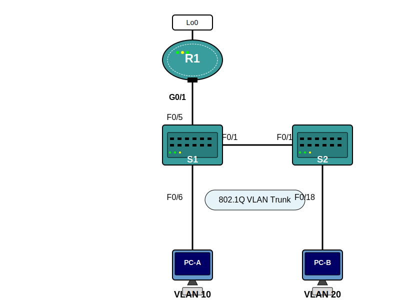

# Lab_22: Troubleshooting Inter-VLAN Routing

## Topology


## Addressing Table

| Device | Interface | IP Address | Subnet Mask | Default Gateway |
|--------|-----------|------------|-------------|-----------------|
| R1 | G0/1.1 | 192.168.1.1 | 255.255.255.0 | N/A |
| | G0/1.10 | 192.168.10.1 | 255.255.255.0 | N/A |
| | G0/1.20 | 192.168.20.1 | 255.255.255.0 | N/A |
| | Lo0 | 209.165.200.225 | 255.255.255.224 | N/A |
| S1 | VLAN 1 | 192.168.1.11 | 255.255.255.0 | 192.168.1.1 |
| S2 | VLAN 1 | 192.168.1.12 | 255.255.255.0 | 192.168.1.1 |
| PC-A | NIC | 192.168.10.3 | 255.255.255.0 | 192.168.10.1 |
| PC-B | NIC | 192.168.20.3 | 255.255.255.0 | 192.168.20.1 |

## Switch Port Assignment Specifications

| Ports | Assignment | Network |
|-------|------------|---------|
| S1 F0/1 | 802.1Q Trunk | N/A |
| S2 F0/1 | 802.1Q Trunk | N/A |
| S1 F0/5 | 802.1Q Trunk | N/A |
| S1 F0/6 | VLAN 10 – R&D | 192.168.10.0/24 |
| S2 F0/18 | VLAN 20 – Engineering | 192.168.20.0/24 |

## Objectives
- Part 1: Build the Network and Load Device Configurations
- Part 2: Troubleshoot the Inter-VLAN Routing Configuration
- Part 3: Verify VLAN Configuration, Port Assignment, and Trunking
- Part 4: Test Layer 3 Connectivity

## Background / Scenario
The network has been designed and configured to support three VLANs. Inter-VLAN routing is provided by an external router using an 802.1Q trunk, also known as router-on-a-stick. Routing to a remote web server, which is simulated by Lo0, is also provided by R1. However, it is not working as designed, and user complaints have not given much insight into the source of the problems.

In this lab, you must first define what is not working as expected, and then analyze the existing configurations to determine and correct the source of the problems. This lab is complete when you can demonstrate IP connectivity between each of the user VLANs and the external web server network, and between the switch management VLAN and the web server network.

## Required Resources
- 1 Router (Cisco 1941 with Cisco IOS Release 15.2(4)M3 universal image or comparable)
- 2 Switches (Cisco 2960 with Cisco IOS Release 15.0(2) lanbasek9 image or comparable)
- 2 PCs (Microsoft Windows with terminal emulation program)
- Console cables to configure the Cisco IOS devices via the console ports
- Ethernet cables as shown in the topology

## Part 1: Build the Network and Load Device Configurations

### Step 1: Cable the network as shown in the topology.
Connect devices according to the following topology:
- Connect R1 G0/1 to S1 F0/5
- Connect S1 F0/1 to S2 F0/1 
- Connect PC-A to S1 F0/6
- Connect PC-B to S2 F0/18

### Step 2: Configure PC hosts.
Configure PC-A:
- IP Address: 192.168.10.3
- Subnet Mask: 255.255.255.0
- Default Gateway: 192.168.10.1

Configure PC-B:
- IP Address: 192.168.20.3
- Subnet Mask: 255.255.255.0
- Default Gateway: 192.168.20.1

### Step 3: Load router and switch configurations.
Load the following configurations into the appropriate router or switch. All devices have the same passwords; the enable password is class, and the line password is cisco.

**Router R1 Configuration:**
```
hostname R1
enable secret class
no ip domain lookup
line con 0
password cisco
login
logging synchronous
line vty 0 4
password cisco
login
interface loopback0
ip address 209.165.200.225 255.255.255.224
interface gigabitEthernet0/1
no ip address
! no shutdown
interface gigabitEthernet0/1.1
encapsulation dot1q 11
! encapsulation dot1q 1
ip address 192.168.1.1 255.255.255.0
interface gigabitEthernet0/1.10
encapsulation dot1q 10
ip address 192.168.11.1 255.255.255.0
! ip address 192.168.10.1 255.255.255.0
interface gigabitEthernet0/1.20
encapsulation dot1q 20
ip address 192.168.20.1 255.255.255.0
end
```

**Switch S1 Configuration:**
```
hostname S1
enable secret class
no ip domain-lookup
line con 0
password cisco
login
logging synchronous
line vty 0 15
password cisco
login
vlan 10
name R&D
exit
!vlan 20
! name Engineering
! exit
interface fastethernet0/1
switchport mode access
! switchport mode trunk
interface fastethernet0/5
switchport mode trunk
!interface fastethernet0/6
! switchport access vlan 10
! switchport mode access
interface vlan1
ip address 192.168.1.11 255.255.255.0
ip default-gateway 192.168.1.1
end
```

**Switch S2 Configuration:**
```
hostname S2
enable secret class
no ip domain-lookup
line con 0
password cisco
login
logging synchronous
line vty 0 15
password cisco
login
!vlan 10
! name R&D
! exit
vlan 20
name Engineering
exit
interface fastethernet0/1
switchport mode trunk
interface fastethernet0/18
switchport access vlan 10
switchport mode access
! switchport access vlan 20
interface vlan1
ip address 192.168.1.12 255.255.255.0
ip default-gateway 192.168.1.1
end
```

### Step 4: Save the running configuration to the startup configuration.
On each device, use the `copy running-config startup-config` command to save your configuration.

## Part 2: Troubleshoot the Inter-VLAN Routing Configuration

### Step 1: Verify the routing table on R1
Use the `show ip route` command to view the routing table on R1.

You should see that only the 209.165.200.224 network is present, but the 192.168.1.0, 192.168.10.0, and 192.168.20.0 networks are missing.

### Step 2: Examine interface status on R1
Use the `show ip interface brief` command to check the status of the interfaces on R1.

You will likely see that the GigabitEthernet0/1 interface is administratively down. Additionally, there's an IP addressing issue on the G0/1.10 subinterface.

### Step 3: Fix identified issues on R1
To resolve these issues:
1. Enable the main interface:
   ```
   R1(config)# interface g0/1
   R1(config-if)# no shutdown
   ```

2. Fix the IP address on the G0/1.10 subinterface:
   ```
   R1(config)# interface g0/1.10
   R1(config-subif)# ip address 192.168.10.1 255.255.255.0
   ```

3. Fix the VLAN encapsulation on the G0/1.1 subinterface:
   ```
   R1(config)# interface g0/1.1
   R1(config-subif)# encapsulation dot1q 1
   ```

### Step 4: Verify the routing table again
After making these changes, check the routing table again with `show ip route` to ensure all networks are now listed.

## Part 3: Verify VLAN Configuration, Port Assignment, and Trunking

### Step 1: Verify VLAN configuration and port assignments on S1
Use the `show vlan brief` command on S1 to view the VLAN database.

You will notice:
- VLAN 20 (Engineering) is missing
- Port F0/6 is not assigned to VLAN 10

To fix these issues:
```
S1(config)# vlan 20
S1(config-vlan)# name Engineering
S1(config-vlan)# exit
S1(config)# interface fa0/6
S1(config-if)# switchport mode access
S1(config-if)# switchport access vlan 10
```

### Step 2: Verify VLAN configuration and port assignments on S2
Use the `show vlan brief` command on S2 to view the VLAN database.

You will notice:
- VLAN 10 has no name
- Port F0/18 is assigned to VLAN 10 instead of VLAN 20

To fix these issues:
```
S2(config)# vlan 10
S2(config-vlan)# name R&D
S2(config-vlan)# exit
S2(config)# interface fa0/18
S2(config-if)# switchport access vlan 20
```

### Step 3: Verify trunking interfaces on S1
Use the `show interface trunk` command to view the trunking interfaces on S1.

You will notice that F0/1 is not in trunking mode. To fix this:
```
S1(config)# interface fa0/1
S1(config-if)# switchport mode trunk
```

### Step 4: Verify trunking interfaces on S2
Use the `show interface trunk` command to view the trunking interfaces on S2.

Confirm that F0/1 is properly configured as a trunk port.

## Part 4: Test Layer 3 Connectivity

### Step 1: Test connectivity from PC-A
From PC-A, test connectivity to:
- The default gateway (192.168.10.1)
- PC-B (192.168.20.3)
- The loopback interface on R1 (209.165.200.225)
- S1 (192.168.1.11)
- S2 (192.168.1.12)

### Step 2: Perform tracert to identify routing issues
If connectivity to the switches fails, use the `tracert` command to help identify where the communication is failing:
```
C:\Users\User1> tracert 192.168.1.11
```

### Step 3: Verify R1 subinterface configurations
Use the `show run | section interface` command to verify the configuration of all interfaces, particularly the VLAN encapsulation on subinterfaces.

The issues you might find include:
- The native VLAN on G0/1.1 is incorrectly set to VLAN 11 instead of VLAN 1
- Fix this with:
  ```
  R1(config)# interface g0/1.1
  R1(config-subif)# encapsulation dot1q 1
  ```

### Step 4: Final connectivity tests
After resolving all identified issues, verify full connectivity between all devices in the network.

## Reflection
Viewing the routing table is advantageous for troubleshooting purposes because all configured interfaces and subinterfaces are listed and can be easily examined for errors. This allows for quick identification of missing networks, incorrect IP addressing, or interface status issues.

## Troubleshooting Commands Reference

| Command | Purpose |
|---------|---------|
| `show vlan brief` | Displays VLAN information and port assignments |
| `show interfaces trunk` | Displays trunk port information |
| `show running-config interface interface_id` | Displays configuration for a specific interface |
| `show ip interface brief` | Displays status and IP address info for all interfaces |
| `show ip route` | Displays the routing table |
| `debug ip icmp` | Displays ICMP debugging messages for ping troubleshooting |
| `tracert ip_address` | Traces the path to a destination (from PC command prompt) |