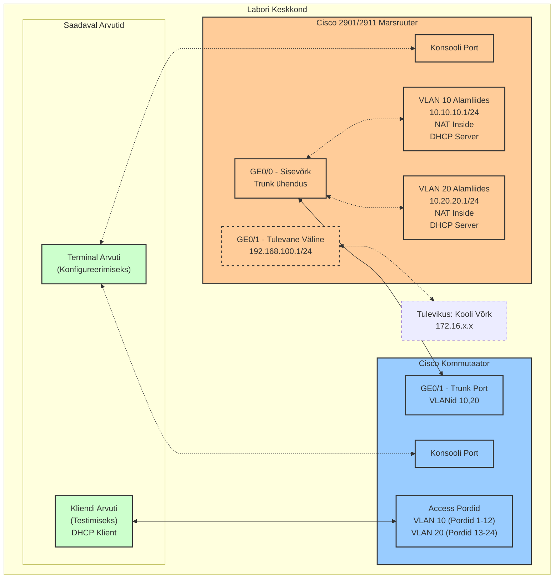

# Labor 26: Cisco 2901/2911 Marsruuteri ja Kommutaatori Seadistamine

## Labori Ülevaade

Selles laboris seadistate ja konfigureerite Cisco 2901/2911 marsruuteri ja Cisco Catalyst kommutaatori, et luua väike võrk mitme VLAN-iga, DHCP teenusega ja NAT-iga tulevase välisühenduse jaoks. Õpite, kuidas füüsiliselt ühendada võrguseadmeid, teostada algset konfiguratsiooni, seadistada VLAN-e ja kontrollida oma konfiguratsiooni sobivate käskudega.

## Võrgukomponentide Eesmärgid ja Kasud

### VLAN-ide Seadistamine
VLAN-ide (virtuaalsete kohtvõrkude) seadistamine võimaldab meil:
- **Jagada võrku loogilisteks osadeks** ilma füüsilisi seadmeid lisamata
- **Parandada turvalisust** eraldades erinevad kasutajagrupid (õpilased ja õpetajad) üksteisest
- **Vähendada leviedastuse (broadcast) liiklust**, mis tõstab võrgu jõudlust
- **Lihtsustada võrgu haldamist**, kuna muudatusi saab teha keskselt
- **Optimeerida ressursside kasutust** ühel füüsilisel seadmel

Praktikas tähendab see, et õpetajate arvutid VLAN 20-s ei näe õpilaste võrguliiklust VLAN 10-s, isegi kui nad on ühendatud sama kommutaatoriga.

### DHCP Teenuse Seadistamine
DHCP (Dynamic Host Configuration Protocol) seadistamine annab meile:
- **Automaatne võrgukonfiguratsioon** klientseadmetele, mis vähendab vigade võimalust
- **Tsentraalne IP-aadresside haldamine**, mis lihtsustab administreerimist
- **Ressursside dünaamiline jaotamine**, mis tagab efektiivse IP-aadresside kasutuse
- **Standardiseeritud konfiguratsioon** kõigile klientseadmetele (DNS serverid, vaikelüüs jne)
- **Kergem skaleerimine**, kui võrku tuleb juurde uusi seadmeid

Näiteks kui õpilane ühendab oma arvuti võrku, saab see automaatselt õige IP-aadressi vahemikust 10.10.10.11-254, ilma et administraator peaks käsitsi sekkuma.

### NAT-i Seadistamine
NAT (Network Address Translation) seadistamine võimaldab:
- **Privaatse võrgu ühendamist internetiga** kasutades vähem avalikke IP-aadresse
- **Võrgu turvalisuse suurendamist**, varjates sisemise võrgu struktuuri
- **Kohalike võrkude taaskasutamist** ja konfigureerimist ilma IP konfliktideta
- **Erinevate VLAN-ide ühendamist välisvõrku** üle ühe välisühenduse
- **Liikluse suunamist** läbi tulemüüri või filtrite

Meie seadistuses võivad nii õpilaste (10.10.10.0/24) kui ka õpetajate (10.20.20.0/24) arvutid tulevikus pääseda internetile ligi läbi ühe väljundpunkti (192.168.100.1).

### Alamliideste (Subinterface) Kasutamine
Alamliideste kasutamine marsruuteril annab järgmised eelised:
- **Üks füüsiline port suudab teenindada mitut VLAN-i** läbi trunking protokolli
- **Kokkuhoid riistvaras**, kuna pole vaja eraldi füüsilist liidest iga VLAN-i jaoks
- **Tsentraalne marsruutimine** erinevate VLAN-ide vahel ühe seadmega
- **Lihtsam haldamine**, kuna kõik seadistused on ühes kohas

Meie juhul kasutatakse GigabitEthernet0/0 liidese peal alamliideseid .10 ja .20, mis võimaldab marsruuteril suhelda mõlema VLAN-iga üle ühe füüsilise pordi.

### Trunk Pordi Seadistamine
Trunk pordi seadistamine kommutaatoril:
- **Võimaldab mitme VLAN-i liikluse transportimist** üle ühe füüsilise ühenduse
- **Säilitab VLAN-ide märgendid** IEEE 802.1Q standardi abil
- **Vähendab vajalike füüsiliste portide ja kaablite arvu**
- **Tagab õige liikluse suunamise** erinevate VLAN-ide vahel

Trunk port kommutaatoril (GE0/1) ja marsruuteri "koor"-port (GE0/0) moodustavad ühe loogilise ühenduse, mis kannab mõlema VLAN-i (10 ja 20) andmeid, säilitades nende eraldatuse.

## Seadmed

- 1 Cisco 2901/2911 marsruuter (iga õpilase/rühma kohta)
- 1 Cisco Catalyst kommutaator (iga õpilase/rühma kohta)
- 1 arvuti konsooli ühenduste jaoks (Terminal PC)
- 1 arvuti kliendi testimiseks
- Konsooli kaablid (USB või RJ-45)
- Ethernet patch kaablid
- Patch paneel (labori ühenduste jaoks)

## Võrgu Topoloogia



## IP-aadresside Skeem

| Seade | Liides | IP-aadress | Võrgumask | Kirjeldus | VLAN | NAT Roll |
|--------|-----------|------------|-------------|-------------|------|----------|
| Õpilase-Marsruuter | GigabitEthernet0/0 | N/A | N/A | Trunk Kommutaatoriga | N/A | N/A |
| Õpilase-Marsruuter | GigabitEthernet0/0.10 | 10.10.10.1 | 255.255.255.0 | Õpilaste Võrk | 10 | Inside |
| Õpilase-Marsruuter | GigabitEthernet0/0.20 | 10.20.20.1 | 255.255.255.0 | Õpetajate Võrk | 20 | Inside |
| Õpilase-Marsruuter | GigabitEthernet0/1 | 192.168.100.1 | 255.255.255.0 | Tulevane Väline | N/A | Outside |
| Kliendi Arvuti | Ethernet | DHCP | 255.255.255.0 | Testimise Klient | 10 või 20 | N/A |

## Labori Ülesanded

### Osa 1: Füüsiline Seadistamine ja Ühendused

1. **Marsruuteri Seadistamine:**
   - Leia oma määratud Cisco 2901/2911 marsruuter
   - Ühenda toitekaabel ja lülita marsruuter sisse
   - Oota, kuni marsruuter lõpetab käivitumise (püsiv roheline süsteemi LED)

2. **Kommutaatori Seadistamine:**
   - Leia oma määratud Cisco Catalyst kommutaator
   - Ühenda toitekaabel ja lülita kommutaator sisse
   - Oota, kuni kommutaator lõpetab käivitumise

3. **Konsooli Ühendused:**
   - Ühenda Terminal PC marsruuteri konsooli pordiga patch paneeli kaudu
   - Hiljem vahetad selle ühenduse kommutaatori konsooli pordiga

4. **Võrgu Ühendused:**
   - Ühenda marsruuteri GE0/0 port kommutaatori GE0/1 pordiga patch paneeli kaudu
   - Ühenda Kliendi Arvuti kommutaatori pordiga (port 1-12 VLAN 10 testimiseks)
   - Jäta marsruuteri GE0/1 port ühendamata (tulevase välisühenduse jaoks)

### Osa 2: Seadmete Lähtestamine (Vajadusel)

#### Marsruuteri Lähtestamine
Kui vajad puhast konfiguratsiooni:
```
enable
write erase
reload
```
Kui küsitakse konfiguratsiooni salvestamist, kirjuta "no"

#### Kommutaatori Lähtestamine
Kui vajad puhast konfiguratsiooni:
```
enable
delete flash:vlan.dat
erase startup-config
reload
```
Kui küsitakse konfiguratsiooni salvestamist, kirjuta "no"

### Osa 3: Marsruuteri Konfigureerimine

1. **Marsruuteriga Ühenduse Loomine:**
   - Ava terminali emulatsiooni tarkvara oma Terminal PC-l
   - Seadista parameetrid: 9600 baud, 8 andmebitti, paarsuseta, 1 stoppbitt, ilma vookontrollita
   - Ühenda konsooli pordiga

2. **Riistvara ja NAT Toe Kontrollimine:**
   - Sisene privilegeeritud EXEC režiimi: `enable`
   - Kontrolli marsruuteri mudelit ja IOS-i: `show version`
   - Kontrolli liideste olekut: `show ip interface brief`
   - Kontrolli NAT tuge: `ip nat ?`

3. **Marsruuteri Põhikonfiguratsioon:**
   - Sisene konfiguratsiooni režiimi: `configure terminal`
   - Määra hostnimi (kasuta oma nime): `hostname [SinuNimi]-Router`
   - Seadista põhiline turvalisus:
     ```
     enable secret cisco
     line console 0
     password cisco
     login
     exit
     ```

4. **Liideste Konfigureerimine:**
   - Seadista peamine liides:
     ```
     interface GigabitEthernet0/0
     description Connection to Internal Switch
     no shutdown
     exit
     ```
   - Seadista VLAN-i alamliidesed:
     ```
     interface GigabitEthernet0/0.10
     encapsulation dot1Q 10
     ip address 10.10.10.1 255.255.255.0
     exit
     
     interface GigabitEthernet0/0.20
     encapsulation dot1Q 20
     ip address 10.20.20.1 255.255.255.0
     exit
     ```
   - Seadista tulevane väline liides:
     ```
     interface GigabitEthernet0/1
     description Future External Connection
     ip address 192.168.100.1 255.255.255.0
     no shutdown
     exit
     ```

5. **NAT Konfigureerimine:**
   - Märgi sisemised liidesed:
     ```
     interface GigabitEthernet0/0.10
     ip nat inside
     exit
     
     interface GigabitEthernet0/0.20
     ip nat inside
     exit
     ```
   - Märgi väline liides:
     ```
     interface GigabitEthernet0/1
     ip nat outside
     exit
     ```
   - Loo pääsuloend ja NAT reegel:
     ```
     access-list 1 permit 10.10.10.0 0.0.0.255
     access-list 1 permit 10.20.20.0 0.0.0.255
     ip nat inside source list 1 interface GigabitEthernet0/1 overload
     ```

6. **DHCP Konfigureerimine:**
   - Seadista DHCP VLAN 10 jaoks:
     ```
     ip dhcp excluded-address 10.10.10.1 10.10.10.10
     ip dhcp pool StudentNet
     network 10.10.10.0 255.255.255.0
     default-router 10.10.10.1
     dns-server 8.8.8.8 8.8.4.4
     domain-name lab.local
     exit
     ```
   - Seadista DHCP VLAN 20 jaoks:
     ```
     ip dhcp excluded-address 10.20.20.1 10.20.20.10
     ip dhcp pool TeacherNet
     network 10.20.20.0 255.255.255.0
     default-router 10.20.20.1
     dns-server 8.8.8.8 8.8.4.4
     domain-name lab.local
     exit
     ```

7. **Kontrollimise Käsud:**
   - Kontrolli alamliideste konfiguratsiooni: 
     ```
     show running-config interface GigabitEthernet0/0.10
     ```
     (TEE EKRAANIPILT #1)
     
     **Nõue ekraanipildile:** Peab olema näha encapsulation dot1Q seadistus, IP-aadress 10.10.10.1, ja "ip nat inside" seadistus
     
   - Kontrolli NAT konfiguratsiooni:
     ```
     show ip nat statistics
     ```
     (TEE EKRAANIPILT #2)
     
     **Nõue ekraanipildile:** Peab olema näha aktiivsed NAT tõlked, inside ja outside liidesed, pääsuloendi number 1 kasutus

8. **Salvesta Konfiguratsioon:**
   ```
   copy running-config startup-config
   ```

### Osa 4: Kommutaatori Konfigureerimine

1. **Kommutaatoriga Ühenduse Loomine:**
   - Ühenda konsoolikaabel marsruuterist lahti
   - Ühenda konsoolikaabel kommutaatori konsooli pordiga patch paneeli kaudu
   - Veendu, et terminal PC-l on terminali emulatsiooni tarkvara jätkuvalt avatud
   - Kontrolli terminali seadeid: 9600 baud, 8-N-1, no flow control

2. **Kommutaatori Põhikonfiguratsioon:**
   - Sisene privilegeeritud EXEC režiimi: `enable`
   - Kontrolli kommutaatori mudelit ja tarkvara versiooni: `show version`
   - Sisene konfiguratsiooni režiimi: `configure terminal`
   - Määra kommutaatorile oma nimi: `hostname [SinuNimi]-Switch`
   - Seadista põhiline turvalisus:
     ```
     enable secret cisco
     line console 0
     password cisco
     login
     exit
     service password-encryption
     banner motd # Autoriseerimata juurdepääs on keelatud! #
     ```

3. **VLAN-i Konfigureerimine:**
   - Loo VLAN 10 õpilaste jaoks:
     ```
     vlan 10
     name Students
     exit
     ```
   
   - Loo VLAN 20 õpetajate jaoks:
     ```
     vlan 20
     name Teachers
     exit
     ```
   
   - Määra esimesed pordid VLAN 10-sse (õpilaste võrk):
     ```
     interface range fastethernet0/1-12
     switchport mode access
     switchport access vlan 10
     description Student Access Ports
     no shutdown
     exit
     ```
   
   - Määra järgmised pordid VLAN 20-sse (õpetajate võrk):
     ```
     interface range fastethernet0/13-24
     switchport mode access
     switchport access vlan 20
     description Teacher Access Ports
     no shutdown
     exit
     ```
   
   - Seadista trunk port marsruuteri ühenduse jaoks:
     ```
     interface gigabitethernet0/1
     description Trunk to Router
     switchport mode trunk
     switchport trunk allowed vlan 10,20
     switchport trunk native vlan 1
     no shutdown
     exit
     ```
   
   - Lülita välja kõik kasutamata pordid (kui on):
     ```
     interface range gigabitethernet0/2-24
     shutdown
     exit
     ```

4. **Kommutaatori Haldusfunktsioonid (Valikuline):**
   - Seadista SSH ligipääs (kui on vaja):
     ```
     ip domain-name lab.local
     crypto key generate rsa modulus 1024
     username admin secret cisco
     line vty 0 15
     transport input ssh
     login local
     exit
     ```

5. **Kontrollimise Käsud:**
   - Kontrolli loodud VLAN-e ja nendega seotud porte:
     ```
     show vlan brief
     ```
     (TEE EKRAANIPILT #3)
     
     **Nõue ekraanipildile:** Peab olema näha VLAN 10 (Students) ja VLAN 20 (Teachers) ning neile määratud pordid
     
   - Kontrolli trunk pordi seadistust:
     ```
     show interfaces gigabitethernet0/1 trunk
     ```
     (TEE EKRAANIPILT #4)
     
     **Nõue ekraanipildile:** Peab olema näha trunk pordi režiim ja lubatud VLAN-id (10 ja 20)
   
   - Kontrolli kõigi liideste olekut ja määranguid:
     ```
     show interfaces status
     ```
   
   - Kontrolli kommutaatori jooksva konfiguratsiooni VLAN osa:
     ```
     show running-config | include interface|vlan|switchport
     ```

6. **Salvesta Konfiguratsioon:**
   ```
   copy running-config startup-config
   ```
   Kinnita küsimuse korral vajutades Enter

### Osa 5: Kliendi Testimine

1. **VLAN 10 Testimine:**
   - Veendu, et Kliendi Arvuti on ühendatud VLAN 10 pordiga (pordid 1-12)
   - Seadista Kliendi Arvuti DHCP-le (kui veel pole)
   - Ava Käsurida Kliendi Arvutil
   - Kontrolli IP-konfiguratsiooni: 
     ```
     ipconfig /all
     ```
     (TEE EKRAANIPILT #5)
     
     **Nõue ekraanipildile:** Peab olema näha DHCP-lt saadud IP-aadress 10.10.10.xx vahemikust, vaikelüüs 10.10.10.1, ja DNS serverid
     
   - Kontrolli ühenduvust: 
     ```
     ping 10.10.10.1
     ```

2. **VLAN 20 Testimine:**
   - Liiguta Kliendi Arvuti ühendus VLAN 20 pordile (pordid 13-24) patch paneeli kaudu
   - Uuenda DHCP: 
     ```
     ipconfig /release
     ipconfig /renew
     ```
   - Kontrolli IP-konfiguratsiooni: 
     ```
     ipconfig /all
     ```
   - Kontrolli ühenduvust: 
     ```
     ping 10.20.20.1
     ```

3. **Lõplik Marsruuteri Kontrollimine:**
   - Ühenda konsool uuesti marsruuteriga patch paneeli kaudu
   - Kontrolli DHCP seoseid: 
     ```
     show ip dhcp binding
     ```
   - Kontrolli NAT statistikat: 
     ```
     show ip nat statistics
     ```

## Esitamise Nõuded

### Tähtis: Esita dokument, mis sisaldab AINULT järgmised osad:

1. **Päis**: 
   - Sinu täisnimi (eesnimi ja perenimi)
   - Kuupäev (vormingus PP.KK.AAAA)
   - Rühmatähis (näiteks IT24)

2. **Ekraanipildid**: Tee ja esita AINULT need 5 konkreetset ekraanipilti koos lühikirjeldustega:
   - **Ekraanipilt 1**: Marsruuteri alamliideste konfiguratsioon (`show running-config interface GigabitEthernet0/0.10`)
     * _Peab olema näha: encapsulation dot1Q seadistus, IP-aadress 10.10.10.1, ja "ip nat inside" seadistus_
   
   - **Ekraanipilt 2**: Marsruuteri NAT statistika (`show ip nat statistics`)
     * _Peab olema näha: aktiivsed NAT tõlked, inside ja outside liidesed, pääsuloendi number 1 kasutus_
   
   - **Ekraanipilt 3**: Kommutaatori VLAN-i kokkuvõte (`show vlan brief`)
     * _Peab olema näha: VLAN 10 (Students) ja VLAN 20 (Teachers) ning neile määratud pordid_
   
   - **Ekraanipilt 4**: Kommutaatori trunk pordi konfiguratsioon (`show interfaces gigabitethernet0/1 trunk`)
     * _Peab olema näha: trunk pordi režiim ja lubatud VLAN-id (10 ja 20)_
   
   - **Ekraanipilt 5**: Kliendi arvuti IP konfiguratsiooni näidis (`ipconfig /all` VLAN 10 pordil)
     * _Peab olema näha: DHCP-lt saadud IP-aadress 10.10.10.xx vahemikust, vaikelüüs 10.10.10.1, ja DNS serverid_

3. **Kokkuvõte**: 
   - Kirjuta 5-7 lauset, kus:
     Kirjelda täpset probleemi, millega SINA laboris kokku puutusid, ning milliseid käske kasutasid veaotsinguks ja probleemi lahendamiseks

Märkus: Dokument EI TOHI ületada 3 lehekülge kokku. Kogu tekst peab olema 12pt kirjasuurusega, Arial fondiga.

## Eeldatavad Tulemused

1. Marsruuter peaks olema konfigureeritud:
   - Kahe VLAN-i alamliidesega (10.10.10.1/24 ja 10.20.20.1/24)
   - NAT konfiguratsiooniga tulevase välisühenduse jaoks
   - DHCP teenusega mõlema VLAN-i jaoks

2. Kommutaator peaks olema konfigureeritud:
   - Kahe VLAN-iga (10 ja 20)
   - Pordid 1-12 määratud VLAN 10-le
   - Pordid 13-24 määratud VLAN 20-le
   - GE0/1 seadistatud trunk pordina

3. Kliendi Arvuti peaks:
   - Saama sobiva IP-aadressi DHCP-lt (10.10.10.x või 10.20.20.x)
   - Edukalt suhtlema marsruuteriga