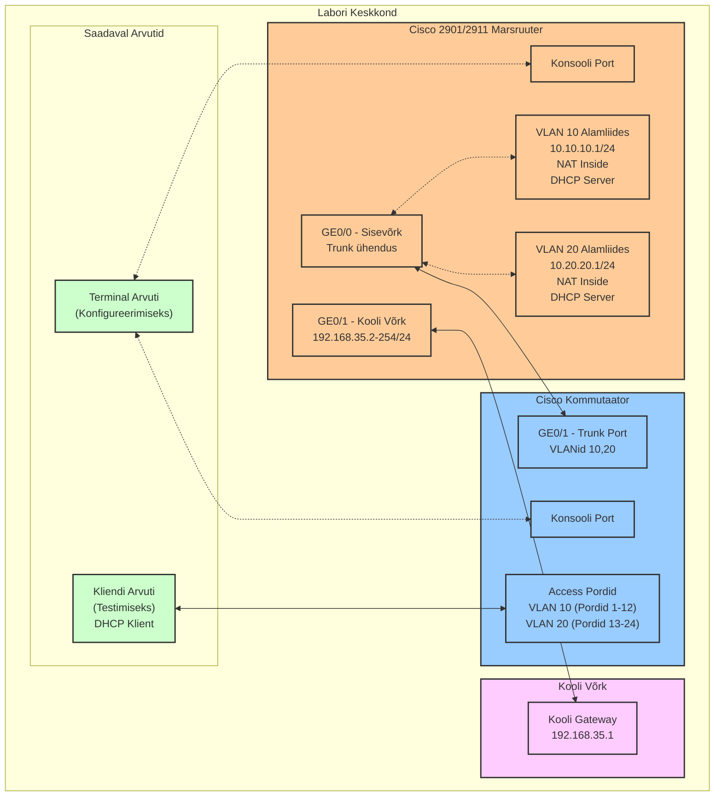

# Labor 26: Cisco 2901/2911 Marsruuteri ja Kommutaatori Seadistamine

## Labori Ülevaade

Selles laboris seadistate ja konfigureerite Cisco 2901/2911 marsruuteri ja Cisco Catalyst kommutaatori, et luua väike võrk mitme VLAN-iga, DHCP teenusega ja NAT-iga kooli võrgu ühenduseks. Õpite, kuidas füüsiliselt ühendada võrguseadmeid, teostada algset konfiguratsiooni, seadistada VLAN-e ja kontrollida oma konfiguratsiooni sobivate käskudega.

## Seadmed

- 1 Cisco 2901/2911 marsruuter (iga õpilase/rühma kohta)
- 1 Cisco Catalyst kommutaator (iga õpilase/rühma kohta)
- 1 arvuti konsooli ühenduste jaoks (Terminal PC)
- 1 arvuti kliendi testimiseks
- Konsooli kaablid (USB või RJ-45)
- Ethernet patch kaablid
- Patch paneel (labori ühenduste jaoks)

## Võrgu Topoloogia



## IP Aadresside Skeem

### Sisevõrgu VLAN-id

| VLAN ID | VLAN Nimi | IP Võrk | Vaikelüüs | DHCP Vahemik |
|---------|-----------|----------|-----------|--------------|
| 10 | Students | 10.10.10.0/24 | 10.10.10.1 | 10.10.10.11 - 10.10.10.254 |
| 20 | Teachers | 10.20.20.0/24 | 10.20.20.1 | 10.20.20.11 - 10.20.20.254 |

### Välisühendus (Kooli Võrk)

| Võrk | Gateway | Marsruuteri IP | Märkused |
|------|---------|----------------|----------|
| 192.168.35.0/24 | 192.168.35.1 | Vali vahemikust 192.168.35.2-254 | [Gdokist võtta endale](https://docs.google.com/spreadsheets/d/1jkSfoy97GF3riLE1zJioKBctpNo7gy8rSXunM9aJIyE/edit?usp=sharing) |

### Seadmete IP-aadressid

| Seade | Liides | IP-aadress | Võrgumask | Kirjeldus | VLAN | NAT Roll |
|--------|-----------|------------|-------------|-------------|------|----------|
| Õpilase-Marsruuter | GigabitEthernet0/0 | N/A | N/A | Trunk Kommutaatoriga | N/A | N/A |
| Õpilase-Marsruuter | GigabitEthernet0/0.10 | 10.10.10.1 | 255.255.255.0 | Õpilaste Võrk | 10 | Inside |
| Õpilase-Marsruuter | GigabitEthernet0/0.20 | 10.20.20.1 | 255.255.255.0 | Õpetajate Võrk | 20 | Inside |
| Õpilase-Marsruuter | GigabitEthernet0/1 | 192.168.35.X | 255.255.255.0 | Kooli Võrk | N/A | Outside |
| Kliendi Arvuti | Ethernet | DHCP | 255.255.255.0 | Testimise Klient | 10 või 20 | N/A |

**Märkus:** Iga õpilane/rühm peab võtam IP mida võttis https://docs.google.com/spreadsheets/d/1jkSfoy97GF3riLE1zJioKBctpNo7gy8rSXunM9aJIyE/edit?usp=sharing, millist IP-aadressi vahemikust 192.168.35.2-254 kasutada.

## Labori Ülesanded

### Osa 1: Füüsiline Seadistamine ja Ühendused

1. **Marsruuteri Seadistamine:**
   - Leia oma määratud Cisco 2901/2911 marsruuter
   - Ühenda toitekaabel ja lülita marsruuter sisse
   - Oota, kuni marsruuter lõpetab käivitumise (püsiv roheline süsteemi LED)

2. **Kommutaatori Seadistamine:**
   - Leia oma määratud Cisco Catalyst kommutaator
   - Ühenda toitekaabel ja lülita kommutaator sisse
   - Oota, kuni kommutaator lõpetab käivitumise

3. **Konsooli Ühendused:**
   - Ühenda Terminal PC marsruuteri konsooli pordiga patch paneeli kaudu
   - Hiljem vahetad selle ühenduse kommutaatori konsooli pordiga

4. **Võrgu Ühendused:**
   - Ühenda marsruuteri GE0/0 port kommutaatori GE0/1 pordiga patch paneeli kaudu
   - Ühenda Kliendi Arvuti kommutaatori pordiga (port 1-12 VLAN 10 testimiseks)
   - **UUS:** Ühenda marsruuteri GE0/1 port kooli võrgu külge patch paneeli kaudu

### Osa 2: Marsruuteri Konfigureerimine

1. **Marsruuteriga Ühenduse Loomine:**
   - Ava terminali emulatsiooni tarkvara oma Terminal PC-l
   - Seadista parameetrid: 9600 baud, 8 andmebitti, paarsuseta, 1 stoppbitt, ilma vookontrollita
   - Ühenda konsooli pordiga

2. **Kontrolli Riistvara ja NAT Tuge:**
   - Sisene privilegeeritud EXEC režiimi: `enable`
   - Kontrolli marsruuteri mudelit: `show version` **(EKRAANIPILT #1)**
   - Kontrolli liideste olekut: `show ip interface brief` **(EKRAANIPILT #2)**
   - Kontrolli NAT tuge: `ip nat ?` **(EKRAANIPILT #3)**

3. **Põhikonfiguratsioon:**
   ```
   configure terminal
   hostname [SinuNimi]-Router
   enable secret cisco
   line console 0
   password cisco
   login
   exit
   ```

4. **Liideste Konfigureerimine:**

   **Sisemised liidesed:**
   ```
   interface GigabitEthernet0/0
   description Connection to Internal Switch
   no shutdown
   exit
   
   interface GigabitEthernet0/0.10
   encapsulation dot1Q 10
   ip address 10.10.10.1 255.255.255.0
   exit
   
   interface GigabitEthernet0/0.20
   encapsulation dot1Q 20
   ip address 10.20.20.1 255.255.255.0
   exit
   ```

   **Väline liides (kooli võrk):**
   ```
   interface GigabitEthernet0/1
   description Connection to School Network
   ip address 192.168.35.[X] 255.255.255.0
   no shutdown
   exit
   ```
   *Asenda [X] oma määratud IP-aadressiga (2-254 vahemikust)*

   **Vaikimisi marsruut:**
   ```
   ip route 0.0.0.0 0.0.0.0 192.168.35.1
   ```

5. **NAT Konfigureerimine:**
   ```
   interface GigabitEthernet0/0.10
   ip nat inside
   exit
   
   interface GigabitEthernet0/0.20
   ip nat inside
   exit
   
   interface GigabitEthernet0/1
   ip nat outside
   exit
   
   access-list 1 permit 10.10.10.0 0.0.0.255
   access-list 1 permit 10.20.20.0 0.0.0.255
   ip nat inside source list 1 interface GigabitEthernet0/1 overload
   ```

6. **DHCP Konfigureerimine:**
   ```
   ip dhcp excluded-address 10.10.10.1 10.10.10.10
   ip dhcp pool StudentNet
   network 10.10.10.0 255.255.255.0
   default-router 10.10.10.1
   dns-server 8.8.8.8 8.8.4.4
   domain-name lab.local
   exit
   
   ip dhcp excluded-address 10.20.20.1 10.20.20.10
   ip dhcp pool TeacherNet
   network 10.20.20.0 255.255.255.0
   default-router 10.20.20.1
   dns-server 8.8.8.8 8.8.4.4
   domain-name lab.local
   exit
   ```

7. **Marsruuteri Kontrollimine:**
   ```
   show running-config interface GigabitEthernet0/0.10
   show running-config interface GigabitEthernet0/0.20
   ```
   **(EKRAANIPILT #4)**
   
   ```
   show ip dhcp pool
   ```
   **(EKRAANIPILT #5)**
   
   ```
   show ip nat statistics
   ```
   **(EKRAANIPILT #6)**

8. **Salvesta Konfiguratsioon:**
   ```
   copy running-config startup-config
   ```
   **(EKRAANIPILT #7)**

### Osa 3: Kommutaatori Konfigureerimine

1. **Kommutaatori Juurdepääs:**
   - Ühenda konsool kommutaatoriga patch paneeli kaudu

2. **Põhikonfiguratsioon:**
   ```
   enable
   configure terminal
   hostname [SinuNimi]-Switch
   enable secret cisco
   line console 0
   password cisco
   login
   exit
   ```

3. **VLAN-ide Konfigureerimine:**
   ```
   vlan 10
   name Students
   exit
   
   vlan 20
   name Teachers
   exit
   
   interface range fastethernet0/1-12
   switchport mode access
   switchport access vlan 10
   exit
   
   interface range fastethernet0/13-24
   switchport mode access
   switchport access vlan 20
   exit
   
   interface gigabitethernet0/1
   switchport mode trunk
   switchport trunk allowed vlan 10,20
   exit
   ```

4. **Kommutaatori Kontrollimine:**
   ```
   show version
   ```
   **(EKRAANIPILT #8)**
   
   ```
   show vlan brief
   ```
   **(EKRAANIPILT #9)**
   
   ```
   show interfaces gigabitethernet0/1 trunk
   ```
   **(EKRAANIPILT #10)**
   
   ```
   show interfaces status
   ```
   **(EKRAANIPILT #11)**

5. **Salvesta Konfiguratsioon:**
   ```
   copy running-config startup-config
   ```
   **(EKRAANIPILT #12)**

### Osa 4: Kliendi Testimine

1. **VLAN 10 Testimine:**
   - Ühenda klient VLAN 10 porti (pordid 1-12)
   - Kontrolli IP konfiguratsiooni: `ipconfig /all` **(EKRAANIPILT #13)**
   - Testi ühenduvust: `ping 10.10.10.1` **(EKRAANIPILT #14)**

2. **VLAN 20 Testimine:**
   - Liiguta klient VLAN 20 porti (pordid 13-24)
   - Uuenda IP: `ipconfig /release` ja `ipconfig /renew`
   - Kontrolli IP konfiguratsiooni: `ipconfig /all` **(EKRAANIPILT #15)**
   - Testi ühenduvust: `ping 10.20.20.1` **(EKRAANIPILT #16)**

3. **Interneti Ühenduvuse Testimine:**
   - Testi ühenduvust kooli võrgu väravaga: `ping 192.168.35.1` **(EKRAANIPILT #17)**
   - Testi interneti ühenduvust: `ping 8.8.8.8` **(EKRAANIPILT #18)**

4. **Lõplik Marsruuteri Kontrollimine:**
   - Ühenda konsool tagasi marsruuterile
   - Kontrolli DHCP seoseid: `show ip dhcp binding`
   - Kontrolli NAT tõlkeid: `show ip nat translations`

## Esitamise Nõuded

Esita dokument, mis sisaldab:

1. **Päis:**
   - Sinu täisnimi
   - Kuupäev
   - Kasutatud välise IP-aadressi (192.168.35.X)

2. **Nõutavad ekraanipildid (18 tk):**
   - Kõik eelpool märgitud ekraanipildid koos lühikirjeldustega

3. **Kokkuvõte:**
   - Lühike kirjeldus, mida õppisid
   - Probleemid, mis tekkisid, ja kuidas neid lahendasid

## Eeldatavad Tulemused

1. **Marsruuter:** Konfigureeritud VLAN-ide, DHCP ja NAT-iga
2. **Kommutaator:** Seadistatud VLAN-id ja trunk port
3. **Klient:** Saab DHCP-lt IP-aadressi ja pääseb internetile ligi
4. **Ühenduvus:** Toimib nii sisevõrgus kui ka välismaailmaga

**Märkus:** Kui interneti ühenduvus ei tööta, kontrolli:
- Kas GE0/1 on ühendatud kooli võrku
- Kas välise IP-aadressi konfiguratsioon on õige
- Kas vaikimisi marsruut on seadistatud