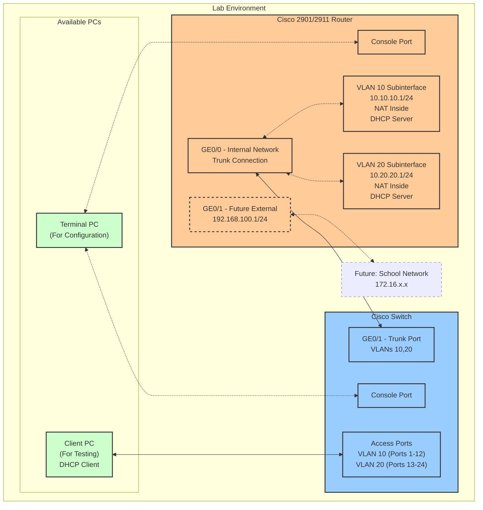

# Lab 26: Cisco 2901/2911 Router and Switch Configuration

## Lab Overview

In this lab, students will set up and configure a Cisco 2901/2911 router and Cisco Catalyst switch to create a small network with multiple VLANs, DHCP service, and NAT for future external connectivity. Students will learn how to physically connect network devices, perform initial configuration, set up VLANs, and verify their configuration with appropriate commands.

## Equipment

- 1 Cisco 2901/2911 Router (per student/group)
- 1 Cisco Catalyst Switch (per student/group)
- 1 PC for console connections (Terminal PC)
- 1 PC for client testing
- Console cables (USB or RJ-45)
- Ethernet patch cables
- Patch panel (for lab connections)

## Network Topology



## IP Addressing Scheme

| Device | Interface | IP Address | Subnet Mask | Description | VLAN | NAT Role |
|--------|-----------|------------|-------------|-------------|------|----------|
| Student-Router | GigabitEthernet0/0 | N/A | N/A | Trunk to Switch | N/A | N/A |
| Student-Router | GigabitEthernet0/0.10 | 10.10.10.1 | 255.255.255.0 | Student Network | 10 | Inside |
| Student-Router | GigabitEthernet0/0.20 | 10.20.20.1 | 255.255.255.0 | Teacher Network | 20 | Inside |
| Student-Router | GigabitEthernet0/1 | 192.168.100.1 | 255.255.255.0 | Future External | N/A | Outside |
| Client PC | Ethernet | DHCP | 255.255.255.0 | Test Client | 10 or 20 | N/A |

## Lab Tasks

### Part 1: Physical Setup and Connections

1. **Router Setup:**
   - Locate your assigned Cisco 2901/2911 router
   - Connect power cable and turn on the router
   - Wait for the router to complete booting (solid green system LED)

2. **Switch Setup:**
   - Locate your assigned Cisco Catalyst switch
   - Connect power cable and turn on the switch
   - Wait for the switch to complete booting

3. **Console Connections:**
   - Connect your Terminal PC to the router's console port using the patch panel
   - You will later switch this connection to the switch's console port

4. **Network Connections:**
   - Connect the router's GE0/0 port to the switch's GE0/1 port using the patch panel
   - Connect the Client PC to a port on the switch (port 1-12 for VLAN 10 testing)
   - Leave the router's GE0/1 port disconnected (for future external connection)

### Part 2: Resetting Devices (If Needed)

#### Router Reset
If you need to start with a clean configuration:
```
enable
write erase
reload
```
When prompted to save the configuration, type "no"

#### Switch Reset
If you need to start with a clean configuration:
```
enable
delete flash:vlan.dat
erase startup-config
reload
```
When prompted to save the configuration, type "no"

### Part 3: Router Configuration

1. **Access the Router:**
   - Open terminal emulation software on your Terminal PC
   - Configure settings: 9600 baud, 8 data bits, no parity, 1 stop bit, no flow control
   - Connect to the console port

2. **Verify Hardware and NAT Support:**
   - Enter privileged EXEC mode: `enable`
   - Check router model and IOS: `show version` (TAKE SCREENSHOT #1)
   - Check interface status: `show ip interface brief` (TAKE SCREENSHOT #2)
   - Verify NAT support: `ip nat ?` (TAKE SCREENSHOT #3)

3. **Basic Router Configuration:**
   - Enter configuration mode: `configure terminal`
   - Set hostname (use your name): `hostname [YourName]-Router`
   - Configure basic security:
     ```
     enable secret cisco
     line console 0
     password cisco
     login
     exit
     ```

4. **Interface Configuration:**
   - Configure main interface:
     ```
     interface GigabitEthernet0/0
     description Connection to Internal Switch
     no shutdown
     exit
     ```
   - Configure VLAN subinterfaces:
     ```
     interface GigabitEthernet0/0.10
     encapsulation dot1Q 10
     ip address 10.10.10.1 255.255.255.0
     exit
     
     interface GigabitEthernet0/0.20
     encapsulation dot1Q 20
     ip address 10.20.20.1 255.255.255.0
     exit
     ```
   - Configure future external interface:
     ```
     interface GigabitEthernet0/1
     description Future External Connection
     ip address 192.168.100.1 255.255.255.0
     no shutdown
     exit
     ```

5. **NAT Configuration:**
   - Mark inside interfaces:
     ```
     interface GigabitEthernet0/0.10
     ip nat inside
     exit
     
     interface GigabitEthernet0/0.20
     ip nat inside
     exit
     ```
   - Mark outside interface:
     ```
     interface GigabitEthernet0/1
     ip nat outside
     exit
     ```
   - Create access list and NAT rule:
     ```
     access-list 1 permit 10.10.10.0 0.0.0.255
     access-list 1 permit 10.20.20.0 0.0.0.255
     ip nat inside source list 1 interface GigabitEthernet0/1 overload
     ```

6. **DHCP Configuration:**
   - Configure DHCP for VLAN 10:
     ```
     ip dhcp excluded-address 10.10.10.1 10.10.10.10
     ip dhcp pool StudentNet
     network 10.10.10.0 255.255.255.0
     default-router 10.10.10.1
     dns-server 8.8.8.8 8.8.4.4
     domain-name lab.local
     exit
     ```
   - Configure DHCP for VLAN 20:
     ```
     ip dhcp excluded-address 10.20.20.1 10.20.20.10
     ip dhcp pool TeacherNet
     network 10.20.20.0 255.255.255.0
     default-router 10.20.20.1
     dns-server 8.8.8.8 8.8.4.4
     domain-name lab.local
     exit
     ```

7. **Verification Commands:**
   - Verify subinterface configuration:
     ```
     show running-config interface GigabitEthernet0/0.10
     show running-config interface GigabitEthernet0/0.20
     ```
     (TAKE SCREENSHOT #4)
   - Verify DHCP configuration:
     ```
     show ip dhcp pool
     ```
     (TAKE SCREENSHOT #5)
   - Verify NAT configuration:
     ```
     show ip nat statistics
     ```
     (TAKE SCREENSHOT #6)

8. **Save Configuration:**
   ```
   copy running-config startup-config
   ```
   (TAKE SCREENSHOT #7)

### Part 4: Switch Configuration

1. **Access the Switch:**
   - Disconnect the console cable from the router and connect it to the switch using the patch panel
   - Connect to the console port in your terminal software

2. **Basic Switch Configuration:**
   - Enter privileged EXEC mode: `enable`
   - Verify switch model: `show version` (TAKE SCREENSHOT #8)
   - Enter configuration mode: `configure terminal`
   - Set hostname (use your name): `hostname [YourName]-Switch`
   - Configure basic security:
     ```
     enable secret cisco
     line console 0
     password cisco
     login
     exit
     ```

3. **VLAN Configuration:**
   - Create VLANs:
     ```
     vlan 10
     name Students
     exit
     
     vlan 20
     name Teachers
     exit
     ```
   - Configure access ports:
     ```
     interface range fastethernet0/1-12
     switchport mode access
     switchport access vlan 10
     exit
     
     interface range fastethernet0/13-24
     switchport mode access
     switchport access vlan 20
     exit
     ```
   - Configure trunk port:
     ```
     interface gigabitethernet0/1
     switchport mode trunk
     switchport trunk allowed vlan 10,20
     exit
     ```

4. **Verification Commands:**
   - Verify VLAN configuration:
     ```
     show vlan brief
     ```
     (TAKE SCREENSHOT #9)
   - Verify trunk configuration:
     ```
     show interfaces gigabitethernet0/1 trunk
     ```
     (TAKE SCREENSHOT #10)
   - Verify interface status:
     ```
     show interfaces status
     ```
     (TAKE SCREENSHOT #11)

5. **Save Configuration:**
   ```
   copy running-config startup-config
   ```
   (TAKE SCREENSHOT #12)

### Part 5: Client Testing

1. **Testing VLAN 10:**
   - Ensure Client PC is connected to a port in VLAN 10 (ports 1-12)
   - Configure Client PC for DHCP (if not already)
   - Open Command Prompt on Client PC
   - Verify IP configuration: `ipconfig /all` (TAKE SCREENSHOT #13)
   - Verify connectivity: `ping 10.10.10.1` (TAKE SCREENSHOT #14)

2. **Testing VLAN 20:**
   - Move Client PC connection to a port in VLAN 20 (ports 13-24) using the patch panel
   - Release/renew DHCP: `ipconfig /release` then `ipconfig /renew`
   - Verify IP configuration: `ipconfig /all` (TAKE SCREENSHOT #15)
   - Verify connectivity: `ping 10.20.20.1` (TAKE SCREENSHOT #16)

3. **Final Router Verification:**
   - Reconnect console to router via patch panel
   - Check DHCP bindings: `show ip dhcp binding` (TAKE SCREENSHOT #17)
   - Check NAT statistics: `show ip nat statistics` (TAKE SCREENSHOT #18)

## Submission Requirements

Submit a document containing:

1. Your name and date
2. All 18 required screenshots with brief descriptions
3. A short paragraph explaining what you learned from this lab

## Expected Results

1. Router should be configured with:
   - Two VLAN subinterfaces (10.10.10.1/24 and 10.20.20.1/24)
   - NAT configuration for future external connectivity
   - DHCP service for both VLANs

2. Switch should be configured with:
   - Two VLANs (10 and 20)
   - Ports 1-12 assigned to VLAN 10
   - Ports 13-24 assigned to VLAN 20
   - GE0/1 configured as a trunk port

3. Client PC should:
   - Receive appropriate IP address from DHCP (10.10.10.x or 10.20.20.x)
   - Successfully communicate with the router