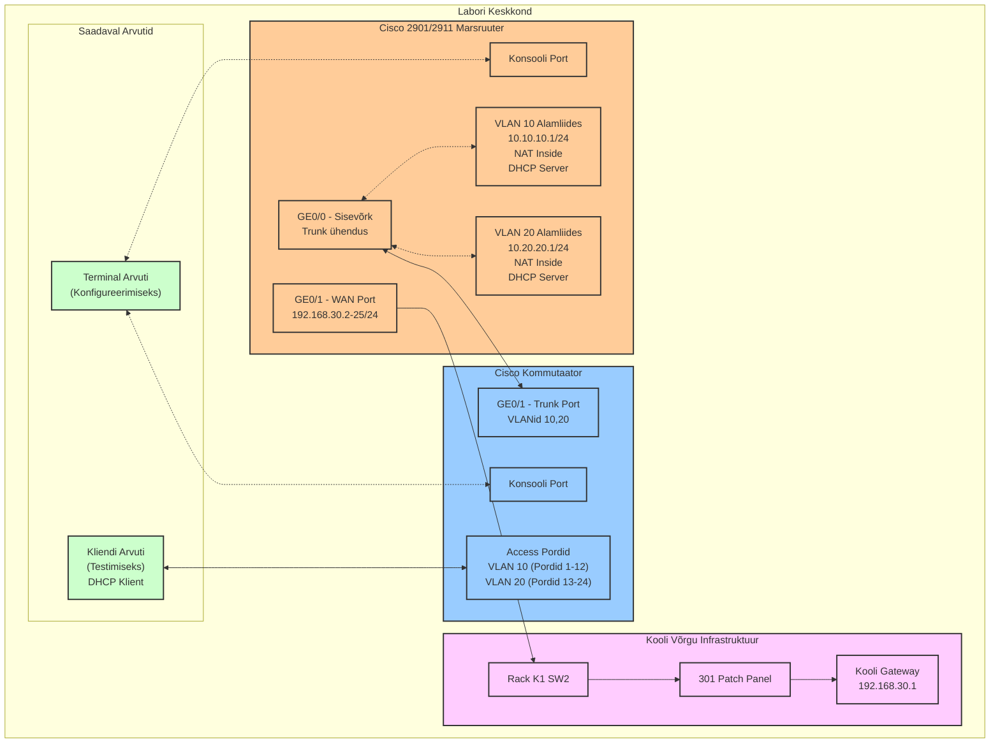

# Labor 26: Cisco 2901/2911 Marsruuteri ja Kommutaatori Seadistamine

## Labori Ülevaade

Selles laboris seadistate ja konfigureerite Cisco 2901/2911 marsruuteri ja Cisco Catalyst kommutaatori, et luua väike võrk mitme VLAN-iga, DHCP teenusega ja NAT-iga kooli võrgu ühenduseks. Õpite, kuidas füüsiliselt ühendada võrguseadmeid, teostada algset konfiguratsiooni, seadistada VLAN-e ja kontrollida oma konfiguratsiooni sobivate käskudega.

## Võrgukomponentide Eesmärgid ja Kasud

### VLAN-ide Seadistamine
VLAN-ide (virtuaalsete kohtvõrkude) seadistamine võimaldab meil:
- **Jagada võrku loogilisteks osadeks** ilma füüsilisi seadmeid lisamata
- **Parandada turvalisust** eraldades erinevad kasutajagrupid (õpilased ja õpetajad) üksteisest
- **Vähendada leviedastuse (broadcast) liiklust**, mis tõstab võrgu jõudlust
- **Lihtsustada võrgu haldamist**, kuna muudatusi saab teha keskselt
- **Optimeerida ressursside kasutust** ühel füüsilisel seadmel

Praktikas tähendab see, et õpetajate arvutid VLAN 20-s ei näe õpilaste võrguliiklust VLAN 10-s, isegi kui nad on ühendatud sama kommutaatoriga.

### DHCP Teenuse Seadistamine
DHCP (Dynamic Host Configuration Protocol) seadistamine annab meile:
- **Automaatne võrgukonfiguratsioon** klientseadmetele, mis vähendab vigade võimalust
- **Tsentraalne IP-aadresside haldamine**, mis lihtsustab administreerimist
- **Ressursside dünaamiline jaotamine**, mis tagab efektiivse IP-aadresside kasutuse
- **Standardiseeritud konfiguratsioon** kõigile klientseadmetele (DNS serverid, vaikelüüs jne)
- **Kergem skaleerimine**, kui võrku tuleb juurde uusi seadmeid

### NAT-i Seadistamine
NAT (Network Address Translation) seadistamine võimaldab:
- **Privaatse võrgu ühendamist internetiga** kasutades vähem avalikke IP-aadresse
- **Võrgu turvalisuse suurendamist**, varjates sisemise võrgu struktuuri
- **Kohalike võrkude taaskasutamist** ja konfigureerimist ilma IP konfliktideta
- **Erinevate VLAN-ide ühendamist välisvõrku** üle ühe välisühenduse

## Seadmed

- 1 Cisco 2901/2911 marsruuter (iga õpilase/rühma kohta)
- 1 Cisco Catalyst kommutaator (iga õpilase/rühma kohta)
- 1 arvuti konsooli ühenduste jaoks (Terminal PC)
- 1 arvuti kliendi testimiseks
- Konsooli kaablid (USB või RJ-45)
- Ethernet patch kaablid
- Patch paneel (labori ühenduste jaoks)

## IP-aadressi Määramine

**OLULINE:** Enne labori alustamist peate määrama oma IP-aadressi ja registreerima end järgmises Google Sheets dokumendis:

**📋 IP-aadresside register:** https://docs.google.com/spreadsheets/d/1jkSfoy97GF3riLE1zJioKBctpNo7gy8rSXunM9aJIyE/edit?usp=sharing

**Juhised:**
1. Avage ülaltoodud link
2. Valige vaba IP-aadress vahemikust 192.168.30.2 - 192.168.30.25
3. Kirjutage oma nimi vastava IP-aadressi kõrvale
4. See IP-aadress määratakse teie marsruuteri GE0/1 liidesele (WAN port)

## Võrgu Topoloogia



## VLAN-ide ja IP-aadresside Plaan

### VLAN-id

| VLAN ID | VLAN Nimi | Eesmärk | IP Võrk | Vaikelüüs | DHCP Vahemik |
|---------|-----------|---------|----------|-----------|--------------|
| 10 | Students | Õpilaste võrguliiklus | 10.10.10.0/24 | 10.10.10.1 | 10.10.10.11 - 10.10.10.254 |
| 20 | Teachers | Õpetajate võrguliiklus | 10.20.20.0/24 | 10.20.20.1 | 10.20.20.11 - 10.20.20.254 |

### Välisühendus (Kooli Võrk)

| Võrk | Gateway | Marsruuteri IP | Märkused |
|------|---------|----------------|----------|
| 192.168.30.0/24 | 192.168.30.1 | Vali vahemikust 192.168.30.2-25 | Google Sheets dokumendist |

### Seadmete IP-aadressid

| Seade | Liides | IP-aadress | Võrgumask | Kirjeldus | VLAN | NAT Roll |
|--------|-----------|------------|-------------|-------------|------|----------|
| Õpilase-Marsruuter | GigabitEthernet0/0 | N/A | N/A | Trunk Kommutaatoriga | N/A | N/A |
| Õpilase-Marsruuter | GigabitEthernet0/0.10 | 10.10.10.1 | 255.255.255.0 | Õpilaste Võrk | 10 | Inside |
| Õpilase-Marsruuter | GigabitEthernet0/0.20 | 10.20.20.1 | 255.255.255.0 | Õpetajate Võrk | 20 | Inside |
| Õpilase-Marsruuter | GigabitEthernet0/1 | 192.168.30.X | 255.255.255.0 | Kooli Võrk | N/A | Outside |
| Kliendi Arvuti | Ethernet | DHCP | 255.255.255.0 | Testimise Klient | 10 või 20 | N/A |

### Füüsiliste Ühenduste Detailne Skeem

| Allikas | Port | Sihtkoht | Port | Kaabli Tüüp | Märkused |
|---------|------|----------|------|-------------|----------|
| Terminal PC | Console | Marsruuter | Console | Console kaabel | Konfigureerimiseks |
| Terminal PC | Console | Kommutaator | Console | Console kaabel | Konfigureerimiseks |
| Marsruuter | GE0/0 | Kommutaator | GE0/1 | Ethernet | Trunk ühendus |
| Marsruuter | GE0/1 | Rack K1 SW2 | Port X | Ethernet | WAN ühendus |
| Rack K1 SW2 | Port Y | 301 Patch Panel | Port Z | Ethernet | Kooli võrk |
| Kliendi PC | NIC | Kommutaator | Port 1-24 | Ethernet | Testimiseks |

## Labori Ülesanded

### Osa 1: Füüsiline Seadistamine ja Ühendused

1. **IP-aadressi Registreerimine:**
   - Avage Google Sheets dokument: https://docs.google.com/spreadsheets/d/1jkSfoy97GF3riLE1zJioKBctpNo7gy8rSXunM9aJIyE/edit?usp=sharing
   - Valige vaba IP-aadress vahemikust 192.168.30.2-25
   - Kirjutage oma nimi vastava IP-aadressi kõrvale

2. **Marsruuteri Seadistamine:**
   - Leia oma määratud Cisco 2901/2911 marsruuter
   - Ühenda toitekaabel ja lülita marsruuter sisse
   - Oota, kuni marsruuter lõpetab käivitumise (püsiv roheline süsteemi LED)

3. **Kommutaatori Seadistamine:**
   - Leia oma määratud Cisco Catalyst kommutaator
   - Ühenda toitekaabel ja lülita kommutaator sisse
   - Oota, kuni kommutaator lõpetab käivitumise

4. **Konsooli Ühendused:**
   - Ühenda Terminal PC marsruuteri konsooli pordiga patch paneeli kaudu
   - Hiljem vahetad selle ühenduse kommutaatori konsooli pordiga

5. **Võrgu Ühendused:**
   - Ühenda marsruuteri GE0/0 port kommutaatori GE0/1 pordiga patch paneeli kaudu
   - Ühenda Kliendi Arvuti kommutaatori pordiga (port 1-12 VLAN 10 testimiseks)
   - **Kooli võrgu ühendus:** 
     1. Ühenda marsruuteri GE0/1 port → Rack K1 SW2
     2. Rack K1 SW2 → 301 patch panel
     3. 301 patch panel → Kooli võrk (192.168.30.0/24)

### Osa 2: Seadmete Lähtestamine (Vajadusel)

#### Marsruuteri Lähtestamine
Kui vajad puhast konfiguratsiooni:
```
enable
write erase
reload
```
Kui küsitakse konfiguratsiooni salvestamist, kirjuta "no"

#### Kommutaatori Lähtestamine
Kui vajad puhast konfiguratsiooni:
```
enable
delete flash:vlan.dat
erase startup-config
reload
```
Kui küsitakse konfiguratsiooni salvestamist, kirjuta "no"

### Osa 3: Marsruuteri Konfigureerimine

1. **Marsruuteriga Ühenduse Loomine:**
   - Ava terminali emulatsiooni tarkvara oma Terminal PC-l
   - Seadista parameetrid: 9600 baud, 8 andmebitti, paarsuseta, 1 stoppbitt, ilma vookontrollita
   - Ühenda konsooli pordiga

2. **Kontrolli Riistvara ja NAT Tuge:**
   - Sisene privilegeeritud EXEC režiimi: `enable`
   - Kontrolli marsruuteri mudelit: `show version`
   - Kontrolli liideste olekut: `show ip interface brief`
   - Kontrolli NAT tuge: `ip nat ?`

3. **Põhikonfiguratsioon:**
   ```
   configure terminal
   hostname [SinuNimi]-Router
   enable secret cisco
   line console 0
   password cisco
   login
   exit
   service password-encryption
   banner motd # Autoriseerimata juurdepääs on keelatud! #
   ```

4. **Liideste Konfigureerimine:**

   **Sisemised liidesed:**
   ```
   interface GigabitEthernet0/0
   description Connection to Internal Switch
   no shutdown
   exit
   
   interface GigabitEthernet0/0.10
   encapsulation dot1Q 10
   ip address 10.10.10.1 255.255.255.0
   exit
   
   interface GigabitEthernet0/0.20
   encapsulation dot1Q 20
   ip address 10.20.20.1 255.255.255.0
   exit
   ```

   **Väline liides (kooli võrk):**
   ```
   interface GigabitEthernet0/1
   description Connection to School Network via Rack K1 SW2
   ip address 192.168.30.[X] 255.255.255.0
   no shutdown
   exit
   ```
   *Asenda [X] oma Google Sheets dokumendist valitud IP-aadressiga (2-25 vahemikust)*

   **Vaikimisi marsruut:**
   ```
   ip route 0.0.0.0 0.0.0.0 192.168.30.1
   ```

5. **NAT Konfigureerimine:**
   ```
   interface GigabitEthernet0/0.10
   ip nat inside
   exit
   
   interface GigabitEthernet0/0.20
   ip nat inside
   exit
   
   interface GigabitEthernet0/1
   ip nat outside
   exit
   
   access-list 1 permit 10.10.10.0 0.0.0.255
   access-list 1 permit 10.20.20.0 0.0.0.255
   ip nat inside source list 1 interface GigabitEthernet0/1 overload
   ```

6. **DHCP Konfigureerimine:**
   ```
   ip dhcp excluded-address 10.10.10.1 10.10.10.10
   ip dhcp pool StudentNet
   network 10.10.10.0 255.255.255.0
   default-router 10.10.10.1
   dns-server 8.8.8.8 8.8.4.4
   domain-name lab.local
   exit
   
   ip dhcp excluded-address 10.20.20.1 10.20.20.10
   ip dhcp pool TeacherNet
   network 10.20.20.0 255.255.255.0
   default-router 10.20.20.1
   dns-server 8.8.8.8 8.8.4.4
   domain-name lab.local
   exit
   ```

7. **Marsruuteri Kontrollimine:**
   ```
   show running-config interface GigabitEthernet0/0.10
   ```
   **(EKRAANIPILT #1)**
   
   ```
   show ip nat statistics
   ```
   **(EKRAANIPILT #2)**

8. **Salvesta Konfiguratsioon:**
   ```
   copy running-config startup-config
   ```

### Osa 4: Kommutaatori Konfigureerimine

1. **Kommutaatori Juurdepääs:**
   - Ühenda konsool kommutaatoriga patch paneeli kaudu

2. **Põhikonfiguratsioon:**
   ```
   enable
   configure terminal
   hostname [SinuNimi]-Switch
   enable secret cisco
   line console 0
   password cisco
   login
   exit
   service password-encryption
   banner motd # Autoriseerimata juurdepääs on keelatud! #
   ```

3. **VLAN-ide Konfigureerimine:**
   ```
   vlan 10
   name Students
   exit
   
   vlan 20
   name Teachers
   exit
   
   interface range fastethernet0/1-12
   switchport mode access
   switchport access vlan 10
   description Student Access Ports
   no shutdown
   exit
   
   interface range fastethernet0/13-24
   switchport mode access
   switchport access vlan 20
   description Teacher Access Ports
   no shutdown
   exit
   
   interface gigabitethernet0/1
   description Trunk to Router
   switchport mode trunk
   switchport trunk allowed vlan 10,20
   switchport trunk native vlan 1
   no shutdown
   exit
   ```

4. **Kommutaatori Kontrollimine:**
   ```
   show vlan brief
   ```
   **(EKRAANIPILT #3)**
   
   ```
   show interfaces gigabitethernet0/1 trunk
   ```
   **(EKRAANIPILT #4)**

5. **Salvesta Konfiguratsioon:**
   ```
   copy running-config startup-config
   ```

### Osa 5: Kliendi Testimine

1. **VLAN 10 Testimine:**
   - Ühenda klient VLAN 10 porti (pordid 1-12)
   - Kontrolli IP konfiguratsiooni: `ipconfig /all` **(EKRAANIPILT #5)**
   - Testi ühenduvust: `ping 10.10.10.1`

2. **VLAN 20 Testimine:**
   - Liiguta klient VLAN 20 porti (pordid 13-24)
   - Uuenda IP: `ipconfig /release` ja `ipconfig /renew`
   - Kontrolli IP konfiguratsiooni: `ipconfig /all`
   - Testi ühenduvust: `ping 10.20.20.1`

3. **Interneti Ühenduvuse Testimine:**
   - Testi ühenduvust kooli võrgu väravaga: `ping 192.168.30.1`
   - Testi interneti ühenduvust: `ping 8.8.8.8`

4. **Lõplik Marsruuteri Kontrollimine:**
   - Ühenda konsool tagasi marsruuterile
   - Kontrolli DHCP seoseid: `show ip dhcp binding`
   - Kontrolli NAT tõlkeid: `show ip nat translations`

## Esitamise Nõuded

Esita dokument, mis sisaldab AINULT järgmised osad:

1. **Päis:**
   - Sinu täisnimi (eesnimi ja perenimi)
   - Kuupäev (vormingus PP.KK.AAAA)
   - Kasutatud välise IP-aadressi (192.168.30.X)

2. **Nõutavad ekraanipildid (5 tk):**
   - **Ekraanipilt 1**: Marsruuteri alamliideste konfiguratsioon (`show running-config interface GigabitEthernet0/0.10`)
     * _Peab olema näha: encapsulation dot1Q seadistus, IP-aadress 10.10.10.1, ja "ip nat inside" seadistus_
   
   - **Ekraanipilt 2**: Marsruuteri NAT statistika (`show ip nat statistics`)
     * _Peab olema näha: aktiivsed NAT tõlked, inside ja outside liidesed, pääsuloendi number 1 kasutus_
   
   - **Ekraanipilt 3**: Kommutaatori VLAN-i kokkuvõte (`show vlan brief`)
     * _Peab olema näha: VLAN 10 (Students) ja VLAN 20 (Teachers) ning neile määratud pordid_
   
   - **Ekraanipilt 4**: Kommutaatori trunk pordi konfiguratsioon (`show interfaces gigabitethernet0/1 trunk`)
     * _Peab olema näha: trunk pordi režiim ja lubatud VLAN-id (10 ja 20)_
   
   - **Ekraanipilt 5**: Kliendi arvuti IP konfiguratsiooni näidis (`ipconfig /all` VLAN 10 pordil)
     * _Peab olema näha: DHCP-lt saadud IP-aadress 10.10.10.xx vahemikust, vaikelüüs 10.10.10.1, ja DNS serverid_

3. **Kokkuvõte:**
   - Kirjuta 5-7 lauset, kus kirjelda täpset probleemi, millega SINA laboris kokku puutusid, ning milliseid käske kasutasid veaotsinguks ja probleemi lahendamiseks

## Eeldatavad Tulemused

1. **Marsruuter peaks olema konfigureeritud:**
   - Kahe VLAN-i alamliidesega (10.10.10.1/24 ja 10.20.20.1/24)
   - NAT konfiguratsiooniga kooli võrgu ühenduse jaoks
   - DHCP teenusega mõlema VLAN-i jaoks

2. **Kommutaator peaks olema konfigureeritud:**
   - Kahe VLAN-iga (10 ja 20)
   - Pordid 1-12 määratud VLAN 10-le
   - Pordid 13-24 määratud VLAN 20-le
   - GE0/1 seadistatud trunk pordina

3. **Kliendi Arvuti peaks:**
   - Saama sobiva IP-aadressi DHCP-lt (10.10.10.x või 10.20.20.x)
   - Edukalt suhtlema marsruuteriga
   - Omama juurdepääsu internetile läbi NAT-i

**Märkus:** Kui interneti ühenduvus ei tööta, kontrolli:
- Kas GE0/1 on ühendatud Rack K1 SW2 külge
- Kas välise IP-aadressi konfiguratsioon vastab Google Sheets dokumendis valitule
- Kas vaikimisi marsruut on seadistatud (192.168.30.1)