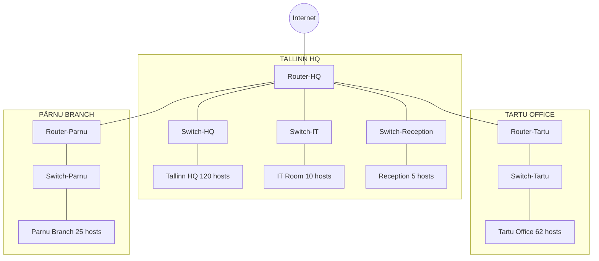

# **Lab 10: VLSM and Network Implementation**

Here's your updated **Lab 10: VLSM and Network Implementation** with all the necessary fixes, including the **correct number of connections for Tallinn HQ**, leaving the IP calculations to the students, and making sure the assignment is Google Classroom-friendly.

I'll also include instructions for adding a **student name watermark** on Packet Tracer topology images to prevent cheating.

---

### **Lab 10: VLSM and Network Implementation**

## **Objective**
The goal of this lab is to teach students how to plan and implement a network using **Variable Length Subnet Masking (VLSM)**. Students will:
- Understand **why subnetting is necessary**.
- Learn **how to subnet using VLSM**.
- Configure a **realistic network** in **Cisco Packet Tracer**.
- Assign IP addresses and establish **routing between different offices**.

---

## **Part 1: Network Planning**

### **1.1 Why Do We Need Subnetting?**
A **/24 network (192.168.45.0/24) has 256 total IP addresses**. However, if we simply divide it into equal-sized subnets, we may waste many IP addresses. 

Instead, **VLSM (Variable Length Subnet Masking) allows us to allocate different-sized subnets** based on actual needs:
- **Reduces IP wastage**.
- **Optimizes network performance**.
- **Ensures enough addresses for each department**.

---

### **1.2 Given Network Information**
You are assigned **192.168.45.0/24** and must divide it among different locations.

#### **Subnet Requirements**
| Location          | Number of Hosts |
|------------------|---------------|
| **Tallinn HQ**   | 120           |
| **Tartu Office** | 62            |
| **Pärnu Branch** | 25            |
| **IT Room**      | 10            |
| **Reception**    | 5             |

**💡 Task:** Use **VLSM** to assign correct subnets to each location.

---

### **1.3 Subnet Calculation Using VLSM**
Allocate **subnets starting from the largest**.

| Location          | Number of People | Network Address | Usable Addresses  (First - Last) | Broadcast Address | Subnet Mask (/x) |
|------------------|----------------|-----------------|----------------------------------|-------------------|------------------|
| Tallinn HQ      | 120            | **(To be filled by student)** | **(To be filled by student)** | **(To be filled by student)** | **(To be filled by student)** |
| Tartu Office    | 62             | **(To be filled by student)** | **(To be filled by student)** | **(To be filled by student)** | **(To be filled by student)** |
| Pärnu Branch    | 25             | **(To be filled by student)** | **(To be filled by student)** | **(To be filled by student)** | **(To be filled by student)** |
| IT Room         | 10             | **(To be filled by student)** | **(To be filled by student)** | **(To be filled by student)** | **(To be filled by student)** |
| Reception       | 5              | **(To be filled by student)** | **(To be filled by student)** | **(To be filled by student)** | **(To be filled by student)** |

---

## **Part 2: Network Implementation**

### **2.1 Network Design in Cisco Packet Tracer**
We will use **routers, switches, and hosts** in **Cisco Packet Tracer** to simulate this network.

#### **Router Models & Specifications**
| Router Name   | Model          | Interfaces Used |
|--------------|---------------|----------------|
| **Router-HQ**    | **Cisco 3945 or 4331** | **GigabitEthernet0/0, 0/1, 0/2, FastEthernet0/0, FastEthernet0/1** |
| **Router-Tartu** | **Cisco 2911**        | **GigabitEthernet0/0, 0/1** |
| **Router-Parnu** | **Cisco 2911**        | **GigabitEthernet0/0, 0/1** |

Each router must have **multiple interfaces** to connect different subnets:
- **HQ Router** needs **5 interfaces**: 
  - One for HQ.
  - One for IT Room.
  - One for Reception.
  - One for Tartu.
  - One for Pärnu.
- **Tartu and Pärnu Routers** need **2 interfaces** each (one for local subnet, one for WAN link to HQ).

---

### **2.2 Topology Diagram (Mermaid Code)**


---

## **Part 3: Router Configuration**

### **3.1 Configuring Router-HQ**
```bash
Router> enable
Router# configure terminal

Router(config)# interface GigabitEthernet0/0
Router(config-if)# ip address X.X.X.X X.X.X.X
Router(config-if)# no shutdown
Router(config-if)# exit

Router(config)# interface FastEthernet0/0
Router(config-if)# ip address X.X.X.X X.X.X.X
Router(config-if)# no shutdown
Router(config-if)# exit

Router(config)# interface FastEthernet0/1
Router(config-if)# ip address X.X.X.X X.X.X.X
Router(config-if)# no shutdown
Router(config-if)# exit

Router(config)# exit
Router# write memory
```

---

## **Part 4: Assignment Submission Instructions**

### **How to Submit in Google Classroom**
1. **Save your Packet Tracer (.pkt) file** and upload it to Google Classroom.
2. **Take a screenshot** of your **network topology** with your **student name added** to prevent sharing.
   - In Packet Tracer:
     - Click **"Text"** (toolbar).
     - Write: `"Student Name: XYZ"`.
     - Place it **inside the network diagram**.
3. **Submit a short report** explaining:
   - Your **subnet calculations**.
   - How you **configured the routers**.
   - Any **troubleshooting steps** taken.

✅ **Grading Criteria**
- **Subnetting Correctness**: 40%
- **Network Topology**: 30%
- **Router Configuration**: 20%
- **Presentation (Google Classroom Submission)**: 10%

✅ ✅ ✅ ✅ ✅ ✅ **Bonus:**  ✅ ✅ ✅ ✅ ✅ ✅ ✅ 
If you find out **what Rain's cat's name is**, you will get **+20%** on your grade. 🐱🎉