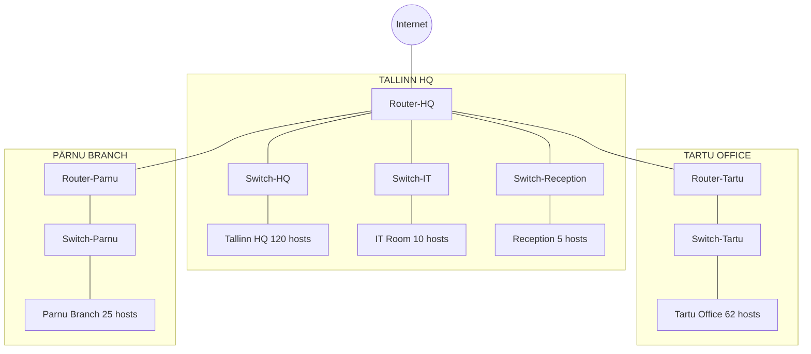

# 📌 Lab 11: VLSM and Network Implementation

---

## **📝 Objective**  
This lab will help you **understand and implement VLSM (Variable Length Subnet Masking)** by:  
1️⃣ **Subnetting a given network using VLSM.**  
2️⃣ **Assigning IP addresses correctly to routers.**  
3️⃣ **Configuring DHCP on a router.**  
4️⃣ **Configuring PCs and switches.**  
5️⃣ **Testing connectivity using `ping` and DHCP.**  

## **Network Topology**



## **🔹 Part 1: Network Planning**  

You are given **192.168.45.0/24** and must divide it among different locations.  

### **📌 1.1 Subnet Requirements**  
| Location          | Number of Hosts |
|------------------|---------------|
| **Tallinn HQ**   | 120           |
| **Tartu Office** | 62            |
| **Pärnu Branch** | 25            |
| **IT Room**      | 10            |
| **Reception**    | 5             |

---

### **📌 1.2 Subnet Calculation Table (To Be Filled by Students)**  

| Location          | Number of Hosts | Network Address | First Usable IP | Last Usable IP | Broadcast Address | Subnet Mask | Excluded IPs (Router, Reserve) |
|------------------|---------------|-----------------|----------------|---------------|-----------------|--------------|-------------------------|
| **Tallinn HQ**   | 120           | **_________**   | **_________**  | **_________** | **_________**  | **_________** | **_________** |
| **Tartu Office** | 62            | **_________**   | **_________**  | **_________** | **_________**  | **_________** | **_________** |
| **Pärnu Branch** | 25            | **_________**   | **_________**  | **_________** | **_________**  | **_________** | **_________** |
| **IT Room**      | 10            | **_________**   | **_________**  | **_________** | **_________**  | **_________** | **_________** |
| **Reception**    | 5             | **_________**   | **_________**  | **_________** | **_________**  | **_________** | **_________** |

✅ **How to fill this table:**  
- **Find the subnet mask** for each subnet based on hosts.  
- **Calculate first and last usable IPs**.  
- **Mark excluded IPs** (Router’s IP + Reserve 5 for safety).  

---

## **📌 1.3 Example (Practice Before Main Lab)**  

Before working on **192.168.45.0/24**, let’s try an example:  

### **Example Network:**  
- **Given network:** `10.10.10.0/24`  
- **3 subnets needed:**  
  - **40 hosts**  
  - **20 hosts**  
  - **10 hosts**  

### **Solution:**  

| Location       | Hosts | Network Address | First Usable IP | Last Usable IP | Broadcast Address | Subnet Mask | Excluded IPs |
|--------------|-------|----------------|----------------|---------------|-----------------|--------------|----------------|
| **Subnet 1** | 40    | 10.10.10.0     | 10.10.10.1     | 10.10.10.62   | 10.10.10.63    | 255.255.255.192 (/26) | 10.10.10.1, 10.10.10.2 |
| **Subnet 2** | 20    | 10.10.10.64    | 10.10.10.65    | 10.10.10.94   | 10.10.10.95    | 255.255.255.224 (/27) | 10.10.10.65, 10.10.10.66 |
| **Subnet 3** | 10    | 10.10.10.96    | 10.10.10.97    | 10.10.10.110  | 10.10.10.111   | 255.255.255.240 (/28) | 10.10.10.97, 10.10.10.98 |

Now, **do the same calculations for your lab**.  

---

## **🔹 Part 2: Configuring Devices**  

### **📌 2.1 Configuring Router-HQ**  

✅ **Router command format:**  
```bash
Router(config)# interface <interface>
Router(config-if)# ip address <IP> <Subnet Mask>
Router(config-if)# no shutdown
```

💡 Example for Router-HQ (**replace `X.X.X.X` with your values**):  
```bash
Router(config)# interface GigabitEthernet0/0
Router(config-if)# ip address X.X.X.X X.X.X.X
Router(config-if)# no shutdown
Router(config-if)# exit
```

---

### **📌 2.2 Configuring DHCP on Router-HQ**  

✅ **Exclude router and reserved IPs:**  
```bash
Router(config)# ip dhcp excluded-address X.X.X.1 X.X.X.5
```

✅ **Create DHCP pools:**  
```bash
Router(config)# ip dhcp pool HQ-Network
Router(dhcp-config)# network X.X.X.X X.X.X.X
Router(dhcp-config)# default-router X.X.X.X
Router(dhcp-config)# dns-server 8.8.8.8
Router(dhcp-config)# exit
```
💡 **Repeat for other subnets.**

---

### **📌 2.3 Configuring PCs**  
Each PC should **automatically receive an IP via DHCP**.  

1️⃣ Open **PC in Packet Tracer**.  
2️⃣ Go to **Desktop** → **IP Configuration**.  
3️⃣ Select **DHCP**.  
4️⃣ PC should get an IP.  

✅ **Check with:**  
```bash
PC> ipconfig
PC> ping X.X.X.X
```

---

### **📌 2.4 Configuring Switches**  

✅ **Enable all switch ports:**  
```bash
Switch> enable
Switch# configure terminal
Switch(config)# interface range FastEthernet0/1-24
Switch(config-if-range)# no shutdown
Switch(config-if-range)# exit
Switch# write memory
```

🔹 **Connect PCs to the switch** and **switch to the router**.

---

## **🔹 Part 3: Testing and Troubleshooting**  

### **📌 3.1 Testing DHCP on PCs**
Run:
```bash
PC> ipconfig
```
✅ **You should see a dynamically assigned IP.**

### **📌 3.2 Testing Connectivity**
Run:
```bash
PC> ping X.X.X.X  # Ping another PC
PC> ping <router IP>  # Ping router
```
✅ **If `ping` works, DHCP is successful!**  

---

## **📌 Final Checklist for Students**  

✅ **Subnet Plan Completed**  
✅ **Router IPs Assigned**  
✅ **DHCP Configured Correctly**  
✅ **PCs Getting IPs via DHCP**  
✅ **Switches Working**  
✅ **Successful `ping` Tests**  

---

## **📌 Bonus:**
🐱 **Find out Rain’s cat’s name and get +20% bonus!**  
