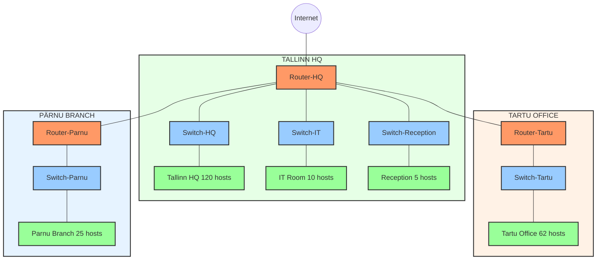

# **Lab10: VLSM**

## **Part 1: Network Planning**

### **Instructions**
1. Use the provided main network: **192.168.45.0/24**.
2. Divide the network into subnets using **VLSM** to meet the user requirements for each location.
3. Start with the **largest group first** and work your way down.
4. For each subnet, calculate:
   - **Network Address**
   - **Usable IP Range** (First to Last)
   - **Broadcast Address**
   - **Subnet Mask (/x)**

### **Network Design**
| Location          | Number of People | Network Address | Available Addresses  (First - Last) | Broadcast Address | Subnet Mask (/x) |
|--------------------|------------------|-----------------|--------------------------------------|-------------------|------------------|
| Tallinn HQ         | 120              |                 |                                      |                   |                  |
| Tartu Office       | 62               |                 |                                      |                   |                  |
| Pärnu Branch       | 25               |                 |                                      |                   |                  |
| IT Room            | 10               |                 |                                      |                   |                  |
| Reception          | 5                |                 |                                      |                   |                  |

---

## **Part 2: Network Implementation**

### **Objective**
Build the planned network in **Cisco Packet Tracer**. Configure devices and connections to enable communication between all locations.

---

---

TO BE CONTINUED