# 🔍 Lab13: Virtualbox Learn About Routers By Building One!

## Overview

In this lab, you will:
1. Create a router VM and multiple client VMs in VirtualBox
2. Configure the router VM to provide internet access to clients
3. Set up DHCP, DNS, and NAT services on the router
4. Test connectivity from the clients through the router

```mermaid
graph TD
    subgraph "VirtualBox Host Computer"
        subgraph "Internet Access"
            Internet[Internet 🌐]
            NAT[VirtualBox NAT\n10.0.2.0/24]
        end
        
        subgraph "Router VM"
            R_WAN[WAN Interface\nenp0s3\n10.0.2.x]
            R_LAN[LAN Interface\nenp0s8\n192.168.56.2/24]
            NAT_Service[NAT Service]
            DHCP[DHCP Server\n192.168.56.100-200]
            DNS[DNS Service]
            
            R_WAN --- NAT_Service
            NAT_Service --- R_LAN
            DHCP --- R_LAN
            DNS --- R_LAN
        end
        
        subgraph "Host-only Network (VirtualBox)"
            HostNet[VirtualBox Host-only Network\n192.168.56.0/24]
            HostInterface[Host Computer\n192.168.56.1]
        end
        
        subgraph "Client VMs"
            C1[Client1 VM\nenp0s3\n192.168.56.100]
            C2[Client2 VM\nenp0s3\n192.168.56.101]
            C3[Client3 VM\nenp0s3\n192.168.56.102]
        end
        
        Internet --- NAT
        NAT --- R_WAN
        R_LAN --- HostNet
        HostInterface --- HostNet
        HostNet --- C1
        HostNet --- C2
        HostNet --- C3
    end
    
    classDef internet fill:#f0f7ff,stroke:#333,stroke-width:2px;
    classDef router fill:#fff5f5,stroke:#333,stroke-width:2px;
    classDef client fill:#f0fff4,stroke:#333,stroke-width:2px;
    classDef network fill:#ffe9d9,stroke:#333,stroke-width:2px,stroke-dasharray: 5 5;
    
    class Internet,NAT internet;
    class R_WAN,R_LAN,NAT_Service,DHCP,DNS router;
    class C1,C2,C3 client;
    class HostNet,HostInterface network;
```

## Understanding IP Address Assignment in This Lab

### Where Do All These IPs Come From?

Students often have questions about the different IP addresses used in this lab. Here's a clear explanation:

### The 10.0.2.x Addresses (WAN/Internet Side)

1. **Where they come from**: These IPs are automatically assigned by VirtualBox's built-in NAT feature
   
2. **How they're assigned**:
   - When you set Adapter 1 to "NAT" in VirtualBox settings
   - VirtualBox creates a virtual NAT network (usually 10.0.2.0/24)
   - VirtualBox runs its own DHCP server on this network
   - Your VM automatically gets an IP (usually 10.0.2.15)
   - The virtual gateway is 10.0.2.2
   - The virtual DNS server is 10.0.2.3

3. **What students need to do**:
   - Just set Adapter 1 to "NAT" in VirtualBox
   - In Ubuntu, make sure the interface is set to DHCP
   - That's it! VirtualBox handles everything else automatically

4. **How to check it's working**:
   ```bash
   ip addr
   ```
   You should see one interface (usually enp0s3) with an IP like 10.0.2.15

   ```bash
   ip route
   ```
   You should see a default route via 10.0.2.2

### The 192.168.56.x Addresses (LAN Side)

1. **Where they come from**:
   - VirtualBox creates a "Host-only Network" on your computer
   - Your computer gets 192.168.56.1 on this network
   - You manually assign 192.168.56.2 to your router VM
   - Your router's DHCP server assigns 192.168.56.100-200 to clients

2. **How to check your host-only network**:
   - In VirtualBox, go to File → Host Network Manager
   - Look for the adapter with an IP like 192.168.56.1
   - Note: Some systems might use a different range like 192.168.99.x

3. **What students need to do**:
   - Set Adapter 2 to "Host-only Adapter" in VirtualBox
   - Manually configure the LAN interface with a static IP (192.168.56.2)
   - Set up DHCP server to give out IPs in range 192.168.56.100-200

## Part 1: Setting Up VMs in VirtualBox

### Creating the Router VM

1. **Open VirtualBox** and click "New"

2. **Basic VM Settings**:
   - Name: `router-YOUR_NAME` (use your actual name)
   - Type: Linux
   - Version: Ubuntu (64-bit)
   - Memory: 2048 MB (2GB)
   - Create a virtual hard disk (8GB, VDI, Dynamically allocated)

3. **Configure Network Adapters**:
   - Select the router VM and click "Settings"
   - Go to "Network" tab
   
   **For Adapter 1 (WAN/Internet)**:
   - Attached to: NAT
   - Advanced: Adapter Type: Intel PRO/1000 MT Desktop
   
   **For Adapter 2 (LAN)**:
   - Click the "Adapter 2" tab
   - Enable Network Adapter: Checked
   - Attached to: Host-only Adapter
   - Name: Select your VirtualBox Host-Only adapter (if unsure, check the "Host Network Manager" first)
   - Advanced: Adapter Type: Intel PRO/1000 MT Desktop

### Creating Client VMs

1. **Create New VM**:
   - Name: `client1-YOUR_NAME` (use your name)
   - Type: Linux
   - Version: Ubuntu (64-bit)
   - Memory: 1024 MB (1GB)
   - Create a virtual hard disk (4GB, VDI, Dynamically allocated)

2. **Configure Network**:
   - Select the client VM and click "Settings"
   - Go to "Network" tab
   - Enable Network Adapter: Checked
   - Attached to: Host-only Adapter
   - Name: Same host-only adapter you chose for the router's Adapter 2
   - Advanced: Adapter Type: Intel PRO/1000 MT Desktop

3. **Repeat for Client2 and Client3** if desired

### Installing Ubuntu

For each VM (router and clients):

1. **Start the VM** and select your Ubuntu ISO
2. Choose "Install Ubuntu" and follow the installation wizard
3. Select "Minimal installation" to save space
4. Choose "Erase disk and install Ubuntu"
5. Create a user account and password
6. After installation, restart the VM and remove the installation media

## Part 2: Setting Up the Router VM

### Method 1: Configure Network Directly in VirtualBox (Beginner-Friendly)

The most important network configuration happens directly in VirtualBox:

1. **Check your host-only network configuration**:
   - In VirtualBox, go to File → Host Network Manager
   - Note the IPv4 Address of your host-only adapter (typically 192.168.56.1)
   - Make sure DHCP Server is disabled for this network

2. **Configure Router VM adapters** (as described above):
   - Adapter 1: NAT (for internet)
   - Adapter 2: Host-only Adapter (for LAN)

3. **Inside the router VM**, you just need to set a static IP for the LAN interface:

   First, identify your interfaces:
   ```bash
   ip addr
   ```

   Look for two interfaces besides loopback (lo):
   - One with an IP like 10.0.2.15 (this is your WAN interface, usually enp0s3)
   - One that might not have an IP yet (this is your LAN interface, usually enp0s8)

   Install required packages:
   ```bash
   sudo apt update
   sudo apt install -y net-tools iptables isc-dhcp-server dnsmasq
   ```

### Method 2: Configure Network Inside Ubuntu (For Complete Control)

Inside the router VM, you need to configure both network interfaces:

1. **Create/edit netplan configuration**:
   ```bash
   sudo nano /etc/netplan/00-installer-config.yaml
   ```

2. **Add this configuration** (adjust interface names if needed):
   ```yaml
   network:
     version: 2
     renderer: networkd
     ethernets:
       enp0s3:    # WAN interface (change if yours is different)
         dhcp4: true
       enp0s8:    # LAN interface (change if yours is different)
         addresses: [192.168.56.2/24]
   ```

   **Understanding this configuration**:
   - `network:`: Main section for network config
   - `version: 2`: The netplan format version
   - `renderer: networkd`: Ubuntu's network management system
   - `ethernets:`: Section for wired connections
   - `enp0s3:`: First network adapter (WAN)
   - `dhcp4: true`: Get internet IP automatically
   - `enp0s8:`: Second network adapter (LAN)
   - `addresses: [192.168.56.2/24]`: Set static IP for LAN

   **IMPORTANT**: YAML files are strict about spaces and indentation:
   - Use exactly 2 spaces for each indentation level
   - No tabs allowed, only spaces
   - Be careful with alignment

3. **Apply network configuration**:
   ```bash
   sudo netplan apply
   ```

4. **Verify configuration**:
   ```bash
   ip addr
   ```
   - WAN interface (enp0s3): Should have IP like 10.0.2.15
   - LAN interface (enp0s8): Should have IP 192.168.56.2

### Setting Up Router Services

Regardless of which network setup method you chose, continue with these steps:

1. **Configure DHCP Server** (to give IPs to clients):
   ```bash
   sudo nano /etc/default/isc-dhcp-server
   ```

   Find and modify:
   ```
   INTERFACESv4="enp0s8"   # Use your LAN interface name
   ```

   Create DHCP configuration:
   ```bash
   sudo nano /etc/dhcp/dhcpd.conf
   ```

   Add to the end of file:
   ```
   # Our LAN configuration
   subnet 192.168.56.0 netmask 255.255.255.0 {
     range 192.168.56.100 192.168.56.200;  # IP range to give out
     option routers 192.168.56.2;          # Router address
     option domain-name-servers 8.8.8.8;   # DNS servers
   }
   ```

2. **Configure DNS Server**:
   ```bash
   sudo nano /etc/dnsmasq.conf
   ```

   Add to the end of file:
   ```
   # DNS configuration
   interface=enp0s8                    # LAN interface
   listen-address=127.0.0.1,192.168.56.2
   bind-interfaces
   server=8.8.8.8                     # Google DNS
   server=8.8.4.4                     # Backup DNS
   ```

3. **Enable IP Forwarding** (to allow clients to access internet):
   ```bash
   sudo nano /etc/sysctl.conf
   ```

   Find and uncomment (remove #):
   ```
   net.ipv4.ip_forward=1
   ```

   Apply change immediately:
   ```bash
   sudo sysctl -p
   ```

4. **Set Up NAT** (Network Address Translation):
   ```bash
   # Allow clients to access internet through router
   sudo iptables -t nat -A POSTROUTING -o enp0s3 -j MASQUERADE

   # Allow established connections
   sudo iptables -A FORWARD -i enp0s8 -o enp0s3 -m state --state RELATED,ESTABLISHED -j ACCEPT

   # Allow outbound connections
   sudo iptables -A FORWARD -i enp0s8 -o enp0s3 -j ACCEPT
   ```

   Save rules permanently:
   ```bash
   sudo apt install -y iptables-persistent
   ```
   When prompted, select "Yes" to save rules.

5. **Start Services**:
   ```bash
   sudo systemctl restart isc-dhcp-server
   sudo systemctl restart dnsmasq
   ```

## Part 3: Testing Your Router Setup

### From the Router VM

1. **Check Network Configuration**:
   ```bash
   ip addr
   ip route
   ```

2. **Check Internet Connectivity**:
   ```bash
   ping -c 4 8.8.8.8
   ping -c 4 google.com
   ```

3. **Verify NAT Configuration**:
   ```bash
   sudo iptables -t nat -L
   cat /proc/sys/net/ipv4/ip_forward  # Should show "1"
   ```

4. **Check Service Status**:
   ```bash
   sudo systemctl status isc-dhcp-server
   sudo systemctl status dnsmasq
   ```

### From Client VMs

1. **Configure Network** (if needed):
   - On each client VM, the network adapter should be set to Host-only
   - It should automatically get IP from your router's DHCP server
   - If not, try: `sudo dhclient`

2. **Check Network Configuration**:
   ```bash
   ip addr
   ip route
   ```
   Verify:
   - IP is in range 192.168.56.100-200
   - Default route is through 192.168.56.2 (router)

3. **Test Connectivity**:
   ```bash
   # Test connection to router
   ping -c 4 192.168.56.2

   # Test internet connectivity
   ping -c 4 8.8.8.8

   # Test DNS resolution
   nslookup google.com
   ```

## Verification Steps: How to Check Your Router Setup

### 1. Verify Router Network Configuration

On your router VM, run these commands to check the network setup:

```bash
# Check network interfaces and their IP addresses
ip addr

# Verify you see:
# - WAN interface (enp0s3) with an IP from VirtualBox NAT (usually 10.0.2.x)
# - LAN interface (enp0s8) with IP 192.168.56.2
```

```bash
# Check routing table
ip route

# Verify you see:
# - Default route via your WAN interface
# - Direct route to your LAN subnet
```

```bash
# Check internet connectivity from router
ping -c 4 8.8.8.8

# All 4 pings should be successful
```

### 2. Verify NAT and Forwarding Configuration

On your router VM, check that IP forwarding and NAT are properly configured:

```bash
# Check if IP forwarding is enabled
cat /proc/sys/net/ipv4/ip_forward

# Should output "1"
```

```bash
# Check NAT rules
sudo iptables -t nat -L

# Should show a POSTROUTING rule with MASQUERADE for your WAN interface
```

### 3. Verify DHCP Server Operation

On your router VM, check the DHCP server status:

```bash
# Check if DHCP server is running
sudo systemctl status isc-dhcp-server

# Should show "active (running)"
```

```bash
# Check DHCP leases
cat /var/lib/dhcp/dhcpd.leases

# Should show leases for your client VMs
```

### 4. Verify DNS Service

On your router VM, check the DNS service:

```bash
# Check if DNS service is running
sudo systemctl status dnsmasq

# Should show "active (running)"
```

```bash
# Test DNS resolution on router
nslookup google.com

# Should resolve to Google's IP addresses
```

### 5. Verify Client Network Configuration

On each client VM, check their network configuration:

```bash
# Check network interface and IP address
ip addr

# Verify client has an IP in your DHCP range (192.168.56.100-200)
```

```bash
# Check routing table
ip route

# Verify default route goes through router (192.168.56.2)
```

```bash
# Check connection to router
ping -c 4 192.168.56.2

# All 4 pings should be successful
```

### 6. Verify Client Internet Connectivity

On each client VM, verify internet access:

```bash
# Check if client can access internet
ping -c 4 8.8.8.8

# All 4 pings should be successful
```

```bash
# Check if DNS resolution works
nslookup google.com

# Should resolve to Google's IP addresses
```

```bash
# Try accessing a website (if GUI available)
firefox google.com

# Should load Google homepage
```

### 7. Verify Cross-Client Communication

Test if clients can communicate with each other:

```bash
# From client1, ping client2 (use its actual IP)
ping -c 4 192.168.56.101  # Adjust IP if different

# All 4 pings should be successful
```

## Troubleshooting Guide

### Network Interface Names Different?

If your network interfaces aren't named enp0s3 and enp0s8, check their actual names:
```bash
ip addr
```
Use the correct names in all configuration files.

### DHCP Not Working?

1. Check DHCP server status:
   ```bash
   sudo systemctl status isc-dhcp-server
   ```

2. Check DHCP server configuration:
   ```bash
   sudo nano /etc/dhcp/dhcpd.conf
   ```
   Make sure subnet matches your network.

3. Check DHCP server logs:
   ```bash
   sudo journalctl -u isc-dhcp-server -n 50
   ```

### No Internet on Clients?

1. Check router forwarding:
   ```bash
   cat /proc/sys/net/ipv4/ip_forward
   ```
   Should show "1".

2. Check NAT rules:
   ```bash
   sudo iptables -t nat -L
   ```
   Should show MASQUERADE rule.

3. Check client routing:
   ```bash
   ip route
   ```
   Default route should go through router (192.168.56.2).

### DNS Not Working?

1. Check DNS service:
   ```bash
   sudo systemctl status dnsmasq
   ```

2. Test DNS resolution manually:
   ```bash
   nslookup google.com 8.8.8.8
   ```

3. Check DNS configuration:
   ```bash
   sudo nano /etc/dnsmasq.conf
   ```

## Frequently Asked Questions

**Q: Why do I need two different IP ranges?**
A: Your router connects two different networks:
   - The WAN side (10.0.2.x) connects to the internet
   - The LAN side (192.168.56.x) connects to your client VMs
   This is exactly how home routers work - they join your home network to the internet.

**Q: What if my host-only network uses a different IP range?**
A: It's fine! Just adjust your configurations to match:
   - If your host-only network is 192.168.99.x:
   - Use 192.168.99.2 for your router's LAN IP
   - Set DHCP range to 192.168.99.100-200
   - Update all config files accordingly

**Q: What if the 10.0.2.x address doesn't appear automatically?**
A: Check that:
   - Adapter 1 is set to "NAT" in VirtualBox
   - The interface is configured for DHCP in Ubuntu
   - Try rebooting the VM
   - If still not working, try `sudo dhclient enp0s3`

**Q: I'm confused about which interface is which!**
A: Run this command to see all interfaces:
   ```bash
   ip addr
   ```
   - The interface with a 10.0.2.x address is your WAN interface
   - The interface connected to the host-only network is your LAN interface
   - Use the actual interface names you see (like enp0s3, enp0s8) in your config files

**Q: Why can't I ping the 10.0.2.x network from my client VMs?**
A: That's normal! The NAT network is only accessible to the router VM. 
   Your clients access the internet through the router's NAT service.

**Q: Can other students see my VMs?**
A: No, your VMs are only visible within your computer. 
   Each student's setup is isolated from others.

## Adapting to Different Network Environments

### If Your Host-Only Network Uses a Different IP Range

If your VirtualBox Host-Only Network uses a different IP range than 192.168.56.0/24:

1. **Check your current Host-Only Network**:
   - In VirtualBox, go to File → Host Network Manager
   - Note the IPv4 Address and Network Mask

2. **Adjust Router IP** according to your network:
   - If your host-only network is 192.168.99.0/24 with host at 192.168.99.1:
   - Change router's LAN IP to 192.168.99.2
   - Adjust DHCP range to 192.168.99.100-200

3. **Update All Configuration Files** with the correct subnet

### Working with Classmates

If you're setting up this lab in a classroom with other students:

1. **Make sure your VM names include YOUR NAME** to avoid confusion
2. **Use your own IP range** if possible to avoid conflicts
3. **Check VirtualBox Host-Only Network Manager** to identify your specific adapter

## Understanding the Complete Picture

Your lab creates a setup like this:

1. **Internet** → **VirtualBox NAT (10.0.2.0/24)** → **Router VM WAN Interface (10.0.2.15)**
2. **Router VM LAN Interface (192.168.56.2)** → **Host-only Network (192.168.56.0/24)** → **Client VMs (192.168.56.100+)**

This multi-layered setup gives you hands-on experience with:
- Network address translation (NAT)
- DHCP server configuration
- DNS server setup
- IP routing
- Network segmentation

These are the same principles used in real-world networking!

## Required Lab Deliverables

1. **Network Configuration Evidence**:
   - Screenshot of `ip addr` output from router showing both interfaces
   - Screenshot of `ip route` output from router

2. **NAT Configuration Evidence**:
   - Screenshot of `sudo iptables -t nat -L` output
   - Screenshot of `cat /proc/sys/net/ipv4/ip_forward` showing "1"

3. **Client Connectivity Evidence**:
   - Screenshot of `ip addr` from a client showing IP assigned by DHCP
   - Screenshot of successful `ping google.com` from client
   - Screenshot of successful `nslookup google.com` from client

Make sure all screenshots show your hostname with YOUR_NAME to prove it's your work!