# Router Lab for VirtualBox: Building Your Own Router (Detailed Steps for Beginners)

## VM Requirements & Network Interfaces

### Router VM
- **Name**: `router-YOUR_NAME` (use your actual name)
- **Memory**: 2GB
- **Disk**: 8GB
- **Network Interfaces**: 2 interfaces
  1. Adapter 1: NAT Network (WAN/Internet connection)
  2. Adapter 2: Host-only Adapter (LAN connection to clients)

### Client VMs (create 2-3)
- **Names**: `client1-YOUR_NAME`, `client2-YOUR_NAME`, etc.
- **Memory**: 1GB
- **Disk**: 4GB
- **Network Interfaces**: 1 interface each
  - Adapter 1: Host-only Adapter (same network as router's second adapter)

### Topology

```mermaid
graph TD
    subgraph "VirtualBox Host Computer"
        subgraph "Internet Access"
            Internet[Internet 🌐]
            NATNetwork[VirtualBox NAT Network\n10.0.2.0/24]
        end
        
        subgraph "Router VM"
            R_WAN[WAN Interface\nenp0s3\n10.0.2.x]
            R_LAN[LAN Interface\nenp0s8\n192.168.100.1/24]
            NAT[NAT Service]
            DHCP[DHCP Server\n192.168.100.50-150]
            DNS[DNS Service]
            
            R_WAN --- NAT
            NAT --- R_LAN
            DHCP --- R_LAN
            DNS --- R_LAN
        end
        
        subgraph "Host-only Network (RouterLAN)"
            HostNet[VirtualBox Host-only Network\n192.168.100.0/24]
        end
        
        subgraph "Client VMs"
            C1[Client1 VM\nenp0s3\n192.168.100.50]
            C2[Client2 VM\nenp0s3\n192.168.100.51]
            C3[Client3 VM\nenp0s3\n192.168.100.52]
        end
        
        Internet --- NATNetwork
        NATNetwork --- R_WAN
        R_LAN --- HostNet
        HostNet --- C1
        HostNet --- C2
        HostNet --- C3
    end
    
    classDef internet fill:#f0f7ff,stroke:#333,stroke-width:2px;
    classDef router fill:#fff5f5,stroke:#333,stroke-width:2px;
    classDef client fill:#f0fff4,stroke:#333,stroke-width:2px;
    classDef network fill:#ffe9d9,stroke:#333,stroke-width:2px,stroke-dasharray: 5 5;
    
    class Internet,NATNetwork internet;
    class R_WAN,R_LAN,NAT,DHCP,DNS router;
    class C1,C2,C3 client;
    class HostNet network;
```

## Step-by-Step Setup Guide

### Part 1: Create the VMs in VirtualBox

#### Creating the Router VM:

1. **Open VirtualBox** and click the "New" button

2. **Enter VM details**:
   - Name: `router-YOUR_NAME`
   - Type: Linux
   - Version: Ubuntu (64-bit)
   - Click "Next"

3. **Set memory size**:
   - Allocate 2048 MB (2GB)
   - Click "Next"

4. **Create hard disk**:
   - Select "Create a virtual hard disk now"
   - Click "Create"
   - Choose "VDI (VirtualBox Disk Image)"
   - Click "Next"
   - Select "Dynamically allocated"
   - Click "Next"
   - Set size to 8 GB
   - Click "Create"

5. **Configure network adapters** (with router VM selected):
   - Click "Settings"
   - Go to "Network" tab
   
   For Adapter 1 (WAN):
   - Enable "Enable Network Adapter"
   - Select "NAT Network" from the dropdown
   - If no NAT Network exists, click "Create" to make a new one
   - Name it "InternetNetwork"
   - Click OK
   
   For Adapter 2 (LAN):
   - Click the "Adapter 2" tab
   - Check "Enable Network Adapter"
   - Select "Host-only Adapter" from dropdown
   - If no host-only network exists, go to File → Host Network Manager to create one
   - Name the host network "RouterLAN"
   - **Important**: Disable DHCP in the host network manager for this network
   - Click OK

#### Creating Client VMs (repeat for each client):

1. **Click "New"**
   - Name: `client1-YOUR_NAME` (for first client)
   - Type: Linux
   - Version: Ubuntu (64-bit)
   - Click "Next"

2. **Set memory size**:
   - Allocate 1024 MB (1GB)
   - Click "Next"

3. **Create hard disk**:
   - Select "Create a virtual hard disk now"
   - Click "Create"
   - Choose "VDI"
   - Select "Dynamically allocated"
   - Set size to 4 GB
   - Click "Create"

4. **Configure network**:
   - With the client VM selected, click "Settings"
   - Go to "Network" tab
   - For Adapter 1:
     - Enable "Enable Network Adapter"
     - Select "Host-only Adapter"
     - Select the same host-only network used for the router ("RouterLAN")
     - Click OK

### Part 2: Install Ubuntu on All VMs

For each VM (router and clients):

1. **Start the VM** by selecting it and clicking "Start"

2. **Select Ubuntu ISO**:
   - Click the folder icon and browse to your Ubuntu ISO
   - Select it and click "Start"

3. **Follow installation prompts**:
   - Select "Install Ubuntu"
   - Choose language, keyboard layout, etc.
   - Select "Minimal installation"
   - Choose "Erase disk and install Ubuntu"
   - Set your time zone
   - Create a user (write down username and password!)
   - Wait for installation to complete
   - Click "Restart Now" when prompted
   - Remove the installation medium when prompted (just press Enter)

### Part 3: Setting Up the Router VM

1. **Boot into your router VM** and log in

2. **Open Terminal** (press Ctrl+Alt+T)

3. **Update system packages**:
```bash
sudo apt update
sudo apt upgrade -y
```

4. **Install required packages**:
```bash
sudo apt install -y net-tools iptables isc-dhcp-server dnsmasq
```

5. **Check network interfaces**:
```bash
ip addr
```
You should see two interfaces besides the loopback (lo):
- `enp0s3` - This is likely your WAN interface (NAT Network)
- `enp0s8` - This is likely your LAN interface (Host-only Network)

Write down which is which! Look for the one that already has an IP address (WAN) vs. the one without an IP or with a 169.254.x.x address (LAN).

6. **Configure network interfaces**:
```bash
sudo nano /etc/netplan/00-installer-config.yaml
```

Type or paste this configuration (adjust interface names if yours are different):
```yaml
network:
  version: 2
  renderer: networkd
  ethernets:
    enp0s3:   # WAN interface (change if yours is different)
      dhcp4: true
    enp0s8:   # LAN interface (change if yours is different)
      addresses: [192.168.100.1/24]
```

Save the file (Ctrl+O, then Enter) and exit (Ctrl+X)

7. **Apply network configuration**:
```bash
sudo netplan apply
```

8. **Verify network configuration**:
```bash
ip addr
```
You should see:
- enp0s3 with an IP like 10.x.x.x (from NAT Network)
- enp0s8 with IP 192.168.100.1/24

9. **Configure DHCP server**:
```bash
sudo nano /etc/default/isc-dhcp-server
```

Find and edit the INTERFACESv4 line:
```
INTERFACESv4="enp0s8"  # Use your LAN interface name
```

Save and exit.

10. **Configure DHCP settings**:
```bash
sudo nano /etc/dhcp/dhcpd.conf
```

Scroll to the bottom and add:
```
# Our LAN configuration
subnet 192.168.100.0 netmask 255.255.255.0 {
  range 192.168.100.50 192.168.100.150;
  option routers 192.168.100.1;
  option domain-name-servers 8.8.8.8, 8.8.4.4;
  default-lease-time 600;
  max-lease-time 7200;
}
```

Save and exit.

11. **Configure DNS service**:
```bash
sudo nano /etc/dnsmasq.conf
```

Add these lines at the end:
```
# DNS configuration
interface=enp0s8
listen-address=127.0.0.1,192.168.100.1
bind-interfaces
server=8.8.8.8
server=8.8.4.4
```

Save and exit.

12. **Enable IP forwarding**:
```bash
sudo nano /etc/sysctl.conf
```

Find and uncomment this line (remove the # at the beginning):
```
net.ipv4.ip_forward=1
```

Save and exit.

13. **Apply IP forwarding immediately**:
```bash
sudo sysctl -p
```

14. **Set up NAT (Network Address Translation)**:
```bash
sudo iptables -t nat -A POSTROUTING -o enp0s3 -j MASQUERADE
sudo iptables -A FORWARD -i enp0s8 -o enp0s3 -m state --state RELATED,ESTABLISHED -j ACCEPT
sudo iptables -A FORWARD -i enp0s8 -o enp0s3 -j ACCEPT
```

15. **Save iptables rules permanently**:
```bash
sudo apt install -y iptables-persistent
```
When prompted, select "Yes" to save current rules.

16. **Restart network services**:
```bash
sudo systemctl restart isc-dhcp-server
sudo systemctl restart dnsmasq
```

17. **Check services status**:
```bash
sudo systemctl status isc-dhcp-server
sudo systemctl status dnsmasq
```
Both should show as "active (running)".

### Part 4: Testing Your Router from Client VMs

1. **Boot each client VM** and log in

2. **Open Terminal** on the client

3. **Check network configuration**:
```bash
ip addr
```
The client should have received an IP in the 192.168.100.50-150 range on its network interface.

If it doesn't have an IP, try requesting one:
```bash
sudo dhclient
```

4. **Check routing table**:
```bash
ip route
```
You should see a default route via 192.168.100.1

5. **Test connectivity to router**:
```bash
ping -c 4 192.168.100.1
```
This should show successful pings to your router.

6. **Test internet connectivity**:
```bash
ping -c 4 8.8.8.8
```
This tests if you can reach Google's DNS server.

7. **Test DNS resolution**:
```bash
nslookup google.com
```
This should resolve to Google's IP addresses.

8. **Test web browsing**:
If you have a GUI installed:
- Open Firefox or another browser
- Try browsing to a website like google.com

### Part 5: Troubleshooting

If clients can't connect to the internet:

1. **Check router WAN connection**:
On router VM:
```bash
ping -c 4 8.8.8.8
```
If this fails, your router doesn't have internet access.

2. **Check DHCP server status**:
On router VM:
```bash
sudo systemctl status isc-dhcp-server
```
If it shows errors, fix the configuration.

3. **Check DNS server status**:
On router VM:
```bash
sudo systemctl status dnsmasq
```

4. **Check IP forwarding**:
On router VM:
```bash
cat /proc/sys/net/ipv4/ip_forward
```
Should output "1".

5. **Check NAT rules**:
On router VM:
```bash
sudo iptables -t nat -L
```
Should show MASQUERADE rules for your WAN interface.

6. **Check client IP configuration**:
On client VM:
```bash
ip addr
ip route
```
Client should have an IP in the correct range and a default route.

7. **Restart services**:
On router VM:
```bash
sudo systemctl restart isc-dhcp-server
sudo systemctl restart dnsmasq
```

### Part 6: Collecting Evidence for Lab Completion

Take these screenshots to prove your lab works:

#### From Router VM:

1. **Network configuration**:
```bash
ip addr
```
Shows both WAN and LAN interfaces with correct IPs.

2. **NAT configuration**:
```bash
sudo iptables -t nat -L
```
Shows the NAT rules.

3. **Services status**:
```bash
sudo systemctl status isc-dhcp-server
sudo systemctl status dnsmasq
```
Shows both services running.

#### From Each Client VM:

1. **Network configuration**:
```bash
ip addr
```
Shows client has received IP from DHCP.

2. **Internet connectivity test**:
```bash
ping -c 4 google.com
```
Shows successful pings to Google.

3. **DNS resolution test**:
```bash
nslookup google.com
```
Shows DNS is working.

### Final Notes for Beginners

- **Save VM states** when things are working correctly
- **Be patient** - networking can be tricky at first
- **Double-check interface names** - they might be different on your system
- If something doesn't work, **restart the service** and check logs:
  ```bash
  sudo journalctl -u isc-dhcp-server -n 50
  sudo journalctl -u dnsmasq -n 50
  ```
- Remember to **include your name** in all VM names and screenshots
