# 🔍 Lab13: Learn About Routers By Building One!

### Important Note About Names! ✏️
When creating your VMs, always use your name in them! For example:
- If your name is Maria:
  - `router-maria`
  - `client1-maria`
  - `client2-maria`

### Network Topology 🗺️

### Router VM Configuration
| Component | Configuration |
|-----------|---------------|
| **VM Name** | `router-YOUR_NAME` |
| **WAN Interface** | ens3 (DHCP from internet) |
| **LAN Interface** | ens4 (192.168.100.1/24) |
| **Services** | • NAT Translation<br>• DHCP Server (192.168.100.50-150)<br>• DNS Server |

### Client VM Details
| VM Name | Network Configuration |
|---------|---------------------|
| `client1-YOUR_NAME` | DHCP (e.g., 192.168.100.50) |
| `client2-YOUR_NAME` | DHCP (e.g., 192.168.100.51) |
| `client3-YOUR_NAME` | DHCP (e.g., 192.168.100.52) |

## Understanding NAT (Network Address Translation) 🔄

### Why Do We Need NAT? 🤔

1. **Limited IPv4 Addresses**
   - The internet was designed with a limited number of public IP addresses (about 4.3 billion)
   - With billions of devices worldwide, we don't have enough public IPs for everyone
   - NAT allows multiple devices to share one public IP address

2. **Security Benefits**
   - Private network devices are hidden from the internet
   - External systems can only see the router's public IP
   - Acts like a basic firewall by controlling incoming connections

### How NAT Works in Our Network 🛠️


### NAT Translation Example 📝

When client1 (192.168.100.50) accesses Google:

1. **Before NAT**:
   ```
   Source IP: 192.168.100.50 (Private)
   Destination: google.com
   ```

2. **After NAT**:
   ```
   Source IP: 203.0.113.1 (Router's Public IP)
   Destination: google.com
   ```

### Private IP Ranges We Can Use 📋
- 192.168.0.0 - 192.168.255.255 (192.168.0.0/16)
- 172.16.0.0 - 172.31.255.255 (172.16.0.0/12)
- 10.0.0.0 - 10.255.255.255 (10.0.0.0/8)

### Benefits in Our Setup ✨

1. **Resource Efficiency**
   - All our client VMs share one public IP
   - Can add more clients without needing more public IPs

2. **Network Management**
   - Easier to manage internal network
   - Can change internal IP structure without affecting external connections

3. **Cost Effective**
   - No need to purchase additional public IPs
   - Standard practice in both home and business networks

## NAT Process Flow 🔄
1. 📤 Client sends request to google.com
2. 📥 Router receives request on ens4
3. 🔄 Router translates private IP to public IP
4. 📤 Router forwards request to internet via ens3
5. 📥 Google responds to router's public IP
6. 🔍 Router identifies original client
7. 📤 Router forwards response to client

### What is a Router? 🤔
Think of a router like a post office for the internet:
- It knows where every computer in your network is (like addresses in a city)
- It directs messages to the right place (like a mail sorter)
- It helps different networks talk to each other (like connecting different cities)

Here's what happens when you browse the internet:
1. Your computer asks: "Can I see google.com?"
2. Router says: "I'll help you find it!"
3. Router sends request to the internet
4. Google sends back its webpage
5. Router delivers it to your computer

```mermaid
graph TD
    subgraph "Internet 🌐"
    A[Google.com]
    end
    
    subgraph "Our Network 🏠"
    B[Our Router]
    C[Computer 1 💻]
    D[Computer 2 📱]
    E[Computer 3 🖥️]
    end
    
    B <--> A
    C <--> B
    D <--> B
    E <--> B
    
    style A fill:#ccf,stroke:#000
    style B fill:#fcc,stroke:#000
    style C fill:#cfc,stroke:#000
    style D fill:#cfc,stroke:#000
    style E fill:#cfc,stroke:#000
```



### Part 1: Getting Started with Multipass 🛠️

#### Checking if Multipass is Installed
1. Press the Windows key and type "Multipass"
2. If you see "Multipass" in the results, it's already installed!

#### Installing Multipass (Two Ways)

**Method 1: Using GUI (Easier)**
1. Open Microsoft Store on your computer
2. Search for "Multipass"
3. Click "Install" or "Get"
4. Wait for installation to complete

**Method 2: Using PowerShell (If you can)**
1. Open PowerShell as Administrator
2. Type: `winget install Canonical.Multipass`

#### Verify Installation
- Try opening Multipass (Windows key → type "Multipass")
- You should see the Multipass window

### Part 2: Creating Our Virtual Network 🏗️

We'll create three virtual computers:
1. Router VM (the main computer that will become our router)
2. Client VM 1 (like your laptop)
3. Client VM 2 (like your phone)

#### Creating VMs Using GUI
1. Open Multipass
2. Click "Create Instance"
3. For Router VM:
   - Name: `router-lab`
   - Memory: 2GB
   - Disk: 8GB
4. Repeat for client VMs:
   - Names: `client1` and `client2`
   - Memory: 1GB
   - Disk: 4GB

#### Creating VMs Using PowerShell
```powershell
# Create Router VM (replace YOUR_NAME with your actual name)
multipass launch --name router-YOUR_NAME --memory 2G --disk 8G

# Create Client VMs (replace YOUR_NAME with your actual name)
multipass launch --name client1-YOUR_NAME --memory 1G --disk 4G
multipass launch --name client2-YOUR_NAME --memory 1G --disk 4G
```

### Part 3: Setting Up Our Router ⚙️

#### Connecting to Router VM
1. In Multipass window:
   - Find `router-lab`
   - Click "Shell" or "Open Terminal"
   OR
2. Using PowerShell:
   ```powershell
   multipass shell router-lab
   ```

**Important**: All router setup commands must be done in the router-lab VM!

#### Installing Router Tools
```bash
sudo apt update
sudo apt install -y net-tools iptables isc-dhcp-server dnsmasq
```

#### Setting Up Network
```bash
sudo nano /etc/netplan/50-cloud-init.yaml
```
Add this configuration:
```yaml
network:
    version: 2
    ethernets:
        ens3:
            dhcp4: true        # Internet connection
        ens4:
            addresses: [192.168.100.1/24]  # Our network
```

### Part 4: Making Our Router Work 🔌

#### Setting Up DHCP (Address Giver)
In router-lab VM:
```bash
sudo nano /etc/dhcp/dhcpd.conf
```
Add:
```conf
subnet 192.168.100.0 netmask 255.255.255.0 {
    range 192.168.100.50 192.168.100.150;  # Addresses to give out
    option routers 192.168.100.1;          # Router address
    option domain-name-servers 8.8.8.8;    # Google DNS
}
```

#### Setting Up DNS (Name Helper)
Still in router-lab VM:
```bash
sudo nano /etc/dnsmasq.conf
```
Add:
```conf
interface=ens4
listen-address=192.168.100.1
bind-interfaces
```

#### Turn On Internet Sharing
In router-lab VM:
```bash
# Allow internet sharing
sudo sh -c 'echo 1 > /proc/sys/net/ipv4/ip_forward'

# Set up routing
sudo iptables -t nat -A POSTROUTING -o ens3 -j MASQUERADE
```

### Part 5: Testing with Multiple Computers! 🧪

#### Testing from Client1
1. Open new terminal for client1:
   ```powershell
   multipass shell client1
   ```
2. Check connection:
   ```bash
   ip addr show  # Should show IP like 192.168.100.xx
   ping -c 4 google.com  # Should work!
   ```

#### Testing from Client2
1. Open another terminal:
   ```powershell
   multipass shell client2
   ```
2. Same tests:
   ```bash
   ip addr show
   ping -c 4 google.com
   ```

### Adding a Third Computer! 🖥️

Let's add another computer to see how our router handles it:

1. Create new VM:
   ```powershell
   multipass launch --name client3 --memory 1G --disk 4G
   ```

2. Connect to it:
   ```powershell
   multipass shell client3
   ```

3. Our router will automatically:
   - Give it a new address (thanks to DHCP!)
   - Let it access the internet
   - Help it find websites (thanks to DNS!)

### Fun Experiments! 🔬

1. **Watch Your Router Work**
   In router-lab VM:
   ```bash
   # Watch network traffic
   sudo tcpdump -i ens4
   ```
   Now try using the internet from a client - you'll see the traffic!

2. **Test Communication**
   From client1, try to ping client2:
   ```bash
   # In client1
   ping 192.168.100.x  # Use client2's IP
   ```

3. **Break and Fix**
   Try turning off the router service and see what happens:
   ```bash
   # In router-lab
   sudo systemctl stop isc-dhcp-server
   # Try using internet from clients
   # Then turn it back on
   sudo systemctl start isc-dhcp-server
   ```

### Why This Works 🧠

- The router connects two networks:
  1. The internet (big outside network)
  2. Our network (small home network)
- When a computer wants to use the internet:
  1. It asks our router for help
  2. Router remembers who asked
  3. Router gets the answer
  4. Router sends it back to the right computer

### Troubleshooting 🔧

If something's not working:

1. **Check Router Connection**
   ```bash
   # In router-lab
   ping -c 4 8.8.8.8
   ```

2. **Check Client IP**
   ```bash
   # In any client
   ip addr show
   ```

3. **Check DHCP Server**
   ```bash
   # In router-lab
   sudo systemctl status isc-dhcp-server
   ```

### Remember! 🌟
- A router is like a traffic controller for the internet
- Each computer needs a unique address
- The router keeps track of everyone
- If something breaks, try turning it off and on again!

# Key Lab Deliverables 📝 I have to see YOUR NAME on PRINTSCREEN!

1. **Basic Connectivity (Required)** ✅
   - Screenshot of `ip addr` showing all interfaces working
   - Ping test results from client to google.com
   - Proof of DNS working (`nslookup google.com`)

2. **NAT Working** 🔄
   - `iptables -L -t nat` output
   - Proof all clients can access internet