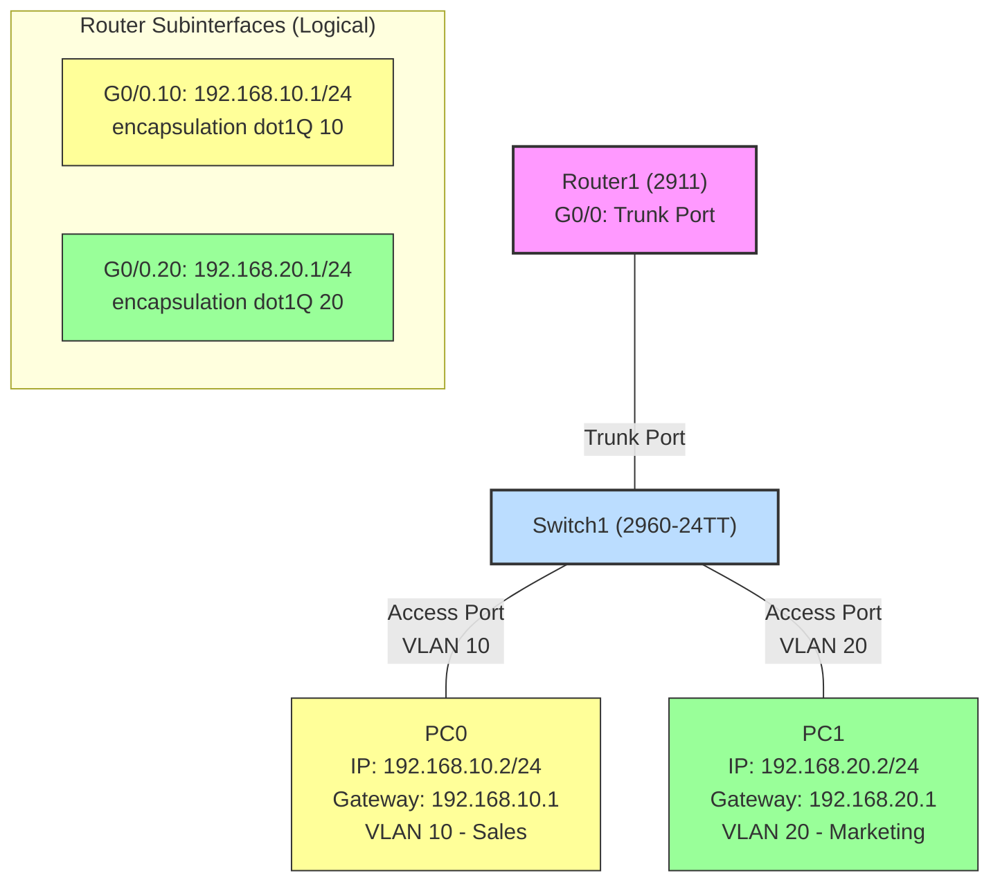

# 🔍 Lab14: Simple VLAN Configuration

## Overview
This lab guide demonstrates how to set up a basic VLAN network using Cisco Packet Tracer. We'll create two VLANs (Sales and Marketing) and configure inter-VLAN routing using a router-on-a-stick approach.

## Objectives
- Create a network with two VLANs
- Configure a switch with VLAN assignments
- Set up inter-VLAN routing using router subinterfaces
- Test connectivity between VLANs

## Network Topology
The network consists of:
- 1x Cisco 2911 Router
- 1x Cisco 2960-24TT Switch
- 2x PCs (one in each VLAN)


## IP Addressing Scheme
| Device | Interface | IP Address | Subnet Mask | VLAN | Gateway |
|--------|-----------|------------|-------------|------|---------|
| Router1 | G0/0.10 | 192.168.10.1 | 255.255.255.0 | 10 | N/A |
| Router1 | G0/0.20 | 192.168.20.1 | 255.255.255.0 | 20 | N/A |
| PC0 | FastEthernet0 | 192.168.10.2 | 255.255.255.0 | 10 | 192.168.10.1 |
| PC1 | FastEthernet0 | 192.168.20.2 | 255.255.255.0 | 20 | 192.168.20.1 |

## Lab Setup Instructions

### Step 1: Build the Network
1. Open Packet Tracer
2. Add a 2911 router (Router1)
3. Add a 2960-24TT switch (Switch1)
4. Add two PCs (PC0 and PC1)
5. Connect devices:
   - Connect Router1's G0/0 to any port on Switch1 (use Copper Straight-through)
   - Connect PC0 to any port on Switch1 (use Copper Straight-through)
   - Connect PC1 to any port on Switch1 (use Copper Straight-through)

### Step 2: Configure VLANs on the Switch
1. Double-click on Switch1 and go to the CLI tab
2. Enter privileged EXEC mode:
   ```
   Switch> enable
   ```
3. Enter global configuration mode:
   ```
   Switch# configure terminal
   ```
4. Create VLAN 10 and name it Sales:
   ```
   Switch(config)# vlan 10
   Switch(config-vlan)# name Sales
   Switch(config-vlan)# exit
   ```
5. Create VLAN 20 and name it Marketing:
   ```
   Switch(config)# vlan 20
   Switch(config-vlan)# name Marketing
   Switch(config-vlan)# exit
   ```
6. Assign the port connected to PC0 to VLAN 10:
   ```
   Switch(config)# interface fastEthernet 0/1
   Switch(config-if)# switchport mode access
   Switch(config-if)# switchport access vlan 10
   Switch(config-if)# exit
   ```
7. Assign the port connected to PC1 to VLAN 20:
   ```
   Switch(config)# interface fastEthernet 0/2
   Switch(config-if)# switchport mode access
   Switch(config-if)# switchport access vlan 20
   Switch(config-if)# exit
   ```
8. Configure the port connected to the router as a trunk port:
   ```
   Switch(config)# interface fastEthernet 0/24
   Switch(config-if)# switchport mode trunk
   Switch(config-if)# exit
   ```

### Step 3: Configure Router Subinterfaces
1. Double-click on Router1 and go to the CLI tab
2. Enter privileged EXEC mode:
   ```
   Router> enable
   ```
3. Enter global configuration mode:
   ```
   Router# configure terminal
   ```
4. Create a subinterface for VLAN 10:
   ```
   Router(config)# interface g0/0.10
   Router(config-subif)# encapsulation dot1Q 10
   Router(config-subif)# ip address 192.168.10.1 255.255.255.0
   Router(config-subif)# exit
   ```
5. Create a subinterface for VLAN 20:
   ```
   Router(config)# interface g0/0.20
   Router(config-subif)# encapsulation dot1Q 20
   Router(config-subif)# ip address 192.168.20.1 255.255.255.0
   Router(config-subif)# exit
   ```
6. Enable the main interface:
   ```
   Router(config)# interface g0/0
   Router(config-if)# no shutdown
   Router(config-if)# exit
   ```

### Step 4: Configure PC IP Addresses
1. Configure PC0:
   - Double-click on PC0
   - Go to Desktop > IP Configuration
   - Set IP Address: 192.168.10.2
   - Set Subnet Mask: 255.255.255.0
   - Set Default Gateway: 192.168.10.1

2. Configure PC1:
   - Double-click on PC1
   - Go to Desktop > IP Configuration
   - Set IP Address: 192.168.20.2
   - Set Subnet Mask: 255.255.255.0
   - Set Default Gateway: 192.168.20.1

### Step 5: Test Connectivity
1. On PC0, open Command Prompt and ping PC1:
   ```
   ping 192.168.20.2
   ```
2. On PC1, open Command Prompt and ping PC0:
   ```
   ping 192.168.10.2
   ```
3. Both pings should be successful, confirming inter-VLAN communication is working.

## Verification Commands
Use these commands to verify your configuration:

### Switch Commands
- Show VLANs:
  ```
  Switch# show vlan brief
  ```
- Show trunk ports:
  ```
  Switch# show interfaces trunk
  ```
- Show port configuration:
  ```
  Switch# show running-config interface fastEthernet 0/1
  ```

### Router Commands
- Show IP interfaces:
  ```
  Router# show ip interface brief
  ```
- Show subinterface configuration:
  ```
  Router# show running-config interface g0/0.10
  ```

## Troubleshooting
If devices cannot communicate:
1. Verify VLAN assignments on the switch
2. Check that the trunk port is properly configured
3. Verify router subinterface configuration
4. Confirm PC IP addresses and default gateways are correctly set
5. Use tracert to identify where communication fails

## Conclusion
In this lab, you've successfully:
- Created and configured two VLANs on a Cisco switch
- Set up a trunk port to the router
- Configured router subinterfaces for inter-VLAN routing
- Configured PCs in different VLANs
- Verified connectivity between VLANs

This configuration implements the router-on-a-stick approach to inter-VLAN routing, allowing devices in different VLANs to communicate through the router while maintaining logical separation at Layer 2.