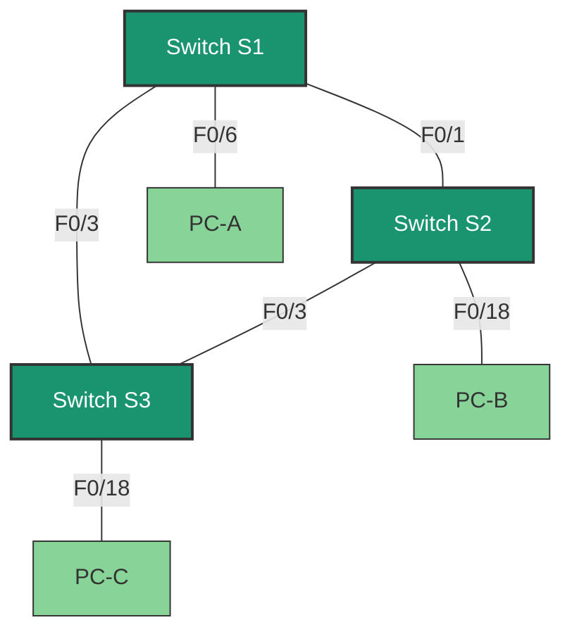

# 🔍 Lab15: Configuring Extended VLANs, VTP, and DTP

## Topology



## Addressing Table
| Header | Interface | IP Address | Subnet Mask |
|--------|-----------|------------|-------------|
| S1 | VLAN 99 | 192.168.99.1 | 255.255.255.0 |
| S2 | VLAN 99 | 192.168.99.2 | 255.255.255.0 |
| S3 | VLAN 99 | 192.168.99.3 | 255.255.255.0 |
| PC-A | NIC | 192.168.10.1 | 255.255.255.0 |
| PC-B | NIC | 192.168.20.1 | 255.255.255.0 |
| PC-C | NIC | 192.168.10.2 | 255.255.255.0 |

## Tasks
- Part 1: Configure VTP
- Part 2: Configure DTP
- Part 3: Add VLANs and assign ports
- Part 4: Configure extended range VLAN

## Background/Scenario
As the number of switches in a network increases, managing VLANs and trunks becomes more complex. VTP allows a network administrator to automate VLAN management. Automatic trunk negotiation between network devices is managed by the Dynamic Trunking Protocol (DTP). DTP is enabled by default on Catalyst 2960 and Catalyst 3560 switches.

In this laboratory work, you will configure trunk links between these switches. You will also need to configure a server and VTP clients in one VTP domain. Additionally, you will configure an extended VLAN on one of the switches, assign ports to VLANs, and verify end-to-end connectivity within this VLAN.

**Note:** Cisco Catalyst 2960s switches with Cisco IOS version 15.0(2) (lanbasek9 image) are used. Other switch models and other Cisco IOS versions can be used. Depending on the device model and Cisco IOS version, available commands and their results may differ from those shown in the laboratory work.

**Note:** Make sure that all switch settings are deleted and there is no startup configuration. If you are unsure, consult your instructor.

## Required Resources
- 3 switches (Cisco 2960 with Cisco IOS 15.0(2) operating system (lanbasek9 image) or similar model)
- 3 PCs (Windows 7 or 8 with terminal emulation program, such as Tera Term)
- Console cables for configuring Cisco IOS devices through console ports
- Ethernet cables arranged according to the topology

## Part 1: Configuring VTP
All switches will be configured to use VTP for VLAN updates. S2 will be configured as a server. S1 and S3 switches will be configured as clients. They will be in the CCNA VTP domain with the password cisco.

a. Configure S2 as a VTP server in the CCNA domain with the password cisco.
```
S2(config)# vtp domain CCNA
Changing VTP domain name from NULL to CCNA
S2(config)#
*Mar 1 00:03:44.193: %SW_VLAN-6-VTP_DOMAIN_NAME_CHG: VTP domain name changed to CCNA.
S2(config)# vtp mode server
Device mode already VTP Server for VLANS.
S2(config)# vtp password cisco
Setting device VTP password to cisco
```

b. Configure S1 and S3 as VTP clients in the CCNA domain with the password cisco. VTP configurations are shown below.
```
S1(config)# vtp domain CCNA
Changing VTP domain name from NULL to CCNA
S1(config)#
*Mar 1 00:03:44.193: %SW_VLAN-6-VTP_DOMAIN_NAME_CHG: VTP domain name changed to CCNA.
S1(config)# vtp mode client
Device mode VTP client for VLANS.
S1(config)# vtp password cisco
Setting device VTP password to cisco
```

c. Verify VTP configurations by entering the show vtp status command on all switches. The VTP status for S3 is shown below.
```
S3# show vtp status
VTP Version capable : 1 to 3
VTP version running : 1
VTP Domain Name : CCNA
VTP Pruning Mode : Disabled
VTP Traps Generation : Disabled
Device ID : 0cd9.96d2.3580
Configuration last modified by 0.0.0.0 at 0-0-00 00:00:00
Feature VLAN:
--------------
VTP Operating Mode : Client
Maximum VLANs supported locally : 255
Number of existing VLANs : 5
Configuration Revision : 0
MD5 digest : 0x8B 0x58 0x3D 0x9D 0x64 0xBE 0xD5 0xF6
 0x62 0xCB 0x4B 0x50 0xE5 0x9C 0x6F 0xF6
```

## Part 2: Configuring Dynamic Trunking Protocol (DTP)

### Step 1: Configure dynamic trunk links between S1 and S2.
a. Enter the show interfaces f0/1 switchport command on S1 and S2 switches.
What is the administrative and operational mode of the f0/1 switch port?
______________________

b. In interface configuration mode, set up a dynamic trunk link between S1 and S2. Since the default mode is dynamic auto, only one side of the link needs to be set to dynamic desirable.
```
S1(config)# interface f0/1
S1(config-if)# switchport mode dynamic desirable
S1(config-if)#
*Mar 1 00:30:45.082: %LINEPROTO-5-UPDOWN: Line protocol on Interface FastEthernet0/1, changed state to down
*Mar 1 0:30:48.102: %LINEPROTO-5-UPDOWN: Line protocol on Interface FastEthernet0/1, changed state to up
```

c. Verify the trunk link between S1 and S2 switches using the show interfaces trunk command.
```
S1# show interfaces trunk
Port    Mode        Encapsulation    Status      Native vlan
Fa0/1   desirable   802.1q           trunking    1

Port    Vlans allowed on trunk
Fa0/1   1-4094

Port    Vlans allowed and active in management domain
Fa0/1   1

Port    Vlans in spanning tree forwarding state and not pruned
Fa0/1   none
```

```
S2# show interfaces trunk
Port    Mode        Encapsulation    Status      Native vlan
Fa0/1   auto        802.1q           trunking    1

Port    Vlans allowed on trunk
Fa0/1   1-4094

Port    Vlans allowed and active in management domain
Fa0/1   1

Port    Vlans in spanning tree forwarding state and not pruned
Fa0/1   1
```

### Step 2: Configure a static trunk link between S1 and S3.
a. Between switches S1 and S3, set up a static trunk link using the switchport mode trunk command in interface configuration mode for port F0/3.
```
S1(config)# interface f0/3
S1(config-if)# switchport mode trunk
```

b. Verify the trunks using the show interfaces trunk command on switch S1.
```
S1# show interface trunk
Port    Mode        Encapsulation    Status      Native vlan
Fa0/1   desirable   802.1q           trunking    1
Fa0/3   on          802.1q           trunking    1

Port    Vlans allowed on trunk
Fa0/1   1-4094
Fa0/3   1-4094

Port    Vlans allowed and active in management domain
Fa0/1   1
Fa0/3   1

Port    Vlans in spanning tree forwarding state and not pruned
Fa0/1   none
Fa0/3   none
```

c. Configure a permanent trunk between switches S2 and S3.

d. Write down the commands used to create a static trunk.
______________________

## Part 3: Adding VLANs and Assigning Ports

### Step 1: Add VLANs to the switches.
a. On switch S1, add VLAN 10.
```
S1(config)# vlan 10
```
Were you able to create VLAN 10 on switch S1? Explain your answer.

b. Add the following VLANs on switch S2.
| VLAN | Name |
|------|------|
| 10 | Red |
| 20 | Blue |
| 30 | Yellow |
| 99 | Management |

```
S2(config)# vlan 10
S2(config-vlan)# name Red
S2(config-vlan)# vlan 20
S2(config-vlan)# name Blue
S2(config-vlan)# vlan 30
S2(config-vlan)# name Yellow
S2(config-vlan)# vlan 99
S2(config-vlan)# name Management
S2(config-vlan)# end
S2# show vlan brief
VLAN Name                             Status    Ports
---- -------------------------------- --------- -------------------------------
1    default                          active    Fa0/2, Fa0/4, Fa0/5, Fa0/6
                                                Fa0/7, Fa0/8, Fa0/9, Fa0/10
                                                Fa0/11, Fa0/12, Fa0/13, Fa0/14
                                                Fa0/15, Fa0/16, Fa0/17, Fa0/18
                                                Fa0/19, Fa0/20, Fa0/21, Fa0/22
                                                Fa0/23, Fa0/24, Gi0/1, Gi0/2
10   Red                              active
20   Blue                             active
30   Yellow                           active
99   Management                       active
<output omitted>
```

### Step 2: Verify VTP updates on S1 and S3 switches.
Since S2 is configured as a VTP server, and S1 and S3 are configured as VTP clients, S1 and S3 should receive and apply VLAN information from S2.

What show commands did you use to verify VTP updates on S1 and S3 switches?
______________________

### Step 3: Assign ports to VLANs.
In this step, you will associate ports with VLANs and configure IP addresses according to the following table.

| Port Assignment | VLAN | IP Address and Prefix of Attached Computer |
|-----------------|------|-------------------------------------------|
| S1 F0/6 | VLAN 10 | PC-A: 192.168.10.1 /24 |
| S2 F0/18 | VLAN 20 | PC-B: 192.168.20.1 /24 |
| S3 F0/18 | VLAN 10 | PC-C: 192.168.10.2 /24 |

a. On switch S1, set port F0/6 to access mode and assign it to VLAN 10.
```
S1(config)# interface f0/6
S1(config-if)# switchport mode access
S1(config-if)# switchport access vlan 10
```

b. Repeat the procedure for port F0/18 on switches S2 and S3. Assign the VLAN according to the table above.

c. Assign IP addresses to computers according to the table.

### Step 4: Configure IP addresses on the switches.
a. On switch S1, assign an IP address to the SVI interface for VLAN 99 according to the addressing table and activate the interface.
```
S1(config)# interface vlan 99
S1(config-if)# ip address 192.168.99.1 255.255.255.0
S1(config-fi)# no shutdown
```

b. Repeat step a for switches S2 and S3.

### Step 5: Verify end-to-end connectivity
a. Send a ping from PC-B to PC-A and check the result. Explain the answer.
______________________

b. Send a ping from PC-A to PC-C and check the result. Explain the answer.
______________________

c. Send a ping from switch S1 to PC-A. Was the test successful? Explain the answer.
______________________

d. Send a ping from switch S2 to switch S1. Was the test successful? Explain the answer.
______________________

## Part 4: Configuring Extended Range VLAN
An extended range VLAN is a VLAN in the range from 1025 to 4096. Since extended range VLANs cannot be managed using VTP, VTP must be set to transparent mode. In this part, you will set VTP on switch S1 to transparent mode and create an extended range VLAN on switch S1.

### Step 1: Set VTP on switch S1 to transparent mode.
a. Set VTP on switch S1 to transparent mode.
```
S1(config)# vtp mode transparent
Setting device to VTP Transparent mode for VLANS.
S1(config)# exit
```

b. Verify VTP mode on switch S1.
```
S1# show vtp status
VTP Version capable             : 1 to 3
VTP version running             : 1
VTP Domain Name                 : CCNA
VTP Pruning Mode                : Disabled
VTP Traps Generation            : Disabled
Device ID                       : 0cd9.96e2.3d00
Configuration last modified by 0.0.0.0 at 3-1-93 02:36:11
Feature VLAN:
--------------
VTP Operating Mode              : Transparent
Maximum VLANs supported locally : 255
Number of existing VLANs        : 9
Configuration Revision          : 0
MD5 digest                      : 0xB2 0x9A 0x11 0x5B 0xBF 0x2E 0xBF 0xAA
                                  0x31 0x18 0xFF 0x2C 0x5E 0x54 0x0A 0xB7
```

### Step 2: Configure an extended range VLAN on switch S1.
a. Display the current VLAN configurations on switch S1.

b. Create extended range VLAN 2000.
```
S1# conf t
Enter configuration commands, one per line. End with CNTL/Z.
S1(config)# vlan 2000
S1(config-vlan)# end
```

c. Verify that the VLAN is created correctly.
```
S1# show vlan brief
VLAN Name                             Status    Ports
---- -------------------------------- --------- -------------------------------
1    default                          active    Fa0/2, Fa0/4, Fa0/5, Fa0/7
                                                Fa0/8, Fa0/9, Fa0/10, Fa0/11
                                                Fa0/12, Fa0/13, Fa0/14, Fa0/15
                                                Fa0/16, Fa0/17, Fa0/18, Fa0/19
                                                Fa0/20, Fa0/21, Fa0/22, Fa0/23
                                                Fa0/24, Gi0/1, Gi0/2
10   Red                              active    Fa0/6
20   Blue                             active
30   Yellow                           active
99   Management                       active
1002 fddi-default                     act/unsup
1003 token-ring-default               act/unsup
1004 fddinet-default                  act/unsup
1005 trnet-default                    act/unsup
2000 VLAN2000                         active
```

## Review Questions
What are the advantages and disadvantages of using VTP?
______________________

## Router Interface Summary Table
| Router Model | Ethernet Interface 1 | Ethernet Interface 2 | Serial Interface 1 | Serial Interface 2 |
|--------------|----------------------|----------------------|--------------------|-------------------|
| 1800 | Fast Ethernet 0/0 (F0/0) | Fast Ethernet 0/1 (F0/1) | Serial 0/0/0 (S0/0/0) | Serial 0/0/1 (S0/0/1) |
| 1900 | Gigabit Ethernet 0/0 (G0/0) | Gigabit Ethernet 0/1 (G0/1) | Serial 0/0/0 (S0/0/0) | Serial 0/0/1 (S0/0/1) |
| 2801 | Fast Ethernet 0/0 (F0/0) | Fast Ethernet 0/1 (F0/1) | Serial 0/1/0 (S0/1/0) | Serial 0/1/1 (S0/1/1) |
| 2811 | Fast Ethernet 0/0 (F0/0) | Fast Ethernet 0/1 (F0/1) | Serial 0/0/0 (S0/0/0) | Serial 0/0/1 (S0/0/1) |
| 2900 | Gigabit Ethernet 0/0 (G0/0) | Gigabit Ethernet 0/1 (G0/1) | Serial 0/0/0 (S0/0/0) | Serial 0/0/1 (S0/0/1) |

**Note:** To determine the router configuration, you can look at the interfaces and determine the type of router and the number of its interfaces. It is impossible to list all possible configuration combinations for each router class. This table contains identifiers for possible combinations of Ethernet and serial interfaces on the device. Other interface types are not represented in the table, although they may be present on a particular router. As an example, ISDN BRI interfaces can be mentioned. The line in parentheses is the official abbreviation that can be used in Cisco IOS commands to designate the interface.