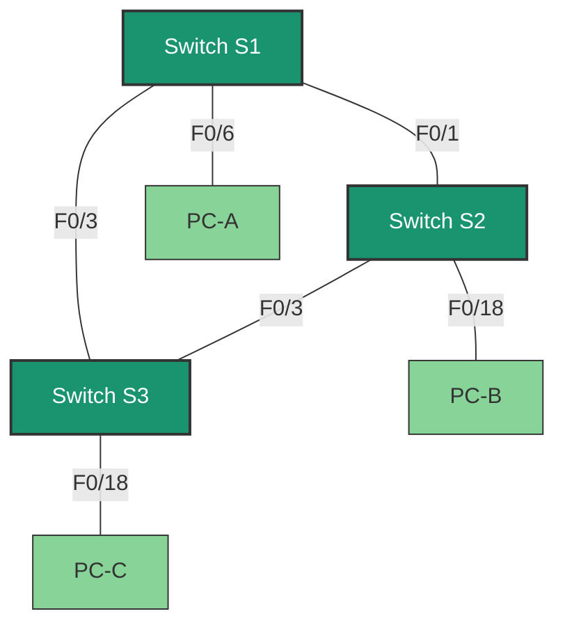

---

# 🔍 Lab15: Configuring Extended VLANs, VTP, and DTP

## **Topology**



---

## **Addressing Table**

| Device   | Interface | IP Address       | Subnet Mask       |
|----------|-----------|------------------|-------------------|
| S1       | VLAN 99   | 192.168.99.1     | 255.255.255.0     |
| S2       | VLAN 99   | 192.168.99.2     | 255.255.255.0     |
| S3       | VLAN 99   | 192.168.99.3     | 255.255.255.0     |
| PC-A     | NIC       | 192.168.10.1     | 255.255.255.0     |
| PC-B     | NIC       | 192.168.20.1     | 255.255.255.0     |
| PC-C     | NIC       | 192.168.10.2     | 255.255.255.0     |

---

## **Tasks**
1. **Part 1:** Configure VTP (VLAN Trunking Protocol).
2. **Part 2:** Configure DTP (Dynamic Trunking Protocol).
3. **Part 3:** Add VLANs and assign ports.
4. **Part 4:** Configure extended range VLANs.

---

## **Background/Scenario**
In larger networks, managing VLANs across multiple switches can become complex. VTP simplifies VLAN management by propagating VLAN information across switches in the same VTP domain. DTP automates trunk link formation between switches. In this lab, you will configure VTP, DTP, and extended VLANs to ensure proper VLAN communication across the network.

---

## **Required Resources**
- 3 switches (Cisco 2960 with Cisco IOS 15.0(2) or similar).
- 3 PCs (with terminal emulation software like Tera Term).
- Console cables for switch configuration.
- Ethernet cables as per the topology.

---

## **Part 1: Configuring VTP**

### **Step 1: Configure S2 as the VTP Server**
- **Why:** The VTP server is responsible for creating, modifying, and deleting VLANs. It propagates VLAN information to all switches in the same VTP domain.
- **What it achieves:** Ensures consistent VLAN configuration across the network.

```bash
S2(config)# vtp domain CCNA
S2(config)# vtp mode server
S2(config)# vtp password cisco
```

**Explanation:**
- **VTP Domain:** All switches in the same VTP domain share VLAN information. This ensures that VLANs are consistent across the network.
- **VTP Mode:** The server can create, modify, and delete VLANs. Clients synchronize VLAN information from the server.
- **VTP Password:** Ensures only authorized switches can join the VTP domain, preventing unauthorized switches from disrupting VLAN configurations.

---

### **Step 2: Configure S1 and S3 as VTP Clients**
- **Why:** VTP clients receive VLAN information from the VTP server and cannot create or modify VLANs. This ensures centralized VLAN management.
- **What it achieves:** Simplifies VLAN management by allowing the VTP server to control VLAN configurations.

```bash
S1(config)# vtp domain CCNA
S1(config)# vtp mode client
S1(config)# vtp password cisco
```

**Explanation:**
- **VTP Clients:** These switches receive VLAN updates from the VTP server and apply them locally. This reduces the risk of inconsistent VLAN configurations.

---

### **Step 3: Verify VTP Configuration**
- **Why:** Verifying the VTP configuration ensures that all switches are in the same domain, have the correct mode, and are synchronized.
- **What it achieves:** Confirms that VLAN information will propagate correctly.

```bash
S1# show vtp status
```

**Expected Output:**
- VTP Domain Name: `CCNA`
- VTP Operating Mode: `Client` (for S1 and S3), `Server` (for S2).
- Configuration Revision: Should be the same across all switches.

---

## **Part 2: Configuring DTP**

### **Step 1: Configure Dynamic Trunk Links**
- **Why:** DTP automates the formation of trunk links between switches, reducing manual configuration.
- **What it achieves:** Ensures that switches dynamically form trunk links to carry traffic for multiple VLANs.

```bash
S1(config)# interface f0/1
S1(config-if)# switchport mode dynamic desirable
```

**Explanation:**
- **Dynamic Desirable:** The port actively tries to form a trunk link with the neighboring switch.
- **Dynamic Auto:** The port forms a trunk link only if the other side is set to `dynamic desirable` or `trunk`.

---

### **Step 2: Verify Trunk Links**
- **Why:** Verifying trunk links ensures that VLAN traffic can pass between switches.
- **What it achieves:** Confirms that trunk links are active and carrying traffic for the correct VLANs.

```bash
S1# show interfaces trunk
```

**Expected Output:**
- Ports F0/1 and F0/3 should be in trunking mode.

---

## **Part 3: Adding VLANs and Assigning Ports**

### **Step 1: Create VLANs on S2**
- **Why:** VLANs segment the network into smaller broadcast domains, improving performance and security.
- **What it achieves:** Allows devices in the same VLAN to communicate while isolating traffic from other VLANs.

```bash
S2(config)# vlan 10
S2(config-vlan)# name Red
S2(config-vlan)# vlan 20
S2(config-vlan)# name Blue
S2(config-vlan)# vlan 30
S2(config-vlan)# name Yellow
S2(config-vlan)# vlan 99
S2(config-vlan)# name Management
```

**Explanation:**
- **VLANs:** VLANs 10, 20, and 30 are used for user traffic, while VLAN 99 is used for switch management.

---

### **Step 2: Assign Ports to VLANs**
- **Why:** Assigning ports to VLANs ensures that devices are placed in the correct broadcast domain.
- **What it achieves:** Devices in the same VLAN can communicate, while devices in different VLANs are isolated.

```bash
S1(config)# interface f0/6
S1(config-if)# switchport mode access
S1(config-if)# switchport access vlan 10
```

**Explanation:**
- **Access Ports:** These ports carry traffic for a single VLAN, ensuring that devices connected to them are in the correct VLAN.

---

### **Step 3: Verify VLAN Propagation**
- **Why:** Verifying VLAN propagation ensures that all switches have the same VLAN information.
- **What it achieves:** Confirms that VLANs are consistent across the network.

```bash
S1# show vlan brief
```

**Expected Output:**
- VLANs 10, 20, 30, and 99 should appear on all switches.

---

## **Part 4: Configuring Extended VLANs**

### **Step 1: Set VTP to Transparent Mode**
- **Why:** Extended VLANs (1025–4096) cannot be managed by VTP. Setting the switch to transparent mode allows local VLAN configuration.
- **What it achieves:** Enables the creation of extended VLANs without affecting other switches in the VTP domain.

```bash
S1(config)# vtp mode transparent
```

**Explanation:**
- **Transparent Mode:** The switch does not participate in VTP updates but can create local VLANs.

---

### **Step 2: Create Extended VLAN**
- **Why:** Extended VLANs are useful for large networks that require more than 1000 VLANs.
- **What it achieves:** Provides additional VLANs for network segmentation.

```bash
S1(config)# vlan 2000
S1(config-vlan)# end
```

**Explanation:**
- **Extended VLANs:** These VLANs are used in large networks where the standard VLAN range (1–1005) is insufficient.

---

## **Troubleshooting Tips**
1. **VLANs Not Propagating:**
   - Verify VTP domain and password.
   - Ensure S2 is in server mode and S1/S3 are in client mode.

2. **Trunk Links Not Forming:**
   - Check DTP settings (`dynamic desirable` or `trunk`).
   - Verify native VLAN consistency.

3. **Ping Failures:**
   - Check VLAN assignments and IP addressing.
   - Ensure trunk links are active.

---

## **Review Questions**
1. What is the purpose of VTP, and what are its advantages and disadvantages?
2. How does DTP simplify trunk link configuration?
3. Why can’t extended VLANs be managed by VTP?

---