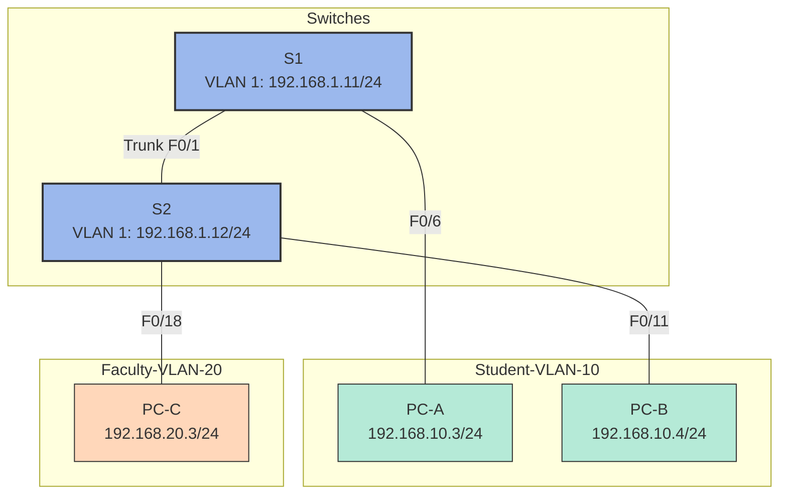

# 🔍 Lab14: Configuring VLANs and Trunking

## Introduction

This lab guides you through setting up Virtual Local Area Networks (VLANs) and trunking between switches. VLANs are used to logically segment a network and improve performance by breaking up large broadcast domains into smaller ones. Trunking allows multiple VLANs to traverse a single physical link while maintaining their separation.

## Lab Topology



*Figure: Network topology showing two switches (S1 and S2) connected via trunk, with PCs assigned to different VLANs*

## Addressing Table

| Device | Interface | IP Address    | Subnet Mask   | Default Gateway |
|--------|-----------|---------------|---------------|-----------------|
| S1     | VLAN 1    | 192.168.1.11  | 255.255.255.0 | N/A             |
| S2     | VLAN 1    | 192.168.1.12  | 255.255.255.0 | N/A             |
| PC-A   | NIC       | 192.168.10.3  | 255.255.255.0 | 192.168.10.1    |
| PC-B   | NIC       | 192.168.10.4  | 255.255.255.0 | 192.168.10.1    |
| PC-C   | NIC       | 192.168.20.3  | 255.255.255.0 | 192.168.20.1    |

## Lab Objectives

1. Build the network and configure basic device settings
2. Create VLANs and assign switch ports
3. Maintain VLAN port assignments and the VLAN database
4. Configure an 802.1Q trunk between the switches
5. Delete the VLAN database

## Required Equipment

- 2 Switches (Cisco 2960 or comparable)
- 3 PCs (with terminal emulation program)
- Console cables
- Ethernet cables as shown in the topology

## Detailed Instructions

### Part 1: Build the Network and Configure Basic Device Settings

1. **Cable the network according to the topology**

2. **Configure basic settings for each switch:**
   ```
   Switch> enable
   Switch# configure terminal
   Switch(config)# no ip domain-lookup
   Switch(config)# hostname S1
   S1(config)# enable secret class
   S1(config)# line console 0
   S1(config-line)# password cisco
   S1(config-line)# login
   S1(config-line)# logging synchronous
   S1(config-line)# line vty 0 15
   S1(config-line)# password cisco
   S1(config-line)# login
   S1(config-line)# exit
   S1(config)# banner motd #Unauthorized access is prohibited!#
   S1(config)# interface vlan 1
   S1(config-if)# ip address 192.168.1.11 255.255.255.0
   S1(config-if)# no shutdown
   S1(config-if)# exit
   S1(config)# interface range fa0/2-24, gi0/1-2
   S1(config-if-range)# shutdown
   S1(config-if-range)# end
   S1# copy running-config startup-config
   ```

   Repeat these steps for S2, changing the hostname and IP address as needed.

3. **Configure PC hosts according to the addressing table**

4. **Test connectivity between devices in the same VLAN**

### Part 2: Create VLANs and Assign Switch Ports

1. **Create VLANs on the switches:**
   ```
   S1(config)# vlan 10
   S1(config-vlan)# name Student
   S1(config-vlan)# vlan 20
   S1(config-vlan)# name Faculty
   S1(config-vlan)# vlan 99
   S1(config-vlan)# name Management
   S1(config-vlan)# end
   ```

   Repeat these steps on S2.

2. **Verify VLAN creation:**
   ```
   S1# show vlan brief
   ```

3. **Assign VLANs to switch interfaces:**
   
   On S1:
   ```
   S1(config)# interface f0/6
   S1(config-if)# switchport mode access
   S1(config-if)# switchport access vlan 10
   S1(config-if)# exit
   ```

   On S2:
   ```
   S2(config)# interface f0/11
   S2(config-if)# switchport mode access
   S2(config-if)# switchport access vlan 10
   S2(config-if)# exit
   S2(config)# interface f0/18
   S2(config-if)# switchport mode access
   S2(config-if)# switchport access vlan 20
   S2(config-if)# exit
   ```

4. **Move the management IP address to VLAN 99:**
   ```
   S1(config)# interface vlan 1
   S1(config-if)# no ip address
   S1(config-if)# interface vlan 99
   S1(config-if)# ip address 192.168.1.11 255.255.255.0
   S1(config-if)# end
   ```

   Repeat for S2 with its corresponding IP address.

5. **Verify VLAN assignments:**
   ```
   S1# show vlan brief
   ```

### Part 3: Maintain VLAN Port Assignments and the VLAN Database

1. **Assign a VLAN to multiple interfaces:**
   ```
   S1(config)# interface range f0/11-24
   S1(config-if-range)# switchport mode access
   S1(config-if-range)# switchport access vlan 10
   S1(config-if-range)# end
   ```

2. **Reassign specific ports to another VLAN:**
   ```
   S1(config)# interface f0/11
   S1(config-if)# switchport access vlan 20
   S1(config-if)# exit
   S1(config)# interface f0/21
   S1(config-if)# switchport access vlan 20
   S1(config-if)# end
   ```

3. **Remove a VLAN assignment from an interface:**
   ```
   S1(config)# interface f0/24
   S1(config-if)# no switchport access vlan
   S1(config-if)# end
   ```

4. **Add a new VLAN by assigning it to an interface:**
   ```
   S1(config)# interface f0/24
   S1(config-if)# switchport access vlan 30
   S1(config-if)# end
   ```

5. **Remove a VLAN from the VLAN database:**
   ```
   S1(config)# no vlan 30
   S1(config)# end
   ```

   Note: Before removing a VLAN, reassign all ports to different VLANs first to avoid traffic disruption.

### Part 4: Configure an 802.1Q Trunk Between the Switches

1. **Use DTP to initiate trunking on F0/1:**
   ```
   S1(config)# interface f0/1
   S1(config-if)# switchport mode dynamic desirable
   S1(config-if)# end
   ```

   Note: The default DTP mode on Cisco 2960 switches is "dynamic auto".

2. **Verify the trunk has been established:**
   ```
   S1# show interfaces trunk
   ```

3. **Manually configure trunk interface F0/1:**
   ```
   S1(config)# interface f0/1
   S1(config-if)# switchport mode trunk
   S1(config-if)# end
   ```

   Repeat on S2 to set its F0/1 interface to trunk mode as well.

4. **Verify trunk configuration:**
   ```
   S1# show interfaces trunk
   ```

5. **Set a native VLAN:**
   ```
   S1(config)# interface f0/1
   S1(config-if)# switchport trunk native vlan 99
   S1(config-if)# end
   ```

   Note: Make sure to configure the same native VLAN on both switches to avoid native VLAN mismatch errors.

6. **Control VLANs allowed on the trunk (optional):**
   ```
   S1(config)# interface f0/1
   S1(config-if)# switchport trunk allowed vlan 10,20,99
   S1(config-if)# end
   ```

   To add an additional VLAN later:
   ```
   S1(config)# interface f0/1
   S1(config-if)# switchport trunk allowed vlan add 30
   S1(config-if)# end
   ```

### Part 5: Delete the VLAN Database

1. **Check if the VLAN database exists:**
   ```
   S1# show flash
   ```

   Look for a file named "vlan.dat" in the output.

2. **Delete the VLAN database:**
   ```
   S1# delete vlan.dat
   ```

   Confirm by pressing Enter when prompted.

3. **Verify the VLAN database was deleted:**
   ```
   S1# show flash
   ```

4. **Reload the switch to complete the factory reset (if needed):**
   ```
   S1# erase startup-config
   S1# reload
   ```

## Verification and Testing

After each section, verify your configuration using the following commands:

- `show vlan brief` - Displays VLANs and their assigned ports
- `show interfaces trunk` - Shows trunk interfaces and their configurations
- `show run interface <interface-id>` - Displays the running configuration for a specific interface
- `show ip interface brief` - Shows the status of all interfaces with their IP addresses

Use ping tests between devices to verify connectivity within and across VLANs:

- PCs in the same VLAN should be able to ping each other
- PCs in different VLANs will not be able to ping each other without a Layer 3 device (router)
- Switches should be able to ping each other if they have IP addresses in the same VLAN

## Key VLAN and Trunking Concepts

### VLAN Fundamentals
- VLANs logically segment a network independently of physical location
- Each VLAN creates a separate broadcast domain
- By default, traffic cannot pass between different VLANs (requires a Layer 3 device)
- Default VLAN 1 contains all ports by default

### Trunking
- Trunks carry traffic from multiple VLANs over a single link
- IEEE 802.1Q is the industry standard trunking protocol
- 802.1Q adds a tag (4 bytes) to the Ethernet frame to identify the VLAN
- The native VLAN's traffic is sent untagged across the trunk

### DTP (Dynamic Trunking Protocol)
- Cisco proprietary protocol for automatic trunk negotiation
- DTP modes:
  - `switchport mode access` - Never forms a trunk
  - `switchport mode trunk` - Forces trunking
  - `switchport mode dynamic auto` - Forms a trunk if the neighbor is set to trunk or desirable
  - `switchport mode dynamic desirable` - Actively tries to form a trunk

### Native VLAN Considerations
- Traffic on the native VLAN crosses trunks without a VLAN tag
- Native VLAN mismatch issues can cause problems with STP and CDP
- Security best practice: Change native VLAN to something other than VLAN 1

### Security Best Practices
- Disable unused ports and assign them to an unused VLAN
- Use dedicated VLANs for management traffic
- Change the native VLAN to something other than VLAN 1
- Disable DTP when not needed (use manual trunking configuration)
- Only allow necessary VLANs across trunks