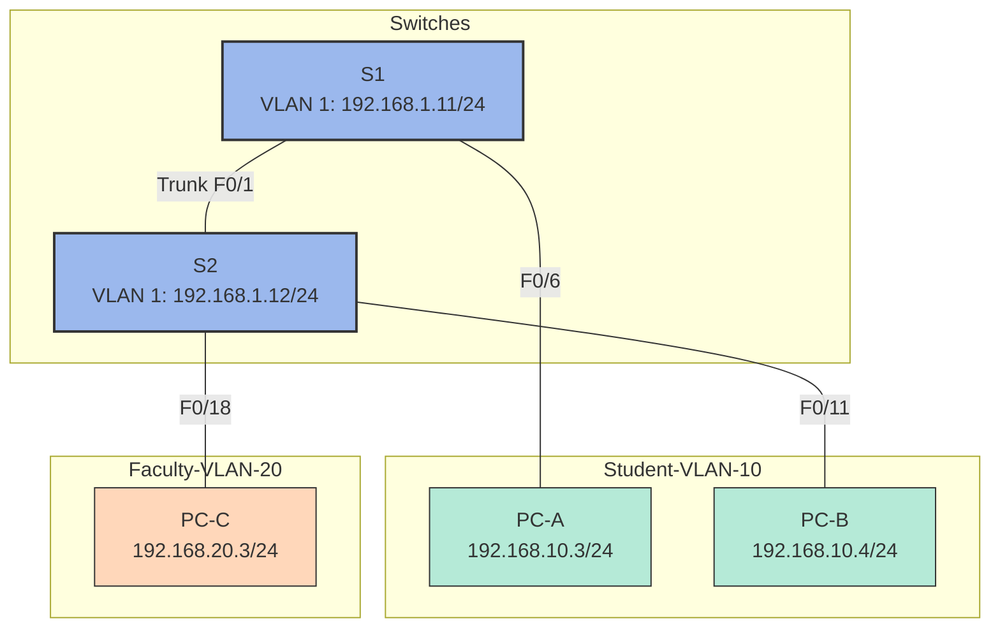

---

# 🔍 Lab16: Configuring VLANs and Trunking

## Introduction
This lab guides you through setting up **Virtual Local Area Networks (VLANs)** and **trunking** between switches. VLANs are used to logically segment a network, improving performance and security by breaking up large broadcast domains into smaller ones. Trunking allows multiple VLANs to traverse a single physical link while maintaining their separation.

---

## Lab Topology



*Figure: Network topology showing two switches (S1 and S2) connected via trunk, with PCs assigned to different VLANs*

---

## Addressing Table

| Device | Interface | IP Address    | Subnet Mask   | Default Gateway |
|--------|-----------|---------------|---------------|-----------------|
| S1     | VLAN 1    | 192.168.1.11  | 255.255.255.0 | N/A             |
| S2     | VLAN 1    | 192.168.1.12  | 255.255.255.0 | N/A             |
| PC-A   | NIC       | 192.168.10.3  | 255.255.255.0 | 192.168.10.1    |
| PC-B   | NIC       | 192.168.10.4  | 255.255.255.0 | 192.168.10.1    |
| PC-C   | NIC       | 192.168.20.3  | 255.255.255.0 | 192.168.20.1    |

---

## Lab Objectives
1. Build the network and configure basic device settings.
2. Create VLANs and assign switch ports.
3. Maintain VLAN port assignments and the VLAN database.
4. Configure an 802.1Q trunk between the switches.
5. Verify connectivity and troubleshoot common issues.
6. Delete the VLAN database (optional).

---

## Required Equipment
- 2 Switches (Cisco 2960 or comparable)
- 3 PCs (with terminal emulation program)
- Console cables
- Ethernet cables (straight-through for switch-to-PC, crossover or straight-through for switch-to-switch, depending on switch model)

---

## Detailed Instructions

### Part 1: Build the Network and Configure Basic Device Settings

1. **Cable the Network:**
   - Connect **PC-A** to **S1** on port **F0/6**.
   - Connect **PC-B** to **S2** on port **F0/11**.
   - Connect **PC-C** to **S2** on port **F0/18**.
   - Connect **S1** and **S2** using a trunk link on port **F0/1**.

2. **Configure Basic Switch Settings:**
   - Access the switch via console cable and terminal emulation software (e.g., PuTTY).
   - Configure the hostname, passwords, and IP address for management.

   **Example for S1:**
   ```bash
   Switch> enable
   Switch# configure terminal
   Switch(config)# no ip domain-lookup
   Switch(config)# hostname S1
   S1(config)# enable secret class
   S1(config)# line console 0
   S1(config-line)# password cisco
   S1(config-line)# login
   S1(config-line)# logging synchronous
   S1(config-line)# line vty 0 15
   S1(config-line)# password cisco
   S1(config-line)# login
   S1(config-line)# exit
   S1(config)# banner motd #Unauthorized access is prohibited!#
   S1(config)# interface vlan 1
   S1(config-if)# ip address 192.168.1.11 255.255.255.0
   S1(config-if)# no shutdown
   S1(config-if)# exit
   S1(config)# interface range fa0/2-24, gi0/1-2
   S1(config-if-range)# shutdown
   S1(config-if-range)# end
   S1# copy running-config startup-config
   ```

   Repeat for **S2**, changing the hostname to **S2** and IP address to **192.168.1.12**.

3. **Configure PC IP Addresses:**
   - Assign IP addresses to **PC-A**, **PC-B**, and **PC-C** according to the addressing table.

---

### Part 2: Create VLANs and Assign Switch Ports

1. **Create VLANs on S1 and S2:**
   ```bash
   S1(config)# vlan 10
   S1(config-vlan)# name Student
   S1(config-vlan)# vlan 20
   S1(config-vlan)# name Faculty
   S1(config-vlan)# vlan 99
   S1(config-vlan)# name Management
   S1(config-vlan)# exit
   ```

   Repeat on **S2**.

2. **Assign VLANs to Ports:**
   - Assign **PC-A** (connected to **S1 F0/6**) to **VLAN 10**:
     ```bash
     S1(config)# interface f0/6
     S1(config-if)# switchport mode access
     S1(config-if)# switchport access vlan 10
     S1(config-if)# exit
     ```
   - Assign **PC-B** (connected to **S2 F0/11**) to **VLAN 10**:
     ```bash
     S2(config)# interface f0/11
     S2(config-if)# switchport mode access
     S2(config-if)# switchport access vlan 10
     S2(config-if)# exit
     ```
   - Assign **PC-C** (connected to **S2 F0/18**) to **VLAN 20**:
     ```bash
     S2(config)# interface f0/18
     S2(config-if)# switchport mode access
     S2(config-if)# switchport access vlan 20
     S2(config-if)# exit
     ```

3. **Verify VLAN Assignments:**
   ```bash
   S1# show vlan brief
   ```

---

### Part 3: Configure an 802.1Q Trunk Between Switches

1. **Configure Trunking on S1 and S2:**
   - On **S1**:
     ```bash
     S1(config)# interface f0/1
     S1(config-if)# switchport mode trunk
     S1(config-if)# switchport trunk native vlan 99
     S1(config-if)# end
     ```
   - On **S2**:
     ```bash
     S2(config)# interface f0/1
     S2(config-if)# switchport mode trunk
     S2(config-if)# switchport trunk native vlan 99
     S2(config-if)# end
     ```

2. **Verify Trunk Configuration:**
   ```bash
   S1# show interfaces trunk
   ```

---

### Part 4: Verification and Testing

1. **Test Connectivity:**
   - **PC-A** should be able to ping **PC-B** (both in VLAN 10).
   - **PC-C** should not be able to ping **PC-A** or **PC-B** (different VLANs).

2. **Useful Commands:**
   - `show vlan brief` – Verify VLAN assignments.
   - `show interfaces trunk` – Verify trunk configuration.
   - `show running-config` – View the full switch configuration.

---

### Part 5: Delete the VLAN Database (Optional)

1. **Delete VLAN Database:**
   ```bash
   S1# delete vlan.dat
   ```
   Confirm by pressing Enter.

2. **Reload the Switch:**
   ```bash
   S1# reload
   ```

---

## Troubleshooting Tips

1. **No Connectivity Between PCs in the Same VLAN:**
   - Verify VLAN assignments using `show vlan brief`.
   - Ensure the switch ports are in `access` mode.

2. **Trunk Not Forming:**
   - Check DTP mode using `show interfaces trunk`.
   - Ensure both ends of the trunk are configured consistently.

3. **Native VLAN Mismatch:**
   - Verify the native VLAN on both ends of the trunk using `show interfaces trunk`.

---

## Key Takeaways
- VLANs segment networks logically, improving performance and security.
- Trunking allows multiple VLANs to share a single physical link.
- Always verify configurations using `show` commands.
- Change the native VLAN from the default (VLAN 1) for better security.

---
