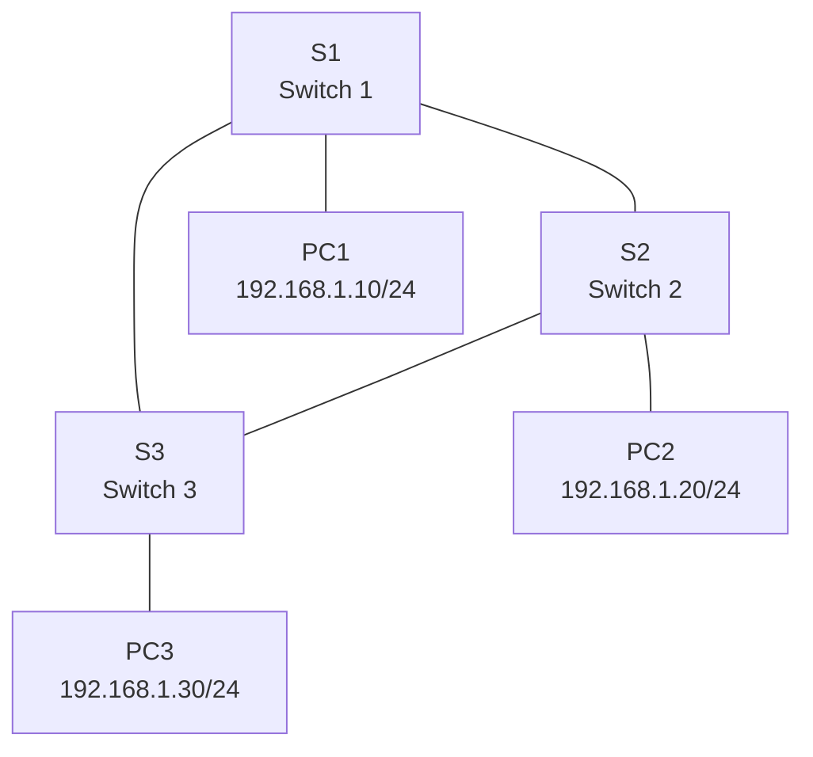

Here’s a **20-minute Spanning Tree Protocol (STP) lab** designed for Cisco Packet Tracer. This lab focuses on configuring and verifying STP to prevent loops in a switched network. It’s concise, practical, and can be completed within the time frame.

---

# 🔍 Lab: Configuring and Verifying Spanning Tree Protocol (STP)

## Lab Objective
In this lab, you will:
1. Configure **Spanning Tree Protocol (STP)** to prevent loops in a switched network.
2. Verify STP operation and root bridge election.
3. Manipulate STP to change the root bridge.

---

## Lab Topology



*Figure: Three switches connected in a triangle with PCs attached to each switch.*

---

## Addressing Table

| Device | Interface | IP Address    | Subnet Mask   |
|--------|-----------|---------------|---------------|
| PC1    | NIC       | 192.168.1.10  | 255.255.255.0 |
| PC2    | NIC       | 192.168.1.20  | 255.255.255.0 |
| PC3    | NIC       | 192.168.1.30  | 255.255.255.0 |

---

## Lab Steps (20 Minutes)

### Step 1: Build the Network
1. Add **3 switches (2960)** and **3 PCs** to the workspace in Packet Tracer.
2. Connect the switches in a triangle:
   - **S1 F0/1** to **S2 F0/1**
   - **S1 F0/2** to **S3 F0/1**
   - **S2 F0/2** to **S3 F0/2**
3. Connect each PC to a switch:
   - **PC1** to **S1 F0/3**
   - **PC2** to **S2 F0/3**
   - **PC3** to **S3 F0/3**

---

### Step 2: Configure STP (5 Minutes)
1. Verify STP is enabled by default:
   ```bash
   S1# show spanning-tree
   ```
   - Observe the root bridge and port states.

2. **Manually set S1 as the root bridge:**
   ```bash
   S1(config)# spanning-tree vlan 1 root primary
   ```

3. **Set S2 as the secondary root bridge:**
   ```bash
   S2(config)# spanning-tree vlan 1 root secondary
   ```

4. Verify the root bridge election:
   ```bash
   S1# show spanning-tree
   S2# show spanning-tree
   S3# show spanning-tree
   ```
   - Confirm **S1** is the root bridge and **S2** is the secondary.

---

### Step 3: Verify STP Operation (5 Minutes)
1. Check port roles and states:
   ```bash
   S1# show spanning-tree
   S2# show spanning-tree
   S3# show spanning-tree
   ```
   - Look for **Root Port (RP)**, **Designated Port (DP)**, and **Blocking Port (BLK)**.

2. Test connectivity:
   - Ping from **PC1** to **PC2** and **PC3**.
   - Ensure all PCs can communicate.

---

### Step 4: Manipulate STP (5 Minutes)
1. **Change the root bridge to S3:**
   ```bash
   S3(config)# spanning-tree vlan 1 root primary
   ```

2. Verify the new root bridge:
   ```bash
   S3# show spanning-tree
   ```
   - Confirm **S3** is now the root bridge.

3. Check port roles and states on all switches:
   ```bash
   S1# show spanning-tree
   S2# show spanning-tree
   S3# show spanning-tree
   ```

---

### Step 5: Test and Clean Up (5 Minutes)
1. Test connectivity again:
   - Ping from **PC1** to **PC2** and **PC3**.
   - Ensure all PCs can still communicate.

2. **Reset STP to default settings (optional):**
   ```bash
   S1(config)# no spanning-tree vlan 1 root
   S2(config)# no spanning-tree vlan 1 root
   S3(config)# no spanning-tree vlan 1 root
   ```

---

## Key Commands for Verification
- `show spanning-tree` – Displays STP information, including root bridge, port roles, and states.
- `show spanning-tree brief` – Provides a summary of STP status.
- `show interfaces trunk` – Verifies trunk links (if used).

---

## Expected Results
1. **Initial STP Configuration:**
   - **S1** is the root bridge.
   - One port on **S3** or **S2** will be in **blocking** state to prevent loops.

2. **After Changing the Root Bridge:**
   - **S3** becomes the root bridge.
   - Port roles and states adjust accordingly.

---

## Troubleshooting Tips
1. **No Connectivity Between PCs:**
   - Verify STP is enabled on all switches.
   - Check for blocking ports and ensure they are not blocking necessary traffic.

2. **Unexpected Root Bridge:**
   - Ensure the `spanning-tree vlan 1 root primary` command is applied correctly.
   - Use `show spanning-tree` to verify the root bridge.

---

## Key Takeaways
- STP prevents loops in switched networks by blocking redundant paths.
- The root bridge is the central reference point for STP calculations.
- You can manually configure the root bridge using `spanning-tree vlan 1 root primary`.

---
