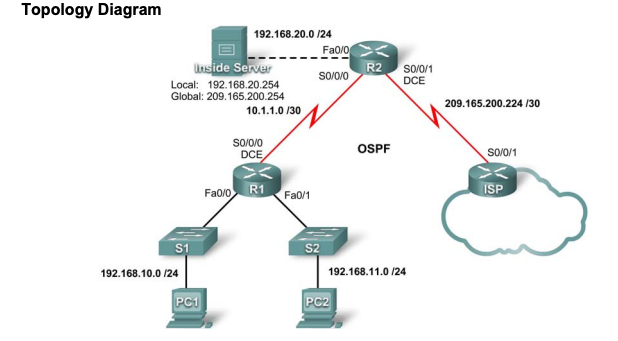

# 🧪 Lab 23: DHCP JA NAT PÕHIKONFIGURATSIOON
## ehk "Kuidas panna ruuterid tööle ja mitte hulluks minna"

## ⚠️⚠️ TÄHELEPANU – LOE HOOLIKALT! ⚠️⚠️

> 💥 KÕIGILE SEADMETELE PEAB LISAMA SINU NIME!  
> 🔹 Näiteks kui sinu nimi on **Maria**, siis peavad seadmete nimed olema:  
> ✅ **Maria_R1**  
> ✅ **Maria_R2**  
> ✅ **Maria_ISP**  
>
> See aitab õpetajal **õpilase konfiguratsioone eristada**.  
> ❗ **VALE NIMETAMINE VÕIB KAASA TUUA FÜÜSILIST VÄGIVALDA!** (Jah, niivõrd lihtsate asjade eest võid päriselt. Elu on ebaõiglane.)

---

## 📝 LÕPUÜLESANNE – **KOHUSTUSLIK EDASTAMINE**

> 📸 **ESITA "PRINT SCREEN"** ehk ekraanipilt **KOGU `show run` väljundist IGA SEADME KOHTA**!  
> Ekraanipildil peab kindlasti olema näha:  
> 🔹 **Seadme nimi** (koos sinu nimega! Jah, me mainime seda kaks korda, sest muidu keegi ei tee seda ikka õigesti)  
> 🔹 **Kõik selle labori jaoks tehtud konfiguratsioonid** (Isegi need, mis sa arvad, et pole tähtsad. Eriti need.)
>
> 🚫 Osalised väljatrükid või kärbitud pildid EI OLE AKTSEPTEERITAVAD! (Ära ürita vingerdada - me näeme kõike!)

---

## 🌐 Topoloogia diagramm
### ehk "mis sellest võrgust üldse saama peaks"



### Adresseerimise tabel
#### (need arvud pole suvalised, need on täpselt need, mida peate kasutama)
| Seade | Liides | IP aadress | Võrgumask |
|-------|--------|------------|-----------|
| R1 | S0/0/0 | 10.1.1.1 | 255.255.255.252 |
|    | Fa0/0 | 192.168.10.1 | 255.255.255.0 |
|    | Fa0/1 | 192.168.11.1 | 255.255.255.0 |
| R2 | S0/0/0 | 10.1.1.2 | 255.255.255.252 |
|    | S0/0/1 | 209.165.200.225 | 255.255.255.252 |
|    | Fa0/0 | 192.168.20.1 | 255.255.255.0 |
| ISP | S0/0/1 | 209.165.200.226 | 255.255.255.252 |

## Õppe-eesmärgid
### (ehk mida sa pärast seda kannatust peaks oskama)

Pärast selle labori lõpetamist oskad:
* Võrku ette valmistada (eeldusel, et sa ei unusta kaableid ühendada)
* Teostada põhilisi ruuteri konfiguratsioone (ehk saad nüüd aru, miks administraatorid nii stressis on)
* Seadistada Cisco IOS DHCP serverit (et sa ei peaks IP-aadresse käsitsi määrama nagu mingi esiajal elav neandertallane)
* Konfigureerida staatilist ja vaikimisi marsruutimist (kui sa tahad, et asjad päriselt liiguksid)
* Seadistada staatilist NAT-i (sest igaüks tahab olla eriline)
* Seadistada dünaamilist NAT-i aadresside kogumiga (sest mitu seadet ühe avaliku IP-aadressi taga on nagu mitme kassiga elamine ühe katuse all)
* Konfigureerida NAT ülekoormust (et kogu su võrk saaks internetti minna ühe avaliku IP-aadressiga, nagu kogu külarahvas ühest kaevust vett ammutamas)

## Stsenaarium
### (ehk miks me siin üldse kannatame)

Selles laboritöös seadistad DHCP ja NAT teenused, kaks asja, mis hoiavad interneti töötamas, kuigi keegi ei tea täpselt, kuidas.

DHCP (Dynamic Host Configuration Protocol) on see imeline asi, mis annab sinu seadmetele automaatselt IP-aadressid. Ilma selleta oleksid sa nagu post-apokalüptilises filmis, kus pead igale seadmele aadressi käsitsi määrama. Tõeline õudusunenägu!

NAT (Network Address Translation) on see trikk, mis laseb sul terve võrgu taha peita ja internetti pääseda läbi üheainsa avaliku IP-aadressi. See on nagu terve rühm inimesi, kes saadavad kirju sama postkasti kaudu, aga keegi ei tea, kes täpselt mida saatis. Privaatsus 101!

Üks ruuter mängib DHCP serverit (jagab IP-aadresse nagu jõuluvana kingitusi) ja teine ruuter edastab DHCP päringuid (nagu see üks sõber, kes teab alati, kelle käest midagi küsida). Konfigureerid ka erinevaid NAT tüüpe, sest kellele ei meeldiks natuke kirju segamini ajada?

## Ülesanne 1: Teosta põhilised ruuteri konfiguratsioonid
### (ehk "arvuti ütlemine, kes ta on ja kuidas ta peaks käituma")

Põhikonfiguratsioonid on võrreldavad hommikuse rutiiniga – kui sa seda ei tee, siis päev läheb untsu.

Konfigureeri R1, R2 ja ISP ruuterid vastavalt järgmistele juhistele:

**Oluline!** Kasuta ruuterite nimetamisel oma nime, näiteks `hostname Maria_R1`
(Kui sa paned ruuteri nimeks lihtsalt "R1", saame kõik teada, et sa ei oska lugeda)

* **Seadme hostinimi:** Määra iga ruuteri nimi, lisades oma nime
  ```
  Router(config)# hostname Maria_R1
  ```
  (Sellega annad ruuterile identiteedikriisi)

* **DNS otsingu keelamine:** See hoiab ära ajakao, kui kirjutad käsku valesti
  ```
  Maria_R1(config)# no ip domain-lookup
  ```
  (Muidu ruuter üritab sinu kirjavigu internetist leida, nagu oleks see mingi mõistlik idee)

* **Privilegeeritud režiimi parool:** See kaitseb ruuteri administraatoritaseme juurdepääsu
  ```
  Maria_R1(config)# enable secret cisco12345
  ```
  (Super turvaline parool, mida keegi ei arva iial ära, välja arvatud kõik, kes on kunagi Cisco seadmeid kasutanud)

* **Päeva-sõnumi bänner:** See on teade, mis kuvatakse sisselogimisel
  ```
  Maria_R1(config)# banner motd #See on Maria ruuter R1. Volitamata juurdepääs on keelatud! (Aga ausalt, kui sa siiani jõudsid, siis on juba hilja)#
  ```

* **Konsooli ühenduse parool:** Kaitseb füüsilist ühendust ruuteriga
  ```
  Maria_R1(config)# line console 0
  Maria_R1(config-line)# password ciscocon
  Maria_R1(config-line)# login
  ```
  (Kui keegi juba sinu ruuteri juures seisab, siis see parool on see viimane õlekõrs)

* **VTY ühenduste parool:** Kaitseb kaugpääsu ruuterile (nt Telnet, SSH)
  ```
  Maria_R1(config)# line vty 0 4
  Maria_R1(config-line)# password ciscovty
  Maria_R1(config-line)# login
  ```
  (Veelgi üks "turvaline" parool, seekord neile, kes isegi kohale ei vaevu tulema)

* **IP aadresside konfigureerimine:** Määra igale ruuteri liidesele õige IP aadress ja võrgumask vastavalt adresseerimise tabelile
  ```
  Maria_R1(config)# interface Serial0/0/0
  Maria_R1(config-if)# ip address 10.1.1.1 255.255.255.252
  Maria_R1(config-if)# no shutdown
  ```
  (Ära unusta "no shutdown", muidu ootad kogu päeva ja imestan, miks miski ei tööta)
  
  ```
  Maria_R1(config)# interface FastEthernet0/0
  Maria_R1(config-if)# ip address 192.168.10.1 255.255.255.0
  Maria_R1(config-if)# no shutdown
  
  Maria_R1(config)# interface FastEthernet0/1
  Maria_R1(config-if)# ip address 192.168.11.1 255.255.255.0
  Maria_R1(config-if)# no shutdown
  ```

* **OSPF marsruutimise lubamine:** See võimaldab ruuteritel omavahel marsruudi-informatsiooni vahetada
  ```
  Maria_R1(config)# router ospf 1
  Maria_R1(config-router)# network 10.1.1.0 0.0.0.3 area 0
  Maria_R1(config-router)# network 192.168.10.0 0.0.0.255 area 0
  Maria_R1(config-router)# network 192.168.11.0 0.0.0.255 area 0
  ```
  (Need käsud on nagu sõbrad, kes ütlevad üksteisele, kus nad elavad, et saaks üksteisele külla minna)

**Ära unusta:** Korda samu konfiguratsioone ka teistel ruuteritel (Maria_R2 ja Maria_ISP), kasutades vastavaid IP aadresse ja võrgumaskidega! (Kui sa seda ei tee, siis need ruuterid hakkavad solvuma)

## Ülesanne 2: Konfigureerige Cisco IOS DHCP server
### (ehk "kuidas panna üks arvuti teistele aadresse jagama")

DHCP on see võlukunst, mis säästab sind sadadest peavaludest. See on nagu postiametniku töö, kes jagab igale majale aadressi, ilma et keegi peaks vaeva nägema.

### Samm 1: Jäta välja staatiliselt määratud aadressid
(sest mõned IP aadressid on liiga erilised, et neid rahvamassile anda)

```
R1(config)#ip dhcp excluded-address 192.168.10.1 192.168.10.10
R1(config)#ip dhcp excluded-address 192.168.11.1 192.168.11.10
```
(Need aadressid on VIPid – Very Important Packets)

### Samm 2: Konfigureerige aadresside kogum
(ehk aadresside bassein, kust kõik seadmed endale IP "märja" saavad)

Loo DHCP kogum esimese võrgu jaoks:

```
R1(config)#ip dhcp pool R1Fa0
R1(dhcp-config)#network 192.168.10.0 255.255.255.0
R1(dhcp-config)#dns-server 192.168.11.5
R1(dhcp-config)#default-router 192.168.10.1
```
(DNS server 192.168.11.5 ei pruugi üldse olemas olla, aga me teeskleme, et on)

Loo DHCP kogum teise võrgu jaoks:

```
R1(config)#ip dhcp pool R1Fa1
R1(dhcp-config)#network 192.168.11.0 255.255.255.0
R1(dhcp-config)#dns-server 192.168.11.5
R1(dhcp-config)#default-router 192.168.11.1
```
(Siin teeskleme jälle, et meil on see DNS server, kuigi pole)

Vaikevärav (default-router) on nagu uksehoidja, kes ütleb: "Kui sa ei tea, kuhu minna, siis mine siit!"

### Samm 3: Kontrolli DHCP konfiguratsiooni
(ehk kas see jama üldse töötab)

```
R1#show ip dhcp binding
```
(See näitab sulle, kellele millise aadressi andsid, või kui kedagi pole, siis saad teada, et keegi ei taha sinuga rääkida)

### Samm 4: Seadista DHCP abilise aadress (Helper Address)
(sest DHCP päringud on nagu hädasignaalid, mis kaovad andmete ookeanis)

```
R1(config)#interface fa0/0
R1(config-if)#ip helper-address 10.1.1.2
R1(config)#interface fa0/1
R1(config-if)#ip helper-address 10.1.1.2
```
(Need käsud on nagu kajakad, kes kannavad DHCP hädakutsed õigele ruuterile)

## Ülesanne 3: Konfigureerige staatiline ja vaikimisi marsruutimine
### (ehk "kuidas öelda ruuteritele, kuhu paketid saata")

Kui ruuterid ei tea, kuhu pakette saata, on see nagu GPS-ita autosõit välismaal – kohe oled eksinud.

Esiteks seadistame, kuidas ISP teab, kuidas jõuda meie sisevõrku:

```
ISP(config)#ip route 209.165.200.240 255.255.255.240 serial 0/0/1
```
(See on nagu öelda ISP-le: "Kui keegi küsib seda aadressi, saada nad sellesse suunda!")

Seejärel seadistame, kuidas meie võrk teab, kuidas jõuda välisvõrku:

```
R2(config)#ip route 0.0.0.0 0.0.0.0 209.165.200.226
R2(config)#router ospf 1
R2(config-router)#default-information originate
```
(See on nagu öelda: "Kui sa ei tea, kuhu minna, mine sinna. Ja räägi ka teistele, et seal on väljapääs!")

Veendu, et R1 teab vaikimisi marsruuti:

```
R1#show ip route
```
(Kui sa ei näe siin vaikeruuti, on kõik kadunud)

Tee ping R2 välisliidesele, et kontrollida ühendust:

```
R1#ping 209.165.200.225
```
(Kui see ping ei tööta, vajuta CTRL+C ja hakka nutma)

Kui marsruutimistabel ei uuene kohe, võid selle sundida uuenema käsuga:
```
R1#clear ip route *
```
(See on nagu ruuteri mälu kustutamine – "unusta kõik, mida tead, ja õpi uuesti!")

## Ülesanne 4: Konfigureerige staatiline NAT
### (ehk "kuidas lasta välismaailmal ühenduda sinu serveriga")

Staatiline NAT on nagu VIP-sissepääs klubisse – kindel väline aadress garanteerib kindla sisemise aadressi.

### Samm 1: Kaardista avalik IP aadress privaatse IP aadressiga
(anna oma serverile "avalik nägu")

```
R2(config)#ip nat inside source static 192.168.20.254 209.165.200.254
```
(See on nagu öelda: "Kui keegi küsib Boondi, saada nende kõne hoopis Jamesile")

### Samm 2: Määra sisemised ja välised NAT liidesed
(ruuter peab teadma, kus on "sees" ja kus "väljas")

```
R2(config)#interface serial 0/0/1
R2(config-if)#ip nat outside
R2(config-if)#interface fa0/0
R2(config-if)#ip nat inside
```
(See on nagu öelda: "See uks viib tänavale, see uks viib kööki")

### Samm 3: Kontrolli staatilise NAT konfiguratsiooni
(kas see mask ikka töötab?)

ISP-st pingige avalikku IP aadressi 209.165.200.254, et veenduda, kas staatiline NAT töötab.
(Kui see töötab, oled sa üks samm lähemal võrguadministraatoriks saamisele)

## Ülesanne 5: Konfigureerige dünaamiline NAT aadresside kogumiga
### (ehk "kuidas jagada piiratud hulka avalikke IP-aadresse")

Dünaamiline NAT on nagu hotelli vastuvõtulaud – kui külaline tuleb, saab ta toa. Kui lahkub, antakse tuba järgmisele.

### Samm 1: Määratle globaalsete aadresside kogum
(ehk aadresside bassein, kus seadmed saavad "ujuda")

```
R2(config)#ip nat pool MY-NAT-POOL 209.165.200.241 209.165.200.246 netmask 255.255.255.248
```
(See on nagu öelda: "Nende aadresside bassein on avalik supluseks, kasutage neid!")

### Samm 2: Loo pääsuloend, et määrata, millised sisevõrgu seadmed saavad NAT-i kasutada
(sest mitte igaüks ei vääri basseinipääsu)

```
R2(config)#ip access-list extended NAT
R2(config-ext-nacl)#permit ip 192.168.10.0 0.0.0.255 any
R2(config-ext-nacl)#permit ip 192.168.11.0 0.0.0.255 any
```
(See on nagu klubi uksel olev turvamees, kes ütleb: "Need võrgud võivad sisse, teised mitte!")

### Samm 3: Ühenda pääsuloend aadresside kogumiga
(lase turvatöötajatel ja vastuvõtulaual koostööd teha)

```
R2(config)#ip nat inside source list NAT pool MY-NAT-POOL
```
(See on nagu ütleks: "Need, keda turvamees lubab, saavad endale toa basseiniga hotellis")

### Samm 4: Määra sisemised ja välised NAT liidesed
(täpsusta, mis uksi kasutame)

```
R2(config)#interface serial 0/0/0
R2(config-if)#ip nat inside
```
(See on nagu öelda: "Ka see uks viib kööki")

### Samm 5: Kontrolli konfiguratsiooni
(kas see jama üldse töötab?)

Tee ping ISP-le PC1-st ja PC2-st. Seejärel vaata, kas NAT töötab:

```
R2#show ip nat translations
R2#show ip nat statistics
```
(See on nagu spikerdamine – näed, kes parasjagu milliseid aadresse kasutab)

NAT silumiseks võite kasutada:
```
R2#debug ip nat
```
(See näitab, mis tegelikult toimub, kui sa midagi ei usu)

## Ülesanne 6: Konfigureerige NAT ülekoormus (PAT)
### (ehk "kuidas panna terve võrk ühe IP taha")

NAT ülekoormus (PAT) on nagu terve kommuuni elamine ühe postkastiga majas – kõik kirjad tulevad samale aadressile, aga on tänu korterinumbritele (ehk portidele) õigetele inimestele määratud.

### Samm 1: Eemalda eelnevalt konfigureeritud NAT kogum
(viska vana hotell minema, me teeme pansionaadi)

```
R2(config)#no ip nat pool MY-NAT-POOL 209.165.200.241 209.165.200.246 netmask 255.255.255.248
R2(config)#no ip nat inside source list NAT pool MY-NAT-POOL
```
(Tere tulemast võrguadministreerimi põnevasse maailma, kus pool ajast kustutad asju, mida just tegid)

Kui näed teadet "Pool MY-NAT-POOL in use, cannot destroy", siis tühjenda NAT tõlked:

```
R2#clear ip nat translation *
```
(See on nagu öelda: "Kõik hotelli külalised, VÄLJA! KOHE!")

### Samm 2: Konfigureerige PAT R2 välisliidese aadressiga
(terve apartment-hotell ühe ukse taga)

```
R2(config)#ip nat inside source list NAT interface S0/0/1 overload
```
(See on nagu öelda: "Kõik kasutage sama postkasti, aga pange oma korterinumbrid kirja!")

### Samm 3: Kontrolli konfiguratsiooni
(kas meie uksehoidja suudab kõigile kirjad kätte toimetada?)

Tee ping ISP-le PC1-st ja PC2-st. Seejärel vaata NAT tõlkeid:

```
R2#show ip nat translations
```
(Nüüd peaksid nägema, kuidas üks IP kasutatakse kõigi seadmete poolt, aga erinevate portidega)

## Ülesanne 7: Dokumenteeri võrk
### (ehk "tõesta, et sa päriselt midagi tegid")

**Oluline!** Käivita igal ruuteril käsk `show running-config` ja tee sellest ekraanipilt täispikkuses. Ekraanipildil peab olema näha:
1. Seadme nimi koos sinu nimega (nt `Maria_R1`)
2. Kõik selle labori jaoks tehtud konfiguratsioonid

Salvesta need ekraanipildid ja esita need oma õpetajale hinnangu saamiseks.
(Need on tõendid, et sa ei maganud tervet laborit maha)

**Vihje:** Kui konfiguratsioon on liiga pikk, võid kasutada käsku:
```
show running-config | begin hostname
```
See alustab konfiguratsioonide näitamist alates `hostname` realt.
(See on nagu öelda raamatule: "Alusta sealt, kus asi huvitavaks läheb")