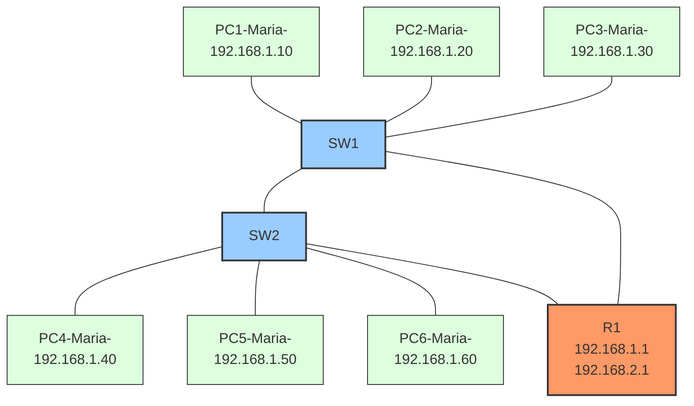

# Lab9: ARP Fundamentals and Troubleshooting
**Duration**: 90 minutes

## Lab Objectives
- Master ARP operations in a switched network
- Understand ARP cache management
- Learn to use Packet Tracer's Simulation mode and Packet Sniffer
- Practice advanced ARP troubleshooting

## Required Equipment
- 2 Cisco 2960 Switches (available in Packet Tracer)
- 1 Cisco 2911 Router (available in Packet Tracer)
- 6 PCs
- Ethernet cables

## Topology Table
| Device | Interface           | IP Address      | Subnet Mask       | Default Gateway    | Connected To       |
|--------|---------------------|-----------------|-------------------|--------------------|--------------------|
| PC1    | NIC                 | 192.168.1.10    | 255.255.255.0     | 192.168.1.1        | SW1 (f0/1)         |
| PC2    | NIC                 | 192.168.1.20    | 255.255.255.0     | 192.168.1.1        | SW1 (f0/2)         |
| PC3    | NIC                 | 192.168.1.30    | 255.255.255.0     | 192.168.1.1        | SW1 (f0/3)         |
| PC4    | NIC                 | 192.168.1.40    | 255.255.255.0     | 192.168.1.1        | SW2 (f0/1)         |
| PC5    | NIC                 | 192.168.1.50    | 255.255.255.0     | 192.168.1.1        | SW2 (f0/2)         |
| PC6    | NIC                 | 192.168.1.60    | 255.255.255.0     | 192.168.1.1        | SW2 (f0/3)         |
| SW1    | f0/24 (trunk)       | N/A             | N/A               | N/A                | SW2 (f0/24)        |
| SW1    | g0/1 (to Router)    | N/A             | N/A               | N/A                | Router (g0/0)      |
| SW2    | g0/1 (to Router)    | N/A             | N/A               | N/A                | Router (g0/1)      |
| Router | g0/0                | 192.168.1.1     | 255.255.255.0     | N/A                | SW1 (g0/1)         |
| Router | g0/1                | 192.168.2.1     | 255.255.255.0     | N/A                | SW2 (g0/1)         |

## Network Topology


## Part 1: Basic Setup (20 minutes)

### Explanation
The purpose of this section is to set up the basic connectivity between devices to ensure ARP resolution can occur. ARP is critical for mapping IP addresses to MAC addresses in a network. By setting up the topology, you prepare the foundation for observing ARP behavior.

### Router Configuration
1. Configure R1:
```bash
enable
configure terminal
interface g0/0
ip address 192.168.1.1 255.255.255.0
no shutdown
interface g0/1
ip address 192.168.2.1 255.255.255.0
no shutdown
```
**Explanation**: The router acts as the gateway for PCs on different subnets. It handles ARP requests for its interfaces to enable communication between the PCs.

### Switch Configuration
#### SW1 Configuration
```bash
enable
configure terminal
interface range f0/1 - f0/3
switchport mode access
no shutdown
interface f0/24
switchport mode trunk
no shutdown
interface g0/1
no shutdown
end
write memory
```
#### SW2 Configuration
```bash
enable
configure terminal
interface range f0/1 - f0/3
switchport mode access
no shutdown
interface f0/24
switchport mode trunk
no shutdown
interface g0/1
no shutdown
end
write memory
```
**Explanation**: Switch ports connected to PCs are configured as access ports, and the inter-switch link is configured as a trunk to allow communication between SW1 and SW2. All ports are enabled (`no shutdown`) to ensure connectivity.

### PC Configuration
1. Configure all PCs with:
   - IP addresses as shown in the topology table.
   - Subnet mask: 255.255.255.0
   - Default gateway: 192.168.1.1
   - All PC names must include your name in the format: PCx-YourName-Lab9

**Expected Result**: All devices should be able to communicate within the same subnet. Pings between devices connected to the same switch should succeed.

### Initial Testing
1. Verify connectivity:
   - Ping between adjacent PCs.
   - Ping from PC1 to PC6 (requires ARP resolution via the router).
   - Ping from all PCs to the router.

**Expected Result**: Successful pings indicate proper configuration of IPs, gateways, and connectivity.

## Part 2: ARP Analysis (30 minutes)

### Task 1: Basic ARP Operation
1. Enter Simulation mode in Packet Tracer.
2. On PC1:
   - Open Command Prompt.
   - Clear ARP cache: `arp -d *`.
   - Open Packet Sniffer.
   - Start capture.
   - Ping PC4: `ping 192.168.1.40`.

3. Analyze in Simulation mode:
   - Click "Capture/Forward" to see each step.
   - Document ARP request broadcast.
   - Note source and destination MAC addresses.
   - Record complete ARP resolution process.

**Explanation**: ARP broadcasts are used to resolve the MAC address of the destination. The router responds with its MAC address for devices on other subnets.

**Expected Result**: The ARP table on PC1 should update with the MAC address of PC4 or the router.

### Task 2: Manual ARP Entry
1. On PC1, add static ARP entry:
```bash
arp -s 192.168.1.40 [PC4's MAC address]
```
2. Test connectivity:
   - Ping PC4.
   - Document results.
   - Check ARP cache: `arp -a`.

3. Introduce problems:
   - Change PC4's MAC address.
   - Test connectivity.
   - Document what happens.

**Explanation**: Static ARP entries override dynamic ARP resolution. If the MAC address changes, communication fails until the entry is corrected.

**Expected Result**: Pings fail after the MAC address change until resolved.

## Part 3: Advanced Scenarios (40 minutes)

### Scenario 1: Hardware Replacement
1. Initial setup:
   - Ensure PC1 and PC6 can communicate.
   - Record PC6's MAC address.
   - Check PC1's ARP cache.

2. Replacement steps:
   - Delete PC6.
   - Add new PC6 with the same IP.
   - Connect to SW2.
   - Try communication from PC1.
   - Document issues and resolution.

**Explanation**: When hardware is replaced, the ARP cache may contain outdated MAC address mappings, causing communication issues.

**Expected Result**: PC1’s ARP cache updates with the new MAC address after sending an ARP request.

### Scenario 2: IP Conflict Detection
1. Create conflict:
   - Configure PC5 with PC4's IP.
   - Use Packet Sniffer to capture traffic.
   - Document all ARP messages.
   - Note behavior of both PCs.

2. Analysis:
   - Check ARP caches on all devices.
   - Document which device keeps the IP.
   - Explain the resolution process.

**Explanation**: IP conflicts generate ARP replies from multiple devices, causing network instability.

**Expected Result**: Only one device retains the IP after resolution; others fail to communicate.

### Scenario 3: Switch Failure Simulation
1. Initial state:
   - Clear all ARP caches.
   - Verify connectivity.
   - Document ARP entries.

2. Simulate failure:
   - Disconnect the link between switches.
   - Create a new path through the router.
   - Observe ARP behavior.
   - Document cache changes.

**Explanation**: Switch failure forces traffic through alternative paths, requiring new ARP requests and updates.

**Expected Result**: ARP tables update to reflect the new path.

## Part 4: Troubleshooting Tasks (30 minutes)

### Task 1: Missing ARP Entry
1. Setup:
   - Clear PC2's ARP cache.
   - Add incorrect static ARP entry.
   - Try to communicate with PC5.

2. Resolution steps:
   - Use Packet Sniffer to identify the issue.
   - Document troubleshooting process.
   - Implement fix.
   - Verify solution.

**Expected Result**: Communication succeeds after fixing the static ARP entry.

### Task 2: Incomplete ARP
1. Create scenario:
   - Disconnect PC3 but keep the switch port up.
   - Try to ping from PC1 to PC3.
   - Capture ARP requests.
   - Document "incomplete" ARP entries.

2. Analysis:
   - Show ARP cache status.
   - Explain incomplete entries.
   - Document resolution steps.

**Expected Result**: ARP entries remain incomplete due to lack of reply. Resolution requires reconnecting PC3.

## Required Deliverables
1. Network diagram with all MAC addresses.
2. Packet Sniffer captures showing:
   - Normal ARP operation.
   - ARP during IP conflict.
   - Failed ARP resolution.
3. Documentation for each scenario:
   - Initial state.
   - Problem description.
   - Resolution steps.
   - Final state.
4. ARP cache contents at key stages.

## Bonus Challenges
1. Try to create ARP storm (TRY ONLY IN CISCO PACKET TRACER!!!, DON’T DO ON LIVE PCs).
https://medium.com/@abdelwahabshandy/network-security-arp-storm-717cebb96fa6
2. Study broadcast domain effects on ARP.
3. Document MAC address aging vs ARP cache aging.

## Grading Criteria
- Basic Setup and Testing (20%).
- ARP Analysis (30%).
- Advanced Scenarios (30%).
- Troubleshooting (20%).

## Common Issues and Solutions
1. **Connectivity Problems**:
   - Verify IP addressing.
   - Check default gateway.
   - Verify switch connections.
   - Clear ARP cache.

2. **ARP Issues**:
   - Check for static entries.
   - Verify MAC addresses.
   - Clear incomplete entries.
   - Check physical connectivity.