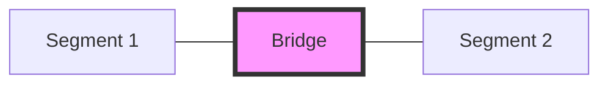
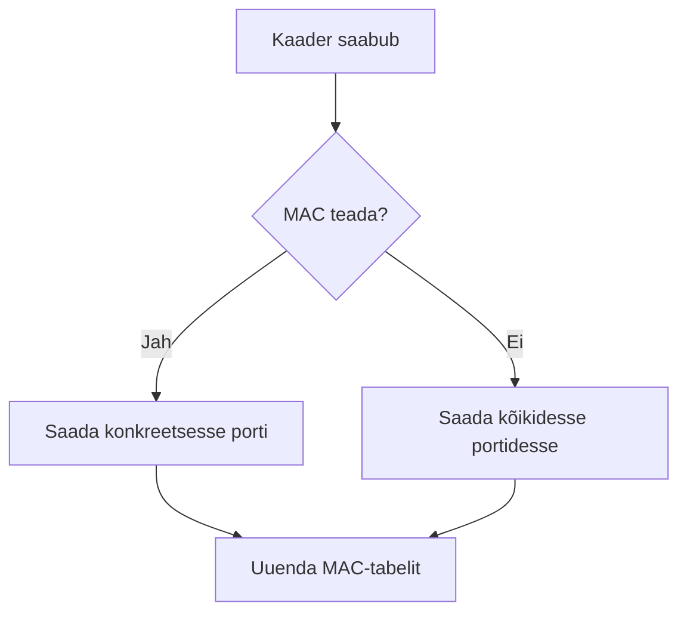

# Teema 10: Kommuteerimine ja Kommutaatori tööpõhimõtted

## Sissejuhatus

Kommuteerimine on võrguliikluse haldamise meetod, mis toimub OSI mudeli teisel kihil. See on fundamentaalne tehnoloogia, mis võimaldab arvutivõrkudel efektiivselt toimida. Kommuteerimine põhineb MAC-aadresside kasutamisel ja võimaldab luua otseühendusi erinevate võrguseadmete vahel.

## Sild (Bridge)


[Source: TechTarget](https://www.techtarget.com/rms/onlineimages/networking-bridge_vs_switch.png)


Sild oli esimene seade, mis võimaldas võrguliikluse intelligentset suunamist. See oli revolutsiooniline lahendus 1980ndate lõpus ja 1990ndate alguses.



### Silla põhifunktsioonid:
1. **Segmentide ühendamine**: Sild võimaldas ühendada kaks või kolm eraldi võrgusegmenti
2. **MAC-aadresside õppimine**: Jälgis, millised seadmed on millisel pordil
3. **Liikluse filtreerimine**: Edastas andmeid ainult vajalikku segmenti

Sild töötas järgmiselt:
- Kui sild sai kaadri, analüüsis ta selle lähte- ja sihtaadressi
- Kui sihtaadress oli tundmatud, saadeti kaader kõigisse segmentidesse
- Kui sihtaadress oli teada, saadeti kaader ainult õigesse segmenti
- See vähendas oluliselt võrgu koormust ja parandas jõudlust

## Kommutaator

**Ethernet-segmentide kommuteerimise tehnoloogia** töötati välja ettevõtte **Kalpana** poolt 1990. aastal vastusena kasvavatele nõudmistele suurendada suure jõudlusega serverite ja tööjaamade segmentide ühenduste läbilaskevõimet.

1994. aastal andis ettevõte **IDC** oma määratluse lokaalse võrgu kommutaatorile:  
kommutaator – **see on seade, mis on konstruktsiooniliselt teostatud võrgu HUBina ja toimib kui kõrge kiirusega mitme pordiga sild**;  
kommuteerimismehhanism võimaldab **lokaalvõrgu segmentimist** ning ribalaiuse jaotamist võrgu lõppjaamadele.

Funktsionaalselt töötab mitmepordiline kommutaator kui mitmepordiline sild, see tähendab, et see töötab kanali tasemel, analüüsib raamide päiseid, loob automaatselt **aadressitabeli** ja suunab selle tabeli alusel kaadreid vastavatesse väljundportidesse või filtreerib need, eemaldades need puhvrist.


Source: [Managing MAC Address Table](https://www.ciscopress.com/)


Source: [How Switch Learns MAC Address of Connected Devices in LAN](https://www.ciscopress.com/)

### Võrdlus jaoturiga (Hub):

| Omadus | Kommutaator | Hub |
|---------|------------|-----|
| Liikluse suunamine | Intelligentne, portipõhine | Kõikidesse portidesse |
| Kollisioonid | Puuduvad | Sagedased |
| Duplex režiim | Täisduplex võimalik | Ainult half-duplex |
| Jõudlus | Kõrge, portipõhine | Madal, jagatud |
| MAC-aadresside õppimine | Jah | Ei |

### Kommutaatori tööpõhimõte:

Kommutaator õpib pidevalt võrgu kohta:
1. Salvestab lähte-MAC-aadressid ja pordid
2. Loob dünaamilise MAC-tabeli
3. Kasutab seda tabelit edasiste otsuste tegemiseks
4. Värskendab tabelit vastavalt vajadusele



## MAC-tabel

MAC-tabel on kommutaatori "aju", mis sisaldab infot seadmete asukoha kohta võrgus.

### MAC-tabeli näide:

| MAC-aadress | Port | Tüüp | Aeg |
|-------------|------|------|-----|
| 00:1A:2B:3C | 1 | Dynamic | 300s |
| 00:4D:5E:6F | 2 | Static | - |
| 00:7G:8H:9I | 3 | Dynamic | 250s |

MAC-tabeli haldamine toimub dünaamiliselt:
- Uued seadmed lisatakse automaatselt
- Mitteaktiivsed kirjed aeguvad
- Staatilised kirjed säilivad taaskäivitamisel


## Küsimus 🧐
Kui **MAC-tabelis** puudub seadme **MAC-aadress**, mida see tähendab? Mis võiks olla valesti?
### Vihjed 💡
- **Switchid** õpivad MAC-aadresse, kui nad saavad liiklust seadmelt.

## MTU ja Jumbo kaadrid

MTU (Maximum Transmission Unit) määrab suurima võimaliku andmepaketi suuruse.

### Ethernet kaadri struktuur:
```
+----------------+----------------+----------+---------+
| Destination MAC| Source MAC    | Type     | Payload |
| (6 bytes)      | (6 bytes)     | (2 bytes)| (1500 B)|
+----------------+----------------+----------+---------+
```

Jumbo kaadrid võimaldavad suuremat andmemahtu:
- Tavaline MTU: 1518 baiti
- Jumbo kaadrid: kuni 9000 baiti

Kasutamine:
- Andmekeskused
- Varundussüsteemid
- Suure jõudlusega võrgud

## Cisco Switch Operation 🔧

Lisainfo Cisco switchide tööpõhimõtete kohta:  
[Cisco Switch Operation – Flackbox](https://www.youtube.com/watch?v=o4xkvyZnhj4)  

[](https://www.youtube.com/watch?v=o4xkvyZnhj4)

## 🧑‍💻 Küsimus: 🤔

Kui **MAC-tabelis** on juba olemas soovitud seadme **MAC-aadress**, kas siis saadetakse **ARP-päring (ARP Request)** või mitte?  

## MAC Attack

[Loe lisaks MAC Flooding - Wikipedia](https://en.wikipedia.org/wiki/MAC_flooding)

  

## Cisco Ios Show Mac Address Table 


## Erinevate tootjate MAC-tabelid  

**Static** – Käsitsi määratud MAC-aadress, mis jääb püsima. Kasutatakse turvalisuse tagamiseks.  

**Dynamic** – Switch õpib aadressi automaatselt ja eemaldab selle, kui liiklust pole.  

## 🧑‍💻 Küsimus: Kas pordi taga võib olla mitu MAC-aadressi?  
Jah, võib!  
💡 Kui mitu seadet jagavad sama pordi, peab lüliti teadma, kuhu andmepaketid saata! 🚀

### Cisco kommutaator:
```
Switch# show mac address-table
VLAN  MAC Address      Type     Port
----  -------------   -------  --------
1     00:1A:2B:3C:4D  DYNAMIC  Gi0/1
1     00:4D:5E:6F:7G  STATIC   Gi0/2
```

### Juniper kommutaator:
```
user@switch> show ethernet-switching table
MAC Address       VLAN     Type     Age Port
00:1A:2B:3C:4D   default  dynamic  0   ge-0/0/1
00:4D:5E:6F:7G   default  static   -   ge-0/0/2
```

### D-Link kommutaator:
```
DGS-1210# show fdb
VID  MAC Address      Type     Port
----  -------------   -------  --------
1    00:1A:2B:3C:4D  Dynamic  1
1    00:4D:5E:6F:7G  Static   2
```

## Leviedastuse domeen ( Broadcast domain)

### See on võrgu piirkond, kus toimub leviedastussõnumite vahetus ja seadmed saavad üksteisele otse sõnumeid saata.  

Näiteks, kui teie arvuti saadab võrku leviedastuspäringu, otsides DHCP-serverit, siis see raam (ehk kaader) on adresseeritud kõigile seadmetele ja selle sihtkoha MAC-aadress on **FF:FF:FF:FF:FF:FF**.  

1️⃣ **Esimene samm:** Kaader jõuab **kommutaatrisse** (switchi), mis saadab selle koopiad kõigile oma portidele.  
2️⃣ **Teine samm:** Osa koopiatest jõuab teistesse **arvutitesse**, osa liigub edasi **naaberlülititesse**.  
3️⃣ **Kolmas samm:** Mõned koopiad jõuavad **ruuterini**, kuid lõpuks saab ühe koopia **DHCP-server** ja vastab päringule.  


  

## **Leviedastuse domeeni omadused:**  
✅ Piiratud marsruuteritega  
✅ Sisaldab kõiki ühendatud kommutaatoreid  
✅ Mõjutab võrgu jõudlust  
✅ Vajab hoolikat planeerimist  

## **Probleemid suures leviedastuse domeenis:**  
⚠️ Suur võrguliiklus  
⚠️ Seadmete aeglane reageerimine  
⚠️ Ressursside raiskamine  
⚠️ Turvariski suurenemine  

[](https://www.youtube.com/watch?v=BuzYB78cmcQ)  
Source: [YouTube - Blinking Ethernet Switch Lights](https://www.youtube.com/watch?v=BuzYB78cmcQ)

## 🧑‍💻 Küsimus:

🔎 Mida need vilkuvad tuled võrgu lülitil (switch) tähendavad?

### **Võrgusilmused (Network Loops)**

Võrgusilmused on üks tõsisemaid probleeme kommuteeritud võrkudes. Need tekivad siis, kui võrgus on mitu füüsilist või loogilist teed samadele sihtpunktidele ning puudub mehhanism, mis takistaks lõputut liikluse edastamist. 

Kui kommutaatorid (switchid) saadavad pidevalt pakette edasi-tagasi ilma nende teekonda lõpetamata, põhjustab see võrgu ülekoormust ja võib viia täieliku võrgukatkestuseni. Selline olukord on tuntud kui **braodcast storm** (ringhäälingutorm), kus võrk täitub tarbetute pakettidega, aeglustades või peatades kogu liikluse.


## ⚠ **ETTEVAATUST: SWITCHI SILMUSED ON KEELATUD!** ⚠  

**Võrgusilmused (switch loops) on tõsine oht kommuteeritud võrkudele ning need on KEELATUD!**  
Kui võrgus tekib silmus, võib see põhjustada võrgu ülekoormuse, seadmete hangumise ja isegi täieliku võrgu rivist välja langemise.  

---

### **Kuidas võrgusilmus võib tekkida?**  

#### 🔴 **Tahtlikult (pahatahtlik või eksperimentaalne testimine)**  
- Keegi ühendab võrgukaabli kahe switchi pordi vahel ilma STP kaitseta.  
- Käsitsi luuakse L2-silmus vigase konfiguratsiooni või testimise eesmärgil.  
- Tahtlikult eemaldatakse STP või Loop Guard kaitse, et „näha, mis juhtub“.  

#### 🔴 **Juhuslikult ja teadmatusest**  
- Kasutaja ühendab kogemata kaabli tagasi samasse võrku, luues füüsilise silmuse.  
- Vale switchi seadistamine, näiteks STP välja lülitamine teadmatusest.  
- Kahe või enama switchi ühendamine ilma STP-d või muud kaitset kasutamata.  

---

### **Silmuste tagajärjed**  
1️⃣ **Broadcast storm** – leviedastuse paketid ringlevad lõputult, põhjustades ülekoormust.  
2️⃣ **MAC-tabeli ebastabiilsus** – MAC-aadressid „hüppavad“ portide vahel, põhjustades segadust.  
3️⃣ **Võrgu ülekoormatus** – võrguressursid ammenduvad ning seadmed muutuvad aeglaseks.  
4️⃣ **Seadmete kättesaamatus** – võrk muutub kasutuskõlbmatuks, katkestades teenused.  


[](https://www.youtube.com/watch?v=K0olpgiQNC8)

---

### **Ennetamine**  
✅ **Spanning Tree Protocol (STP)** – hoiab ära silmuste tekkimise, blokeerides liigsed teed.  
✅ **Hoolikas võrgu planeerimine** – vältida mittevajalikke ühendusi ja tagada korrektne arhitektuur.  
✅ **Port Security seadistused** – piirata seadmete arvu, mis võivad kindlale pordile ühenduda.  
✅ **Regulaarne monitooring** – jälgida võrgu logisid ja liiklust, et avastada potentsiaalseid silmuseid enne, kui need probleeme tekitavad.  

---

## Standardsed ikoonid ( Switch)

Võrguskeemidel kasutatakse standardseid ikoone erinevate seadmete tähistamiseks.


