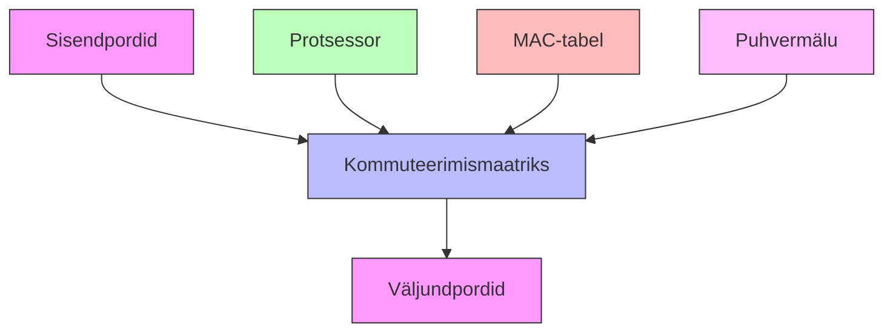

# Teema 11: Kommutaatorite Arhitektuur ja Toimimine

Kommutaatorid on võrguseadmed, mis funktsioneerivad kui võrguliikluse reguleerijad, suunates andmepakette nende sihtpunktidesse. Need on kriitilise tähtsusega komponendid kaasaegses võrguarhitektuuris.

## Kommuteerimismeetodid

Tänapäeva võrguseadmete maailmas on kommutaatorid kui liikluspolitseinikud, kes suunavad andmepakette õigesse sihtpunkti. Need seadmed kasutavad selleks kahte peamist meetodit.

### Store-and-Forward
- Täielik paketi kontroll
- Veakontrolli võimekus
- Andmete terviklikkuse tagamine
- Levinud kontorivõrkudes

### Cut-Through
- Minimaalne viivitus
- Puudub veakontroll
- Maksimaalne jõudlus
- Kasutusel andmekeskustes

## Kommuteerimismaatriks ja Andmete Liikumine

Kommuteerimismaatriks koos andmete liikumisega kirjeldab, kuidas võrguliiklus (andmepaketid) liiguvad läbi kommutaatori, kasutades selleks kahte peamist meetodit: unicast (ühelt-ühele) ja broadcast (ühelt-kõigile) edastust.

### Unicast Liiklus
* Punkt-punkti kommunikatsioon
* Üks saatja, üks vastuvõtja
* Efektiivne resurssikasutus
* Näide: E-kirjade saatmine
* Ei koorma ülejäänud võrku

### Broadcast Liiklus
* Üks-mitmele kommunikatsioon
* Sõnum edastatakse kõigile võrgu seadmetele
* Tuvastatav LED-indikaatorite üheaegsel vilkumisel
* Kasutusel võrgu avastamiseks
* Risk võrgu ülekoormuseks liigsel kasutamisel

## Arhitektuur

### Põhikomponendid

#### ASIC (Application-Specific Integrated Circuit: The actual hardware chip)
- Spetsialiseeritud kiip
- Võrguliikluse töötlemine
- Jõudluse määraja

#### Kommuteerimismaatriks (Switching Matrix: Physical circuitry connecting ports)
- Andmevoogude suunamine
- Läbilaskevõime määraja
- Portide vaheline suhtlus

#### Puhvermälu (Buffer Memory: Physical RAM chips for packet storage)
- Pakettide ajutine hoiustamine
- Võrgukoormuse tasakaalustamine
- Jõudluse optimeerimine

### Mudelite Klassifikatsioon

Siin on tabel, mis võrdleb võrgulülitite füüsilisi komponente ja klassifikatsioone:

| Component | Physical Description | Entry-Level | Enterprise |
|-----------|---------------------|-------------|------------|
| ASIC | Hardware chip for packet processing | Single ASIC | Multiple ASICs |
| Switching Matrix | Physical circuit connections | 8-48 ports | 24-96+ ports |
| Buffer Memory | RAM chips for packet storage | Limited | Large capacity |
| Cooling | Heat management system | Standard fans | Advanced cooling system |

## Füüsiline Paigutus

| Element | Asukoht | Otstarve |
|---------|----------|-----------|
| RJ-45 pordid | Esipaneel | Põhilised võrguühendused |
| LED indikaatorid | Portide juures | Oleku näitamine |
| Konsooliport | Esipaneel | Esialgne seadistamine |
| Uplink pordid | Esipaneel paremal | Kiired ühendused |
| Toiteplokk | Tagapaneel | Seadme toide |
| Ventilaatorid | Tagapaneel | Jahutus |

Cisco WS-C2960X-24PS-L lüliti tagavaade.

### Juhtelemendid ja Indikaatorid

- **POWER**: Toite olek
- **STATUS**: Süsteemi olek
- **PORT**: Ühenduse kiirus/olek
- **SYSTEM**: Üldine tööolek

Etherneti pordi oleku LED-ide tähendused.

Youtube video:

### Spetsiaalpordid
Sure! Here’s a more detailed explanation of **Spetsiaalpordid**:

### **Spetsiaalpordid**  

Erinevate võrguseadmete spetsiaalpordid.

---

### **Miks on nii palju erinevaid porte ja milles on erinevus?**  

Võrguseadmetel on mitu erinevat porditüüpi, kuna igal neist on konkreetne eesmärk ja funktsioon. Allolevas tabelis on toodud peamised pordid ja nende erinevused:

| **Port**      | **Funktsioon** | **Kasutus** |
|--------------|--------------|------------|
| **CONSOLE** | RS-232 serial port seadistamiseks | Kasutatakse seadme esmakordseks konfigureerimiseks ja vigade diagnoosimiseks. Ühendus arvutiga konsoolikaabli kaudu. |
| **MGMT (Management)** | Eraldi haldusport | Võimaldab võrguseadme haldamist sõltumatult peavõrgust. Kasutatakse OOBM (Out-of-Band Management) jaoks. |
| **USB** | Konfiguratsioonifailide ja püsivara uuenduste laadimine | Saab kasutada seadme tarkvara ja seadistuste uuendamiseks USB-mälupulgalt. Mõned mudelid toetavad ka USB-konsooliühendust. |
| **Ethernet (RJ-45)** | Andmeedastusport | Peamine ühendusvõimalus teiste seadmetega. Kiirused varieeruvad (1G, 10G jne). |
| **SFP / SFP+ / QSFP** | Kiudoptiline või vaskühendusega moodulipesa | Kasutatakse suure jõudlusega ühenduste loomiseks (1G, 10G, 40G, 100G). Võimaldab paindlikkust erinevate kaablitüüpide vahel. |
| **PoE (Power over Ethernet)** | Toite edastamine võrgu kaudu | Võimaldab varustada toitega IP-telefone, kaameraid ja muid seadmeid ilma eraldi adapterita. |

---

## **Ühendusmoodulid**

### **GBIC vs SFP vs QSFP Võrdlus**

Moodulid võimaldavad ühendusi erinevate võrgukiiruste ja kaablitüüpidega, pakkudes paindlikkust võrguarhitektuuris.

| **Moodul** | **Kiirus** | **Suurus** | **Kasutusala** |
|------------|-----------|-----------|---------------|
| **GBIC** | 1 Gbps | 30x65x15mm | Vanemad seadmed, suurem vormifaktor |
| **SFP** | 1 Gbps | 14x57x13mm | Standardühendused, kompaktsem kui GBIC |
| **SFP+** | 10 Gbps | 14x57x13mm | Andmekeskused ja kiiret ühendust vajavad võrgud |
| **QSFP** | 40/100 Gbps | - | Suurte võrkude selgrooühendused (backbone) |

## 📊 Tootjad ja turuosad

Erinevad võrguseadmete tootjad ja nende turupositsioon.

| **Tootja** | **Turupositsioon** | **Tugevused** | **Link** |
|------------|----------------|----------------------|---------|
|  **Cisco Systems** | 🔹 45% (Turuliider) | Pikaajaline turuliidri staatus, laialdane dokumentatsioon, enterprise-klassi tugi | [Cisco Switches](https://www.cisco.com/site/au/en/products/networking/switches/index.html) |
| **Huawei** | 🔹 20% | Innovatiivsed lahendused, konkurentsivõimeline hind, kasvav turuosa | [Huawei Switches](https://e.huawei.com/sa/products/switches.html) |
| **HPE/Aruba** | 🔹 ~10% | Spetsialiseerunud WiFi-lahendustele, tugev võrguautomaatika | [HPE/Aruba Switches](https://www.arubanetworks.com/products/switches/) |
| **Juniper** | 🔹 ~10% | Suurvõrkude lahendused, kõrge skaleeritavus ja turvalisus | [Juniper Switches](https://www.juniper.net/us/en/products/switches.html) |
| **MikroTik** | 🔹 ~5% | Taskukohased lahendused väikestele ja keskmise suurusega ettevõtetele | [MikroTik Switches](https://mikrotik.com/products/group/switches) |
| **Arista** | 🔹 ~5% | Spetsialiseerunud andmekeskustele ja kõrge jõudlusega võrkudele | [Arista Switches](https://www.arista.com/en/products/switches) |

Cisco domineerib endiselt turgu, kuid Huawei ja teised tootjad pakuvad tugevat konkurentsi, eriti hinnakujunduse ja innovatsiooni osas. Arista ja Juniper on valitud lahendused suurvõrkude ja andmekeskuste jaoks, samas kui MikroTik ja Aruba teenindavad väiksemaid ettevõtteid ja WiFi-lahendusi.
