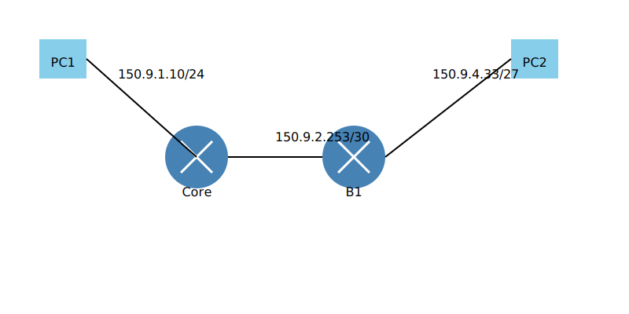

# Teema 12: Marsruutimine. Kuidas marsruuter töötab?

## Sissejuhatus marsruutimisse

Marsruutimine on üks võrgutehnoloogia põhiprotsesse, mis võimaldab andmepakettide liikumist erinevate võrkude vahel. Marsruutimine toimub võrgu kolmandal kihil (Layer 3) ja põhineb IP-aadressidel. Marsruutimise peamine eesmärk on tagada pakettide efektiivne ja usaldusväärne kohaletoimetamine lähtepunktist sihtpunkti.

## Marsruuteri põhikontseptsioonid


Marsruuter ehk ruuter on võrguseade, mis omab mitut võrguliidest (füüsilist või virtuaalset) ja suudab pakette ühest võrgust teise edastada. Marsruuter on tegelikult spetsialiseeritud arvuti, millel on:
- Mitu võrguliidest
- Spetsiaalne tarkvara marsruutimise jaoks
- Marsruutimistabel pakettide suunamiseks

### Marsruuter vs Kommutaator

Oluline on mõista erinevust marsruuteri ja kommutaatori vahel:

**Kommutaator (Switch):**
- Töötab OSI mudeli teisel kihil (Layer 2)
- Kasutab MAC-aadresse
- Ühendab seadmeid samas võrgus
- Ei saa ühendada erinevaid võrke

**Marsruuter (Router):**
- Töötab OSI mudeli kolmandal kihil (Layer 3)
- Kasutab IP-aadresse
- Ühendab erinevaid võrke
- Võimaldab marsruutimist ja filtreerimist

## Marsruutimise põhiprintsiibid


Marsruutimisprotsess algab sellest, et marsruuter saab andmepaketi ühelt seadmelt ja peab otsustama, kuidas see edasi suunata. See protsess hõlmab:

1. Paketi vastuvõtmist võrguliideselt
2. Sihtkoha IP-aadressi analüüsi
3. Marsruutimistabeli konsulteerimist
4. Parima tee valimist
5. Paketi edastamist õigele liidesele

### Marsruutimistabeli struktuur


Marsruutimistabel on marsruuteri keskne komponent, mis sisaldab järgmist informatsiooni:


1. Sihtkoha võrgu aadress (destination)
2. Võrgumask (netmask)
3. Gateway aadress (välja arvatud otseühendatud võrkude puhul)
4. Väljundliides
5. Metrika

 

Näites PC1 suhtleb PC2-ga läbi kahe marsruuteri. Iga marsruuter teeb otsuse paketi edasisuunamise kohta oma marsruutimistabeli põhjal.

---

## Marsruutimisprotsess


Kui marsruuter saab paketi, toimub järgmine protsess:

### 1. Paketi kontroll ja päise töötlemine
- FCS (Frame Check Sequence) kontroll vigade tuvastamiseks
- L2 (Ethernet) päise eemaldamine
- IP-paketi säilitamine edasiseks töötlemiseks


### 2. Marsruudi valimine
- IP-aadressi võrdlemine marsruutimistabeliga
- Parima marsruudi valimine longest match reegli alusel
- Järgmise punkti (next hop) määramine

### 3. Paketi töötlemine ja edastamine
- TTL väärtuse vähendamine
- Vajadusel paketi fragmenteerimine
- Uue L2 päise lisamine
- Paketi edastamine järgmisele seadmele


### IP Routing Steps Slideshow
[SlideServe](https://www.slideserve.com/kasen/chapter-6-objectives-powerpoint-ppt-presentation)


## MAC-aadresside käsitlemine marsruutimisel

MAC-aadresside muutmine on oluline osa marsruutimisprotsessist. Iga kord, kui pakett läbib marsruuteri:
- Lähtekoha MAC muutub marsruuteri liideseks
- Sihtkoha MAC muutub järgmise seadme aadressiks
- IP-aadressid jäävad samaks

### Näide MAC-aadresside muutumisest:
```
Lähe: PC1 -> Core
MAC: PC1_MAC -> CORE_MAC1
IP: 150.9.1.10 -> 150.9.4.33

Core -> B1
MAC: CORE_MAC2 -> B1_MAC1
IP: 150.9.1.10 -> 150.9.4.33

B1 -> PC2
MAC: B1_MAC2 -> PC2_MAC
IP: 150.9.1.10 -> 150.9.4.33
```

---

## 🌐 Marsruutimise Administratiivne Distants (AD)

Ruuter saab õppida marsuutimise teavet erinevatelt allikatelt. Kui ruuter saab sama sihtkoha kohta infot mitmest allikast, siis kasutab ta **AD väärtusi** 🧑‍💻, et otsustada, milline allikas on usaldusväärsem. **AD väärtus** on tegelikult allika usaldusväärsuse **mõõdik** 📊.

**AD väärtused** on vahemikus **0 – 255**, kus väiksem number tähendab, et allikas on usaldusväärsem. Näiteks, kui allikal on **AD väärtus 40**, siis see on usaldusväärsem kui allikal, millel on **AD väärtus 50**. 

- **0** tähendab kõige usaldusväärsemat allikat (usaldusväärne allikas) 👍
- **255** on kõige usaldusväärsem mitte-usaldusväärne allikas 👎

Lihtsustatud öeldes on **AD** skaalal määratud, kui usaldusväärne on allikas, millelt ruuter saab marsuutimisinfot 🔒.


**Mõned tavapärased ruuteri allikad ja nende vaike AD väärtused**:

| Source           | AD Value | Description                                  |
|------------------|----------|----------------------------------------------|
| **Connected**    | **0**    | Direct connection to the router (most reliable). |
| **Static**       | **1**    | Manually configured by the administrator.     |
| **BGP (Ext.)**   | **20**   | External routing for connecting networks.     |
| **EIGRP**        | **90**   | Cisco’s proprietary dynamic protocol.         |
| **OSPF**         | **110**  | Open standard link-state protocol.            |
| **IS-IS**        | **115**  | Similar to OSPF, scalable for large networks. |
| **RIP**          | **120**  | Simple protocol for small/basic networks.     |

---

## Longest Match reegel


Longest match reegel on fundamentaalne marsruutimise printsiip:
- Valitakse kõige pikema maskiga sobiv marsruut
- Pikem mask tähendab täpsemat sihtkoha määratlust
- Võimaldab efektiivset võrkude hierarhilist struktureerimist


---

## L3 kommutaator marsruutimislahendusena

### 🌐 **L3 kommutaator marsruutimislahendusena**  
L3 kommutaator on kaasaegne võrguseade, mis ühendab **kiire L2 kommutatsiooni ja L3 marsruutimise** ühte riistvaraplatvormi, pakkudes efektiivset ja skaleeruvat lahendust sisevõrkudele. See sobib eriti hästi organisatsioonidele, kes vajavad **kiiret VLANide vahelist suhtlust** ja **suurt läbilaskevõimet**.

### 🔑 **L3 kommutaatori eelised**
| Eelis 🏆            | Kirjeldus ✍️                                                                                                                                     |
|---------------------|--------------------------------------------------------------------------------------------------------------------------------------------------|
| ⚡ **Madalam latentsus**  | L3 kommutaator käsitleb andmeid riistvaratasandil, mis tagab kiirema andmeedastuse võrreldes tarkvarapõhise marsruutimisega.                     |
| 🚀 **Suurem läbilaskevõime** | Võimaldab suuri andmemahtusid hallata, mis on kriitiline näiteks andmekeskustes ja suure liiklusega võrkudes.                                   |
| 🌐 **Efektiivne VLANide vaheline suhtlus** | Iga VLAN saab suhelda teiste VLANidega kiiremini tänu sisseehitatud L3 marsruutimisele.                                          |
| 🔒 **Parem jõudlus ja turvalisus sisevõrgus** | Kasutades L3 kommutaatorit, saab lihtsustada ja kiirendada sisevõrkude marsruutimist, vähendades koormust eraldi marsruuteritel. |

---

### 🔌 **L3 kommutaatori liidesed**  
L3 kommutaator pakub paindlikke liideseid erinevate vajaduste jaoks:

1. **Physical L2 Interface (🌐)** – tavalised kommutatsiooniportid, mis töötavad **Ethernet**-tasandil ja võimaldavad kiiret seadmete ühendamist.  
2. **SVI (Switch Virtual Interface) (🛡️)** – VLANide L3 liidesed, mis võimaldavad igal VLANil saada IP-aadressi ja suhelda teiste VLANidega. Kasutatakse sageli **VLANide vaheliseks marsruutimiseks**.  
3. **Physical L3 Interface (🔗)** – Pordid, mis töötavad otse **L3 režiimis**, võimaldades klassikalist marsruutimist (nagu marsruuteritel). Sobivad hästi ühendusteks teiste võrguosade või välisvõrkudega.

---

### 🔎 **Miks meil on ikka vaja L2 kommutatsiooni?**
Kuigi L3 kommutaatorid pakuvad suurepärast marsruutimisvõimekust, on **L2 kommutatsioon jätkuvalt oluline** järgmistes olukordades:  

- **Seadmete otseseks ühendamiseks** (nt tööjaamad, serverid, printerid)  
- **Madal latentsus ja kõrge jõudlus lokaalses võrgus**  
- **Lihtsustatud seadistus ja hallatavus**, kui L3 marsruutimist pole vajalik rakendada igal tasandil  
- **Kuluefektiivsus**, sest ainult L2 kommutatsiooniga seadmed on odavamad ja piisavad väiksemates võrkudes  

---

## Marsruutimiskäsud erinevatel platvormidel

### Cisco IOS
```cisco
ROUTER_CORE#show ip route
C 150.9.1.0/24 is directly connected, Ethernet0
C 150.9.2.252/30 is directly connected, Ethernet1
S 150.9.4.32/27 [1/0] via 150.9.2.254
```

### Juniper JunOS
```juniper
user@ROUTER_B> show route table
150.9.4.32/27     *[Direct/0] 00:08:42
                    > via ge-0/0/0.0
```

### Linux
```bash
$ ip route
default via 192.168.1.1 dev eth0
192.168.1.0/24 dev eth0 proto kernel scope link src 192.168.1.2
```

## Marsruuterite tüübid ja sümbolid

Kaasaegsed marsruuterid võivad täita erinevaid rolle:
- Tavaline marsruuter
- Tulemüüriga marsruuter
- Traadita marsruuter
- VoIP marsruuter
- Content Service marsruuter
- Multiteenuse marsruuter


## Video: Introduction to Networking  
[](https://www.youtube.com/watch?v=qIIRSwnIcaA)  
**Source:** [YouTube - Introduction to Networking](https://www.youtube.com/watch?v=qIIRSwnIcaA)
