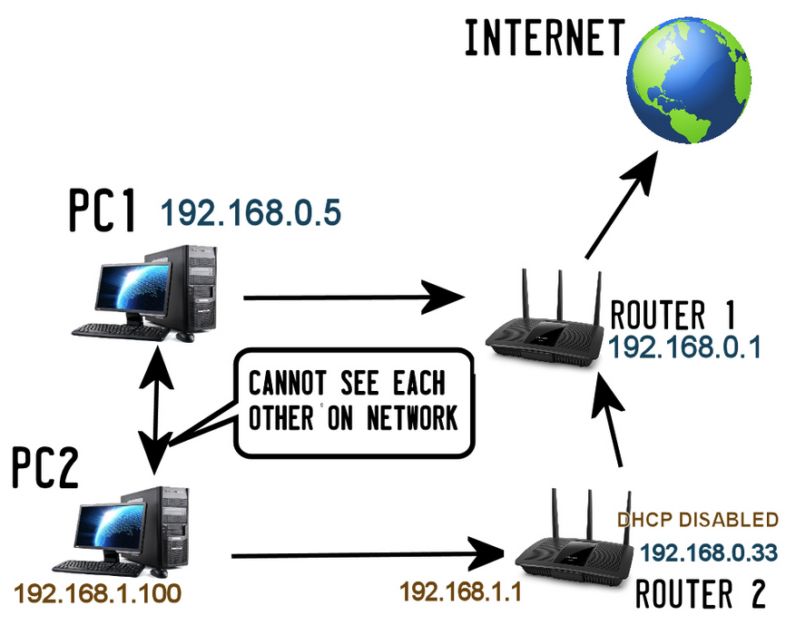
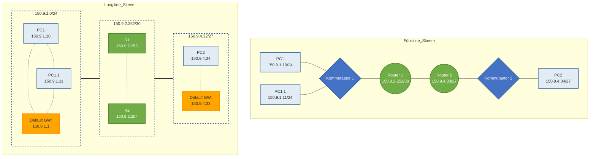

# Teema 12: Marsruutimine. Kuidas marsruuter töötab?

## Sisukord
1. [Sissejuhatus marsruutimisse](#sissejuhatus-marsruutimisse)
2. [Marsruuteri põhimõisted](#-küsimus)
3. [Marsruuteri vs Kommutaator](#marsruuter-vs-kommutaator)
4. [Võrgu marsruutimise näide](#võrgu-marsruutimise-näide-)
5. [Marsruutimise protsess](#marsruutimise-protsess)
6. [MAC-aadresside käsitlemine](#mac-aadresside-käsitlemine-marsruutimisel)
7. [Marsruutimistabeli struktuur](#marsruutimistabeli-struktuur)
8. [Korporatiivsed lahendused](#korporatiivsed-massruuterid-mida-arvestada-enne-ostmist)

## Sissejuhatus marsruutimisse



Marsruutimine on võrgutehnoloogia põhiprotsesse, mis võimaldab andmepakettide liikumist erinevate võrkude vahel. Marsruutimine toimub võrgu kolmandal kihil (Layer 3) ja põhineb IP-aadressidel. Marsruutimise peamine eesmärk on tagada pakettide efektiivne ja usaldusväärne kohaletoimetamine lähtepunktist sihtpunkti.


## ❓ Küsimus  
Kas iga mitme interfaisiga arvuti on ruuter või mitte? 🤔

## 🚀 Oluline Teave!  

Router peab marsruutimiseks omama järgmisi andmeid:  

- 📍 **Sihtaadress (Address of destination)**  
- 🌐 **Kättesaadavad teed kõikidesse kaugvõrkudesse (Available paths to all remote networks)**  
- 🛤️ **Parim tee iga kaugvõrgu jaoks (The best path to each remote network)**  


### Marsruuter vs Kommutaator

Oluline on mõista erinevust marsruuteri ja kommutaatori vahel:


**Kommutaator (Switch):**
- Töötab OSI mudeli teisel kihil (Layer 2)
- Kasutab MAC-aadresse
- Ühendab seadmeid samas võrgus
- Ei saa ühendada erinevaid võrke

**Marsruuter (Router):**
- Töötab OSI mudeli kolmandal kihil (Layer 3)
- Kasutab IP-aadresse
- Ühendab erinevaid võrke
- Võimaldab marsruutimist ja filtreerimist


### Levinumad marsruutimistabeli märgistused:
- **C** - Connected (Otseühendatud võrgud)
- **S** - Static (Staatilised marsruudid)
- **O** - OSPF routes
- **D** - EIGRP routes
- **R** - RIP routes
- **B** - BGP routes

## Võrgu Marsruutimise Näide 🌐

### Skeemide Tüübid

Võrgutopoloogia visualiseerimiseks kasutame kahte erinevat skeemi:

L2 füüsiline skeem 🔌 kujutab seadmete tegelikku füüsilist paigutust ja ühendusi võrgus. See näitab, kuidas hostid, kommutaatorid ja ruuterid on omavahel füüsiliselt ühendatud kaablitega. 

L3 loogiline skeem 🧠 illustreerib võrgu abstraktsemat, loogilist struktuuri IP-võrkude tasandil. See näitab, kuidas erinevad võrgusegmendid on omavahel ühendatud.



## /30 (/31) Võrgumask Ruuterite Vahelises Ühenduses 🔗

Ruuterite vahelistes ühendustes kasutatakse /30 võrgumaski just seetõttu, et see võimaldab ainult 2 kasutatavat IP-aadressi, mis on täpselt see, mida ruuterite omavaheliseks ühendamiseks vaja on. See on väga efektiivne lahendus, kuna punkt-punkt ühenduses ruuterite vahel pole kunagi vaja rohkem kui kahte IP-aadressi. 

## TÄHTIS MÄRKUS VAIKIMISI LÜÜSI KOHTA! 🚨

**Kuldreegel**: Vaikimisi lüüs PEAB alati kuuluma samasse võrku, kus asub host! 

Selgitus praktilise näite põhjal:
Kui host asub võrgus 192.168.1.0/24, siis tema vaikimisi lüüs PEAB omama IP-aadressi formaadis 192.168.1.X.

🔴 Vale konfiguratsioon:
```
Host IP: 192.168.1.10/24
Default Gateway: 192.168.2.1  // EI TÖÖTA! Lüüs on teises võrgus!
```

🟢 Õige konfiguratsioon:
```
Host IP: 192.168.1.10/24
Default Gateway: 192.168.1.1  // TÖÖTAB! Lüüs on samas võrgus
```

## Marsruutimise Protsess

### 1. Paketi kontroll ja päise töötlemine
- FCS (Frame Check Sequence) kontroll vigade tuvastamiseks
- L2 (Ethernet) päise eemaldamine
- IP-paketi säilitamine edasiseks töötlemiseks

### 2. Marsruudi valimine
- IP-aadressi võrdlemine marsruutimistabeliga
- Parima marsruudi valimine longest match reegli alusel
- Järgmise punkti (next hop) määramine

### 3. Paketi töötlemine ja edastamine
- TTL vähendamine
- Vajadusel paketi fragmenteerimine
- Uue L2 päise lisamine
- Paketi edastamine järgmisele seadmele

## Marsruutimise Tüübid 🌐

### 1. Staatiline Marsruutimine (Lihtne) 🔨

Staatilise marsruutimise puhul seadistatakse marsruudid käsitsi:
- Administraator määrab ise kõik marsruudid
- Iga võrgu jaoks määratakse kindel tee
- Marsruuter "teab" ainult seda, mis talle on öeldud
- Sobib väikestele võrkudele
- Lihtne seadistada ja hallata

Näide:
```
Router(config)# ip route 150.9.4.0/27 Serial0/0
```

### 2. Dünaamiline Marsruutimine (Keeruline) 🔄

Dünaamilise marsruutimise puhul vahetavad ruuterid omavahel marsruutimisinformatsiooni:

### Mastaabid:
- **Internet**: ~850,000 marsruuti
  - Uue võrgu info levib 10-15 minutiga üle maailma
  - Täisvaade (full view) tabelid ruuterite vahel
  
- **Ettevõtte võrgud**:
  - Muudatused levivad sekundite või millisekunditega
  - Väiksem marsruutide arv
  - Kiirem konvergents

### Levinumad Protokollid:
- OSPF (Open Shortest Path First)
- BGP (Border Gateway Protocol)
- EIGRP (Enhanced Interior Gateway Routing Protocol)
- RIP (Routing Information Protocol)

### Kokkuvõte ⭐

| Omadus | Staatiline | Dünaamiline |
|---------|------------|-------------|
| Seadistamine | Käsitsi | Automaatne |
| Sobivus | Väikesed võrgud | Suured võrgud |
| Haldus | Lihtne | Keerukam |
| Kohanemisvõime | Madal | Kõrge |
| Ressursikasutus | Madal | Kõrgem |
| Muudatuste kiirus | Manuaalne | Automaatne (sek-min) |

## MAC-aadresside käsitlemine marsruutimisel

MAC-aadresside muutmine on oluline osa marsruutimisprotsessist. Iga kord, kui pakett läbib marsruuteri:
- Lähtekoha MAC muutub marsruuteri liideseks
- Sihtkoha MAC muutub järgmise seadme aadressiks
- IP-aadressid jäävad samaks

### Näide MAC-aadresside muutumisest:
```
Lähe: PC1 -> Core
MAC: PC1_MAC -> CORE_MAC1
IP: 150.9.1.10 -> 150.9.4.33

Core -> B1
MAC: CORE_MAC2 -> B1_MAC1
IP: 150.9.1.10 -> 150.9.4.33

B1 -> PC2
MAC: B1_MAC2 -> PC2_MAC
IP: 150.9.1.10 -> 150.9.4.33
```

## Marsruutimistabeli struktuur

### 📋 Windows
Kasutage käsku **`route print`**, et vaadata marsruutimistabelit Windowsis.

```bash
C:\> route print
```


Marsruutimistabel sisaldab:
1. **Sihtkoha Võrguaadress** (destination) 🎯
   - Siht-võrgu aadress, kuhu paketid tuleb saata

2. **Võrgumask** (netmask) 🔍
   - Määratleb siht-võrgu alamvõrgu osa

3. **Gateway Aadress** (gateway) 🌉
   - Järgmise hüppe marsruuteri aadress
   - Pole vajalik otseühendatud võrkude puhul

4. **Marsruudi Meetrika** (metric) ⚖️
   - Väärtus, mida kasutatakse marsruudi eelistuse määramiseks

5. **On-link** ühendused 🔗
   - Tähistab otseühendatud võrke
   - Seade saab suhelda otse, ilma marsruuterita
   - Näide:
     ```
     192.168.1.0/24    on-link    192.168.1.100
     ```
   - Linux süsteemides näidatakse kui "scope link"
   - 
6. **Staatilised marsruudid** (S) 🔒
   - Tähistatakse 'S' tähega marsruutimistabelis
   - Näide Cisco tabelis:
     ```
     S  192.168.2.0/24 [1/0] via 10.0.0.1
     ```
   - [1/0] näitab administratiivset distantsi (1) ja meetrikat (0)
   - Käsitsi lisatud marsruudid
   - Muudetavad ainult administraatori poolt

## Administratiivne Distans (AD)


AD väärtused on vahemikus 0-255:
- **0**: Connected (otseühendatud)
- **1**: Static (staatilised marsruudid)
- **20**: External BGP
- **90**: EIGRP
- **110**: OSPF
- **115**: IS-IS
- **120**: RIP

## Longest Match reegel


Longest match reegel on fundamentaalne marsruutimise printsiip:
- Valitakse kõige pikema maskiga sobiv marsruut
- Pikem mask tähendab täpsemat sihtkoha määratlust


## L3 kommutaator marsruutimislahendusena

### Eelised:
- ⚡ **Madalam latentsus**: Kiirem andmeedastus
- 🚀 **Suurem läbilaskevõime**: Ideaalne andmekeskustele
- 🌐 **Efektiivne VLANide vaheline suhtlus**: Kiire sisevõrgu liiklus
- 🔒 **Parem jõudlus ja turvalisus sisevõrgus**: Sisseehitatud kaitsemehhanismid

### Liidesed:
1. **Physical L2 Interface (🌐)** – tavalised kommutatsiooniportid, mis töötavad **Ethernet**-tasandil
2. **SVI (Switch Virtual Interface) (🛡️)** – VLANide L3 liidesed
3. **Physical L3 Interface (🔗)** – Pordid, mis töötavad otse **L3 režiimis**

## Marsruutimiskäsud erinevatel platvormidel

### Cisco IOS
```cisco
ROUTER_CORE#show ip route
C 150.9.1.0/24 is directly connected, Ethernet0
C 150.9.2.252/30 is directly connected, Ethernet1
S 150.9.4.32/27 [1/0] via 150.9.2.254
```

### Juniper JunOS
```juniper
user@ROUTER_B> show route table
150.9.4.32/27     *[Direct/0] 00:08:42
                    > via ge-0/0/0.0
```

### Linux
```bash
$ ip route
default via 192.168.1.1 dev eth0
192.168.1.0/24 dev eth0 proto kernel scope link src 192.168.1.2
```

## Marsruuterite tüübid ja sümbolid

Kaasaegsed marsruuterid võivad täita erinevaid rolle:
- Tavaline marsruuter
- Tulemüüriga marsruuter
- Traadita marsruuter
- VoIP marsruuter
- Content Service marsruuter
- Multiteenuse marsruuter


## Video: Introduction to Networking  
[](https://www.youtube.com/watch?v=qIIRSwnIcaA)  
**Source:** [YouTube - Introduction to Networking](https://www.youtube.com/watch?v=qIIRSwnIcaA)

## Korporatiivsed massruuterid: mida arvestada enne ostmist

1. **Võimsus ja jõudlus:**
   - Ruuter peab suutma töödelda suurt andmeliikluse mahtu ilma viivitusteta
   - Jõudlusnäitajad:
     - Pakettide edastamise kiirus (PPS)
     - Ruuteri läbilaskevõime (Mbps või Gbps)

2. **Tarkvarafunktsioonid ja ruutimisprotokollid:**
   - Ruutimisprotokollid: OSPF, BGP, EIGRP
   - QoS (Quality of Service)
   - VPN ja tulemüürid

3. **Laiendatavus ja liidesed:**
   - Uplink-portide tugi (1G, 10G, 40G SFP+)
   - Moodulid laiendamiseks
   - Cluster-tugi

4. **Varjatud kulud:**
   - Lisalitsentsid
   - Riistvaramoodulid
   - Tarkvarauuendused ja hooldustasud

### Hinnad korporatiivsete massruuterite puhul

#### Algklassi massruuterid (väiksemad ettevõtted)
- **Cisco ISR 1000 seeria:** Hind alates 500–1500 €
- **MikroTik CCR (Cloud Core Router):** Hind 300–1000 € (toetab kuni 10G uplinke, kuid vähem jõuline)
- **Ubiquiti EdgeRouter Infinity:** Hind 800–2000 € (võimas ja mitmeportiline)

#### Keskmised ja suured ettevõtted
- **Cisco ISR 4000 seeria:** Hind 3000–6000 €, sõltuvalt konfiguratsioonist
- **Juniper MX-seeria:** Hind 5000–20 000 € (olenevalt konfiguratsioonist ja moodulitest)
- **HPE Aruba ruuterid:** Hind 2000–10 000 €, sõltuvalt mudelist ja laiendustest

#### Tippklassi lahendused
- **Cisco ASR 9000 seeria (Carrier-grade ruuter):** Hind 20 000–50 000 € või rohkem
- **Juniper PTX-seeria:** Hind üle 50 000 € suurettevõtetele ja teenusepakkujatele

### Litsentside ja moodulite hinnad
#### Litsentsid
- L3 ruutimine (OSPF, BGP, MPLS): 500–3000 € litsents
- VPN ja turvalisuse lisalitsentsid: 200–2000 €
- Pilvehaldustarkvara (nt Cisco DNA Center): 500–5000 € aastas

#### Moodulid ja varustus
- **10G SFP+ moodul:** 200–500 € tükk
- **40G/100G moodulid:** 1000–5000 € tükk
- **Optilised transiiverid (SFP, QSFP):** 50–300 € tükk, sõltuvalt kiirusest ja tüübist

### Varjatud kulud
1. **Tarkvarauuendused ja tehniline tugi:**
   - Tehnilise toe lepingud (nt Cisco SmartNet): 500–5000 € aastas

2. **Koolitus ja paigaldus:**
   - Suuremate seadmete seadistamine ja võrgu optimeerimine nõuab IT-spetsialisti, mis võib lisada 1000–3000 € kulusid

3. **Energiatarve:**
   - Kõrgjõudlusega ruuterid võivad tarbida märkimisväärselt elektrit, eriti kui need töötavad 24/7

### Näide: korporatiivse massruutimise lahendus
**Oletame, et sul on ettevõte, kus vajatakse ruuterit 500 töötaja võrgu haldamiseks, ühendades ka mitut kontorit:**
- Ruuter: Cisco ISR 4331 (hind 3000 €)
- L3 litsents (OSPF, BGP): 1000 €
- 10G uplink-moodulid: 2 × 400 € = 800 €
- Optilised transiiverid: 2 × 150 € = 300 €
- Tehnilise toe leping (Cisco SmartNet): 1000 € aastas

**Kogukulu esimesel aastal:** 6100 € + paigaldus
```
