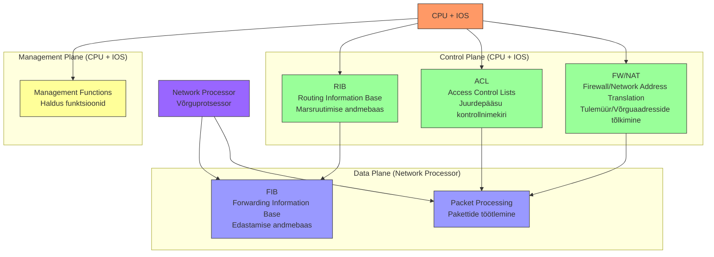
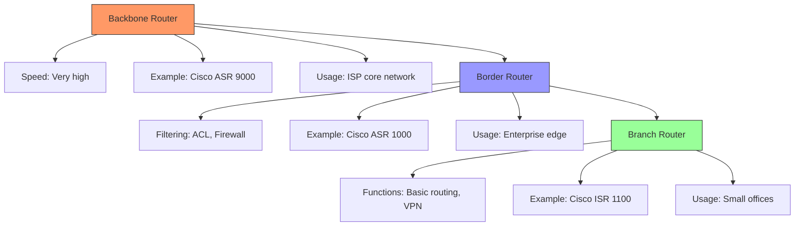
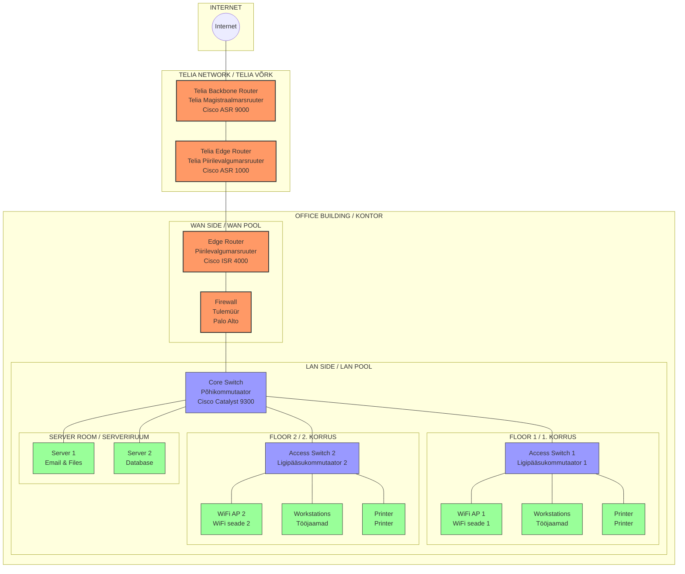
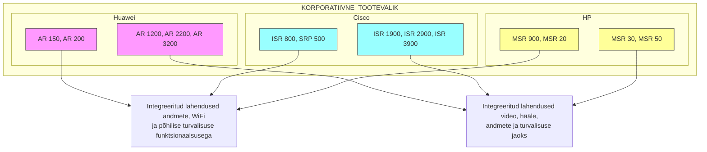

# Teema 13: Marsruuterite arhitektuur ja teostus

# Marsruuterite arhitektuur ja teostus

  
**Source:** [Bleeping Computer](https://www.bleepstatic.com/content/hl-images/2023/04/23/Routers.jpg)

  
**Source:** [OMCS Notes](https://assets.omscs.io/notes/0104.png)

Arhitektuur on üles ehitatud nii, et meil on juhtimiskontuur (Control Plane) ja protokollide marsruutimine. See arhitektuur ei kehti ainult marsruuteritele, vaid ka võimsatele L3 kommutaatoritele. Marsruutimine toimub protokollide RIP, OSPF, IS-IS abil.

  
**Source:** [RST Forum](https://mgmt.rstforum.net/uploads/media-1701418352497.png)

**Marsruuteri põhikomponendid** (Router Main Components):

1. **Kontrollkiht** (Control Plane):
   - RIB (Routing Information Base) - marsruutimise andmebaas
   - ACL (Access Control Lists) - juurdepääsu kontrollnimekiri
   - FW/NAT (Firewall/Network Address Translation) - tulemüür/võrguaadresside tõlkimine

2. **Andmekiht** (Data Plane):
   - FIB (Forwarding Information Base) - edastamise andmebaas
   - Teostab pakettide füüsilist edastamist (Physical packet forwarding)

3. **Juhtimine** (Management):
   - CPU koos IOS tarkvaraga juhib Control Plane'i tööd
   - NP (Network Processor) teostab Data Plane'i funktsioone
   - CPU tegeleb ka seadme haldamisega (Management Plane)

**Marsruuterite liigid** (Router Types):

1. **Magistraalmarsruuter** (Backbone/Core Router):
   - Põhiülesanne: pakettide edastamine kõrge kiirusega
   - Kasutusel: suurtes võrkudes ja andmekeskustes

2. **Piirilevalgumarsruuter** (Border/Edge Router):
   - Põhiülesanne: maksimaalne paindlikkus filtreerimisel ja liikluse profileerimisel
   - Kasutusel: võrkude piiril, ühendab sisevõrku välisega

3. **Kaugkontorite ja kodumarsruuterid** (Branch/Home Routers):
   - Põhiülesanne: põhilised võrgufunktsioonid
   - Kasutusel: väiksemates kontorites ja kodudes

**Täiendav jaotus** (Additional Classification):
- Marsruutereid saab jagada vastavalt nende asukohale võrgus (sisevõrk vs välisvõrk)
- Samuti jaotatakse neid kasutuse järgi:
  - Sideoperaatorite marsruuterid (Service Provider Routers)
  - Ettevõtte marsruuterid (Corporate Routers)

## Võrgu näide Teliaga

---

## Korporatiivne tootevalik:

**Huawei:**  
- AR 150, AR 200  
- AR 1200, AR 2200, AR 3200  
[Huawei Fixed Network Routers](https://carrier.huawei.com/en/products/fixed-network/data-communication/router)  

**Cisco:**  
- ISR 800, SRP 500  
- ISR 1900, ISR 2900, ISR 3900  
[Cisco 800 Series Routers](https://www.cisco.com/c/en/us/support/routers/800-series-routers/series.html)  

**HP:**  
- MSR 900, MSR 20  
- MSR 30, MSR 50  
  

****

2600 seeria marsruuteri välised komponendid:
- Jadapordid (Serial Ports)
- FastEthernet pordid
- Konsooliport (Console Port)
- Lisaport (Auxiliary Port)
- Toitelüliti (Power Switch)
- Toitejuhtme ühendus (Power Cord Connection)

**[Cisco Interfaces and Modules Support](https://www.cisco.com/c/en/us/support/interfaces-modules/index.html)**

****

Moodulid marsruuterite jaoks:

| **Module Type**                              | **Description**                               |
|-----------------------------------------------|----------------------------------------------|
| **Moodulid marsruutitavate portidega**        | Modules with routable ports for WAN or LAN connectivity. |
| **Moodulid kommutaatoritega**                 | Modules with switching capability, typically for Layer 2 networking. |
| **ADSL moodulid**                             | Asymmetric Digital Subscriber Line (ADSL) modules for broadband access over telephone lines. |
| **3G, 4G, LTE moodulid**                      | Cellular network modules for mobile broadband connectivity. |
| **WiFi moodulid**                             | Modules for wireless LAN (WLAN) connectivity using WiFi standards. |
| **Moodulid sünkroonsete portidega V.35**      | Modules with synchronous ports supporting V.35 interface for high-speed data transmission. |
| **Moodulid PDH (E1, G.703, G703.1)**          | Plesiochronous Digital Hierarchy (PDH) modules supporting E1 and G.703 interfaces for digital voice and data transmission. |
| **Moodulid häälportidega FXS/FXO/E1**         | Modules with voice ports for analog (FXS/FXO) and digital (E1) voice communication. |

Here's the YouTube videos:

