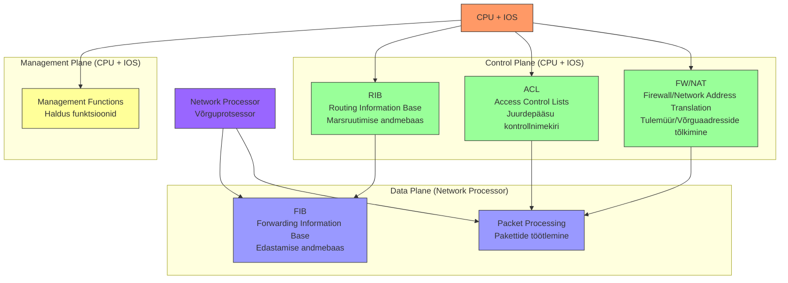
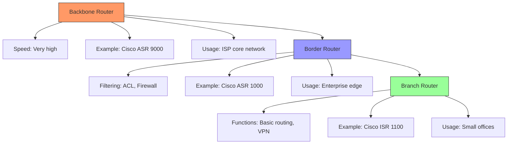
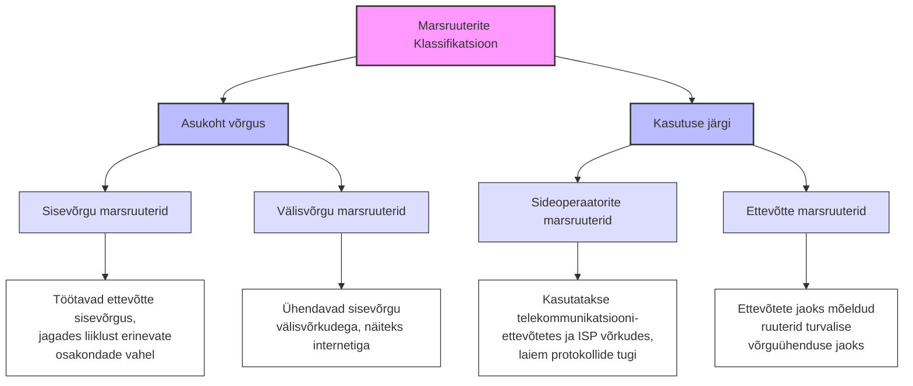
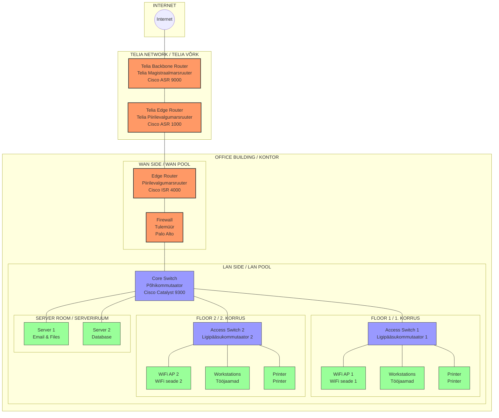
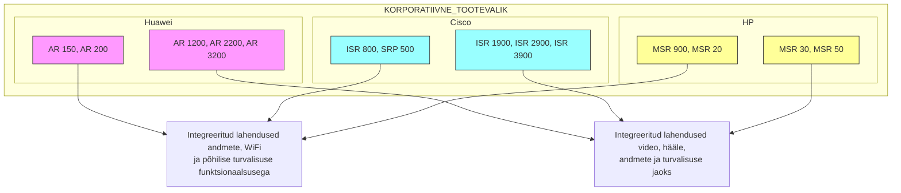

# Teema 13: Marsruuterite arhitektuur ja teostus

  
**Source:** [Bleeping Computer](https://www.bleepstatic.com/content/hl-images/2023/04/23/Routers.jpg)

Arhitektuur on üles ehitatud nii, et meil on juhtimiskontuur (Control Plane) ja protokollide marsruutimine. See arhitektuur ei kehti ainult marsruuteritele, vaid ka võimsatele L3 kommutaatoritele. Marsruutimine toimub protokollide RIP, OSPF, IS-IS abil.

  
**Source:** [RST Forum](https://mgmt.rstforum.net/uploads/media-1701418352497.png)

Selline arhitektuur ei sobi mitte ainult ruuteritele, vaid põhimõtteliselt ka võimsatele L3 switchidele. On oluline mõista, et siin on meil:

1. Juhtimiskontuur (Control Plane)
2. Andmete edastamine (Data Plane)

Miks see on oluline? Ruuter peab pakettide töötlemisel kasutama teatud ressursse. Näiteks on vaja pakette töödelda, lahti võtta ja kokku panna. Varem tehti seda tarkvaraliselt ruuteri CPU abil. 

Praegune olukord on selline, et CPU tegeleb peamiselt marsruutide kogumise ja seadme juhtimisega - see tähendab väliste ühenduste ja juhtimisprotokollide vastustega. Näiteks kui te pingisite ruuterit, vastab teile just selle keskprotsessor. 

**Source:** [Netmanias](https://www.netmanias.com/en/?m=attach&no=8930)

Tootmiskeskkonnas juhtub tihti, et inimesed pingivad seadet, mis on parasjagu millegagi koormatud (näiteks marsruutide ümberarvutamisega). Protsessor on hõivatud ja seetõttu on ping aeglane. Inimene näeb, et vastuste aeg kõigub ja on suur, ning arvab, et võrguühendus ei tööta. Tegelikult pole probleem ühenduses, vaid protsessor on hõivatud, sest vastab teistele päringutele.

Data Plane ehk andmete edastamine toimub tavaliselt läbi kiipide ja spetsiaalse riistvara. Control Plane'ist laetakse andmed kiiresti töötavatesse kiipidesse ja mällu ning andmete edastamine toimub riistvaraliselt.

Miks on oluline neid kahte mõistet eristada? Kui seade töötab riistvaraliselt, toimub see kiiresti ja probleemideta. Aga kui tekivad mingid probleemid, näiteks pakettide fragmenteerimine, muutub olukord keerulisemaks. Kui iga paketti on vaja fragmenteerida, hakkab see kasutama CPU ressursse. Iga sellise paketiga peame pöörduma CPU poole, ootama vastust, tegema mingi töö ja siis edasi saatma. See töötab palju aeglasemalt kui puhtalt riistvaraline töötlus.

Seetõttu on oluline mõista, mida seade teeb riistvaraliselt ja mida tarkvaraliselt. Näiteks kui seade suudab VPN-i krüpteerida riistvaraliselt, töötab see väga kiiresti. Kui aga krüpteerimine toimub tarkvaraliselt, on sellel tugev läbilaskevõime piirang ja see koormab ka protsessorit.

Oluline on mõista, et kõik, mida ruuter kogub marsruutimisprotokollide kaudu (osaliselt dünaamiliselt), töödeldakse keskprotsessoris. Seejärel teeb protsessor sellest kokkuvõtte ja laeb selle riistvaralisse ossa, kus see töötab kiiresti riistvara tasemel.

Kui töötate võrguseadmetega, puutute kindlasti kokku nende mõistetega, eriti kui tegemist on kõrge jõudlusega lahenduste ja suure koormusega ruuteritega.

## Ruuteri tööskeem (Router operating scheme)

Siin on kujutatud mõned detailid, kuidas toimub pakettide vastuvõtmine. Pakett satub FIB-i (Forwarding Information Base) - see on marsruutimistabeli analoog, aga binaarkujul, mis asub riistvaralises osas.

Siin töötab kõik muu - näiteks operatsioonisüsteem IOS, mis annab teile käsurea, millega te suhtlete. See täidab kesta operatsioone. Siin võib töötada ka HTTP server - näiteks kui te sisenete oma kodusesse ruuterisse, kasutate HTTP kasutajaliidest. Seal töötab väike veebiserver.

Põhimõtteliselt kõik, mis puudutab juhtimist, tööd protokollidega jne. Vahel juhtub, nagu siin hästi kirjutatud, et kui lisate ACL-i (pääsuloendid) filtreerimiseks, hakkavad mõned ruuterid filtreerimist tegema tarkvaralisel tasemel. See tähendab, et kogu paketivoog tuleb siia ja me hakkame seda filtreerima, mis loomulikult aeglustab voolu.

Samas tulemüürid (firewalls) omavad tihti mooduleid, mis suudavad seda teha riistvaraliselt. See tähendab, et kui te kirjutate filtri, laetakse see riistvara tasemele ja see töötab juba kõrge kiirusega.

Seepärast on need mõisted nii olulised - milline konkreetne riistvara, milline püsivara, millised funktsioonid töötavad ühel või teisel tasemel. Muidugi on arusaadav, et jõudluse kasvuga tehakse üha rohkem riistvaraliselt, aga see sõltub ka seadme otstarbest ja funktsioonidest.

Ma mäletan üht juhtumit, kus ühel seadmel GRE-tunneli tegemiseks pidi välja lülitama ühe füüsilise pordi. See tähendab, et ta võttis ühe füüsilise gigabitise pordi ressursid ja ütles, et kasutab neid tunneli töötamiseks. Ta ütles põhimõtteliselt "loobuge sellest pordist ja ma suudan riistvaraliselt teha tunnelit". Selliseid erilisi juhtumeid tuleb ette, aga see on juba eksootika.

| Kiht           | Funktsioonid |
|---------------|-------------|
| **Kontrollkiht (Control Plane)** | - **RIB (Routing Information Base):** Hoidla kõikidele marsruutidele, mis on õpitud marsruutimisprotokollide või staatiliste seadistuste kaudu.    - **ACL-id (Access Control Lists):** Kontrollivad ja filtreerivad võrgu liiklust.   - **Tulemüür ja NAT:** Võrgu turvalisuse ja aadressitõlke haldamine. |
| **Andmekiht (Data Plane)** | - **FIB (Forwarding Information Base):** Optimeeritud marsruutimistabel, mis põhineb RIB-il ja tagab kiire pakettide edastamise.   - **Paketiedastus:** Teostab pakettide füüsilist liikumist riistvarapõhiselt, mitte CPU kaudu, mis tagab kõrge jõudluse.   - **Riistvarakiirendus:** Kasutab spetsiaalseid kiipe kiireks andmetöötluseks. |
| **Juhtimine (Management)** | - **CPU koos IOS tarkvaraga:** Kontrollkihti haldav protsessor.   - **Võrguprotsessor (NP):** Andmekihi kiire pakettide töötlemine.   - **Seadme haldamine:** CLI või veebiserveri kasutajaliides, konfiguratsioonihaldus, monitooring ja logimine. |

---

## Klassifikatsioon

Klassifikatsioon on tegelikult üsna lihtne. Millised nad olla võivad?

| Marsruuteri Tüüp | Põhiülesanne | Kasutuskoht |
|------------------|-------------|------------|
| **Magistraalmarsruuter (Backbone/Core Router)** | Pakettide edastamine kõrge kiirusega | Suured võrgud ja andmekeskused |
| **Piirilevalgumarsruuter (Border/Edge Router)** | Maksimaalne paindlikkus filtreerimisel ja liikluse profileerimisel | Võrkude piiril, ühendab sisevõrgu välisega |
| **Kaugkontorite ja kodumarsruuterid (Branch/Home Routers)** | Põhilised võrgufunktsioonid | Väiksemad kontorid ja koduvõrgud |

Magistraalruuter ("Backbone Router" või "Core Router")- tavaliselt on need sellised seadmed, mis asuvad kuskil ja tagavad interneti töö. Need on tavaliselt teenusepakkujate seadmed, harva võib neid kohata suurtes ettevõtetes. Need peavad edastama pakette suure kiirusega ühe teenusepakkuja või ettevõtte võrgu piires. Need on tavaliselt suured ja võimsad seadmed, mitte seadmed nagu meil koolis on, vaid päris suured.

**Source:** [SysAdmin - What is Core Router?](https://sysadmin.co.in/what-is-core-router/)

Piiriruuter ehk border router - kus ta meil siin pildil on...  Tavaliselt mõistetakse selle all ruuterit, mis asub ettevõtte võrgu piiril või autonoomse süsteemi piiril. Mina kohtun selliste asjadega kõige sagedamini interneti piiril, seepärast nimetataksegi seda piiriruuteriks või inglise keeles border router.

**Source:** [Cisco 8000 Series Routers](https://www.cisco.com/site/us/en/products/networking/sdwan-routers/8000-series/index.html)

Spetsiifika - tavaliselt on tal olemas kõik vajalikud protokollid interneti jaoks, tal peab olema kõrge jõudlus ja, noh, sõltub muidugi ettevõtte võrgust. Aga rohkem ma siin ei ütlekski. See tähendab, et ta ei sarnane magistraalruuteriga, ta võib olla üsna väike. See tähendab, kui teie võrk ühendub ühe-kahe-kolme teenusepakkujaga, ei pruugi teil palju linke vajagi minna, aga jõudlus peab olema kõrge, et tagada teie kohalikule võrgule kiire ühendus. Pluss BGP protokoll ja kindlasti võimalus võtta vastu täielik marsruutimistabel (full view).

*Source: [Cisco 1921 Integrated Services Modular Router](https://preview.redd.it/cisco1921-k9-cisco-1921-integrated-services-modular-router-v0-tdvzj8o80q7b1.jpg?width=1080&crop=smart&auto=webp&s=61cb1fdb3dc33a471be82eb9c2173f214dba2db4)*

## Kaugkontorite ja Koduruuterid

Kaugkontorite ja koduruuterid moodustavad olulise segmendi võrguseadmete turul. Paljud tootjad pakuvad selliseid tooteid, mis on mõeldud väikeste kontorite ja filiaalide jaoks. Näiteks pangakassapunktid, kus töötab vaid mõni inimene, vajavad sageli stabiilset ja turvalist internetiühendust, mida võimaldavad professionaalsed tootjad oma seadmetega.

Koduruuterid võib samuti teatud mõttes nimetada väga lihtsustatud piiriruuteriteks, kuna neil on põhifunktsioonid internetiühenduse loomiseks.

### VPN ja Turvalisus

Kaugkontorite ja koduruuterite puhul on tihti oluline VPN-tehnoloogia kasutamine, et võimaldada turvalist ühendust põhikontoriga. 

VPN-i kasutamine tagab:
- Turvalise ühenduse kaugkontori ja peakontori vahel.
- Teatud läbilaskevõime vastavalt seadme spetsifikatsioonidele.
- Võimaluse kasutada ettevõtte servereid ja ressursse üle interneti.

Erinevalt sisevõrgu ja välisvõrgu ruuteritest ei ole andmekeskuste ruuterite puhul eraldi klassifikatsiooni levinud, mistõttu neid sageli eraldi ei käsitleta.

Kaugkontorite ja koduruuterid mängivad olulist rolli nii väikestes ettevõtetes kui ka kodukasutuses. VPN-i tugi, turvalisus ja usaldusväärsus on võtmetähtsusega omadused, mida nende seadmete valikul silmas pidada. Ruuterite klassifitseerimine aitab paremini mõista nende kasutusvaldkondi ja funktsioone erinevates võrgukeskkondades.

Pluss on seal mingid eripärad. Näiteks kui see on ettevõtte ruuter, võib seal kohata WiFi moodulit, IP-telefoni moodulit, vahel läheb asi päris kaugele - ma olen näinud, kus terve server on 67xx ruuterisse pandud. Isegi sellised asjad on olemas. Loomulikult ei kohta sa sellist asja operaatorite ruuterites - seal on teised nõuded: kõrge kiirus, portide kõrge tihedus, mingid spetsiaalsed protokollid. Aga selliseid lisafunktsioone kontori töö mugavuse jaoks seal ei ole. See on väga tinglik...

### Võrgu näide Teliaga

---

## Korporatiivne tootevalik:

**Huawei:**  
- AR 150, AR 200  
- AR 1200, AR 2200, AR 3200  
[Huawei Fixed Network Routers](https://carrier.huawei.com/en/products/fixed-network/data-communication/router)  

**Cisco:**  
- ISR 800, SRP 500  
- ISR 1900, ISR 2900, ISR 3900  
[Cisco 800 Series Routers](https://www.cisco.com/c/en/us/support/routers/800-series-routers/series.html)  

**HP:**  
- MSR 900, MSR 20  
- MSR 30, MSR 50  
  

Tegelikult on need väga vanad tooteliinid. Kõik, mis siin näidatud, on selline hea vana tehnika. Näiteks nii näevad välja seadmed väikeste kontorite jaoks. Ja nii näevad nad välja, kui nad kasvavad suuremaks. Ja kui asi muutub selliseks, hakkab see sarnanema piiriruuteritega (border router). Siin on Cisco seadmed, aga sama edukalt võiks siin olla ka Juniper.

Pange tähele, siin on kõrge portide tihedus, turvaline lahendus. See tähendab, et me saame selle seadme väga kiiresti internetti ühendada ja lisaks peame tagama mingisuguse turvalisuse välisperimeertil.

Mis puudutab neid madalama klassi mudeleid, siis näete, et siin pööratakse rohkem tähelepanu sellele, et kõik andmed saaksid edastatud, saaks prioriseerida videot, käidelda häälliiklust (VoIP), andmeid ja kõike muud. Mingil pool saab otse WiFi sinna ühendada, otse sellesse šassiisse. See tähendab, et mida väiksemad nad on, seda paindlikumad. Mida kõrgemale liigud, seda vähem paindlikud nad on, aga kiirus kasvab. Tavaliselt on see niimoodi.

[Source: Juniper Networks](https://www.juniper.net/)

Nad näevad erinevad välja. Näiteks Juniper - need on ka ruuterid ja on olemas RX seeria ja SRX. SRX on tegelikult tulemüür ja huvitaval kombel algavad need väga väikestest, tõesti väikestest 8-pordiga seadmetest, mida võib lihtsalt lauale panna nagu lauakommutaatorit, aga tal on sama funktsionaalsus. Ja lõpetades selliste suurte seadmetega, mis maksavad lihtsalt hulga raha ja mis suudavad töödelda väga suurt hulka liiklust. Jah, nad on samaaegselt nii ruuterid kui tulemüürid ja selline huvitav šassii, kuhu saab sisestada kommutaatoriplaate - ta on nii tulemüür, ruuter kui kommutaator. On isegi selline nali, et ma ei saa aru, kas SRX on kommutaator, ruuter või tulemüür, ja vastus on - ma arvan, et see on modem.

[Source: Network Screen](https://www.networkscreen.co.uk/)

Kummaline tooteseeria, aga sellegipoolest on tal kasvuvõimalused nii kiiruse kui turvalisuse osas.

[Source: Cisco Blog](https://blogs.cisco.com/networking/the-isr-4000-series-one-platform-to-rule-them-all)

Ruuterite eripära on nende modulaarne konstruktsioon. See tähendab, et harva näete ruuteris suurt hulka porte. Neil on neid tavaliselt vähe, kui see just pole mingi 6-šassiiga ruuter, kus neid on palju. Antud juhul siin on näha... Las ma näitan teile, need on moodulid. Nii nad välja näevadki, nad võivad olla 1U või 2U kõrgused. Siin on populaarsed QWIC moodulid.

Nii näevad need moodulid välja, nad on vahetatavad. Siin on jadapordi moodul, ja see moodul on huvitav - see on ruuteri jaoks mõeldud kommutaatorimoodul 4 pordiga. Ja kohe tekib küsimus - kui ma selle sinna panen, kas see on nüüd ruuter või kommutaator? Need on tegelikult erinevad. See kõik on juba üsna vana, aga see ei muuda asja olemust.

[Source: Cisco](https://www.cisco.com/)

Moodulid võivad olla erinevad - on jadapordid, on Ethernet. Võib olla või mitte olla algselt paigaldatud. Seal võib olla 2, 3, 4 porti, mis on SFP-d. Mõnikord on vaskühendused. Siin on näiteks kaks Fast Etherneti porti, ainult kaks. See tähendab, et kui ostate šassii ilma mooduliteta, saab seda põhimõtteliselt kasutada, aga te olete väga piiratud nii läbilaskevõime, portide arvu kui ka funktsionaalsuse osas. See tähendab, kui teil on vaja mooduleid, ja moodulid võivad maksta...

****

2600 seeria marsruuteri välised komponendid:
- Jadapordid (Serial Ports)
- FastEthernet pordid
- Konsooliport (Console Port)
- Lisaport (Auxiliary Port)
- Toitelüliti (Power Switch)
- Toitejuhtme ühendus (Power Cord Connection)

Moodulid on kallid, jah. Ja juhtimise osas on siin sama lugu - on olemas konsooliport, millega saab ühenduda RS-232 kaudu.

On olemas erinevad mälukaardid, tänapäeval on USB-pordid, mille kaudu saab näiteks:
- Laadida uue püsivara faile
- Laadida alla konfiguratsioonifaile
See vana mudel siin kasutab veel vana mälukaarti.

Toide - vahel on seal mitu toiteplokki, vahel on see sisseehitatud. Võib kohata ka ventilaatoripaneele.

Kui rääkida hooldusest, siis need lähevad samuti ummistuse ja neid tuleb puhastada, muidu seade kuumeneb üle ja läheb katki. See siin ongi moodul koos...

| **Module Type**                              | **Description**                               |
|-----------------------------------------------|----------------------------------------------|
| **Moodulid marsruutitavate portidega**        | Modules with routable ports for WAN or LAN connectivity. |
| **Moodulid kommutaatoritega**                 | Modules with switching capability, typically for Layer 2 networking. |
| **ADSL moodulid**                             | Asymmetric Digital Subscriber Line (ADSL) modules for broadband access over telephone lines. |
| **3G, 4G, LTE moodulid**                      | Cellular network modules for mobile broadband connectivity. |
| **WiFi moodulid**                             | Modules for wireless LAN (WLAN) connectivity using WiFi standards. |
| **Moodulid sünkroonsete portidega V.35**      | Modules with synchronous ports supporting V.35 interface for high-speed data transmission. |
| **Moodulid PDH (E1, G.703, G703.1)**          | Plesiochronous Digital Hierarchy (PDH) modules supporting E1 and G.703 interfaces for digital voice and data transmission. |
| **Moodulid häälportidega FXS/FXO/E1**         | Modules with voice ports for analog (FXS/FXO) and digital (E1) voice communication. |

Moodul nelja Ethernet-pordiga ja kommutaatoriga. Millised moodulid võivad veel olla:
- Kommutaatorimoodulid
- ADSL-liinid
- 4G, 3G ja LTE moodulid
- Mõnikord on ruuteris või moodulis SIM-kaardi pesa
- WiFi moodulid
- Jadapordid
- E1 pordid (mida saab kasutada nii häälliikluse jaoks, kui ruuter toetab VoIP-i, kui ka tavalise andmeside jaoks, kuigi 1-2 Mbit/s pole tänapäeval enam aktuaalne)
- Häälpordid (saab otse telefone ühendada ruuterisse, mis toimib siis ka telefonikeskjaamana)

Nägin ise huvitavat lahendust - Cisco 4U modulaarne ruuter, kus oli 48-pordiga kommutaatorimoodul ja sinna oli paigaldatud 2U server. Selline terve server koos kõvakettaga lihtsalt sisestati moodulina.

****

Sellise šassiiga on vahel mugav, sest sinna saab panna, mida vaja. Kommutaatoritel on ka moodulid, aga mitte nii mitmekesised kui ruuteritel.

Kui paigaldate ruuterisse kommutaatorimooduli, siis kes ta nüüd on? Õige on öelda, et see on siiski ruuter, millesse on sisseehitatud kommutaator. Vaatamata sellele, et panite sinna mooduli, ei tähenda see, et seda kommutaatorit saaks enamasti käsitleda eraldi seadmena.

Kui joonistate kommuteerimisskeemi, näeb see välja nii, aga kui joonistate marsruutimisskeemi, näeb see välja teisiti. Üks võrk siin, teine võrk seal. Layer 3 on nii ja Layer 2 on siiski naa, sest kui see on kommutaator ja siin on ühendused teiste kommutaatoritega, tähendab see, et võite tekitada silmuse ja probleeme. Siin töötavad kõik kommutaatorite eripärad, aga kui see on puhas L3 port ruuteril, siis sellist probleemi ei ole.

**[Cisco Interfaces and Modules Support](https://www.cisco.com/c/en/us/support/interfaces-modules/index.html)**

****

Turuülevaade näitab, et liider on Cisco. Nokia... ma ei tea, mulle tundub, et keegi ostis kedagi mingil hetkel. Nokia ja Alcatel-Lucent, need on mingid tootjad... ma ei mäleta, kes keda ostis, aga Alcatel toodab palju magistraalseadmeid ja ilmselt Nokia osa on sellega seotud. Ei ole kindel, ei hakka väitma. Huawei, Juniper... see on maailmaturg, kõik enterprise'i ruuterid.

Kui vaatame sektorite kaupa, on numbrid natuke teised, aga siit on näha, millist varustust peaks tundma, et end kindlalt tunda.

Porte on vähe ja neid ei saa palju teha. Kui teha kõik pordid, mida soovitakse, tuleb sellest väga kallis seade. Siis tekib küsimus - kuidas valida, milliseid porte vajad? Siin tulevad mängu moodulid. Teeme ühe siini ja ütleme - sellised moodulid meil on, soovi korral pange see või teine.

Muide, näiteks selle šassii puhul - see, et seal on neli sellist moodulikohta, ei tähenda, et ma saan neli sellist kommutaatorit panna. Avan spetsifikatsiooni, vaatan... ma ei mäleta, kas sellel šassiil on 1 või 2 [mooduli võimalust].

Nii on iga seadmega, iga mooduli ja iga versiooniga. See, et teil on 8 pesa, ei tähenda, et saate sinna panna 8 moodulit, mis teile meeldivad. See sõltub tugevalt platvormist.

### Router Market Share (India, 2021)

[Source: InfoTechLead](https://infotechlead.com/)

---

