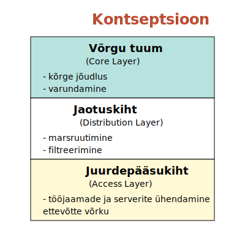

# Teema 14: Kolmetasandiline Võrguarhitektuur

Räägime sellest, kuidas võrgud tegelikult ehitatud on. See on selline praktiline teema - kuidas ühendada seadmeid, kuidas ehitada võrke ja isegi see, kuidas neid õigesti kappidesse paigutada.

## Kust see kontseptsioon tuli?

Kogu see lugu sai alguse Cisco'st. Nad tulid välja selle kolmetasandilise mudeliga ja nüüd, ausalt öeldes, kasutavad seda kõik tootjad ühel või teisel moel. Aga vaatame, mis need tasandid siis on.

### Juurdepääsutase
Teate, see on kõige alumine tase - siia ühenduvad teie töökohad ja mõnikord serverid. Kuigi kui teil on mingi kiire server, siis pole tal seal eriti midagi teha. Pigem on see kasutajate jaoks - arvutid, telefonid, võrgupääsupunktid. Lihtsad L2 kommutaatorid teevad siin oma tööd.

### Jaotustase
Siin läheb asi juba huvitavamaks. Teate, siin püütakse L2 asjad ära lõpetada ja hakata pakette marsruutima. Siin saab ka teha igasugu nutikaid asju - näiteks anda eelise teatud pakettidele. Näiteks kui teil on häälkõned, siis need peaksid ikka kiiresti läbi minema.

### Tuumiktase
See on nagu kiirtee - peab suutma väga kiiresti pakette marsruutida. Kui räägime ettevõtte võrgust, siis siin võivad olla ühendused teiste filiaalidega või mingi suur serveripark. Tihti see tuumik ja jaotustase tegelikult sulanduvad kokku - see pole mingi range reegel, et kõik peab just nii olema.

[Source: Network Layer Architecture](https://www.fibermall.com/)

Praktikas näeb see välja nii - madalaimal tasemel on meil L2-kommutaatorid, millega on ühendatud kasutajad. Jaotustasemel kasutame L3-kommutaatoreid, kuna need suudavad marsruutida liiklust. See tähendab, et siia saabuvaid pakette saavad nad edastada nii marsruutimise kui ka kommuteerimise abil.

[Read more on Core, Distribution, and Access Layer](https://www.fibermall.com/blog/core-distribution-and-assess-layer.htm#)

Tuumiku tasemel on kujutatud L3-kommutaatorid, mis on ühendatud omamoodi "virtuaalseks kiirteeks". See on väga kiire seade - näiteks  6500 kommutaatorit. See oli omal ajal tüüpiline tuumik. Kui sellesse panna palju juurdepääsukaarte (kõik mäletavad seda suurt kommutaatorit nagu kast, milles on palju "terasid"), olid sellised kommutaatorid väga populaarsed.

Need võisid põhimõtteliselt olla tõeline "ämber", ja kuna neisse sai niimoodi plaate lisada, said nad olla nii tuumik, jaotus kui ka juurdepääs. Sest kui need plaadid on kiired, võivad need ühenduda serveritega, aga oli ka aeglaste portidega plaate, millega sai ühendada kasutajaid. Tekib küsimus - kus siin on juurdepääs, kus jaotus, kus tuumik? Kõik on koos.

[Source: Gigabit LAN Switch](http://www.gigabitlanswitch.com/)

Pange tähele, et serverite juurdepääsutase on ka - paar kiireveolise kommutaatorit, millega on ühendatud serverid. Ja kommutaatorid pole tavalised - mäletate, kui ma rääkisin teile erinevusest: ühel on 48 porti ja teisel sama palju, üks maksab nii palju, teine nii palju? Sest ühed pordid on "ausad", teised mitte nii "ausad". Palju sõltub ka sellest, milliseid tehnoloogiaid saab kasutada.

Kui räägime L2-st, lähtume sellisest mudelist. Hiljem, kui räägime agregeerimisest ja kommutaatorite ühendamise võimalustest, räägin teile, kuidas seda saab veel paremini teha. Lõppude lõpuks, kui te panete siia L3-kommutaatorid ja L2 asemel, miski ei takista teil teha täielikku L2-segmentide minimeerimist, nii et marsruutimine toimuks kõigil kolmel tasemel.

Tegelikult sõltub see ülesandest ja sellest, kuidas te lähenete. Aga see mudel on põhimõtteliselt kõigil olemas ja tavaliselt, kui räägitakse võrgu ehitamisest, püütakse seda nii üles ehitada.

Ka operaatorvõrgud on samamoodi üles ehitatud, lihtsalt see sama lugu on neil pikuti välja venitatud. Teil on sideühendused, nendel on mingid tuumikkommutaatorid, magistraalkommutaatorid, mis on omavahel ühendatud. Nendega ühendate juba mingi jaotuse ja sealt lähevad lingid kasutajateni. See tähendab, et teie kommutaator, mis ripub trepikodades (Telia, Elisa), on põhimõtteliselt juurdepääsutas.

[Source: Pinterest](https://www.pinterest.com/)

Vaatamata sellele, et enterprise ja teenusepakkuja tunduvad erinevad asjad, on need üldiselt sarnased. Tasemed on umbes samad, tehnoloogiad võivad olla erinevad.

[Source: Huawei Forum](https://forum.huawei.com/enterprise/)

Kui vaatate mõnda suurt andmekeskust, siis seal on tavaliselt kolm populaarset lähenemist:

1. **ToR ehk "Top of Rack"**
   Kujutage ette, et iga kapi ülaosas on kommutaator. See on praegu kõige populaarsem - umbes 50% juhtudest. Miks? Sest see on paindlik ja lihtne hallata.

2. **Tsentraliseeritud**
   See on selline "kõik ühes kohas" lähenemine. Umbes 25% kasutab seda. Vahel on see lihtsalt mõistlikum - eriti kui teil pole nii palju seadmeid.

3. **Rea keskel või lõpus**
   Mõned panevad kommutaatorid rea keskele või lõppu. See pole nii levinud, aga mõnes olukorras võib just see olla õige valik.

## Praktiline võrgu ülesehitus

Vaadake, kuidas see füüsiliselt välja näeb. Kui teil on kaks kommutaatorit, mis on serveritega ühendatud, siis veel parem on, kui need kaks kommutaatorit on omavahel ühendatud ja moodustavad ühtse terviku - see on tõesti elegantne lahendus! Aga noh, igaühele oma maitse, eks?

### Igapäevane reaalsus

Te võite nüüd mõelda, et me räägime mingist suurest andmekeskusest, mida te kunagi ei näe. Aga võtame täiesti tavalise olukorra: keegi paneb püsti uue võrgukapi ja ütleb, et sinna on vaja kolm ühendust. Mina tavaliselt küsin: "Aga mis siis, kui hiljem on vaja rohkem ühendusi? Äkki paneme kohe ühe kommutaatori üles ja tõmbame ühe optilise kaabli? Siis saame hiljem lihtsalt kõik sinna ühendada."

See on klassikaline dilemma: kas vedada 24 eraldi kaablit kuhugi kaugel asuvasse kommutaatorisse või panna üks kommutaator kohapeale ja vedada ainult üks-kaks optilist kaablit? Tasub alati läbi mõelda!

[Source: UTM ePortfolio](https://eportfolio.utm.my/)

### Kaabeldus hoones

Hoones on kaks põhilist kaabelduse tüüpi:
- Horisontaalne: kui te liigute mööda korrust
- Vertikaalne: kui te liigute korruste vahel

Meil võib olla keskne L3 kommutaator, millest lähevad ühendused otse igale kasutajale läbi patch-paneelide. See on tsentraliseeritud lähenemine. Aga te võite ka panna kommutaatorid igale korrusele - see on paindlikum ja võib-olla vajate vähem kaableid. Mõelge sellele - kas on mõistlikum puurida 30 auku ja vedada kaableid või panna üks kommutaator ja vedada paar optilist kaablit? Muidugi, kommutaator maksab ja vajab optilist moodulit, aga see on kaalumise koht.

## Päris elu näpunäited

Kui hakkate oma võrku planeerima, siis mõelge alati natuke ette. Näiteks kui panete uut kappi püsti ja keegi ütleb, et sinna on vaja kolm ühendust, küsige endalt - kas hiljem võib neid rohkem vaja minna? Võib-olla on mõistlikum kohe üks kommutaator sinna üles panna?

## Oluline lisainfo

Ja veel üks asi - tänapäeva hoone pole lihtsalt arvutivõrk. Seal on:
- Traadita võrk
- Turvakaamerad
- Ukselukkude süsteemid (need sõrmejälje ja silmaiirise lugejad)
- Tulekahjusignalisatsioon
- Ventilatsioonisüsteemid
- Kliimaseadmed

Kõik need asjad vajavad võrguühendust! Seega kui teil on võimalus võrku planeerida, proovige mõelda kõigile neile asjadele korraga. See on päris keeruline inseneeria ülesanne, aga kui õnnestub, siis on tulemus palju parem kui igaühe jaoks eraldi võrgu ehitamine.

See on muidugi ideaal - harva õnnestub kõik nii ilusasti kokku panna. Aga püüelda tasub selle poole küll!

[Watch on YouTube: Rack & stack" a full rack for a customer at our data centre](https://www.youtube.com/watch?v=pLBYulLueQo)