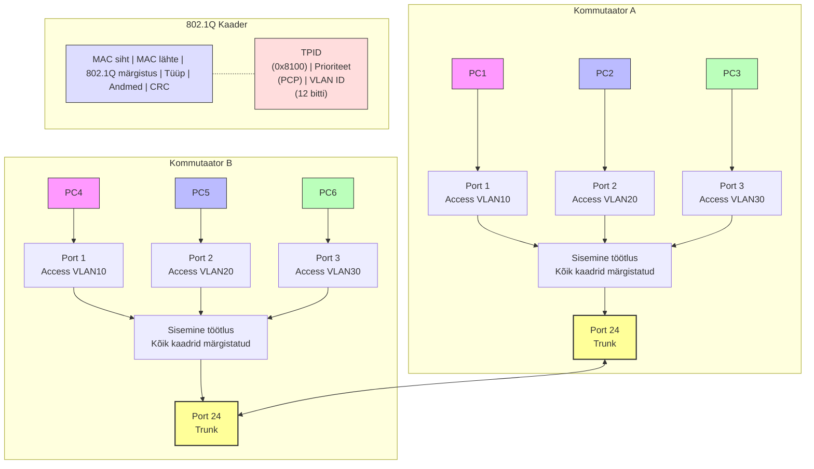
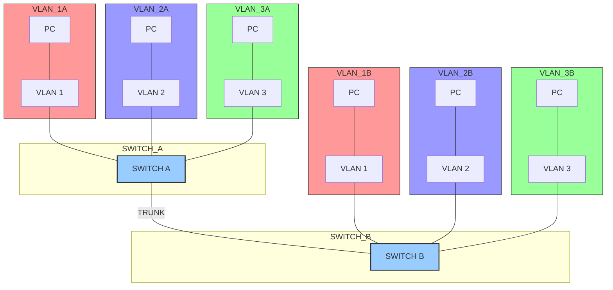
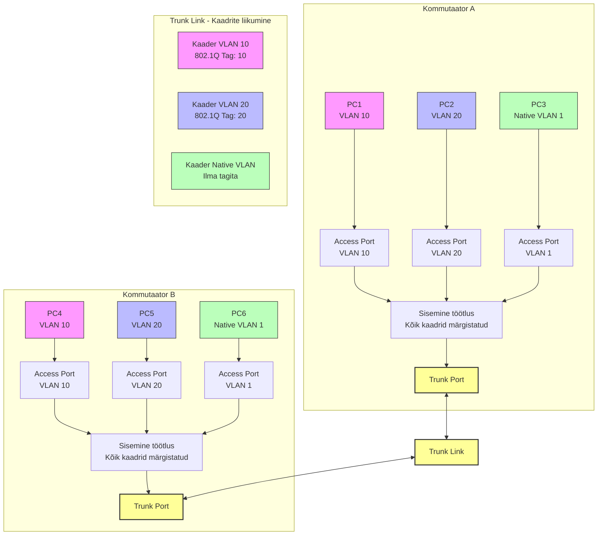
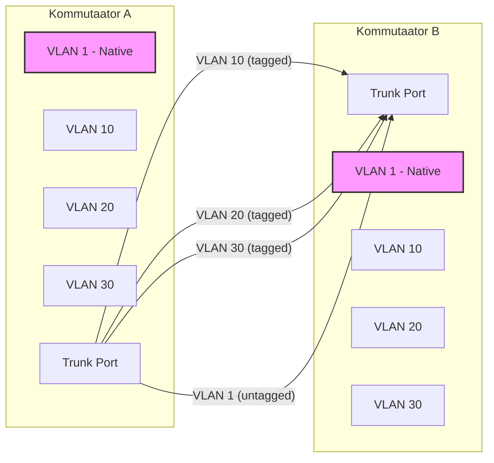
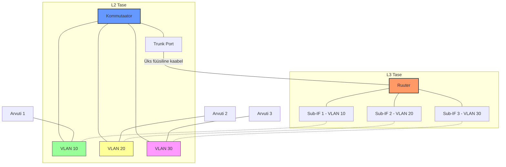
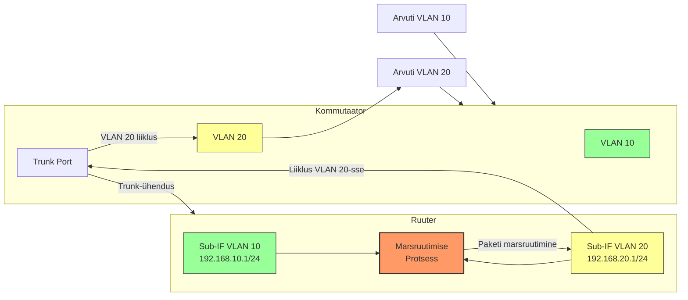

# Teema 15: Mis on VLAN 802.1Q ? Part 1

## Sissejuhatus VLAN-idesse

[](https://www.fibermall.com/blog/wp-content/uploads/2023/01/VLAN-based-on-ports-e1673424252499.png)

Divide VLAN based on ports

Source: [FiberMall](https://www.fibermall.com)


VLAN (Virtual Local Area Network ehk virtuaalne kohtvõrk) on tehnoloogia, mis võimaldab võrguadministraatoritel luua füüsilise kommutaatori siseselt loogilisi jaotusi. See loob efekti, nagu kasutataks mitut eraldiseisvat kommutaatorit, kuigi tegelikult kasutatakse ainult ühte füüsilist seadet.

**Peamised põhjused VLAN-ide kasutamiseks:**

1. **Haldamise mugavus** - Seadmete loogiline organiseerimine sõltumata nende füüsilisest asukohast
2. **Turvalisus** - Tundlike võrkude eraldamine (nt raamatupidamisosakond) teistest võrkudest
3. **Leviedastusliikluse vähendamine** - Väiksemad leviedastusdomäänid vähendavad ebavajalikku võrguliiklust

Näiteks selle asemel, et vajada eraldi füüsilisi kommutaatoreid raamatupidamis-, turundus- ja IT-osakondade jaoks samas kontoris, võimaldavad VLAN-id kasutada ühte kommutaatorit, kuid liiklus on täielikult eraldatud, justkui oleksid seadmed ühendatud erinevate füüsiliste kommutaatoritega.

[](https://www.fibermall.com/blog/wp-content/uploads/2023/01/Divide-VLANs-based-on-MAC-address.png)

Divide VLANs based on network layer protocols

Source: [FiberMall](https://www.fibermall.com)


## Pordipõhised VLAN-id

Varaseimad VLAN-i implementatsioonid põhinesid portidel. Selles lähenemises:

- Kommutaatori administraator määrab iga füüsilise pordi konkreetsele VLAN-ile
- Kaadrid saab edastada ainult portide vahel, mis kuuluvad samasse VLAN-i
- Leviedastuskaadrid saadetakse ainult sama VLAN-i portidele

See loob loogilise eraldatuse, kus eri VLAN-idesse ühendatud seadmed ei saa omavahel otse suhelda, kuigi nad on ühendatud sama füüsilise kommutaatoriga.

Pordipõhises konfiguratsioonis, kui pordid 1-2 on VLAN 1-s, pordid 3-4 on VLAN 2-s ja pordid 5-8 on VLAN 3-s, siis:
- Leviedastus pordist 1 jõuab ainult pordini 2
- Leviedastus pordist 3 jõuab ainult pordini 4
- Leviedastus pordist 5 jõuab portideni 6, 7 ja 8

See vähendab oluliselt leviedastusliiklust. Näiteks 24 pordiga ja kahe arvutiga, millest kumbki saadab 10 leviedastust:
- Ilma VLAN-ideta: 24 porti × 20 leviedastust = 480 kaadrit
- VLAN-idega (jagatuna kaheks 12-pordiseks VLAN-iks): (12 porti × 10 leviedastust) × 2 = 240 kaadrit

[](https://images.squarespace-cdn.com/content/v1/5d3c73c906ac510001158d1b/1618528223782-MLF9Q4FKTBOQPWQKR93O/Understanding+VLANs+and+Network+Layers.png?format=2500w)

Understanding VLANs and Network Layers

Source: [Squarespace](https://squarespace.com)


## ROAS (Router on a Stick)

Kujutame ette, et meil on marsruuter, millel on kaks liidest:
- Esimene liides: 10.10.10.1/24
- Teine liides: 10.10.20.1/24

Traditsioonilises konfiguratsioonis on need liidesed ühendatud eraldi võrkudesse, kuid meie näites on need ühendatud ühte kommutaatorisse.

Mõlemad IP-aadressid töötavad ühel füüsilisel liidesel. Selle tulemusel on kommutaatorisse ühendatud kasutajad, kuid L3 vaatepunktist näeb see välja nii, nagu marsruuter oleks ühendatud kahte eraldi võrku:
- Võrk 1: 192.168.0.0/24
- Võrk 2: 10.10.0.0/24

## Ühenduse loogika

Põhiprintsiip on lihtne - kaks eraldi võrku töötavad ühe füüsilise liidese kaudu. See tähendab, et marsruuteri üks füüsiline port suudab teenindada mitu loogilist võrku.

## Alternatiivsed lahendused

On kaks põhilist alternatiivset lahendust:

1. **Eraldi füüsilised liidesed:** Võime luua teise liidese vastavate aadressidega ja ühendada need kommutaatoriga.

2. **Kommutaatori loogiline jagamine:** Võime jagada kommutaatori loogiliselt osadeks, kus iga osa on täielikult eraldatud teistest.

## VLAN-ide roll

[Presentation Slide Deck on Native VLAN](https://slideplayer.com/slide/13554705/)


Kuigi see näide pole ideaalne, illustreerib see ideed, kuidas üht füüsilist seadet (kommutaatorit) saab jagada mitmeks loogiliseks üksuseks, mis töötavad täiesti eraldi, justkui oleks tegemist mitme eraldi kommutaatoriga.

## Pordipõhiste VLAN-ide jätkame

## Loogika ja toimimine

Kui rakendame sellist lahendust, siis tegelikult näeb see välja nagu kolm kommutaatorit, kuid loogiliselt on see üks kommutaator. Pordipõhised VLAN-id kannavad seda nimetust, sest me toetume pordipõhisele loogikale. Me ütleme, et meie pordid (teatud numbritega) kuuluvad ühte loogilisse gruppi, kus igaühel neist on oma MAC-tabel.

Kaadrid ühest segmendist ei lahku sellest segmendist, isegi mitte leviedastuskaadrid (broadcast). See tähendab, et leviedastus ühest segmendist ei jõua teise segmenti. Need segmendid ei saa omavahel mingil moel suhelda. See on väga kasulik funktsioon.

## Leviedastusliikluse vähenemine

[](https://www.networkacademy.io/sites/default/files/inline-images/LAN%20on%20multiple%20switches.gif)

Having that in mind, if we connect two default setting switches, as shown in figure 1, any broadcast frame received by either switch is forwarded to the other one and then out all its ports.

Source: [Network Academy](https://www.networkacademy.io)

Siin on struktureeritud ja teksti lisatud versioon, mis selgitab arvutusi ja VLAN-i kasutamise eeliseid:

---

### Leviedastuste arvutamise näide

Vaatleme olukorda, kus meil on 24-pordiga kommutaator ja kaks arvutit, mis saadavad kumbki 10 leviedastust. Ühes võrgus tähendab see, et igas pordis liigub kokku 20 leviedastust, mis annab 24 porti korral 480 kaadrit. Kui aga jagame võrgu kaheks loogiliseks osaks (näiteks VLAN-ide abil), jaguneb 24 porti kaheks 12-pordi segmentiks. Iga segment on iseseisev ja ühes segmentis saadab üks arvuti 10 leviedastust, mis annab 12 porti korral 120 kaadrit. Kogu võrgu liiklus jagatud segmentides on seega 120 + 120 = 240 kaadrit – kaks korda vähem kui algses ühes võrgus.

| Kirjeldus                                | Pordide arv | Leviedastused (arvuti kohta) | Arvutatud kaadrite arv         |
|------------------------------------------|-------------|------------------------------|--------------------------------|
| **Ühes võrgus (24 porti)**               | 24          | 2 × 10 = 20                  | 24 × 20 = **480 kaadrit**       |
| **Jagatud võrk (2 segmenti, 12 porti igaüks)** | 12 (iga segment) | 1 arvuti × 10 = 10          | 12 × 10 = **120 kaadrit** (iga segment) |
| **Kokku jagatud võrgus**                 | 24          | –                            | 120 + 120 = **240 kaadrit**     |

---

### VLAN-i kasutamise eelised

VLAN-i kasutamine võimaldab võrke loogiliselt jaotada, mis toob kaasa mitmeid eeliseid:

| Eelis                         | Selgitus                                                                 |
|-------------------------------|--------------------------------------------------------------------------|
| **1. Mugav võrkude jaotamine** | Võimaldab lihtsasti jagada füüsilised seadmed loogilisteks segmentideks.  |
| **2. Leviedastusliikluse vähendamine** | Väiksemad segmentid vähendavad leviedastuste arvu, mis parandab võrgu jõudlust. |
| **3. Suurem turvalisus**      | Loogiline eraldamine tagab parema turvakontrolli ja piirab volitamata juurdepääsu. |

---

Kokkuvõttes näitab see näide, kuidas väiksemateks segmentideks jagades saab märkimisväärselt vähendada leviedastusliiklust ning pakkuda samal ajal paremat võrgu struktuuri ja turvalisust. VLAN-id võimaldavad seega võrguressursside paremat juhtimist ja optimeerimist, mis võib oluliselt kaasa aidata üldise võrgutõhususe parandamisele.


# Kuidas ühendada kommutaatoreid? Trunk-kontseptsioon

Järgnev diagramm illustreerib VLAN-ide liikumist trunk-pordi kaudu kommutaatorite vahel ja 802.1Q märgistuse töötamist:

## Kommutaatorite ühendamise probleem

Meie näites on kaks gruppi (VLAN 1 ja VLAN 2). Järelikult peame eraldama iga grupi jaoks eraldi pordi ja ühendama kommutaatorid nende portidega. Siis saab grupp 1 suhelda teise kommutaatori grupiga 1 ja grupp 2 saab suhelda teise kommutaatori grupiga 2.

Seega, kui meil on VLAN 1, ühendame selle ühe pordiga, ja VLAN 2 ühendame teise pordiga. Kuid siit tekib küsimus - mis juhtub, kui meil on 24 VLAN-i? On selge, et sellise kontseptsiooniga me kaugele ei jõua.

Alguses nii see oligi - kuni VLAN-e oli kaks või kolm, sai niimoodi töötada. Kuid kui nende arv suureneb, ei saa te sel viisil kommutaatoreid ühendada.

[](https://www.networkacademy.io/sites/default/files/inline-images/VLANs%20on%20multiple%20switches%20without%20trunk.gif)

Using VLANs, a switch topology can be segmented into multiple broadcast domains—such as assigning ports 1–4 to VLAN 10 and ports 5–9 to VLAN 20—but this design doesn’t scale well because each VLAN requires a dedicated physical link between switches.

Source: [Network Academy](https://www.networkacademy.io)


## Magistraalide kontseptsioon (Trunk)

Sõna "trunk" võis teile varasemalt tuttav olla raadiosidest või mujalt. Sealt on näha, et tegemist on sidespetsialistide terminiga. Idee on sarnane - kasutada üht ühendust (link) kommutaatorite vahel paljude erinevate VLAN-ide edastamiseks.

Niipea kui hakkame neid ühes ühenduses edastama, tekib küsimus: kuidas teha nii, et need ei segaks üksteist? Kui edastate kaadri lihtsalt ühes ühenduses, pole teisel pool selge, millisesse gruppi see kuulub.

[](https://www.networkacademy.io/sites/default/files/inline-images/VLANs%20on%20multiple%20switches_0.gif)

The link between switch 1 and switch 2 is a trunk link and you can see that both VLAN 10 and VLAN 20 pass through the link.

Source: [Network Academy](https://www.networkacademy.io)

## 802.1Q standard (Trunking protocols)

802.1Q kontseptsioon - see on tegelikult üldnimetuseks muutunud (inglise keeles kõlab see sageli kui "dot1Q" ehk ".1Q"). Sidesüsteemide spetsialistid räägivad sageli just sel viisil. Võite öelda, et "mis port see on? Andke meile dot1Q port" - nii öeldaksegi ja mõeldakse sellega trunk-porti.

Mõnikord juhtub seadmete seadistamisel, kui valite kapseldusrežiimi, et seal on kirjas "802.1Q". See viitab alati trunk-portidele, ka mõõteseadmetes. Seetõttu peab mõiste "802.1Q" olema tihedalt seotud sõnaga "trunk".

## Kuidas see töötab?

[](https://www.networkacademy.io/sites/default/files/inline-images/802.1q%20header.png)

Ethernet frame tagged with 802.1q header

Source: [Network Academy](https://www.networkacademy.io)


Tuleme selle juurde, kuidas see kõik tegelikult töötab. Otsustati standardiseerida ja öeldi: "Lisame siia, meie MAC-aadresside ja tüübivälja (Type field) vahele paketi Ethernet-kaadris ühe lisavälja."

Meie kaks päist - esimene on MAC ja teine on tüüp. Tüübis on tavaliselt kirjas 0x0800, mis tähendab, et seal asub IP-pakett.

Otsustati lisada veel üks väli, mida nimetatakse Tag'iks (sildiks või märgiseks). Millest see koosneb?
- Tag Protocol Identifier (TPID) - protokolli identifikaator
- Tag Control Information (TCI) - kus kõige olulisem on VLAN ID bittide väli, milleks on eraldatud 12 bitti

Siin edastataksegi meie VLAN-i number. Kui neid on 12 bitti, siis VLAN-id nummerdatakse 1 kuni 4096.

[](https://www.researchgate.net/profile/Rute-Sofia/publication/224392603/figure/fig7/AS:668490671325192@1536392004611/Frame-formats-for-8021q-8021ad-PB-8021ah-PBB.png)

Frame formats for 802.1q, 802.1ad (PB), 802.1ah (PBB).

Source: [ResearchGate](https://www.researchgate.net)

Samuti on 802.1Q märgistuses prioriteedibidid (PCP), mis näitavad, et kui see on mingi kriitilise tähtsusega liiklus (tavaliselt hääl ja telefoniside), siis tuleks seda edastada esimeses järjekorras. See on sisuliselt Quality of Service'i (QoS) abimehhanism. Me seda loengutes pikemalt ei käsitle, kuid teadke, et need bitid võimaldavad liiklust prioritiseerida isegi kommutaatorites.

## Kuidas märgistus töötab?

[](https://www.networkacademy.io/sites/default/files/inline-images/VLAN-Tagging.gif)

Example of VLANs tagging

Source: [Network Academy](https://www.networkacademy.io)


Vaadake, TPI ja TCI väljad paiknevad täpselt samas kohas, kus tavaliselt asub Type väli. Need praktiliselt dubleerivad seda. Siin on TPID, mis ütleb, et "jah, see on märgistatud kaader" ja et peale seda välja tuleb konkreetne VLAN number, mitte mõni protokoll.

Põhimõtteliselt asendatakse Type väli spetsiaalse väljaga, mis ütleb: "Vaata, edasi ma annan sulle veel VLAN numbri ja alles seejärel algab tavapärane kaader." Muide, siin on kirjas 0x8100, mis tähistab märgistatud Ethernet kaadrit.

Sellise kaadritüübi saamisel mõistab kommutaator, et seal on VLAN märgistus, ja saab lugeda selle numbri, et teada, millisesse gruppi või millisesse VLAN numbrisse antud kaader kuulub.

## 802.1Q märgistuse komponendid

| Komponent | Ingliskeelne nimetus | Kirjeldus |
|-----------|----------------------|-----------|
| **TPID** | Tag Protocol Identifier | Märgistamise protokolli identifikaator.<br>802.1q puhul kasutatakse väärtust 0x8100. |
| **TCI** | Tag Control Information | Väli, mis kapseldab prioriteedi, kanoonilise formaadi ja VLAN identifikaatori välju. |

## TCI välja komponendid

| Komponent | Ingliskeelne nimetus | Kirjeldus |
|-----------|----------------------|-----------|
| **Prioriteet** | Priority | Prioriteet. Kasutatakse IEEE 802.1p standardit edastatava liikluse prioriteedi määramiseks. |
| **CFI** | Canonical Format Indicator | Kanoonilise formaadi indikaator.<br>Näitab MAC-aadressi formaati:<br>0 — kanooniline (Ethernet kaader)<br>1 — mitte-kanooniline (Token Ring, FDDI kaader). |
| **VID** | VLAN Identifier | VLAN identifikaator.<br>Võimalike väärtuste vahemik on 0 kuni 4094. |

## Erinevused tootjate vahel

Erinevad tootjad nimetavad 802.1Q märgistust erinevalt:
- Cisco, Juniper, Huawei: nimetavad seda "trunk"
- D-Link, ZyXEL, HP: nimetavad seda "tagged" või "T-tagged"

Märgistamata porte kutsutakse Cisco, Juniper, Huawei terminoloogias "access" ja D-Link, ZyXEL, HP terminoloogias "untagged" või "untag".

Mõnikord juhtub, nagu HP kommutaatorite puhul, et üks on sarnane D-Link'ile ja teine Huawei'le. Seega olenevalt sellest, millega tegemist on.

Kui seadistate porte, siis lõppseadmetega ühendatud pordid seadistatakse kui "untag" või "access". See tähendab, et kommutaator võtab vastu ilma märgistuseta kaadri - teie seadmed ei saada märgistusega kaadrit.

[](https://filedb.experts-exchange.com/incoming/2020/01_w03/1440769/vlan5.PNG)

Cisco SLM2024 vlan management

Source: [Experts Exchange](https://www.experts-exchange.com)


Kui need kaadrid saabuvad kommutaatorisse, lisatakse neile märgistus ja need liiguvad edasi koos selle märgistusega kommutaatori sees. Kui nad jõuavad trunk-magistraali, liiguvad need kõik koos üksteise järel selles järjekorras, milles need sinna sattusid.

Kuna kaadrites on märgistus (tag), on võimalik need tagasi õigetesse pordigruppidesse suunata. Kui kaader väljub access-pordist, eemaldatakse märgistus, sest tavaline arvuti ei suuda märgistusega kaadrit lugeda. Seetõttu peab märgistuse eemaldama.

## Kommutaatori konfiguratsioon

Oluline on teada, et kommutaator ei võta niisama kõiki VLAN-e vastu. Tal on oma põhiandmebaas, ja kui loote VLAN-id 1, 2 ja 3, siis ta võtab vastu märgistusi 1, 2 ja 3. Kui te ei loo sellist kirjet, st kui te ei ütle talle, et ta peaks töötlema märgistusi numbritega 1, 2, 3, siis ta seda ei tee.

Kommutaatoritel võivad olla piirangud. Näiteks mõni "light" seeria võib öelda, et saate määrata suvalised VLAN-numbrid, kuid neid ei tohi olla rohkem kui 16. Need võivad olla ükskõik millised numbrid, näiteks 100, 200, 1050, kuid ainult 16 tükki - 17ndat ta teile lisada ei lase. See sõltub litsentseerimisest ja versioonidest.

## Vaikimisi VLAN (VLAN 1)

[](https://www.flackbox.com/wp-content/uploads/2017/09/word-image-20.png)

The Default VLAN – VLAN 1

Source: [Flackbox](https://www.flackbox.com)


Pöörake tähelepanu, et VLAN 1 on karbist välja võetud kommutaatoril kõikides portides vaikimisi aktiveeritud, olenemata tootjast. See tähendab, et kõik pordid on access-režiimis esimeses VLAN-is. See on loodud vaikimisi, ja kui mingi kaader sinna saabub, elab see kommutaatori sees juba alati märgistusega.

Kogu seda infot on vaja seedida. Kommutaator töötab seesmiselt märgistustega. Kui võtate ta karbist välja, on kõik pordid VLAN 1-s. Teile tundub, et see on üks tervik, et kommutaator ja pordid pole seadistatud, et need on kõik omavahel ühenduses. See on õige, kuna vaikimisi seadistus on tavaliselt kõik pordid esimeses VLAN-is, kuid sisemiselt liiguvad need kõik märgistustega ja kõik on märgitud number ühega.

## ISL (Inter-Switch Link) - Cisco protokoll

IEEE 802.1Q ei ole ainus võimalus VLAN-ide kapseldamiseks. Cisco lõi omal ajal tehnoloogia nimega ISL (Inter-Switch Link), mis eksisteeris enne 802.1Q standardi tekkimist.

## Praktiline tähtsus konfigureerimisel

Kui te tulevikus seadistate oma laborites ja kodutöödes VLAN-e, peate sageli määrama kapselduse tüübi. Selleks on käsk `encapsulation dot1q`, mille järel võib tekkida küsimus: miks peab täpsustama, kuidas VLAN-e kapseldada, kui standard on juba olemas?

Põhjus seisneb selles, et Cisco-l oli oma ISL kapseldamise tehnoloogia. Kuigi tänapäeval seda enam laialdaselt ei kasutata, küsib seade pordi seadistamisel ikkagi teilt, mida kasutada - vana ISL-i või kaasaegsemat dot1Q-d. Peate seda iga kord täpsustama, sest ajalooliselt eksisteerisid erinevad variandid.

## Ajaloolised märkused

ISL oli Cisco proprietaarne protokoll, mis täitis sama funktsiooni mida tänapäeval täidab 802.1Q standard. Kuigi seda enam aktiivselt ei kasutata, on teadlikkus sellest oluline, eriti kui töötate vanemate Cisco seadmetega või kohtate viiteid sellele konfiguratsiooni dokumentides.

Tänapäeval on 802.1Q universaalne standard, mida toetavad kõik võrguseadmete tootjad, samas kui ISL jääb Cisco ajaloo osaks.

## Põhi-VLAN (Native VLAN) - Kommutaatori sisene töötlemine

Kommutaatori sees edastatakse kõiki VLAN-e märgistustega (tag). See tähendab, et kommutaator töötleb sisemiselt kõiki kaadreid koos märgistustega.

Kui te teete laboritööd, näitasin teile, et tegelikult on MAC-tabelis külgedel näidatud VLAN-ide numbrid. Kui vaatame siit, näeme, et see on VLAN 1 ja see MAC-aadress tuleb VLAN 1-st. Või näiteks näete, et siin on MAC-aadress VLAN 10 või 11 jaoks.

Kommutaator töötleb kõiki kaadreid alati märgistustega. Isegi kui võtate täiesti uue, seadistamata kommutaatori, millel on kõik pordid VLAN 1-s, ja kui kõik pordid on access-režiimis ning kaader satub kommutaatorisse, lisab kommutaator sellele märgistuse. See tähendab, et sisemiselt töödeldakse kõike ikkagi märgistustega.

Lihtsalt kui kommutaator on karbist välja võetud, on VLAN 1 seal alati olemas ja hiljem hakkate lisama oma VLAN-e.

### Native VLAN kontseptsioon

Näitel on kujutatud VLAN-id 30, 20, 10 ja 1, ning siin tahetakse arutada sellist mõistet nagu "Native VLAN" (põhi-VLAN).

VLAN-ide kaadrid saabuvad ilma märgistuseta access-portidesse ja edastatakse trunk-ühenduses märgistustega. Kuid on võimalik määrata selline VLAN, mida edastatakse trunk-ühenduses ilma märgistuseta. Sellele VLAN-ile ei lisata märgistust ja selline VLAN saab olla ainult üks.

Me ütleme, et "seda VLAN-i võib edastada ilma märgistuseta". Vaikimisi seadistustes on see tavaliselt VLAN 1, kuid mõnikord saab määrata ka mingi muu numbri, mis on teile sobiv.

Mõnikord püütakse asendada VLAN-i numbrit, mis pole alati hea idee, eriti kui jutt käib spanning-tree protokollidest, mis lahendavad silmuste probleeme. Kuid mõnikord seda tehakse.

### Näide

Näiteks siin väljub see kui VLAN 1, aga siin seadistame kommutaatoril ja ütleme, et põhi-VLAN on näiteks VLAN 204. Vastavalt sellele:
- Siit väljub kaader ilma märgistuseta
- Kui see saabub teise kommutaatorisse, lisatakse sellele teise VLAN-i märgistus

Sellist lähenemist kasutatakse mõnikord, kui on vaja muuta VLAN-i numbrit trunk-ühenduses. Ülejäänud VLAN-id edastatakse oma numbrite all ja töödeldakse kommutaatori sisenemisel.

## Olulised tähelepanekud

Oluline moment on see, et selleks, et kommutaator saaks trunk-ühenduse kaudu VLAN-e vastu võtta, peab see VLAN olema kommutaatori VLAN-ide andmebaasis olemas. See tähendab, et kui valite kommutaatori, millel on ainult VLAN 1, siis seni, kuni te ei lisa VLAN-ide andmebaasi numbreid, millega töötate, ei saa seade nendega töötada.

Kommutaatorile tuleb "selgitada", milliseid VLAN-e ta peaks töötlema. Lisaks räägime hiljem, et trunk-ühenduse seadistamisel saate keelata/lubada teatud VLAN-ide vastuvõtmist. See on konfigureeritav - saate otse määrata, milliseid VLAN-e vastu võtate. Nii me ka seadistame oma labori- ja kodutöödes.

## VLAN-ide piirangud

Veel üks asi, mida võib märkida - on kommutaatoreid, millel on piiratud VLAN-ide arv. On teatud piiratud versioonid või lihtsustatud litsentsid, kus näiteks öeldakse, et võite kasutada ükskõik millist VLAN-i numbrit, kuid mitte rohkem kui 16 VLAN-i. Võib tunduda, et see on palju, kuid mõnikord on see vähe. Näiteks ettevõtetes on tavaline olukord, kus ühes kommutaatoris võib olla 30-40 VLAN-i.


## Marsruutimine VLAN-ide vahel. ROAS.

Võib öelda, et need on eraldi võrgud; võiksin isegi öelda, et need on kolm eraldi kommutaatorit, kuhu on ühendatud meie eraldi kasutajad.

Need kasutajad saavad omavahel töötada ühe võrgu piires, kuid nad ei saa suhelda üksteisega, sest ilmselgelt on nad ühendatud võrgu erinevatesse segmentidesse laialt leviedastuse mõttes.

Tehniliselt on see üks seade, kuid loogiliselt näeb see välja nagu erinevad võrgud, mis ei saa kunagi üksteisega ühendust.

Ühenduse loomise küsimus on alati marsruutimine. Pidage meeles, et ühest võrgust väljumiseks ja teise sisenemiseks on vaja marsruutimist.

### Router on a Stick (ROAS)


Image Source: [GeeksforGeeks](https://www.geeksforgeeks.org/)

Selleks on vaja kas ruuterit või L3 kommutaatorit. Meil on siin ruuter, ma ei räägi L3 kommutaatoritest, räägime neist hiljem. Siin on kujutatud skeem, mida sageli nimetatakse "ruuter kepil" või "router on a stick".

Pange tähele, et siin on L2 skeem ja siin on L3 skeem. Nagu ma juba mainisin, et võrgu toimimise mõistmiseks peab alati olema kaks vaadet sellele. L2 näitab, kuidas me oleme füüsiliselt ühendatud, L3 näitab, kuidas see toimib loogiliselt.

Ruuterisse läheb trunk-kaabel. See on üks kaabel, füüsiliselt mitte kolm, vaid üks. Need on lihtsalt kujutatud erinevate VLAN-idena ja erinevate ühendusliinidena, et teil oleks arusaadav, et need on kaadrid erinevate VLAN-i numbritega, erinevalt värvitud ruuteril.

Need ühendusliinid on koondatud kolme liideseks, iga VLAN-i jaoks eraldi. On selge, et ruuteril on need otseselt ühendatud võrgud.

Kui ruuter teab kõigist kolmest võrgust, tähendab see, et paketid marsruuditakse nende vahel ühes ja teises suunas, sest ta teab, et on otseselt ühendatud kõigi kolmega.

Seega saab toimuda marsruutimine. Seetõttu suunatakse ühest VLAN-ist pärit paketid, mis jõuavad vaikimisi lüüsile ruuteris, teise VLAN-i ja vastupidi.

Märgin veel kord, et skeemi nimetatakse "router on a stick", kus ruuter ühendub mitme VLAN-iga ja teostab nende vahel marsruutimist.

### Alternatiivid ja kaalutlused

See pole alati mugav, sest vaadake - teie link hakkab koormatud olema voogudega ühes ja teises suunas. Hakkate koormama lihtsalt üht linki voogudega edasi-tagasi. Lahkute kommutaatorist ja marsruudite, see pole alati hea, kui teil on läbilaskevõime piirangud. Tavaliselt püütakse vältida selliseid kõrge koormusega linke.

Miski ei takista meil võtmast ruutereid ja neid ühendamast lihtsalt kolme füüsiliselt erineva lingiga, igaühes oma VLAN. See on selge, et võtame ruuteri ja teeme sellised eraldi ühendused - access pordid, ilma trunk-ita - määrame neile kolmele IP-aadressile igaühele eraldi pordile.

Aga me teame kulusid, mäletate, kui näitasin, et ruuteritel pole nii palju liideseid ja neid on üsna vähe, seega püütakse alati kokku hoida. Hea viis on koguda kõik trunk-i ja anda see üle.

## Alamliidesed (Subinterfaces)

Te loote niinimetatud subinterface'i ja sellel on mitu liidest ühes füüsilises - ütlete, et sellises VLAN-is on selline liides, sellises VLAN-is on selline liides ja sellises on selline. Seda nimetatakse subinterface'iks.

On võimalik lisada märgiseid erinevatele liidestele - teil on üks füüsiline liides, kuid sellel on mitu alamliidest, mida nimetatakse subinterface'iks. See sõltub jälle tootjast - Cisco puhul on see subinterface ja kui see on Juniper, siis on see unit-interface, mida nimetatakse unit-interface'iks. VLAN-i konfigureerimine on erinev.

# VLAN-ide Konfigureerimine

## VLAN-ide Loomine ja Haldamine


### VLAN-i Loomine
VLAN-i loomiseks sisesta järgmised käsud konfiguratsiooni režiimis:
```
vlan 2
name test
```

**Selgitus:**
- Esimene rida loob VLAN-i numbriga 2
- Teine rida annab sellele nime "test"
- VLAN-ile nime andmine pole kohustuslik, kuid see aitab võrgu halduril hiljem paremini mõista, milleks konkreetne VLAN loodi (näiteks "külalisvõrk", "õpilaste võrk" või "administratiivne võrk")

### VLAN-ide Kuvamine


VLAN-ide ja nendesse kuuluvate portide vaatamiseks kasuta järgmisi käske:
```
show vlan
show vlan brief
```

**Selgitus:**
- `show vlan` näitab detailset informatsiooni kõigi VLAN-ide kohta
- `show vlan brief` annab kokkuvõtlikuma ülevaate
- Need käsud näitavad, milliseid VLAN-e on loodud ja millised pordid neisse kuuluvad
- VLAN võib andmebaasis eksisteerida ka siis, kui sellesse pole veel ühtegi porti määratud

### VLAN-i Kustutamine
VLAN-i kustutamiseks andmebaasist:
```
no vlan X
```

**Selgitus:**
- X on VLAN-i number, mida soovid kustutada
- Enne kustutamist veendu, et ükski aktiivne port pole selle VLAN-iga seotud

## Portide Konfigureerimine


### Access-režiimi Port
Access-režiimi port kuulub ainult ühte VLAN-i ja on tavaliselt mõeldud lõppseadmete (arvutid, printerid jne) ühendamiseks.

```
interface fastEthernet 0/1
switchport mode access
switchport access vlan 2
```

**Selgitus:**
- Esimene rida valib pordi, mida soovid konfigureerida
- Teine rida määrab pordi töörežiimiks "access"
- Kolmas rida määrab, millisesse VLAN-i (antud juhul VLAN 2) see port kuulub
- Access-režiimis port eemaldab saabuvalt raamilt VLAN-i sildi ja lisab selle väljuvale raamile
- Oluline: tavaliselt saab üks port kuuluda ainult ühte VLAN-i


### Trunk-režiimi Port
Trunk-režiimi port võimaldab edastada mitme VLAN-i liiklust ja on tavaliselt kasutusel kommutaatorite või ruuterite vaheliste ühenduste jaoks.

```
interface fastEthernet 0/22
switchport mode trunk
switchport trunk allowed vlan 1,2
```

**Selgitus:**
- Esimene rida valib pordi, mida soovid konfigureerida
- Teine rida määrab pordi töörežiimiks "trunk"
- Kolmas rida määrab, milliste VLAN-ide (antud juhul VLAN 1 ja 2) liiklust see port lubab
- Mõnedel vanematel Cisco 3750 seeria lülititel võib olla vaja lisada ka käsk `encapsulation dot1q`


### Lubatud VLAN-id Trunk-pordis
```
switchport trunk allowed vlan 1,2
```

**Selgitus:**
- See käsk määrab, milliste VLAN-ide liiklus on trunk-pordil lubatud
- Antud näites on lubatud VLAN 1 ja 2
- TÄHTIS: See käsk asendab kõik eelnevad seadistused - kui soovid lisada uut VLAN-i olemasolevate kõrvale, kasuta järgmist käsku

### VLAN-ide Lisamine Trunk-porti
```
switchport trunk allowed vlan add 5
```

**Selgitus:**
- See käsk lisab VLAN 5 lubatud VLAN-ide nimekirja, säilitades samal ajal olemasolevad seadistused
- See on turvalisem meetod, kuna ei kustuta eelnevaid seadistusi


## Native VLAN


Native VLAN on eriline VLAN, mille liiklus saadetakse trunk-pordis ilma VLAN-sildita (untagged).

```
switchport trunk native vlan 5
```

**Selgitus:**
- See käsk määrab VLAN 5 native VLAN-iks antud trunk-pordil
- TÄHTIS: Native VLAN peab olema eelnevalt trunk-pordil lubatud
- Erinevate native VLAN-ide kasutamine trunk-ühenduse eri otstes võib põhjustada probleeme

### Milleks Native VLAN?

**1. Seadmete Haldamine:**
- Native VLAN on kasulik seadmete puhul (nt DSL-modemid), mis ei töötle VLAN-silte
- Need seadmed saavad vastu võtta ainult märgistamata liiklust
- Kui määrad haldusvõrgu VLAN-i native VLAN-iks, saad hallata ka neid seadmeid, mis ei toeta VLAN-tehnoloogiat

**2. Hädaolukorra Juurdepääs:**
- Kui haldusvõrgu lüliti lakkab töötamast, saad ühendada haldusarvuti otse trunk-porti
- Kui haldusvõrgu VLAN on määratud native VLAN-iks, saad juurdepääsu ilma täiendava konfiguratsioonita
- See on nagu tagavaraväljapääs võrguadministraatoritele

## Ohud ja Vältimissoovitused

**VLAN-ide Numbrite Muutmine Ühenduste Vahel:**
- Väldi erinevate VLAN-i numbrite kasutamist ühenduse eri otstes, näiteks:
  ```
  (Switch 1) access vlan 10 --- access vlan 100 (Switch 2)
  ```
- See võib põhjustada probleeme, kui sama seade hiljem teise porti ühendatakse
- Lüliti võib näha sama MAC-aadressi tulemas erinevatest VLAN-idest, mis tekitab segadust

**CDP ja Spanning-Tree Hoiatused:**
- Erinevad native VLAN-id trunk-ühenduse otstes võivad põhjustada "CDP VLAN mismatch" hoiatusi
- Need protokollid jagavad infot VLAN-ide kohta ja võivad tuvastada mittevastavusi
- Jälgi alati süsteemi hoiatusi, kuna need võivad osutada konfiguratsioonivigadele

## Kasulikud Käsud VLAN-ide Kontrollimiseks

**Trunk-portide Kontrollimine:**
```
show interface trunk
```

See käsk näitab:
- Millised pordid on konfigureeritud trunk-režiimis
- Millised pordid on aktiivsed trunk-pordid
- Mis on native VLAN iga trunk-pordi jaoks
- Millised VLAN-id on lubatud üle trunk-pordi


Image Source: [Geek University](https://geek-university.com)


**VLAN-ide Kontrollimine:**
```
show vlan
```

See käsk näitab:
- Millised VLAN-id on loodud
- Millised pordid kuuluvad millisesse VLAN-i
- VLAN-ide olekut ja muid parameetreid


Image Source: [Geek University](https://geek-university.com)
