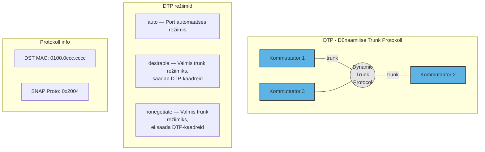
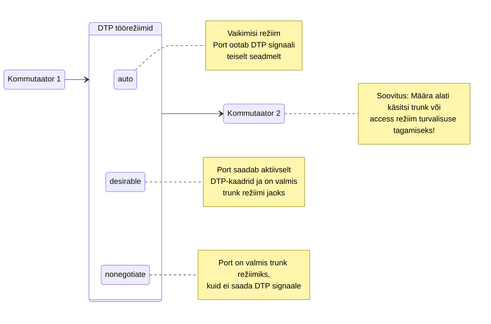
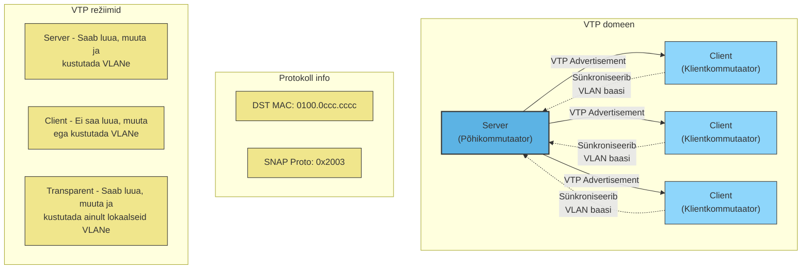
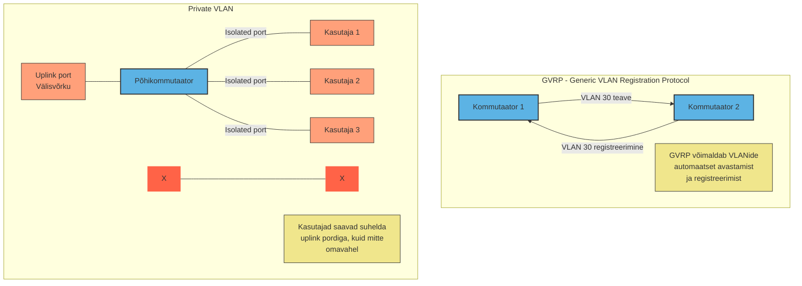
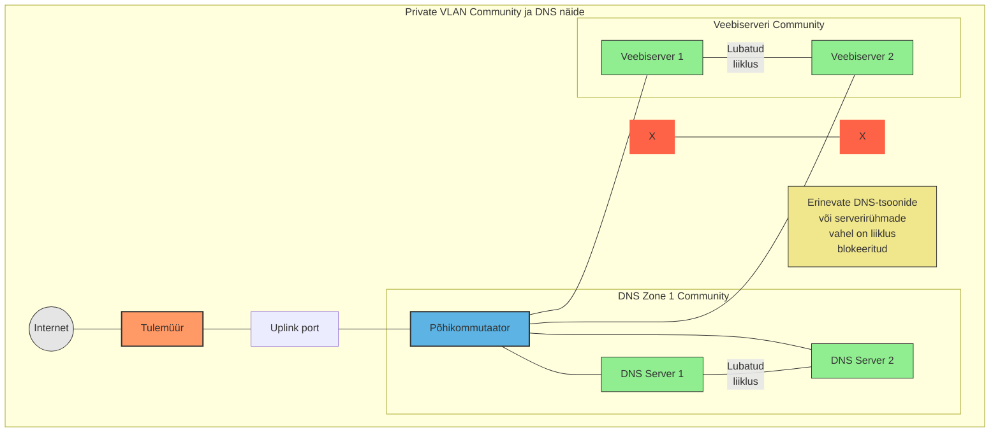
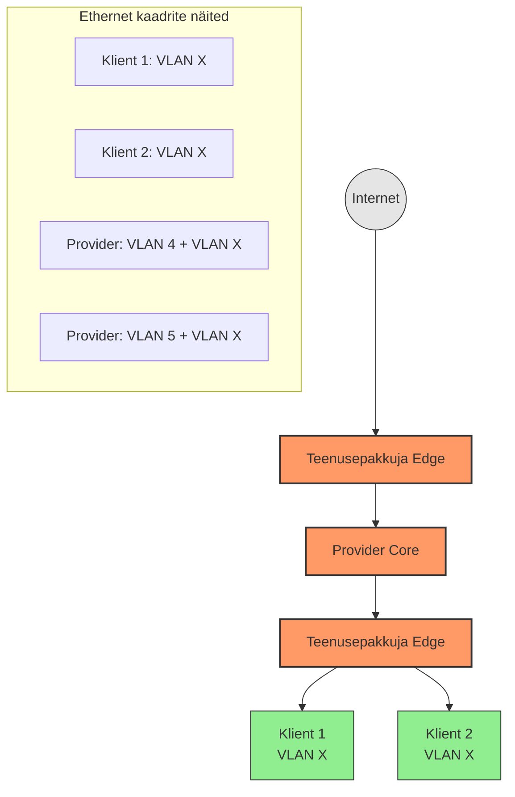

# Teema 15: Mis on VLAN 802.1Q ? Part 2

## DTP (Dünaamilise Trunk Protokoll)

DTP on Cisco patenteeritud protokoll, mis võimaldab kommutaatoritel automaatselt tuvastada, kas naaberlüliti on konfigureeritud trunk režiimi jaoks ja millist protokolli kasutada (802.1Q või ISL). See on vaikimisi sisselülitatud.

### DTP režiimid liidestel:

- **auto** — Port on automaatses režiimis, ootab signaale teiselt kommutaatorilt
- **desirable** — Port on "valmis trunk režiimi" olekus ja saadab perioodiliselt DTP-kaadreid teisele kommutaatorile
- **nonegotiate** — Port on valmis trunk režiimi jaoks, kuid ei saada DTP-kaadreid teisele poolele

### Miks käsitsi seadistamine on parem:

1. **Turvalisus** — Automaatne trunk režiimi aktiveerimine võib olla turvarisk, kuna ründaja võib ühenduda porti ja käivitada trunk režiimi
2. **Stabiilsus** — Käsitsi määratud režiim ei muutu ootamatult
3. **Selgus** — Võrguadministraatorid teavad täpselt, mis režiimis iga port töötab

### Soovitused algajatele:

- Määra alati portide režiimid käsitsi (`switchport mode access` või `switchport mode trunk`)
- Väldi dünaamilisi režiime (`auto`, `desirable`) kui võimalik
- Kasuta `nonegotiate` režiimi, kui soovid trunki ilma DTP-ta

> **NB!** Kui kaks Cisco kommutaatorit on ühendatud konfigureerimata portidega (või `auto`/`desirable` režiimis), võivad nad automaatselt luua trunk ühenduse, mis võib põhjustada turvariske või konfiguratsiooniriske.

Image Source: [Network Kings](https://www.nwkings.com)

## VTP - VLAN Trunking Protocol

VTP on Cisco patenteeritud protokoll, mis on loodud VLANide haldamiseks, loomiseks, kustutamiseks ja ümbernimetamiseks võrguseadmetes.

### VTP režiimid:

1. **Server** (vaikimisi režiim):
   * Saab luua, muuta ja kustutada VLANe kommutaatori käsurealt
   * Genereerib VTP teateid ja edastab neid teistele kommutaatoritele
   * Hoiab terve VTP domeeni VLAN andmebaasi

2. **Client**:
   * Ei saa luua, muuta ega kustutada VLANe kommutaatori käsurealt
   * Edastab VTP teateid teistelt kommutaatoritelt
   * Sünkroniseerib oma VLAN andmebaasi VTP serveri teadetega

3. **Transparent**:
   * Saab luua, muuta ja kustutada VLANe käsurealt, kuid ainult lokaalselt
   * Ei genereeri VTP teateid
   * Edastab VTP teateid teistelt kommutaatoritelt, kuid ei sünkroniseeri oma andmebaasi

Image Source: [CertificationKits](https://www.certificationkits.com)

### Eelised ja riskid:

**Eelised:**
* Lihtsustab VLAN haldust suurtes võrkudes
* Vähendab konfiguratsiooni vigu
* Säästab aega, kuna uusi VLANe pole vaja käsitsi kõikidesse kommutaatoritesse lisada

**Riskid:**
* Vanade VTP serverite taaskasutuselevõtt võib põhjustada VLAN andmebaasi ülekandeid ja võrgu probleeme
* Kõrgem konfiguratsiooniriteade versiooni number (revision number) võib põhjustada soovimatud muudatusi terves võrgus
* Toimib ainult homogeensetes Cisco võrkudes

### Soovitused algajatele:
* Kasuta VTP-d ettevaatlikult, eriti tootmiskeskkondades
* Kasuta võimalusel Transparent režiimi, kui pole vajadust automaatseks VLAN levitamiseks
* Dokumenteeri täpselt VTP domeeni nimi ja parool
* Ole ettevaatlik vanade kommutaatorite taaskasutuselevõtuga, mis võivad sisaldada vananenud VLAN konfiguratsioone

> **NB!** Kuigi VTP on mugav tööriist, võib see valesti kasutades põhjustada tõsiseid võrguprobleeme. Enne selle kasutamist on soovitatav põhjalikult mõista selle tööpõhimõtteid ja võimalikke riske.

## GVRP (Generic Attribute Registration Protocol / GARP VLAN Registration Protocol)

GVRP on standardiseeritud protokoll, mis toimib sarnaselt Cisco VTP-le, kuid on kasutatav erinevate tootjate seadmetel. See võimaldab VLAN-ide automaatset levitamist võrgus.

### GVRP põhiomadused:

* Võimaldab kommutaatoritel dünaamiliselt registreerida ja õppida VLAN-e
* Standardil põhinev (IEEE 802.1Q)
* Töötab erinevate tootjate seadmetel (D-Link, HP, jt)
* Vähendab manuaalset VLAN-ide konfigureerimist

### Kuidas GVRP töötab:

1. Kommutaator liitub võrku trunk-ühenduse kaudu
2. Kommutaator saab teada, et võrgus on kasutusel VLAN 30
3. Kommutaator registreerib VLAN 30 automaatselt
4. Loob läbi VLAN 30 ühenduvuse teiste kommutaatoritega

GVRP on vähemlevinud kui Cisco VTP, kuid on kasutuses mõnede teenusepakkujate võrkudes.

Image Source: [IP With Ease](https://ipwithease.com/concept-of-private-vlan/)

## Private VLAN

Private VLAN on lahendus, mis võimaldab isoleerida ühes VLAN-is olevaid porte üksteisest, samal ajal lubades neil suhelda ühe ühise väljundpordiga.

### Private VLAN põhiomadused:

* Võimaldab isoleerida kasutajaid üksteisest samas VLAN-is
* Vähendab VLAN-ide arvu (pole vaja igale kasutajale eraldi VLAN-i)
* Sobib eriti hästi teenusepakkujatele ja kortermajade võrkudele

### Porditüübid Private VLAN-is:

* **Isolated port** (isoleeritud port) - Kasutaja port, mis saab suhelda ainult uplink pordiga, mitte teiste isoleeritud portidega
* **Uplink port** (promiscuous port) - Port, mis saab suhelda kõigi portidega

### Praktiline näide:

Kortermaja võrgus on üks kommutaator, millesse on ühendatud erinevad korterid:
* Kõik korterid asuvad samas VLAN-is
* Kortereid ühendavad pordid on isoleeritud üksteisest
* Kõik korterid saavad suhelda internetiühendust pakkuva uplink pordiga
* Naaber A ei saa otse suhelda naaber B-ga (turvalisuse tagamiseks)

See lahendus hoiab ära võimaluse, et ühes korteris olev kasutaja saaks teha võrguründeid teistesse korteritesse, kuid võimaldab siiski kõigil kasutada internetiühendust.

> **NB!** Private VLAN on eriti kasulik olukordades, kus võrguressursid on piiratud ja täielik VLAN-ide eraldamine ei ole praktiline, kuid kasutajate vaheline eraldatus on endiselt vajalik.

    ## Private VLAN Community lisanäide DNS-tsoonide jaoks

Private VLAN Community tehnoloogia võimaldab luua spetsiifilisi turvagruppe serverite vahel, mis on ideaalne lahendus DNS-serverite või teiste kriitiliste teenuste isoleerimiseks.

### DNS-tsoonide turvamine Private VLAN Community abil:

* **DNS-serverite loogiline grupeerimine**: Erinevat tüüpi või erinevate tsoonide DNS-serverid saab jagada erinevatesse community gruppidesse
* **Isoleeritud veebiserver-klastrid**: Veebiserveri klastrid saavad suhelda omavahel, kuid mitte DNS-serveritega
* **Turvarünnakute piiramine**: Kui ründaja pääseb ligi ühele serverile, on juurdepääs piiratud ainult selle community serverigrupi piires

### Turvamõju:

1. **Külgsuunas liikumise (lateral movement) piiramine**: Ründaja, kes kompromiteerib ühe serveri, ei saa liikuda teistesse serverirühmadesse
2. **Tsoonide eraldamine**: Erinevate teenusepakkujate või klientide jaoks mõeldud DNS-tsoonid saab hoida eraldi
3. **Administreerimine**: Võimaldab anda administraatoritele õigused konkreetsetele serverirühmadele, ilma et nad saaksid juurde pääseda teistele

### Praktilised eelised:

* **Lihtne haldamine**: Võrreldes täieliku VLAN-ide eraldamisega on Private VLAN Community haldamine lihtsam
* **Ressursside kokkuhoid**: Vajab vähem IP-aadressiruumi ja VLAN-e
* **Turvalisus**: Pakub täiendavat kaitsekihti juba olemasolevate turvameetmete (tulemüürid, VLANid) juures

Sarnast lahendust saab rakendada ka teiste serverirühmade puhul, nagu andmebaasid, rakendusserverid või pilvemajutuse virtuaalserverid, kus on vaja tasakaalustada suhtlusvõimalusi ja turvapiiranguid.

## QinQ (802.1ad) ehk Double Tagging

QinQ on Ethernet'i laiendus, mis võimaldab teenusepakkujatel edastada klientide VLAN-e oma võrgus ilma konfliktideta, isegi kui kliendid kasutavad samu VLAN ID-sid.

### Kuidas QinQ töötab:

1. Klientide A ja B mõlemal on kasutusel VLAN ID X
2. Kui kliendi A kaadrid sisenevad teenusepakkuja võrku, lisab teenusepakkuja neile teise VLAN märgendi (näiteks VLAN 4)
3. Kui kliendi B kaadrid sisenevad, lisab teenusepakkuja neile teise VLAN märgendi (näiteks VLAN 5)
4. Teenusepakkuja võrgus edastatakse kaadrid nende välimiste VLAN märgendite abil
5. Kui kaadrid väljuvad teenusepakkuja võrgust, eemaldatakse teenusepakkuja VLAN märgend

### Ethernet kaadri struktuur:
- **Tavaline kaader**: MAC + MAC + Type + Andmed + FCS (1514 baiti)
- **802.1Q kaader**: MAC + MAC + 0x8100 + VLAN Tag + Type + Andmed + FCS (1518 baiti)
- **QinQ kaader**: MAC + MAC + 0x88A8 + S-VLAN + 0x8100 + C-VLAN + Type + Andmed + FCS (1522 baiti)

QinQ võimaldab teenusepakkujatel pakkuda L2 VPN teenuseid ja ületada 4096 VLAN piiri, kuna mõlema VLAN märgendi kombinatsioon võimaldab kuni 16 miljonit virtuaalvõrku.

# Cisco võrguprotokollide kokkuvõte

| Protokoll/Funktsioon | Mis see on? | Milleks kasutatakse? | Lihtne näide |
|----------------------|-------------|----------------------|--------------|
| **Native VLAN** | VLAN, mis määratakse trunk-pordile märgendamata liiklusele | 1) Hädaolukorras ühenduvuse tagamiseks 2) Ühilduvuse tagamiseks vanemate seadmetega | Kommutaator A ja B on ühendatud trunk-pordiga. Kui seadistused on valesti tehtud, võivad need Native VLAN 1 kaudu siiski suhelda. |
| **DTP** (Dynamic Trunk Protocol) | Cisco patenteeritud protokoll trunk-režiimi automaatseks seadistamiseks | Võimaldab kommutaatoritel automaatselt tuvastada, kas naaberlüliti on trunk-režiimis | Kaks Cisco kommutaatorit on ühendatud. DTP abil muutuvad pordid automaatselt trunk-režiimi, ilma käsitsi seadistamiseta. |
| **VTP** (VLAN Trunking Protocol) | Cisco patenteeritud protokoll VLAN-teabe levitamiseks | VLAN-ide keskne haldamine suurtes Cisco võrkudes | Ettevõttel on 20 kommutaatorit. VTP abil saab administraator lisada uue VLAN-i ühele (server) kommutaatorile ning see levib automaatselt kõigile teistele. |
| **GVRP** (GARP VLAN Registration Protocol) | Standardiseeritud protokoll VLAN-teabe levitamiseks | VLAN-ide automaatne registreerimine erinevate tootjate seadmetel | Erinevate tootjate (Cisco, HP, D-Link) kommutaatorid võrgus saavad automaatselt registreerida ja õppida kasutusel olevaid VLAN-e. |
| **Private VLAN** | Tehnoloogia VLAN-i sisese eralduse loomiseks | Kasutajate eraldamine samas VLAN-is | Kortermaja võrgus on kõik korterid samas VLAN-is, kuid naabrid ei saa omavahel suhelda, ainult internetiga. |
| **Private VLAN Community** | Private VLAN laiendus gruppide loomiseks | Serverite või kasutajate grupeerimine loogiliste üksustena | Andmekeskuses veebiserveri klaster (2 serverit) saab omavahel suhelda, kuid mitte teiste klastritega samas VLAN-is. |
| **QinQ** (802.1ad) | VLAN kapseldamise tehnoloogia | Klientide VLAN-ide isoleerimine teenusepakkuja võrgus | Kaks klienti kasutavad mõlemad VLAN 10. Teenusepakkuja lisab kliendi A liiklusele VLAN 100 ja kliendi B liiklusele VLAN 200, võimaldades mõlemal kasutada VLAN 10 ilma konfliktita. |