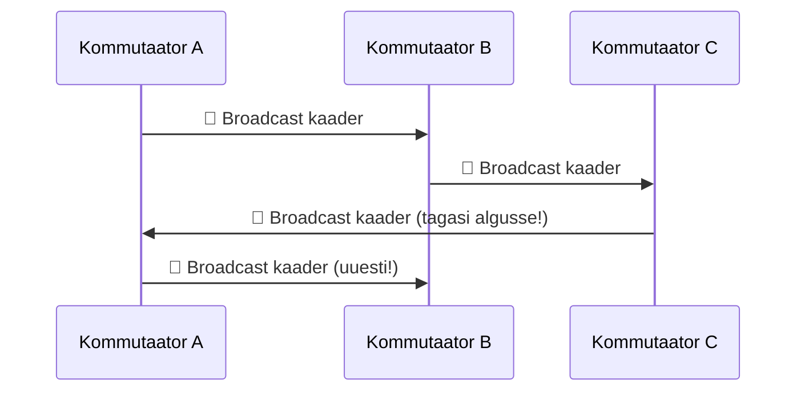

---

# Teema 16: Spanning Tree protokollide perekond. STP, RSTP, PVST/RPVST, MSTP.

## 📜 **Mis on Spanning Tree ja miks see on oluline?**

- **Ethernet-võrkudes võib tekkida SILMUS (LOOP)**, kui **kommutaatorid (switchid) on valesti ühendatud**.
- **Spanning Tree Protocol (STP)** aitab **silmuseid vältida**, blokeerides üleliigsed ühendused.
- Ilma STP-ta võib võrk **aeglustuda või täielikult lakata töötamast**.

---

## ⚠️ **Kuidas silmus (loop) tekib?**

**1️⃣ Liiga palju ühendusi**
- Kujuta ette, et meil on kaks kommutaatorit (A ja B).
- Mõlemad on ühendatud omavahel **mitme kaabliga** (nt kaks Ethernet-kaablit).

**2️⃣ Broadcast-kaadrid hakkavad korduma**
- Kui arvuti saadab **broadcast-kaadri (teate, mis läheb kõigile)**, saadavad kommutaatorid selle edasi **kõikidele portidele**.
- See tähendab, et sama kaader võib **tulla tagasi algsesse kommutaatorisse**, luues lõputu tsükli (silmuse).

**3️⃣ Võrk jookseb kinni**
- Kuna Etherneti protokollis **pole TTL-i (Time-To-Live)**, ei tea kommutaatorid, **millal lõpetada kaadri edastamine**.
- **Kaadrid hakkavad võrgus lõputult liikuma**, ummistades kõik lingid ja aeglustades võrku.

🔍 **Võtame lihtsa näide:**



**📌 Probleem:** Kaader ei peatu kunagi → **võrk on ummistunud!**

✅ **STP lahendus:** **Blokeerib ühe lingi**, et vältida lõputut ringlust.

---

## 📌 **STP Olulised Mõisted**

| 🔍 **Mõiste** | 📝 **Lihtne Selgitus** |
|--------------|------------------|
| **🛠️ Root Bridge** | **Võrgu keskne kommutaator** (valitakse automaatselt). |
| **🔗 Root Port** | **Parim port Root Bridge’ini jõudmiseks**. |
| **🚦 Blocking Port** | **Blokeeritud port, et vältida silmuseid**. |

👨‍💻 **Näide:** Kui kolm switchi on ühendatud ringina, valitakse üks neist **Root Bridge’iks** ja üleliigsed ühendused **blokeeritakse**.


*Image Source: [Network Academy](https://www.networkacademy.io/) - [Root Bridge Election Process](https://www.networkacademy.io/sites/default/files/inline-images/root-bridge-election-process-step-1.svg)*

---

## ⏳ **STP Pordiseisundid**

| 🎯 **Seisund** | 📝 **Mida see tähendab?** |
|---------------|------------------|
| **Blocking** | ❌ Ei edasta liiklust, kuulab BPDU-sid. |
| **Listening** | 🔄 Valmistub edastamiseks, ei õpi MAC-aadresse. |
| **Learning** | 🏗️ Õpib MAC-aadresse, ei edasta veel andmeid. |
| **Forwarding** | ✅ Pordil **täielik töövõime**. |


*Image Source: [www.ccnaccnplinux.com](https://www.ccnaccnplinux.com/)*

---

## 🚀 **RSTP (Rapid STP - IEEE 802.1w)**

| 🚀 **Mida see parandab?** | 📝 **Lihtne selgitus** |
|--------------------------|------------------|
| **Kiirem koondumisaeg** ⏳ | ✅ Üleminek võtab **1-2 sekundit** (vs STP 30-50s). |
| **Uued porditüübid** 🔄 | ✅ **Alternate Port** – Varutee juurkommutaatorile. |
| **Backup Port** 🔁 | ✅ **Varutee sama segmendi sees**. |

👨‍💻 **Ehk:**
Kui mõni **ühendus katkeb**, siis **STP arvutab kõik uuesti (~50 sek)**, aga **RSTP suudab kiiremini reageerida (1-2 sek)**.


*Image Source: [Medium](https://medium.com/)*

---

## 🔀 **PVST+ & RPVST+ (Cisco)**

**📌 Cisco PVST+ ja RPVST+ eelised:**

| 🔍 **Funktsioon** | 📝 **Mida see teeb?** |
|------------------|------------------|
| **Eraldi STP puu iga VLAN-i jaoks** | ✅ VLAN A võib kasutada ühte teed, VLAN B teist! |
| **Parem võrgu koormuse jagamine** ⚖️ | ✅ Võrk töötab **efektiivsemalt**, kui erinevad VLAN-id kasutavad erinevaid linke. |

🔴 **Puudused:**
- ❌ Ainult **Cisco seadmetele**.
- ❌ Rohkem protsessoriressursse vaja.


*Image Source: [Cisco Community](https://community.cisco.com/)*

---

## 🏆 **MSTP (Multiple Spanning Tree Protocol - IEEE 802.1s)**

📌 **Mis see on?**
- **MSTP on standardiseeritud protokoll** (erinevalt PVST-st, mis on Cisco oma).
- **Koondab VLAN-id gruppidesse** ja teeb **neile eraldi spanning tree puu**.

| ✅ **Eelised** |
|-----------------|
| **Töötab erinevate tootjate seadmetega** 🌍 |
| **Ressursside kokkuhoid** 🖥️ (mitte iga VLAN ei vaja oma STP-d) |
| **Tasakaalustab võrgu koormust** ⚖️ |

👨‍💻 **Lihtne näide:**
Kui meil on **50 VLAN-i**, siis **PVST+ teeks 50 STP arvutust**, aga **MSTP teeb ainult 3-4 arvutust** (gruppide järgi).

---

## 🔐 **STP Kaitsemehhanismid**

| 🛡️ **Kaitse** | 📝 **Mida see teeb?** |
|----------|----------------|
| **BPDU Guard** 🚫 | ❌ **Keelab BPDU-de vastuvõtmise**, kui pordil pole lubatud kommutaatoreid. |
| **Root Guard** 🔒 | ❌ **Takistab Root Bridge'i muutmist** (hoiab võrgu stabiilsena). |
| **PortFast** ⚡ | ✅ **Kiire üleminek Forwarding-seisundisse** (kasutatakse PC-de portidel). |

**Näide:** Kui keegi ühendab uue switchi ilma teadmiseta, **Root Guard ja BPDU Guard aitavad vältida võrgu rikkeid**.

---

## 🏁 **Spanning Tree Protokollide Võrdlus**

| 🏷️ **Protokoll** | 🔎 **Standard** | ⏳ **Koondumisaeg** | 🔄 **Eraldi puu VLAN-ile?** |
|-----------|--------------|------------------|----------------------|
| **STP** | IEEE 802.1D | 🕒 **30-50 sek** | ❌ Ei |
| **RSTP** | IEEE 802.1w | ⚡ **1-2 sek** | ❌ Ei |
| **PVST+** | Cisco | 🕒 **30-50 sek** | ✅ Jah |
| **RPVST+** | Cisco | � **1-2 sek** | ✅ Jah |
| **MSTP** | IEEE 802.1s | ⚡ **1-2 sek** | 🏷️ **VLAN-i gruppide kaupa** |

👨‍💻 **Selgitus:**
- Kui tahad **väga lihtsat võrku**, kasuta **STP**.
- Kui tahad **kiiret reageerimist**, kasuta **RSTP**.
- Kui sul on **palju VLAN-e**, kasuta **MSTP või PVST+**.

[**Understand STP Loop Guard and UDLD Features**](https://www.cisco.com/c/en/us/support/docs/lan-switching/spanning-tree-protocol-stp-8021d/218321-configure-stp-with-loop-guard-and-bpdu-s.html)  
*Source: [Cisco Official Documentation](https://www.cisco.com/)*

---

## STP kokkuvõte

```mermaid
flowchart TD
    subgraph "The Problem: Network Loop"
        A1[Switch 1 gets a message] -->|"Forwards to"| B1[Switch 2]
        B1 -->|"Forwards to"| C1[Switch 3]
        C1 -->|"Forwards back to"| A1
        A1 -->|"OMG not again!"| B1
    end

    subgraph "The Fix: Spanning Tree Protocol"
        A2[Switch 1 becomes Root Bridge] -->|"I'm the boss!"| B2[Switch 2]
        A2 -->|"I'm the boss!"| C2[Switch 3]
        B2 -->|"Link between us? BLOCKED!"| C2
        C2 -->|"Can't send this way"| B2
    end

    subgraph "When Links Break"
        A3[Switch 1: Root Bridge] -->|"Link breaks!"| C3[Switch 3: Oh no!]
        C3 -->|"Emergency! Unblock my port!"| B3[Switch 2]
        B3 -->|"You can use me to reach the Root now"| C3
    end

    style A1 fill:#ff9999
    style B1 fill:#ff9999
    style C1 fill:#ff9999
    
    style A2 fill:#99ff99
    style B2 fill:#99ff99
    style C2 fill:#99ff99
    
    style A3 fill:#9999ff
    style B3 fill:#9999ff
    style C3 fill:#9999ff
```



## Probleem
- Lülitid saadavad sõnumeid ringiratast 🔄
- Tekib silmus, mis koormab võrku ⚠️
- Võrk muutub kasutuskõlbmatuks 💥

## Lahendus: STP
1. **Vali Root Bridge** - üks lüliti saab juurlülitiks 👑
2. **Blokeeri mõned teed** - silmuste vältimiseks 🚫
3. **Kiire taastamine** - kui ühendus katkeb, ava alternatiivne tee 🔄

STP on nagu liikluspolitseinik, kes blokeerib mõned teed, et keegi ei saaks lõputult ringi sõita! 🚦

---

## STP kaitsemehhanismid 🛡️
- **BPDU Guard** - kaitseb serverite porte, blokeerides need kui BPDU ilmub 🚫
- **Root Guard** - takistab võõraste lülitite juurlülitiks saamist 👮
- **Loop Guard** - tuvastab ühepoolseid ühendusi, mis võivad silmuseid tekitada 🔍
- **PortFast** - lubab lõppseadmetel kohe andmeid saata, jätmata STP ootamist ⚡

---

## Teised silmuste kaitse protokollid 🌐
- **RSTP** - Rapid STP, kiirem taastumine (~2-3 sekundit) 🏎️
- **MSTP** - võimaldab mitut STP instantsi erinevatele VLAN-idele 🧩
- **PVST+** - Cisco versioon, töötab iga VLAN-iga eraldi 🔌
- **Etherchannel/LACP** - mitu linki töötavad kui üks, suurendades kiirust ja pakkudes varundust 🔗

STP on elutähtis võrgusilmuste vastu, muidu võrk "uputaks ennast" broadcast-tormidega! 🌊💻

---

## 🛠️ **Konfiguratsioon**

### **1. STP sisselülitamine**
```bash
Switch(config)# spanning-tree mode rapid-pvst  # Aktiveerib RSTP
```

### **2. Root Bridge määramine**
```bash
Switch(config)# spanning-tree vlan 10 root primary  # Teeb selle switchi VLAN 10 Root Bridge'iks
```

### **3. PortFast sisselülitamine**
```bash
Switch(config)# interface GigabitEthernet0/1
Switch(config-if)# spanning-tree portfast  # Kiire üleminek Forwarding-seisundisse
```

### **4. BPDU Guard sisselülitamine**
```bash
Switch(config-if)# spanning-tree bpduguard enable  # Blokeerib BPDU-sid
```

---

## 🤔 **Miks on nii palju STP protokolle?**

1. **STP (IEEE 802.1D):**
   - Vanim versioon, aeglane (~50 sekundit taastumiseks).
   - Üks puu kogu võrgule.

2. **RSTP (IEEE 802.1w):**
   - Kiirem (~1-2 sekundit taastumiseks).
   - Lisab uusi porditüüpe (Alternate ja Backup).

3. **PVST+ (Cisco):**
   - Eraldi puu iga VLAN-i jaoks.
   - Parem koormuse jaotus.

4. **MSTP (IEEE 802.1s):**
   - Gruppide kaupa VLAN-id.
   - Töötab erinevate tootjate seadmetega.

---

## 📝 **Näide: Study Case STP seadistamine Cisco switchis:**

Vaatleme näidet kolme switchiga võrgu seadistamisest (SW1, SW2, SW3).

Samm 1: STP sisselülitamine
Vaikimisi on STP tavaliselt sisse lülitatud, kuid on parem kontrollida ja aktiveerida see, kui see nii ei ole.

```bash
SW1(config)# spanning-tree mode rapid-pvst  # Lülitame sisse RSTP (Rapid PVST+)
SW2(config)# spanning-tree mode rapid-pvst
SW3(config)# spanning-tree mode rapid-pvst
```

Samm 2: Root Bridge määramine
Oletame, et tahame, et SW1 oleks Root Bridge VLAN 10 ja VLAN 20 jaoks.

```bash
SW1(config)# spanning-tree vlan 10 root primary  # Teeme SW1 Root Bridgiks VLAN 10 jaoks
SW1(config)# spanning-tree vlan 20 root primary  # Teeme SW1 Rood Bridgiks VLAN 20 jaoks
```

Kui on vaja määrata prioriteet käsitsi:

```bash
SW1(config)# spanning-tree vlan 10 priority 4096  # Prioriteet 4096 (väiksem = kõrgem prioriteet)
```

Samm 3: Portide seadistamine
Igal switchil valib STP automaatselt Root- ja Designated portid, kuid sellele protsessile saab kaasa mõjutada.

Portide oleku kontrollimine:

```bash
SW1# show spanning-tree vlan 10  # Näitab STP olekut VLAN 10 jaoks
```

Näidisväljund:

- **Root Port**: Port, mis viib Rood Switchini.
- **Designated Port**: Aktiivsed portid.
- **Blocked Port**: Blokeeritud portid.

Samm 4: Portide maksumuse seadistamine
Kui on vaja muuta teed, saab seada portide maksumuse. Mida väiksem on maksumus, seda eelistatum on port.

```bash
SW2(config)# interface GigabitEthernet0/1
SW2(config-if)# spanning-tree vlan 10 cost 10  # Määrame VLAN 10 maksumuseks 10
```

Samm 5: STP kiirendamine (PortFast)
Portide jaoks, mis on ühendatud arvutitega (mitte teiste swithitega), saab sisse lülitada PortFast. See kiirendab porti aktiivseks olekuks minekut.

```bash
SW1(config)# interface GigabitEthernet0/2
SW1(config-if)# spanning-tree portfast  # Lülitame sisse PortFast
```

Näidisvõrgu seadistus:
- **SW1 (Root Bridge)**:
  - Seadistatud kui Root Bridge VLAN 10 ja VLAN 20 jaoks.
  - PortFast on sisse lülitatud portidel, mis on ühendatud arvutitega.

- **SW2 ja SW3**:
  - STP on sisse lülitatud Rapid-PVST+ režiimis.
  - Portid, mis on ühendatud SW1-ga, muutuvad Root portideks.
  - Liigsed portid blokeeritakse STP poolt.

### Töö kontrollimine:
STP oleku näitamine:

```bash
SW1# show spanning-tree
```

Konkreetse VLAN-i oleku näitamine:

```bash
SW1# show spanning-tree vlan 10
```

Portide info näitamine:

```bash
SW1# show spanning-tree interface GigabitEthernet0/1
```

### Kokkuvõte:
- **Root Bridge**: Määratakse käsitsi või automaatselt.
- **Portid**: Root-, määratud ja blokeeritud portid valitakse STP poolt.
- **Käsud**: Kasutatakse prioriteetide, portide maksumuse ja töö kiirendamise seadistamiseks.

## Kordame

### Kuidas toimib portide blokeerimine STP-s?
Kui STP blokeerib porti, viib see selle olekusse Blocking. Selles olekus:

- Port ei edasta andmeid: See ei saada ega vastu võta kasutajaandmeid (näiteks pakette arvutite vahel).
- Port kuulab BPDU-sid (Bridge Protocol Data Units): Need on spetsiaalsed STP teenindussõnumid, mida lülitid kasutavad võrgu topoloogia teabe vahetamiseks.

### Kas paketid saavad läbida blokeeritud porti?
- Ei, kasutajate paketid ei läbi. Blokeeritud port ei edasta andmeid, et vältida võrgu tsükleid.
- Jah, BPDU-d läbivad. Blokeeritud port jätkab BPDU-de vastuvõtmist, et jälgida võrgu olekut. Kui midagi muutub (näiteks katkeb kaabel aktiivsel portil), võib STP porti lahti blokeerida ja topoloogiat ümber ehitada.

### Näide tööst:
- Tavaline töö:
  - VLAN 10 andmed liiguvad läbi aktiivsete portide (näiteks SW1 → SW2).
  - Port SW2 ja SW3 vahel on blokeeritud, ja kasutajate paketid ei läbi seda.

- Kaabli katkemine aktiivsel portil:
  - STP tuvastab muutuse (läbi BPDU-de).
  - Blokeeritud port SW2 ja SW3 vahel viiakse olekusse Forwarding.
  - Nüüd liiguvad VLAN 10 andmed läbi SW1 → SW3 → SW2.

### Portide olekud STP-s:
- **Blocking**:
  - Port on blokeeritud, kasutajate paketid ei edastata.
  - Vastuvõetakse ainult BPDU-sid.

- **Listening**:
  - Port valmistub aktiivseks olekuks.
  - Kuulatakse BPDU-sid, kuid kasutajate pakette ei edastata.

- **Learning**:
  - Port õpib MAC-aadresse, kuid kasutajate pakette veel ei edastata.

- **Forwarding**:
  - Port on aktiivne ja edastab kasutajate pakette.

- **Disabled**:
  - Port on administratiivselt välja lülitatud või vea tõttu.

### Miks on blokeerimine virtuaalne?

Blokeerimist nimetatakse "virtuaalseks", sest:

- Füüsiliselt jääb port sisse lülitatuks.
- See jätkab tööd juhtimistasandil (vastuvõtab BPDU-sid).
- Kasutajaandmeid ei edastata, kuid port on valmis "ärkama" võrgu muutuste korral.

### Kokkuvõte:
- Blokeeritud port ei edasta kasutajate pakette. See on vajalik võrgu tsüklite vältimiseks.
- BPDU-d edastatakse alati. See võimaldab STP-l jälgida võrgu olekut ja kiiresti reageerida muutustele.