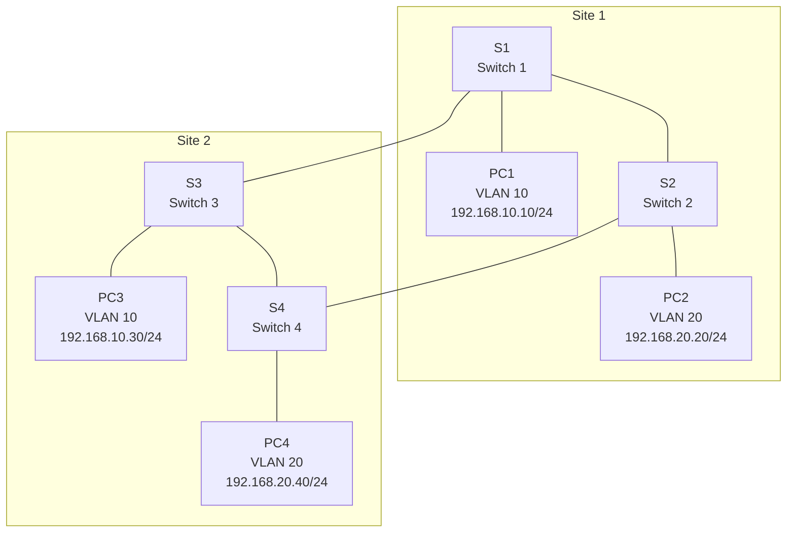

---

# 🔍 Lab: Multi-Site Network with VLANs and STP

## Lab Objective
In this lab, you will:
1. Configure **VLANs** to segment network traffic.
2. Configure **STP** to prevent loops and ensure redundancy.
3. Test **failover** by simulating a link failure.
4. Verify connectivity within and across VLANs.

---

## Lab Topology



*Figure: Two sites with redundant links between switches. PCs are assigned to different VLANs.*

---

## Addressing Table

| Device | Interface | IP Address      | Subnet Mask     | VLAN  |
|--------|-----------|-----------------|-----------------|-------|
| PC1    | NIC       | 192.168.10.10   | 255.255.255.0   | 10    |
| PC2    | NIC       | 192.168.20.20   | 255.255.255.0   | 20    |
| PC3    | NIC       | 192.168.10.30   | 255.255.255.0   | 10    |
| PC4    | NIC       | 192.168.20.40   | 255.255.255.0   | 20    |

---

## Lab Steps (40-50 Minutes)

### Step 1: Build the Network
1. Add **4 switches (2960)** and **4 PCs** to the workspace in Packet Tracer.
2. Connect the switches:
   - **Site 1:**
     - **S1 F0/1** to **S2 F0/1**
   - **Site 2:**
     - **S3 F0/1** to **S4 F0/1**
   - **Inter-Site Links:**
     - **S1 F0/2** to **S3 F0/2**
     - **S2 F0/2** to **S4 F0/2**
3. Connect each PC to a switch:
   - **PC1** to **S1 F0/3**
   - **PC2** to **S2 F0/3**
   - **PC3** to **S3 F0/3**
   - **PC4** to **S4 F0/3**

---

### Step 2: Configure VLANs (10 Minutes)
1. **Create VLANs on all switches:**
   - On **S1**, **S2**, **S3**, and **S4**, create **VLAN 10** and **VLAN 20**:
     ```bash
     S1(config)# vlan 10
     S1(config-vlan)# name SALES
     S1(config-vlan)# exit
     S1(config)# vlan 20
     S1(config-vlan)# name ENGINEERING
     S1(config-vlan)# exit
     ```

2. **Assign VLANs to switch ports:**
   - On **S1**:
     ```bash
     S1(config)# interface f0/3
     S1(config-if)# switchport mode access
     S1(config-if)# switchport access vlan 10
     S1(config-if)# exit
     ```
   - On **S2**:
     ```bash
     S2(config)# interface f0/3
     S2(config-if)# switchport mode access
     S2(config-if)# switchport access vlan 20
     S2(config-if)# exit
     ```
   - On **S3**:
     ```bash
     S3(config)# interface f0/3
     S3(config-if)# switchport mode access
     S3(config-if)# switchport access vlan 10
     S3(config-if)# exit
     ```
   - On **S4**:
     ```bash
     S4(config)# interface f0/3
     S4(config-if)# switchport mode access
     S4(config-if)# switchport access vlan 20
     S4(config-if)# exit
     ```

3. **Verify VLAN assignments:**
   ```bash
   S1# show vlan brief
   ```

---

### Step 3: Configure Trunking (5 Minutes)
1. **Configure trunk ports between switches:**
   - On **S1**:
     ```bash
     S1(config)# interface range f0/1-2
     S1(config-if-range)# switchport mode trunk
     S1(config-if-range)# switchport trunk allowed vlan 10,20
     S1(config-if-range)# exit
     ```
   - Repeat for **S2**, **S3**, and **S4**.

2. **Verify trunk configuration:**
   ```bash
   S1# show interfaces trunk
   ```

---

### Step 4: Configure STP (10 Minutes)
1. **Set S1 as the root bridge for VLAN 10:**
   ```bash
   S1(config)# spanning-tree vlan 10 root primary
   ```

2. **Set S3 as the root bridge for VLAN 20:**
   ```bash
   S3(config)# spanning-tree vlan 20 root primary
   ```

3. **Verify STP configuration:**
   ```bash
   S1# show spanning-tree vlan 10
   S3# show spanning-tree vlan 20
   ```

---

### Step 5: Test Connectivity (5 Minutes)
1. **Test intra-VLAN connectivity:**
   - Ping from **PC1** (VLAN 10) to **PC3** (VLAN 10).
   - Ping from **PC2** (VLAN 20) to **PC4** (VLAN 20).

2. **Test inter-VLAN connectivity:**
   - Ping from **PC1** (VLAN 10) to **PC2** (VLAN 20).
   - Note: Inter-VLAN communication will fail without a Layer 3 device (router).

---

### Step 6: Simulate Failover (10 Minutes)
1. **Disconnect the primary inter-site link:**
   - Shut down the link between **S1** and **S3**:
     ```bash
     S1(config)# interface f0/2
     S1(config-if)# shutdown
     ```

2. **Verify STP recalculates the topology:**
   ```bash
   S1# show spanning-tree vlan 10
   S3# show spanning-tree vlan 20
   ```

3. **Test connectivity after failover:**
   - Ping from **PC1** to **PC3**.
   - Ping from **PC2** to **PC4**.
   - Ensure connectivity is maintained through the redundant link (**S2-S4**).

---

### Step 7: Restore the Primary Link and Verify (5 Minutes)
1. **Re-enable the primary inter-site link:**
   ```bash
   S1(config)# interface f0/2
   S1(config-if)# no shutdown
   ```

2. **Verify STP recalculates the topology:**
   ```bash
   S1# show spanning-tree vlan 10
   S3# show spanning-tree vlan 20
   ```

3. **Test connectivity again:**
   - Ping from **PC1** to **PC3**.
   - Ping from **PC2** to **PC4**.
   - Ensure connectivity is restored through the primary link (**S1-S3**).

---

## Key Commands for Verification
- `show vlan brief` – Verify VLAN assignments.
- `show interfaces trunk` – Verify trunk configuration.
- `show spanning-tree vlan <vlan-id>` – Verify STP configuration for a specific VLAN.

---

## Expected Results
1. **VLAN Configuration:**
   - PCs in the same VLAN can communicate (e.g., **PC1** and **PC3**).
   - PCs in different VLANs cannot communicate without a router.

2. **STP Configuration:**
   - One inter-site link is blocked to prevent loops.
   - Failover ensures connectivity when the primary link fails.

---

## Troubleshooting Tips
1. **No Connectivity Within VLAN:**
   - Verify VLAN assignments using `show vlan brief`.
   - Ensure trunk ports allow the necessary VLANs.

2. **STP Not Blocking Ports:**
   - Verify STP configuration using `show spanning-tree`.
   - Ensure the correct root bridge is elected.

---

## Key Takeaways
- VLANs segment network traffic logically.
- STP ensures redundancy and prevents loops.
- Trunking allows multiple VLANs to traverse a single link.
- Failover testing demonstrates STP’s ability to maintain connectivity during link failures.

---
