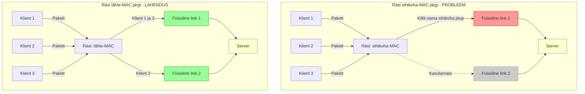
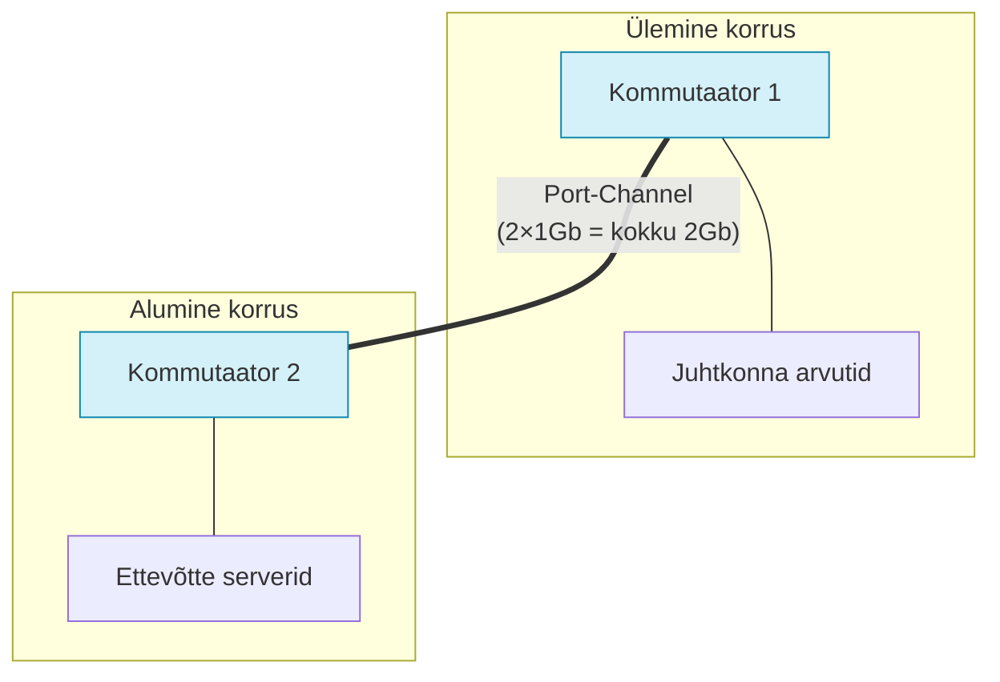
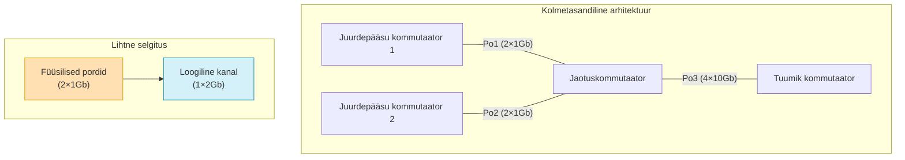

# Teema 17: Ühenduste koondamine (Link Aggregation / EtherChannel)

**What is "link aggregation"? The pros and cons of link aggregation: how does it benefit your network?** ([source](https://medium.com/@gamesworld94/what-is-link-aggregation-c7724f9d0b63))


Koondamine on tehnoloogia, millel võib eri tootjate puhul olla erinev nimetus. Kuid idee on alati sama:

> "Ühendada mitu füüsilist linki üheks loogiliseks kanaliks suurema läbilaskevõimega."

Oletame, et meil on kaks kommutaatorit, mis on ühendatud kahe gigabitise lingiga. Kui kasutada spanning-tree protokolli, lülitatakse üks link välja — ressursside raiskamine! Koondamisega saame kasutada mõlemat ja saavutada kiiruse 2 Gbit/s.

[](https://medium.com/@gamesworld94/what-is-link-aggregation-c7724f9d0b63)

Sellist koondatud kanalit kujutatakse tavaliselt "rõngana", mis ühendab mitu liini. Kui üks link peaks katkema — jätkavad teised tööd. See annab nii **kiiruse** kui ka **reserveerimise** eelise.

Maksimaalselt kuni 8 linki ühes kanalis (sõltuvalt riistvarast). Oluline: pordid peavad olema **sama kiirusega** ja **samast kiibistiku plokist** kommutaatoril.

[](https://medium.com/@gamesworld94/what-is-link-aggregation-c7724f9d0b63)

---

## 💡 Mis toimub koondamisel

Sa ei seadista enam füüsilisi liideseid otse — luuakse **loogiline liides** (näiteks Port-channel1), mis kontrollib kõiki ühendatud porte. Kõik seadistused (VLAN, STP, IP) tehakse ainult loogilisele liidesele.


---

## 🔀 Koormuse tasakaalustamise algoritmid

EtherChannel töötab räsifunktsiooni alusel, mis määrab, millise lingi kaudu kaader liigub. Näited:
- Lähte-MAC-aadress
- Sihtkoha-MAC-aadress
- IP-aadressid (allikas/sihtkoht)
- TCP/UDP-pordid (kui riistvara võimaldab)



Näide: kui teed räsi sihtkoha-MAC-aadressi järgi ja kõik kliendid pöörduvad ühe serveri poole — kogu liiklus läheb ühte linki! Peaksid valima räsi **saatja** aadressi järgi.

> Reegel: kui ühel pool on üks server ja teisel pool palju kliente, teeme räsi lähte-MAC-aadressi järgi.

---

## 🔁 PAgP, LACP, Static: mis on erinevus

| Tüüp | Protokoll | Kirjeldus |
|-----|----------|----------|
| Static | Puudub | Käsitsi seadistamine. Kontrolle pole. Ohtlik. |
| PAgP | Cisco | Partneri automaattuvastuse protokoll (auto/desirable) |
| LACP | IEEE 802.3ad | Standard. Töötab kõikjal. Režiimid: active/passive |

```bash
interface range fa0/1 - 2
 channel-group 1 mode active  # LACP (standard)
```

> Kaks passive'i naabrit ei ühendu. Vähemalt üks peab olema active.

---

## 🖥️ NIC Teaming (serveritel)

**Why We Have EtherChannel** ([source](https://www.flackbox.com/why-we-have-etherchannel))


*Source: [Firewall.cx](https://www.firewall.cx/images/stories/windows-server-nic-teaming-load-balancing-failover-lacp-1.png)*


### Põhjused kahe võrguadapteri (NIC) kasutamiseks:

🔁 **1. Tõrkekindlus (Failover):**  
Kui üks NIC rikki läheb või võrguühendus katkeb (näiteks katkine kaabel või switchi probleem), siis teine NIC võtab automaatselt töö üle. Nii hoitakse **teenused pidevalt töös** – pole katkestusi ega seisakuid.

🚀 **2. Suurem läbilaskevõime (Load Balancing):**  
Mitme NICi kaudu saab võrgu liiklust **ühtlasemalt jaotada**, eriti kui on palju samaaegseid ühendusi. Näiteks failiserver või veebiserver, mis teenindab mitut kasutajat korraga – see parandab **kiirust ja jõudlust**.

🌐 **3. Redundantsus võrgu tasemel:**  
Kui kaks NICi on ühendatud erinevatesse switchidesse, siis isegi **võrguseadme rike** ei katkesta ühendust. See annab täiendava turvalisuse kihistuse.

Serveritel nimetatakse seda tehnoloogiat NIC Teaming või Bonding. HP, Dell, Intel — võivad seda erinevalt nimetada. Näide (Windows Server): loome ühe loogilise Team'i kahest adapterist.

**Režiimid:**
- Active/Backup (üks töötab, teine ootab)
- TLB (Transmit Load Balancing)
- LACP (kui server ja kommutaator mõlemad toetavad)

```powershell
New-NetLbfoTeam -Name "MyTeam" -TeamMembers "Ethernet1","Ethernet2" -TeamingMode LACP
```

> Tihti IT-spetsialistid ei kasuta teaming'ut, kuigi serveril on 4 võrgukaarti.

## 🏢 Praktiline juhtumiuuring: Väikeettevõtte kahe kontori ühendamine

**Olukord:** Väikeettevõttel on kaks kontorit samas hoones, mida soovitakse ühendada kiire ja töökindla võrguühendusega.

### Probleemi kirjeldus:
- Kontorid asuvad kõrvutiasetsevatel korrustel
- Ettevõtte serverid, mis töötlevad raamatupidamise andmeid, on alumisel korrusel
- Ülemisel korrusel on juhtkonna arvutid, mis kasutavad sageli serverite andmeid
- Olemasolev üks võrgukaabel ei suuda tipptundidel kogu liiklust läbi lasta (aeglus)
- Kardeti, et ühe kaabli katkemisel katkeb kogu võrguühendus

### Lahendus: LACP EtherChannel
Otsustati luua kahe gigabitise võrgukaabli koondamine (EtherChannel) kahe korruse vahel.



### Sammud lahenduse seadistamiseks (Cisco kommutaatorite näitel):

1. **Mõlemal kommutaatoril ühendada pordid:**
```
Switch1# configure terminal
Switch1(config)# interface range gigabitethernet 0/1-2
Switch1(config-if-range)# channel-group 1 mode active
Switch1(config-if-range)# switchport mode trunk
Switch1(config-if-range)# exit
Switch1(config)# interface port-channel 1
Switch1(config-if)# switchport mode trunk
Switch1(config-if)# end
```

2. **Kontrolli, kas ühendus töötab:**
```
Switch1# show etherchannel summary
```

### Tulemused:
- **Enne:** Üks 1Gb ühendus, aeglane töö tipptundidel
- **Pärast:** 2Gb koondatud ühendus, kiirem andmevahetus
- **Lisaboonus:** Ühe kaabli katkemisel jätkab võrk tööd teise kaabli kaudu

## 🔍 Miks ei tööta?

- Erinevate kiirustega pordid? ❌
- Üks port teisest ASIC-plokist? ❌
- Viga režiimis (üks passive, teine passive)? ❌
- Üks kasutab PAgP-d, teine LACP-d? ❌

```bash
show interfaces port-channel 1
```

---

## 🧠 Koondamise eelised 3-tasandilises arhitektuuris

Kui ehitad võrku tasemetega access-distribution-core:
- Ühendad access/distribution tasemed EtherChannel'i kaudu
- STP näeb ühte loogilist linki, silmuseid pole
- Võib spanning-tree selles lõigus täiesti välja lülitada (või piirata)
- Suureneb läbilaskevõime ja tõrkekindlus



---

## 📌 Jäta meelde

- Seadista mõlemalt poolt enne linkide ühendamist
- Parem kasuta LACP-d — see töötab kõikjal
- Räsi saatja aadressi järgi, kui sul on palju kliente ja üks server
- Pordid peavad olema ühesuguse kiiruse, dupleksi ja seadistusega

---
[](https://www.youtube.com/watch?v=RFq9qRZ-Svg)
