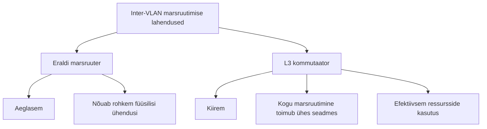
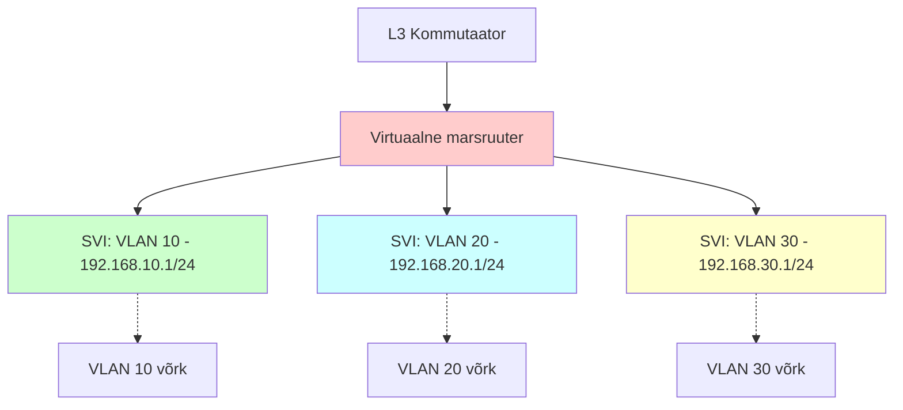
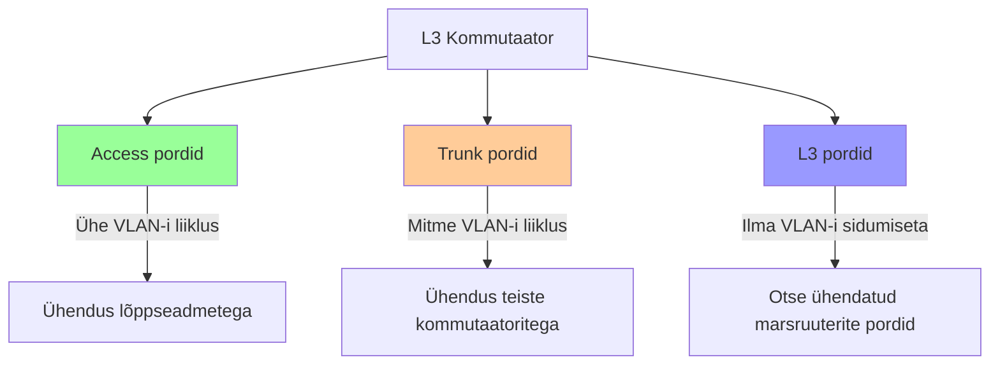
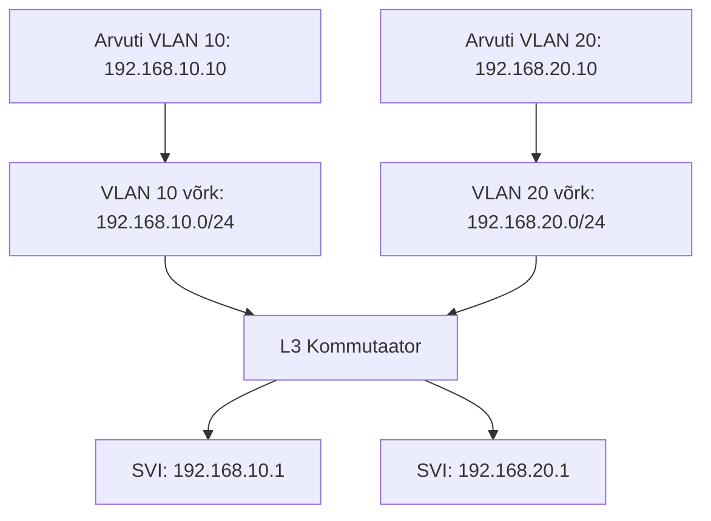
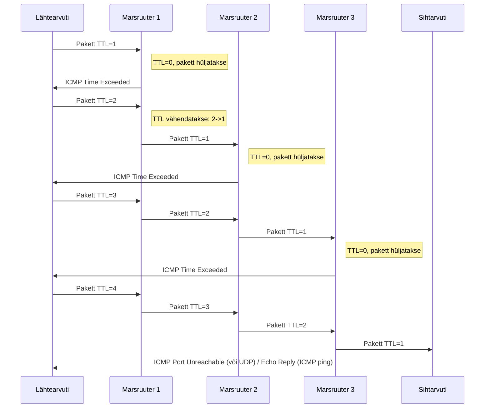
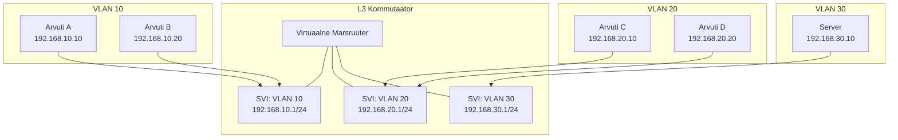

# Teema 18: Inter-VLAN marsruutimine, L3 kommutatsioon ja Traceroute

Source: [https://www.networkacademy.io/ccna/ethernet/intervlan-routing](https://www.networkacademy.io/ccna/ethernet/intervlan-routing)


## Mis on Inter-VLAN marsruutimine?

**Inter-VLAN marsruutimine** on protsess, mis võimaldab erinevates VLAN-ides (virtuaalsetes kohtvõrkudes) paiknevatel seadmetel omavahel suhelda. Kuna VLAN-id eraldavad võrku erinevateks isoleeritud segmentideks, siis on nende vahel suhtlemiseks vajalik marsruutimine 3. tasemel (L3).

### Inter-VLAN marsruutimise lahendused:



## L3 kommutaator ja selle eelised

L3 kommutaator on võrguseade, mis suudab töötada nii OSI mudeli teisel (L2) kui ka kolmandal (L3) tasemel. See tähendab, et see seade suudab teha nii kaadrite kommuteerimist MAC-aadresside alusel kui ka IP-pakettide marsruutimist võrkude vahel.


## Virtuaalsed liidesed: SVI, RVI ja VLANIF - mis nad on?

Virtuaalsed liidesed on L3 kommutaatori võtmekomponendid, mis võimaldavad Inter-VLAN marsruutimist. Need on loogilised (mitte füüsilised) liidesed, mis seovad IP-aadressi VLAN-iga.



| Termin | Tootja | Kirjeldus |
|--------|--------|-----------|
| **SVI** (Switch Virtual Interface) | Cisco | Loogiline liides, mis võimaldab siduda IP-aadressi konkreetse VLAN-iga |
| **RVI** (Routed VLAN Interface) | Juniper | SVI analoog, kasutatakse peamiselt Juniper seadmetes |
| **VLANIF** | Huawei | VLAN-i liides, millele määratakse IP-aadress |

Kõik need kolm on sisuliselt **üks ja sama asi erinevate nimedega**: loogiline liides, mis on seotud VLAN-iga ja mille kaudu toimub IP-pakettide marsruutimine.


### SVI kontseptuaalne mudel

L3 kommutaatoris on virtuaalne marsruuter, millel on erinevad liidesed (SVI-d). Iga SVI on ühendatud konkreetse VLAN-iga ja toimib kui lüüs selle VLAN-i jaoks. Kui pakett peab liikuma ühest VLAN-ist teise:

1. Pakett saabub VLAN-i 10 kaudu kommutaatorisse
2. L3 kommutaator edastab paketi oma virtuaalsele marsruuterile läbi VLAN 10 SVI
3. Virtuaalne marsruuter teeb marsruutimisotsuse oma marsruutimistabeli põhjal
4. Pakett edastatakse õige siht-VLAN-i SVI kaudu
5. Pakett edastatakse sihtkoha VLAN-i

## Miks L3 kommutaatoril on kolm erinevat tüüpi porte?

L3 kommutaator on multifunktsionaalne seade, mis peab täitma erinevaid ülesandeid võrgus. Seetõttu on tal vaja erinevat tüüpi porte erinevate funktsioonide jaoks.



### 1. Access pordid (L2)
- Klassikalised pordid, mis kuuluvad ainult ühte VLAN-i
- Konfigureeritakse käsuga `switchport mode access`
- Töötavad OSI mudeli teisel tasemel
- Näiteks: kui määrate pordi VLAN 10 alla, siis lõppseade (arvuti) ühendatakse sellesse VLAN-i

### 2. Trunk pordid (L2)
- Võimaldavad edastada **mitme VLAN-i liiklust**
- Konfigureeritakse käsuga `switchport mode trunk`
- Töötavad OSI mudeli teisel tasemel
- Kasutatakse kommutaatorite vahel või ühenduses serveritega, mis vajavad ligipääsu mitmele VLAN-ile
- Kaadrid märgistatakse 802.1Q tag-idega, et eristada, millisesse VLAN-i need kuuluvad

### 3. L3 pordid (Routed pordid)
- Need **ei ole L2 pordid**! Need on liidesed ilma VLAN-i seoseta
- Konfigureeritakse käsuga `no switchport` (eemaldab L2 funktsionaalsuse)
- Töötavad otse OSI mudeli kolmandal tasemel
- Täpselt nagu tavalise marsruuteri pordid
- Neile saab määrata IP-aadressi ja kasutada marsruuterite/kommutaatorite ühendamiseks 3. tasemel
- Kasutatakse kui on vaja luua otseühendus teise marsruuteriga ilma VLAN-ita

## SVI erinevus L3 ja L2 kommutaatoril

L2 kommutaatoril olev VLAN liides **ei ole tegelikult SVI** samas tähenduses kui L3 kommutaatoril. Need on fundamentaalselt erinevad, kuigi konfigureerimise süntaks võib olla sarnane.

| Omadus | L3 kommutaator | L2 kommutaator |
|--------|----------------|----------------|
| Terminoloogia | SVI (Switch Virtual Interface) | VLAN liides (mitte tegelik SVI) |
| Funktsioon | Täieõiguslik marsruutimise liides | Ainult haldusliides |
| Marsruutimise võimekus | Suudab marsruutida pakette VLAN-ide vahel | Ei osale marsruutimises |
| Aktiivsete liideste arv | Mitu samaaegselt aktiivset SVI-d | Tavaliselt ainult üks VLAN liides saab olla aktiivne |
| Kasutusjuht | VLAN-ide vaheline liiklus | SSH/Telnet ühendus seadme haldamiseks |
| Sisemine struktuur | Ühendatud virtuaalse marsruuteriga | Lihtsalt halduse jaoks IP-aadress |

L2 kommutaatoril peab lisaks olema määratud `ip default-gateway` käsk, sest tal pole marsruutimise võimekust.

## Kuidas L3 marsruutimine toimib?

Marsruutimine VLAN-ide vahel L3 kommutaatoril toimib sarnaselt klassikalise marsruuteriga:



Kui arvuti VLAN 10-s (192.168.10.10) soovib suhelda arvutiga VLAN 20-s (192.168.20.10):

1. Arvuti kontrollib, kas sihtkoht on samas võrgus.
2. Kuna sihtkoht on erinevas võrgus, saadab arvuti paketi oma vaikelüüsile (192.168.10.1).
3. L3 kommutaator võtab paketi vastu SVI 192.168.10.1 kaudu.
4. Kommutaator kontrollib oma marsruutimistabelit ja leiab, et sihtkoht on otse ühendatud VLAN 20 kaudu.
5. Kommutaator edastab paketi läbi SVI 192.168.20.1 sihtarvutile 192.168.20.10.


## Inter-VLAN marsruutimise konfigureerimine Cisco seadmetel

Inter-VLAN marsruutimise seadistamine L3 kommutaatoril koosneb mitmest sammust:

### L3 kommutaatoril:

```
! 1. Lülitage sisse IP marsruutimine
conf t
ip routing

! 2. Looge vajalikud VLAN-id
vlan 10
 name USERS1
 exit
vlan 20
 name USERS2
 exit
vlan 30
 name SERVERS
 exit

! 3. Looge SVI liidesed igale VLAN-ile
interface vlan 10
 ip address 192.168.10.1 255.255.255.0
 no shutdown
 exit

interface vlan 20
 ip address 192.168.20.1 255.255.255.0
 no shutdown
 exit

interface vlan 30
 ip address 192.168.30.1 255.255.255.0
 no shutdown
 exit

! 4. Konfigureerige pordid VLAN-idesse
interface range gigabitEthernet 0/1-4
 switchport mode access
 switchport access vlan 10
 exit

interface range gigabitEthernet 0/5-8
 switchport mode access
 switchport access vlan 20
 exit

! 5. Konfigureerige trunk pordid
interface gigabitEthernet 0/24
 switchport trunk encapsulation dot1q
 switchport mode trunk
 switchport trunk allowed vlan 10,20,30
 exit
```

⚠️ **Tähtis märkus:** Ilma käsuta `ip routing` marsruutimine **ei tööta**, isegi kui olete liidestel IP-aadressid määranud.

### L2 kommutaatoril:

```
! L2 kommutaatori konfigureerimine
vlan 10
 name USERS1
 exit
vlan 20
 name USERS2
 exit

! Ainult üks haldusliides (mitte SVI marsruutimise mõttes)
interface vlan 1
 ip address 192.168.1.2 255.255.255.0
 no shutdown
 exit

! Vaikimisi lüüs on vajalik, kuna L2 kommutaator ei marsruuti
ip default-gateway 192.168.1.1

! Konfigureerige pordid VLAN-idesse
interface range fastEthernet 0/1-12
 switchport mode access
 switchport access vlan 10
 exit

! Trunk port ühenduseks L3 kommutaatoriga
interface gigabitEthernet 0/1
 switchport mode trunk
 switchport trunk allowed vlan 10,20,30
 exit
```

See on **ainult haldusliides**, mille kaudu saate kommutaatorit hallata. See ei osale marsruutimises.

## Polimisvõrgu veaotsing: Kuidas Traceroute aitab?

`traceroute` (või `tracert` Windowsis) on võimas tööriist võrguprobleemide leidmiseks. Erinevalt `ping` käsust, mis lihtsalt kontrollib sihtkoha kättesaadavust, **näitab traceroute kogu teed, mida mööda paketid liiguvad** lähteseadmest sihtseadmeni.

### Miks traceroute on kasulik veaotsingul:

1. **Identifitseerib marsruutimisprobleemi koha** - näitab, kus täpselt paketid kaovad või hilinevad
2. **Näitab täpset teekonda** - aitab mõista, kuidas võrk on ühendatud
3. **Mõõdab latentsi** - näitab viivitust iga marsruuteri juures
4. **Tuvastab ootamatud marsruutimisteed** - aitab avastada ebaefektiivsusi marsruutimises
5. **Aitab eristada võrgu- ja seadmeprobleeme** - kui traceroute jõuab seadmeni, aga teenus ei vasta, on probleem seadmes, mitte võrgus

### Kuidas `traceroute` täpselt töötab?

`traceroute` kasutab **TTL (Time To Live)** välja IP pakettides, et leida marsruuterid teel sihtpunkti:



1. Saadab paketi TTL=1 väärtusega - see "sureb" esimesel marsruuteril (TTL saab 0), mis saadab tagasi ICMP "Time Exceeded" veateate
2. Seejärel saadetakse pakett TTL=2 väärtusega - see jõuab teise marsruuterini, kes saadab tagasi veateate
3. Protsess jätkub, suurendades TTL väärtust, kuni pakett jõuab sihtpunktini
4. Igas sammus saadetakse tavaliselt 3 paketti, et arvutada keskmine viivitus

### Traceroute väljund näide:

```
$ traceroute 8.8.8.8
1  192.168.1.1  1.123 ms  1.456 ms  1.321 ms
2  10.0.0.1     8.432 ms  8.156 ms  8.321 ms
3  72.14.204.38  15.543 ms  15.332 ms  15.123 ms
4  8.8.8.8      22.651 ms  22.231 ms  22.543 ms
```

### Tähtis teada traceroute'i tõlgendamisel:

- **Tärnid (*)** - marsruuter ei vastanud (võib olla blokeeritud tulemüüri poolt)
- **Kõrge latents** - näitab võimalikku ummistust või probleemi sellel hopil
- **Hopid puuduvad** - mõned marsruuterid võivad olla konfigureeritud mitte vastama ICMP teadetele
- **Erinevad implementatsioonid** - Windows (tracert) kasutab ICMP pakette, Linux (traceroute) kasutab vaikimisi UDP pakette

## Veaotsing Inter-VLAN marsruutimise probleemide puhul

Kui Inter-VLAN marsruutimine ei tööta, on mitu võimalikku põhjust ja kontrollimist vajavat aspekti:

### 1. Kontrollimist vajavad komponendid:

- **IP marsruutimise lubamine** - Kas käsk `ip routing` on aktiivseks tehtud L3 kommutaatoril?
- **SVI liidesed** - Kas kõik SVI-d on loodud ja õige IP-aadressiga? Kas nad on olekus "up"?
- **VLAN-id** - Kas kõik vajalikud VLAN-id on loodud?
- **Trunk pordid** - Kas trunk pordid on õigesti konfigureeritud ja lubavad vajalikke VLAN-e?
- **Vaikelüüsid** - Kas lõppseadmetel on õiged vaikelüüsid konfigureeritud?

### 2. Kasulikud käsud veaotsingul:

```
show ip interface brief      ! Kontrollib liideste olekut ja IP-aadresse
show vlan brief              ! Kontrollib VLAN-ide olemasolu
show interface trunk         ! Kontrollib trunki konfiguratsiooni
show ip route                ! Kontrollib marsruutimistabelit
show running-config          ! Kontrollib jooksvat konfiguratsiooni
```

### 3. Traceroute kasutamine veaotsingul:

```
! Näide: arvuti (192.168.10.10) VLAN 10-s üritab jõuda serverini (192.168.30.10) VLAN 30-s
C:\> tracert 192.168.30.10

Tracing route to 192.168.30.10 over a maximum of 30 hops:

  1    1 ms    1 ms    1 ms  192.168.10.1
  2    2 ms    2 ms    2 ms  192.168.30.10

Trace complete.
```

Õige tulemus peaks näitama ainult kahte hüpet: vaikelüüs (L3 kommutaatori SVI) ja sihtkoht. Kui traceroute näitab ainult ühe hüppe või katkeb pärast vaikelüüsi, võib probleem olla marsruutimises, VLAN-i konfiguratsioonides või tulemüüris.

## Inter-VLAN marsruutimise laiendatud skeem



## Inter-VLAN marsruutimise eelised

| Eelis | Kirjeldus |
|-------|-----------|
| **Kiirus** | L3 kommutaatorid on optimeeritud marsruutimiseks ja pakuvad suuremat jõudlust |
| **Lihtsus** | Puudub vajadus eraldi marsruuteri järele |
| **Skaleeritavus** | Saab hõlpsalt lisada uusi VLAN-e ilma täiendava riistvara vajaduseta |
| **Ressursside optimeerimine** | Liiklus ei pea füüsiliselt liikuma välisele marsruuterile ja tagasi |
| **Ühtsus** | Haldame ühe seadme konfiguratsiooni, mitte mitme |

## Kokkuvõte

L3 kommutaator pakub efektiivset lahendust VLAN-ide vaheliseks suhtluseks, kombineerides L2 kommutatsiooni ja L3 marsruutimise funktsioonid ühes seadmes. See võimaldab suuremat paindlikkust võrgu disainimisel ja haldamisel, eriti keskmise suurusega ja suurtes ettevõttevõrkudes.

Virtuaalsed liidesed (SVI, RVI, VLANIF) on kesksed komponendid, mis võimaldavad sellist funktsionaalsust, sidudes loogilised IP-liidesed konkreetsete VLAN-idega ja võimaldades IP-liikluse marsruutimist VLAN-ide vahel.