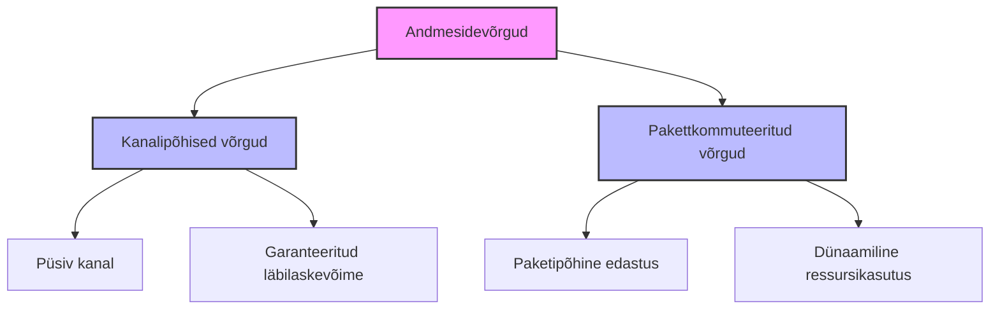
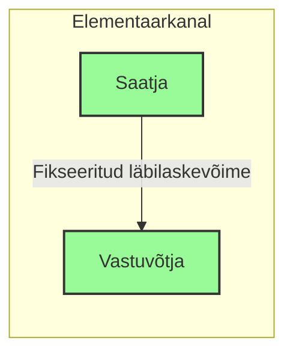
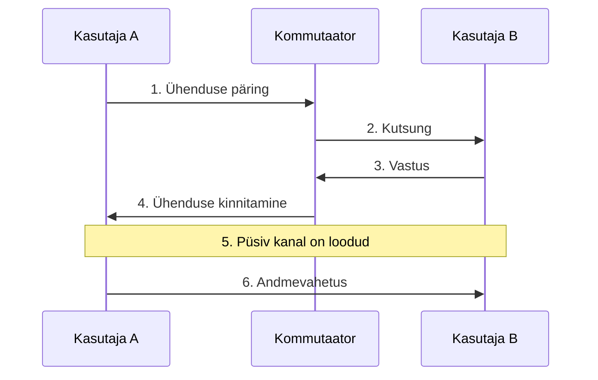
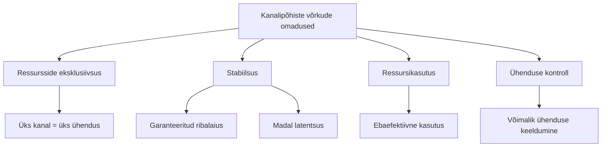
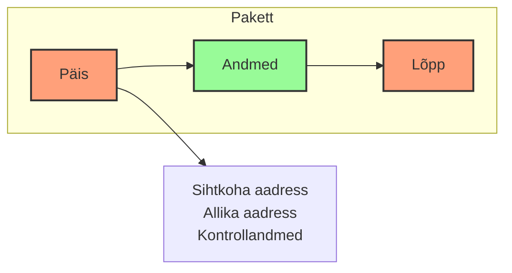
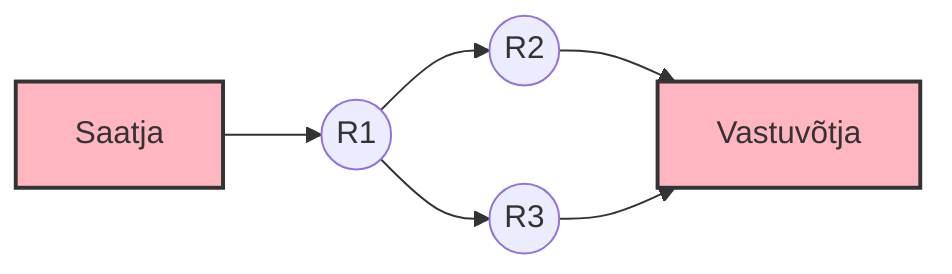
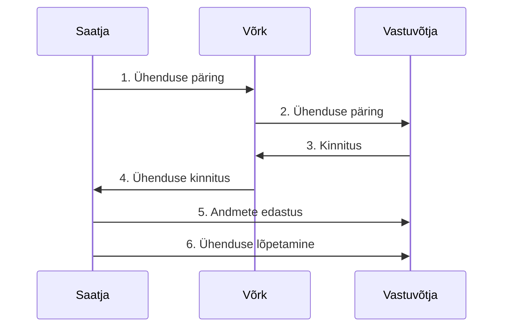
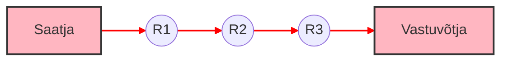
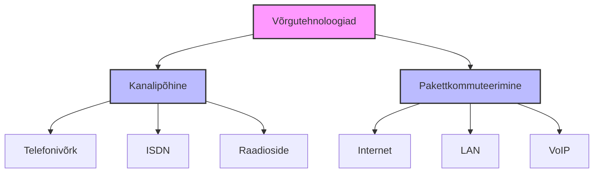

# **Teema 1: Pakettkommuteeritud ja kanalipõhised võrgud**

## **Sisu**

1. [Sissejuhatus](#sissejuhatus)  
2. [Elementaarkanal](#elementaarkanal)  
3. [Kanalipõhine kommuteerimine](#kanalipõhine-kommuteerimine)  
   - [Näide: Telefonivõrgud](#näide-telefonivõrgud)  
   - [Kanalipõhiste võrkude omadused](#kanalipõhiste-võrkude-omadused)  
4. [Pakettkommuteeritud võrgud](#pakettkommuteeritud-võrgud)  
   - [Pakettide edastamise meetodid](#pakettide-edastamise-meetodid)  
     - [Datagrammi edastus](#datagrammi-edastus)  
     - [Loogilise ühenduse loomisega edastus](#loogilise-ühenduse-loomisega-edastus)  
     - [Virtuaalse kanali loomisega edastus](#virtuaalse-kanali-loomisega-edastus)  
5. [Kommuteerimise meetodite võrdlus](#kommuteerimise-meetodite-võrdlus)

## **Sissejuhatus**

Andmesidevõrgud jagunevad kaheks peamiseks tüübiks:
- **Kanalipõhised võrgud**, kus igale ühendusele eraldatakse püsiv andmekanal.  
- **Pakettkommuteeritud võrgud**, kus andmed jagatakse väiksemateks pakettideks ja edastatakse võrgu kaudu.

Mõlemal meetodil on omad eelised ja puudused, sõltuvalt kasutusjuhtudest.

## **Elementaarkanal**

**Elementaarkanal** on kanalipõhise võrgu põhiline tehniline omadus. See esindab kindlaksmääratud läbilaskevõime väärtust, mida kasutatakse abonentide vahelise ühenduse loomiseks.

**Omadused:**
1. Elementaarkanali läbilaskevõime on fikseeritud.  
2. Komposiitkanal koosneb alati elementaarkanalite täisarvust.  
3. Kasutajale eraldatud elementaarkanaleid ei saa kasutada teised kasutajad kuni ühenduse lõppemiseni.  

## **Kanalipõhine kommuteerimine**

Kanalipõhine kommuteerimine hõlmab spetsiaalse kanali eraldamist kahe abonendi vaheliseks suhtluseks. See kanal jääb reserveerituks kogu seansi kestel, tagades püsiva ja häireteta ühenduse.

### **Näide: Telefonivõrgud**  
Telefonivõrk on kanalipõhise kommuteerimise klassikaline näide. Kui kasutaja valib numbri, loob telefonivõrk spetsiaalse kanali, mis jääb kõne ajaks reserveerituks.

### **Kanalipõhiste võrkude omadused**

1. **Ressursside eksklusiivsus:** Üks kanal on reserveeritud ainult ühe ühenduse jaoks.  
2. **Stabiilsus:** Tagatud on kindel ribalaius ja madal latentsus.  
3. **Ebatõhus ressursikasutus:** Kanalid jäävad kasutamata, kui andmeedastus ei ole pidev.  
4. **Ühenduse loomine:** Võrk võib ühenduse loomisest keelduda, kui kõik kanalid on hõivatud.

## **Pakettkommuteeritud võrgud**

Pakettkommuteeritud võrgus jagatakse andmed väiksemateks osadeks ehk **pakettideks**, mis liiguvad sõltumatult läbi võrgu. Iga pakett sisaldab:
- **Andmeid**  
- **Pealkirja (header)**, kus on allika ja sihtkoha aadress.

### **Paketi struktuur:**

**Eelised:**  
- Võrguressursse kasutatakse efektiivsemalt.  
- Võimalik edastada mitmeid andmevooge samaaegselt.  
- Suurem tõrketaluvus.

## **Pakettide edastamise meetodid**

### **1. Datagrammi edastus**

- Andmed jagatakse pakettideks, mida töödeldakse iseseisvalt.  
- Ei ole vaja eelnevalt ühendust luua.  
- **Näited:** IP, UDP.  

**Omadused:**  
- Sobib kiireks ja lihtsaks edastuseks.  
- Ei garanteerita pakettide järjekorda ega kohaletoimetamist.

### **2. Loogilise ühenduse loomisega edastus**

- Loogiline ühendus luuakse enne andmete edastamist.  
- Garanteeritakse andmete järjekord ja terviklikkus.  
- **Näited:** TCP.  

**Protsess:**  
1. Ühenduse loomise päring.  
2. Ühenduse loomise kinnitus.  
3. Andmete edastus.  
4. Ühenduse lõpetamise päring ja kinnitus.

### **3. Virtuaalse kanali loomisega edastus**

- Pakettide liikumiseks määratakse kindel marsruut läbi võrgu.  
- Sobib suure stabiilsusega rakendustele.  
- **Näited:** MPLS, ATM.  

**Eelised:**  
- Püsiv marsruut tagab usaldusväärsuse.  
- Efektiivsem võrguressursside haldamine.

## **Kommuteerimise meetodite võrdlus**

| **Omadus** | **Kanalipõhine kommuteerimine** | **Pakettkommuteerimine** |
|------------|--------------------------------|-----------------------|
| Ribalaiuse garantii | ✓ Tagatud | ✗ Ei ole tagatud |
| Ühenduse loomine | ✓ Vajalik | ✗ Pole vajalik |
| Ressursikasutus | ✗ Vähem efektiivne | ✓ Efektiivne pulsseeriva liiklusega |
| Aadressi kasutamine | Ainult ühenduse loomisel | Iga paketiga kaasas |
| Latentsus | ✓ Madal | ✗ Varieeruv |
| Tõrketaluvus | ✗ Madal | ✓ Kõrge |

### **Rakenduste näited**

