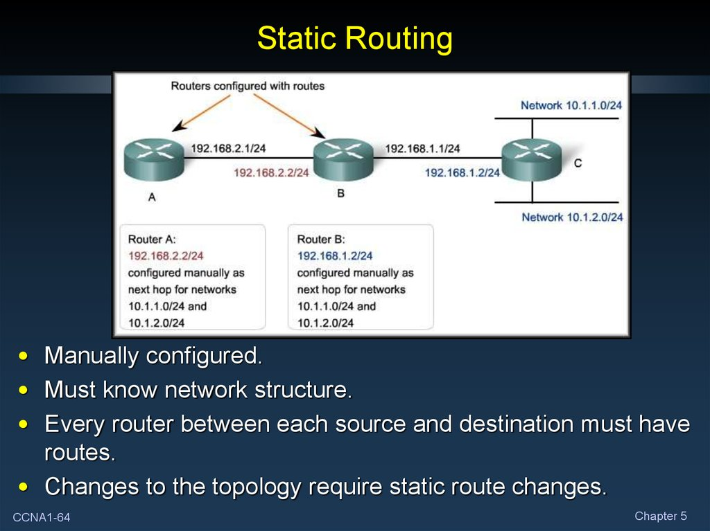
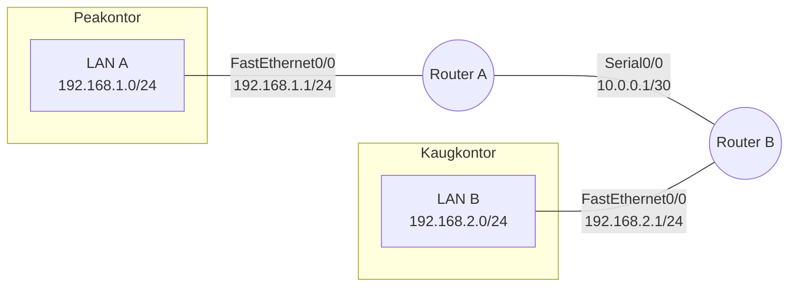
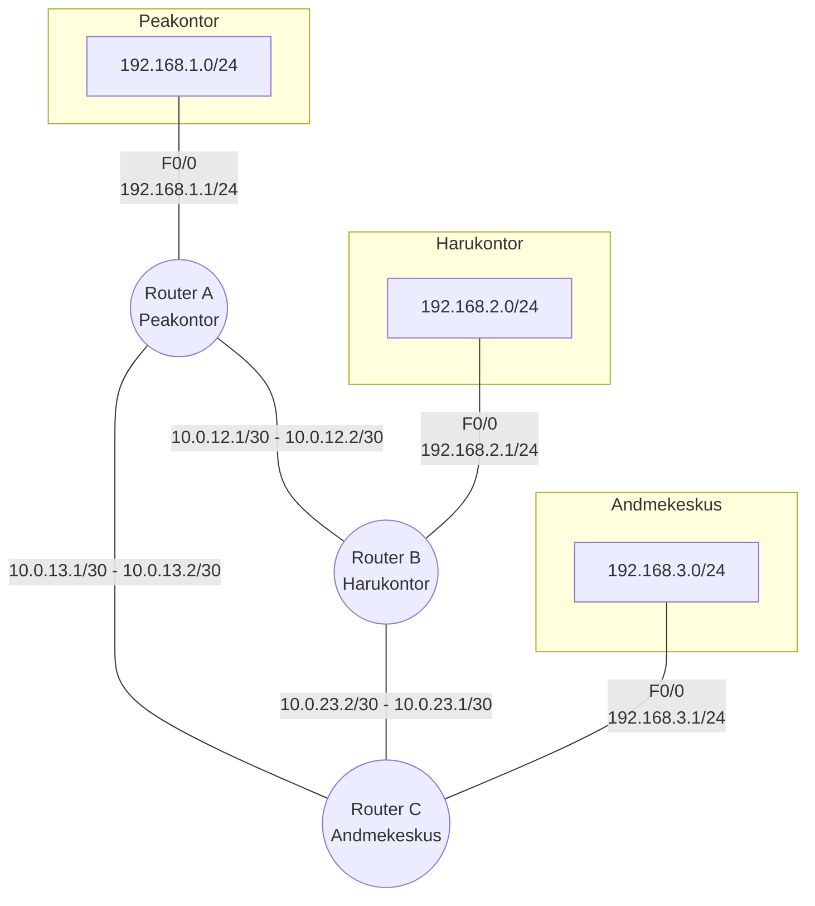

# Teema 20: Staatiline Marsruutimine (Static Routing)

## Sissejuhatus

Staatiline marsruutimine on üks põhilisi võrgumarsruutimise meetodeid, kus võrguadministraator määrab käsitsi ära, kuidas andmepaketid läbi võrgu liiguvad. Erinevalt dünaamilisest marsruutimisest ei muutu staatilised marsruudid automaatselt vastavalt võrgu tingimustele.



## Staatilise marsruutimise põhimõisted

- **Staatiline marsruut**: Käsitsi konfigureeritud tee pakettide liikumiseks sihtkoha võrku
- **Next-hop ruuter**: Järgmine ruuter, kuhu paketid saadetakse sihtkoha võrku jõudmiseks
- **Võrgumask**: Määrab, kui suur osa IP-aadressist viitab võrgule ja kui suur osa seadmele
- **Administratiivne kaugus**: Väärtus, mis määrab marsruutimismeetodi usaldusväärsuse (staatilisel marsruutimisel tavaliselt 1)

## Staatilise marsruudi konfigureerimise süntaks (Cisco)

```
ip route [sihtkoha-võrk] [alamvõrgu-mask] [next-hop-IP või väljundliides] [administratiivne-kaugus]
```

**Näide:**
```
Router(config)# ip route 192.168.2.0 255.255.255.0 10.0.0.2
```

See käsk tähendab: "Saada kõik paketid, mis on mõeldud võrku 192.168.2.0/24, ruuterile IP-aadressiga 10.0.0.2."

## Staatilise marsruutimise tüübid

1. **Tavapärane staatiline marsruut** (Next-Hop)
   ```
   ip route 192.168.2.0 255.255.255.0 10.0.0.2
   ```

2. **Otseselt ühendatud staatiline marsruut** (Exit Interface)
   ```
   ip route 192.168.2.0 255.255.255.0 GigabitEthernet0/0
   ```

3. **Täielikult määratud staatiline marsruut** (Next-Hop + Exit Interface)
   ```
   ip route 192.168.2.0 255.255.255.0 GigabitEthernet0/0 10.0.0.2
   ```

4. **Vaikimisi marsruut** (Default Route)
   ```
   ip route 0.0.0.0 0.0.0.0 10.0.0.2
   ```

## Staatilise marsruutimise eelised

- **Lihtne konfigureerida**: Väikeste võrkude puhul on seadistamine kiire ja sirgjooneline
- **Turvalisus**: Marsruutimisinfo ei jagata võrgus, vähendades turvariske
- **Ressursisäästlik**: Ei vaja täiendavat arvutusvõimsust ega ribalaiust protokollide jaoks
- **Etteaimatavus**: Paketid järgivad alati samu teid, muutes liikluse mustri etteaimatavaks

## Staatilise marsruutimise puudused

- **Ei skaleeru hästi**: Suurtes võrkudes muutub konfiguratsioon keeruliseks ja raskesti hallatavaks
- **Ei kohane muutustega**: Võrgu topoloogia muutumisel on vaja käsitsi uuendada kõiki marsruute
- **Ei taastu automaatselt riketest**: Kui määratud tee on blokeeritud, puudub automaatne alternatiivse tee leidmine
- **Nõuab rohkem haldamist**: Iga uue võrgu lisamisel tuleb käsitsi lisada uued marsruudid

## Millal kasutada staatilist marsruutimist?

- Väikestes võrkudes (alla 10 ruuteri)
- Hierarhilistes või "hub-and-spoke" topoloogiates
- Ühenduseks välismaailmaga (ISP ühendused)
- Kui soovitakse täielikku kontrolli marsruutimise üle
- Varumarsruutidena dünaamilises võrgus

## Õppejuhtum 1: Lihtne kahe kontori võrk

### Stsenaarium
Ettevõttel on kaks kontorit: peakontor ja kaugkontor. Mõlemal kontoril on oma kohtvõrk (LAN) ja neid ühendab üks ruuteritevahelise ühendus.

### Selgitus
Kujutage ette, et meil on kaks maja (peakontor ja kaugkontor). Mõlemas majas on mitu arvutit, mis on omavahel ühendatud - need on kohtvõrgud (LANid). Iga maja uksel on postkast (ruuter). Kui ühe maja inimesed tahavad saata kirju teise majja, panevad nad kirjad oma postkasti.

**Probleem:** Kui arvuti Peakontorist tahab saata info Kaugkontorisse, siis kuidas see teekond välja näeb? Arvuti Peakontoris teab ainult oma postkasti (Ruuter A), aga mitte Kaugkontori postkasti (Ruuter B).

**Lahendus:** Me anname Ruuter A-le juhised: "Kui näed andmepakette, mis on mõeldud Kaugkontori arvutitele (192.168.2.x), saada need Ruuter B-le." Ja vastupidi.

### Võrgu detailid

#### Võrgu diagramm



#### Ruuterite liidesed

| Ruuter | Liides | IP aadress/mask | Kirjeldus |
|--------|--------|-----------------|-----------|
| **Router A** | FastEthernet0/0 | 192.168.1.1/24 | Peakontori kohtvõrk |
| | Serial0/0 | 10.0.0.1/30 | WAN ühendus Router B-ga |
| **Router B** | FastEthernet0/0 | 192.168.2.1/24 | Kaugkontori kohtvõrk |
| | Serial0/0 | 10.0.0.2/30 | WAN ühendus Router A-ga |

### Lahendus

Meie eesmärk on, et arvutid peakontori võrgus (192.168.1.0/24) saaksid suhelda arvutitega kaugkontori võrgus (192.168.2.0/24) ja vastupidi.

#### Marsruutimistabelid

**Router A staatilised marsruudid:**

| Sihtkoht | Võrgumask | Next-Hop | Selgitus |
|----------|-----------|----------|----------|
| 192.168.2.0 | 255.255.255.0 | 10.0.0.2 | Router A saadab paketid kaugkontori LAN-i (192.168.2.0/24) läbi Router B (10.0.0.2) |

**Router B staatilised marsruudid:**

| Sihtkoht | Võrgumask | Next-Hop | Selgitus |
|----------|-----------|----------|----------|
| 192.168.1.0 | 255.255.255.0 | 10.0.0.1 | Router B saadab paketid peakontori LAN-i (192.168.1.0/24) läbi Router A (10.0.0.1) |

#### Konfiguratsioonikäsud

**Router A konfiguratsioon:**

```
! Siseneme globaalsesse konfiguratsioonireziimi
Router_A> enable
Router_A# configure terminal

! Lisame staatilise marsruudi kaugkontori võrku
Router_A(config)# ip route 192.168.2.0 255.255.255.0 10.0.0.2

! Salvestame konfiguratsiooni
Router_A(config)# end
Router_A# write memory
```

**Selgitus:** Me ütleme Router A-le: "Kui keegi tahab saata andmeid võrku 192.168.2.0 (Kaugkontorisse), siis saada need aadressile 10.0.0.2 (Router B)."

**Router B konfiguratsioon:**

```
! Siseneme globaalsesse konfiguratsioonireziimi
Router_B> enable
Router_B# configure terminal

! Lisame staatilise marsruudi peakontori võrku
Router_B(config)# ip route 192.168.1.0 255.255.255.0 10.0.0.1

! Salvestame konfiguratsiooni
Router_B(config)# end
Router_B# write memory
```

**Selgitus:** Me ütleme Router B-le: "Kui keegi tahab saata andmeid võrku 192.168.1.0 (Peakontorisse), siis saada need aadressile 10.0.0.1 (Router A)."

#### Kontrollimine ja verifitseerimine

Peale marsruutide lisamist saame kontrollida, kas marsruudid on korrektselt lisatud ja kas ühendus toimib:

1. **Kontrollime marsruutimistabelit:**
   ```
   Router_A# show ip route
   ```
   
   Väljundis peaks olema näha staatiliselt lisatud marsruut (tähistatud "S" tähega):
   ```
   S    192.168.2.0/24 [1/0] via 10.0.0.2
   ```
   
   **Selgitus:** See on nagu vaadata postkasti sisemusse ja veenduda, et meie juhised on sinna kirja pandud.

2. **Kontrollime ühenduvust ping-käsuga:**
   ```
   Router_A# ping 192.168.2.1
   ```
   
   **Selgitus:** Me saadame väikese proovipaketi (nagu testkiri) teise võrku ja vaatame, kas see tuleb tagasi.

   Kui kõik on korrektselt seadistatud, peaks ping olema edukas.

3. **Kontrollime ühenduvust arvutist arvutisse:**
   Peakontori arvutist (nt. 192.168.1.10) peaks saama pingida kaugkontori arvutit (nt. 192.168.2.10).

### Selle õppejuhtumi selgitus

Selles lihtsamaks tehtud näites:

1. Ruuter A teab, kuidas edastada pakette oma kohalikus LAN-võrgus (192.168.1.0/24), kuna see on otse ühendatud.
2. Ruuter B teab, kuidas edastada pakette oma kohalikus LAN-võrgus (192.168.2.0/24), kuna see on otse ühendatud.
3. **Staatiliste marsruutide eesmärk** on õpetada:
   - Ruuter A-le, kuidas jõuda võrku 192.168.2.0/24 (läbi Ruuter B)
   - Ruuter B-le, kuidas jõuda võrku 192.168.1.0/24 (läbi Ruuter A)

See on staatilise marsruutimise põhiolemus - administraator ütleb käsitsi igale ruuterile, kuidas jõuda võrkudesse, millega ruuter pole otse ühendatud.

**Analoogia:** See on nagu anda postkastile juhised, kuidas kirjad edasi toimetada. "Kui näed kirja, mis on adresseeritud Kaugkontorisse, siis anna see edasi Ruuter B-le." Suuremates võrkudes (paljude postkastidega) oleks vaja palju selliseid juhiseid, mistõttu kasutatakse keerulisemates võrkudes dünaamilist marsruutimist, kus postkastid (ruuterid) jagavad omavahel infot automaatselt.

## Õppejuhtum 2: Kolme kontori täisühendusega võrk

### Stsenaarium
Ettevõttel on kolm kontorit: peakontor, harukontor ja andmekeskus. Kõik kontorid on ühendatud täielikult võrgustatult, st igal kontoril on otseühendus ülejäänud kahe kontoriga.

### Võrgu detailid

#### Võrgu diagramm



### Lahendus

#### Marsruutimistabelid

**Router A (Peakontor) staatilised marsruudid:**

| Sihtkoht | Võrgumask | Next-Hop | Admin. kaugus | Selgitus |
|----------|-----------|----------|--------------|----------|
| 192.168.2.0 | 255.255.255.0 | 10.0.12.2 | 1 | Router A saadab paketid Harukontori LAN-i läbi Router B |
| 192.168.3.0 | 255.255.255.0 | 10.0.13.2 | 1 | Router A saadab paketid Andmekeskuse LAN-i läbi Router C |
| 10.0.23.0 | 255.255.255.252 | 10.0.12.2 | 1 | Router A saadab paketid R2-R3 WAN-i läbi Router B (põhitee) |
| 10.0.23.0 | 255.255.255.252 | 10.0.13.2 | 2 | Router A saadab paketid R2-R3 WAN-i läbi Router C (varumarsruut) |

**Router B (Harukontor) staatilised marsruudid:**

| Sihtkoht | Võrgumask | Next-Hop | Admin. kaugus | Selgitus |
|----------|-----------|----------|--------------|----------|
| 192.168.1.0 | 255.255.255.0 | 10.0.12.1 | 1 | Router B saadab paketid Peakontori LAN-i läbi Router A |
| 192.168.3.0 | 255.255.255.0 | 10.0.23.1 | 1 | Router B saadab paketid Andmekeskuse LAN-i läbi Router C |
| 10.0.13.0 | 255.255.255.252 | 10.0.12.1 | 1 | Router B saadab paketid R1-R3 WAN-i läbi Router A (põhitee) |
| 10.0.13.0 | 255.255.255.252 | 10.0.23.1 | 2 | Router B saadab paketid R1-R3 WAN-i läbi Router C (varumarsruut) |

**Router C (Andmekeskus) staatilised marsruudid:**

| Sihtkoht | Võrgumask | Next-Hop | Admin. kaugus | Selgitus |
|----------|-----------|----------|--------------|----------|
| 192.168.1.0 | 255.255.255.0 | 10.0.13.1 | 1 | Router C saadab paketid Peakontori LAN-i läbi Router A |
| 192.168.2.0 | 255.255.255.0 | 10.0.23.2 | 1 | Router C saadab paketid Harukontori LAN-i läbi Router B |
| 10.0.12.0 | 255.255.255.252 | 10.0.13.1 | 1 | Router C saadab paketid R1-R2 WAN-i läbi Router A (põhitee) |
| 10.0.12.0 | 255.255.255.252 | 10.0.23.2 | 2 | Router C saadab paketid R1-R2 WAN-i läbi Router B (varumarsruut) |

#### Konfiguratsioonikäsud

**R1 konfiguratsioon (Peakontor):**

```
! Marsruut Harukontori LAN-i
R1(config)# ip route 192.168.2.0 255.255.255.0 10.0.12.2

! Marsruut Andmekeskuse LAN-i
R1(config)# ip route 192.168.3.0 255.255.255.0 10.0.13.2

! Marsruut R2-R3 vahelisele ühendusele (vajalik täielikuks ühenduvuseks)
R1(config)# ip route 10.0.23.0 255.255.255.252 10.0.12.2
! Alternatiivne marsruut sama võrgu jaoks läbi teise tee
R1(config)# ip route 10.0.23.0 255.255.255.252 10.0.13.2 2
```

**R2 konfiguratsioon (Harukontor):**

```
! Marsruut Peakontori LAN-i
R2(config)# ip route 192.168.1.0 255.255.255.0 10.0.12.1

! Marsruut Andmekeskuse LAN-i
R2(config)# ip route 192.168.3.0 255.255.255.0 10.0.23.1

! Marsruut R1-R3 vahelisele ühendusele (vajalik täielikuks ühenduvuseks)
R2(config)# ip route 10.0.13.0 255.255.255.252 10.0.12.1
! Alternatiivne marsruut sama võrgu jaoks läbi teise tee
R2(config)# ip route 10.0.13.0 255.255.255.252 10.0.23.1 2
```

**R3 konfiguratsioon (Andmekeskus):**

```
! Marsruut Peakontori LAN-i
R3(config)# ip route 192.168.1.0 255.255.255.0 10.0.13.1

! Marsruut Harukontori LAN-i
R3(config)# ip route 192.168.2.0 255.255.255.0 10.0.23.2

! Marsruut R1-R2 vahelisele ühendusele (vajalik täielikuks ühenduvuseks)
R3(config)# ip route 10.0.12.0 255.255.255.252 10.0.13.1
! Alternatiivne marsruut sama võrgu jaoks läbi teise tee
R3(config)# ip route 10.0.12.0 255.255.255.252 10.0.23.2 2
```

### Testimine ja verifitseerimine
1. Kontrollige marsruutimistabelit:
   ```
   Router# show ip route
   ```

2. Kontrollige ühenduvust:
   ```
   Router# ping 192.168.2.1
   Router# traceroute 192.168.3.1
   ```

3. Simuleerige rikkeolukorda (näiteks lülitage R1-R2 ühendus välja) ja vaadake, kuidas see mõjutab ühenduvust.

## Floating Static Routes (Ujuvad staatilised marsruudid)

Ujuvad staatilised marsruudid on staatilised marsruudid, millele on määratud suurem administratiivne kaugus. Need toimivad varumarsruutidena, kui põhimarsruut muutub kättesaamatuks.

**Näide:**
```
! Põhimarsruut - administratiivne kaugus 1 (vaikimisi)
R1(config)# ip route 192.168.2.0 255.255.255.0 10.0.12.2

! Varumarsruut - administratiivne kaugus 5
R1(config)# ip route 192.168.2.0 255.255.255.0 10.0.13.2 5
```

## Vaikimisi marsruut (Default Route)

Vaikimisi marsruut määrab, kuhu saata paketid, mille sihtkoha kohta puudub konkreetne marsruut. See on kasulik eelkõige Interneti ühenduse konfigureerimisel.

```
Router(config)# ip route 0.0.0.0 0.0.0.0 10.0.0.1
```

## Praktilised soovitused

1. **Dokumenteerimine**: Säilitage alati ajakohastatud dokumentatsioon kõigi staatiliste marsruutide kohta
2. **Planeerimine**: Planeerige oma võrk põhjalikult enne marsruutide konfigureerimist
3. **Testimine**: Testige kõiki võimalikke stsenaariumeid, sealhulgas riketest taastumist
4. **Varundamine**: Kasutage ujuvaid staatilisi marsruute kriitiliste ühenduste jaoks

[](http://www.youtube.com/watch?v=wqE9mqICsV4)
