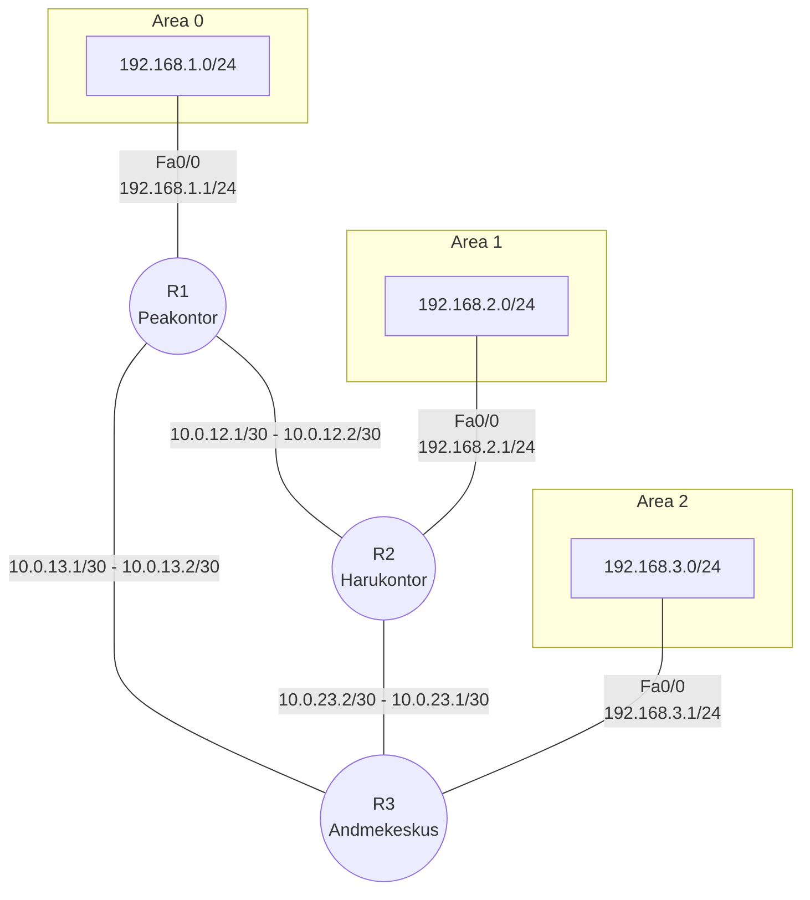

# Teema 21: Dünaamiline Marsruutimine (Dynamic Routing)

## Sissejuhatus

Dünaamiline marsruutimine on võrgumarsruutimise meetod, kus ruuterid vahetavad automaatselt marsruutimisinfot marsruutimisprotokollide abil. Erinevalt staatilisest marsruutimisest, kus administraator peab käsitsi kõik marsruudid konfigureerima, suudavad dünaamilised marsruutimisprotokollid automaatselt kohaneda võrgu topoloogia muutustega.


## Dünaamilise marsruutimise põhimõisted

- **Marsruutimisprotokoll**: Reeglistik, mille alusel ruuterid omavahel suhtlevad ja marsruutimisinfot vahetavad
- **Konvergents**: Aeg, mis kulub kõikide ruuterite marsruutimistabelite sünkroniseerimisele pärast võrgu muutust
- **Meetrika**: Väärtus, mille alusel määratakse parim tee sihtkoha võrku (nt hüpete arv, ribalaiuse, viivitus)
- **Administratiivne kaugus (AD)**: Väärtus, mis määrab marsruutimisprotokollide usaldusväärsuse järjekorra


## Marsruutimisprotokollide administratiivsed kaugused (Cisco)

| Marsruutimismeetod | Administratiivne kaugus |
|--------------------|-------------------------|
| Otseühendatud võrk | 0 |
| Staatiline marsruut | 1 |
| EIGRP kokkuvõte | 5 |
| BGP (väline) | 20 |
| EIGRP (sisemine) | 90 |
| IGRP | 100 |
| OSPF | 110 |
| IS-IS | 115 |
| RIP | 120 |
| EIGRP (väline) | 170 |
| BGP (sisemine) | 200 |
| Tundmatu sihtkoht | 255 (ei marsruutida) |

## Dünaamiliste marsruutimisprotokollide klassifikatsioon

### Sisemine vs välimine
- **IGP (Interior Gateway Protocol)**: Kasutatakse ühe autonoomse süsteemi (AS) piires (nt RIP, EIGRP, OSPF)
- **EGP (Exterior Gateway Protocol)**: Kasutatakse erinevate autonoomsete süsteemide vahel (nt BGP)

### Vektor-kaugus vs link-state
- **Vektor-kaugus (Distance-Vector)**: 
  - Ruuterid jagavad kogu oma marsruutimistabelit naabrite vahel
  - Lihtne seadistada, vähem resurssimahukas
  - Aeglasem konvergents
  - Näited: RIP, IGRP

- **Link-state (olekupõhine)**:
  - Ruuterid jagavad infot ainult otseühenduste kohta
  - Iga ruuter ehitab kogu võrgu topoloogilise kaardi
  - Kiirem konvergents, kuid vajab rohkem ressursse
  - Näited: OSPF, IS-IS

- **Täiustatud vektor-kaugus (Advanced Distance-Vector)**:
  - Hübriid eelnevatest, kombineerib mõlema eeliseid
  - Näide: EIGRP


### Klassipõhine vs klassivaba
- **Klassipõhine (Classful)**: Ei edasta alamvõrgu maski marsruutimis-uuendustes (nt RIPv1, IGRP)
- **Klassivaba (Classless)**: Edastab alamvõrgu maski marsruutimis-uuendustes (nt RIPv2, EIGRP, OSPF, BGP)

## Populaarsed dünaamilised marsruutimisprotokollid

### RIP (Routing Information Protocol)

RIP on üks vanemaid ja lihtsamaid marsruutimisprotokolle, mis põhineb vektor-kaugus algoritmil.

#### Põhiomadused:
- **Meetrika**: Hüpete arv (maksimaalselt 15 hüpet, 16 = lõpmatu)
- **Uuenduste sagedus**: Iga 30 sekundi järel
- **Administratiivne kaugus**: 120
- **Versioonid**: RIPv1 (klassipõhine) ja RIPv2 (klassivaba)

#### RIP konfigureerimine (Cisco):
```
Router(config)# router rip
Router(config-router)# version 2
Router(config-router)# network 192.168.1.0
Router(config-router)# network 10.0.0.0
Router(config-router)# no auto-summary
```

### OSPF (Open Shortest Path First)

This article explains how the [OSPF Routing Protocol is implemented using Dijkstra's Algorithm](https://thespecguy.medium.com/how-is-ospf-routing-protocol-implemented-using-dijkstras-algorithm-94d8f50a9055).


OSPF on laialdaselt kasutatav link-state marsruutimisprotokoll, mis kasutab Dijkstra lühima tee algoritmi.

#### Põhiomadused:
- **Meetrika**: Kulu (cost), tavaliselt arvutatakse liidese ribalaiuse põhjal
- **Uuendused**: Toimuvad ainult muutuste korral või iga 30 minuti järel
- **Administratiivne kaugus**: 110
- **Struktuur**: Võib olla jagatud erinevateks aladeks (areas) hierarhia loomiseks


#### OSPF konfigureerimine (Cisco):
```
Router(config)# router ospf 1
Router(config-router)# network 192.168.1.0 0.0.0.255 area 0
Router(config-router)# network 10.0.0.0 0.0.0.3 area 0
```

### EIGRP (Enhanced Interior Gateway Routing Protocol)

EIGRP on Cisco loodud täiustatud vektor-kaugus protokoll, mis kombineerib vektor-kaugus ja link-state protokollide parimaid omadusi.


#### Põhiomadused:
- **Meetrika**: Kombinatsioon ribalaiusest, viivitusest, koormusest ja usaldusväärsusest
- **Uuendused**: Toimuvad ainult muutuste korral
- **Administratiivne kaugus**: 90 (sisene), 170 (väline)
- **Eelised**: Kiire konvergents, efektiivne ribalaiuse kasutus, VLSM (Variable Length Subnet Mask) tugi

#### EIGRP konfigureerimine (Cisco):
```
Router(config)# router eigrp 100
Router(config-router)# network 192.168.1.0
Router(config-router)# network 10.0.0.0
Router(config-router)# no auto-summary
```

### BGP (Border Gateway Protocol)

BGP on peamine marsruutimisprotokoll Internetis, mida kasutatakse autonoomsete süsteemide vahel.

#### Põhiomadused:
- **Tüüp**: Path-vector protokoll (tee-vektor)
- **Meetrika**: Mitmed atribuudid (AS teekond, alguspunkt, jne)
- **Ühendus**: Kasutab TCP porti 179 usaldusväärse ühenduse loomiseks
- **Kasutus**: Peamiselt ISP-de vahel või suurtes ettevõtetes

#### BGP konfigureerimine (Cisco):
```
Router(config)# router bgp 65000
Router(config-router)# neighbor 192.168.1.2 remote-as 65001
Router(config-router)# network 10.0.0.0 mask 255.255.255.0
```

## Dünaamilise marsruutimise eelised

- **Automaatne kohanemine**: Võrgu muutuste korral uuendatakse marsruutimistabelid automaatselt
- **Skaleeritavus**: Sobib suurte ja keerukate võrkude jaoks
- **Lihtsam haldamine**: Uue võrgu lisamisel on vaja konfigureerida vähem marsruute
- **Tõrkesiirdus**: Võimaldab automaatselt leida alternatiivse tee, kui põhitee on blokeeritud
- **Koormuse jaotamine**: Mõned protokollid (nt EIGRP, OSPF) võimaldavad liiklust jagada mitme tee vahel

## Dünaamilise marsruutimise puudused

- **Ressursikasutus**: Nõuab rohkem protsessori võimsust, mälu ja ribalaiust
- **Keerukus**: Konfigureerimine ja veaotsing võivad olla keerulisemad
- **Turvalisus**: Ilma täiendava turvalisuseta võib olla haavatavam rünnakutele
- **Ennustamatus**: Paketid võivad järgida erinevaid teid olenevalt võrgu olukorrast

## Study Case 1: OSPF kolme kontori võrgustikus

### Stsenaarium
Ettevõttel on kolm kontorit - peakontor, harukontor ja andmekeskus - mis on kõik ühendatud. Soovime konfigureerida OSPF nii, et kõik võrgud oleksid ligipääsetavad.

### Võrgu detailid

#### Võrgu diagramm



### OSPF konfiguratsioon

#### R1 (Peakontor) konfiguratsioon:

```
R1> enable
R1# configure terminal

! Käivitame OSPF protsessi ID-ga 1
R1(config)# router ospf 1

! Määrame ruuteri ID (soovituslik, kuid mitte kohustuslik)
R1(config-router)# router-id 1.1.1.1

! Lisame võrgud OSPF protsessi
! NB! Võrgud määratakse koos wildcard maskiga (vastupidine võrgumaskile)
R1(config-router)# network 192.168.1.0 0.0.0.255 area 0
R1(config-router)# network 10.0.12.0 0.0.0.3 area 0
R1(config-router)# network 10.0.13.0 0.0.0.3 area 0

R1(config-router)# exit
R1(config)# exit
R1# write memory
```

#### R2 (Harukontor) konfiguratsioon:

```
R2> enable
R2# configure terminal

! Käivitame OSPF protsessi ID-ga 1
R2(config)# router ospf 1

! Määrame ruuteri ID
R2(config-router)# router-id 2.2.2.2

! Lisame võrgud OSPF protsessi
R2(config-router)# network 192.168.2.0 0.0.0.255 area 1
R2(config-router)# network 10.0.12.0 0.0.0.3 area 0
R2(config-router)# network 10.0.23.0 0.0.0.3 area 1

R2(config-router)# exit
R2(config)# exit
R2# write memory
```

#### R3 (Andmekeskus) konfiguratsioon:

```
R3> enable
R3# configure terminal

! Käivitame OSPF protsessi ID-ga 1
R3(config)# router ospf 1

! Määrame ruuteri ID
R3(config-router)# router-id 3.3.3.3

! Lisame võrgud OSPF protsessi
R3(config-router)# network 192.168.3.0 0.0.0.255 area 2
R3(config-router)# network 10.0.13.0 0.0.0.3 area 0
R3(config-router)# network 10.0.23.0 0.0.0.3 area 1

R3(config-router)# exit
R3(config)# exit
R3# write memory
```

### Selgitus

OSPF konfiguratsioonis lõime kolm ala (area):
- **Area 0**: Põhiala (backbone area), kuhu kuuluvad peakontor ja ühendused teiste kontoritega
- **Area 1**: Harukontori ala
- **Area 2**: Andmekeskuse ala

Kõik alad on ühendatud area 0 kaudu, mis on OSPF hierarhia nõue. See võimaldab efektiivsemat marsruutimisinfo haldust, kuna täielik topoloogia info on vajalik ainult ala siseselt.

### Kontrollimine

OSPF konfiguratsiooni kontrollimiseks saab kasutada järgmisi käske:

1. **OSPF naabrite kuvamine:**
   ```
   R1# show ip ospf neighbor
   ```

2. **OSPF marsruutimistabeli kuvamine:**
   ```
   R1# show ip route ospf
   ```

3. **OSPF protsesside info kuvamine:**
   ```
   R1# show ip ospf
   ```

4. **OSPF liideste info kuvamine:**
   ```
   R1# show ip ospf interface
   ```

## Study Case 2: EIGRP konfigureerimine

# Dünaamiline Marsruutimine

## Mis asi see dünaamiline marsruutimine üldse on?

Dünaamiline marsruutimine on nagu nutikad teeviidad võrgus. Erinevalt staatilisest marsruutimisest, kus administraator peab iga tee käsitsi seadistama, suudavad dünaamilised marsruutimisprotokollid ise omavahel rääkida ja automaatselt leida parima tee.


**Miks see kasulik on?**
- Kui võrgus midagi muutub (link läheb maha, lisandub uus võrk), kohanevad ruuterid automaatselt
- Suurtes võrkudes pole vaja iga ruuterit käsitsi seadistada
- Kui põhitee läheb maha, leitakse automaatselt varutee

## Staatiline vs dünaamiline marsruutimine

Staatiline marsruutimine on nagu jäik teeviit, mis näitab alati sama suunda, isegi kui tee on suletud. Dünaamiline marsruutimine on aga nagu GPS, mis ütleb: "Oi, see tee on kinni, lähme teist teed!"

| Staatiline | Dünaamiline |
|------------|-------------|
| Käsitsi iga marsruut | Automaatne pärast protokolli seadistamist |
| Sobib väikesele võrgule | Sobib suurele, keerukale võrgule |
| Ei reageeri muutustele | Kohaneb automaatselt muutustega |
| Lihtne seadistada | Natuke keerulisem, aga võimsam |
| Vähe ressursse (CPU, mälu) | Rohkem ressursse |

## Milliseid marsruutimisprotokolle on olemas?

### Protokollid jagunevad kahte suurde gruppi:

**1. Vektor-kaugus protokollid (Distance-Vector)**
- Töötavad põhimõttel "Kuule naaber, tean sihtkohta X - see on minust 3 hüpet eemal!"
- Iga ruuter teab ainult, mida naabrid talle ütlevad, mitte kogu võrgu topoloogiat
- Näited: EIGRP (Cisco erikaup), vanasti RIP (tänapäeval aegunud)

**2. Link-state protokollid (olekupõhised)**
- Töötavad põhimõttel "Siin on info KÕIGI minu otseühenduste kohta. Levitage see kogu võrku!"
- Iga ruuter teab kogu võrgu topoloogiat ja arvutab ise parima tee
- Kiirem reaktsioon muutustele, aga vajab rohkem ressursse
- Näited: OSPF (kõige levinum), IS-IS


### Ruuteri jaoks prioiriteetsus (Administratiivne kaugus - AD)

Ruuter valib teede vahel AD põhjal - mida väiksem number, seda usaldusväärsem:

| Mis marsruut? | Administratiivne kaugus (AD) |
|---------------|------------------------------|
| Otseühendus | 0 |
| Staatiline | 1 |
| EIGRP (sisemine) | 90 |
| OSPF | 110 |
| EIGRP (väline) | 170 |
| Tundmatu sihtkoht | 255 (ei marsruudita) |

Kui sama sihtkoha jaoks on mitu marsruuti, siis võidab väiksema AD väärtusega!

## Kuidas need protokollid tegelikult töötavad?

### Vektor-kaugus protokollid

Need on nagu kooliklatš:

1. Ruuter A: "Mina tean võrku 192.168.1.0, see on minust otse!"
2. Ruuter B kuuleb seda ja ütleb: "Mina tean võrku 192.168.1.0, see on minust 1 hüppe kaugusel (läbi A)!"
3. Ruuter C kuuleb B-d ja ütleb: "Mina tean võrku 192.168.1.0, see on minust 2 hüpet kaugusel (läbi B)!"


**Probleemid ja lahendused:**

Kui link katkeb, võib tekkida "loenda lõpmatuseni" probleem ja marsruutimissilmused. Lahendamiseks on:

- **Split horizon** - Ära räägi tagasi seda, mida kuulsid! (Ära saada infot tagasi sinna, kust see tuli)
  

- **Route poisoning** - Kui tee katkeb, märgi see "mürgiseks" (kaugus = lõpmatu)
  

- **Triggered updates** - Ära oota järgmist uuendust, saada kohe teade kui midagi muutub!
  

### Link-state protokollid

See on nagu ühine kaardi koostamine:

1. Iga ruuter koostab "kaardilehe" AINULT oma otseühenduste kohta
2. Kõik "kaardilehed" saadetakse KÕIGILE ruuteritele võrgus
3. Igal ruuteril on lõpuks identne kaart kogu võrgust
4. Iga ruuter arvutab oma kaardi põhjal iseseisvalt parima tee


## 3 peamist protokolli, mida tegelikult kasutatakse

### 1. OSPF

**Mis see on?** Kõige levinum protokoll - avatud standard, sobib iga tootja seadmetele

**Põhiomadused:**
- Link-state protokoll (iga ruuter teab kogu kaarti)
- Jagab võrgu "aladeks" (väiksemateks tükkideks), et suured võrgud saaksid skaleeruda
- Kiire reageerimine muutustele
- Meetrika: "kulu" - tavaliselt põhineb liidese ribalaiusel


**OSPF alad (areas):**
- Area 0 on selgroog (backbone), millega teised alad ühenduvad
- Alad piiravad uuenduste levikut - ühe ala muutused ei mõjuta teisi


### 2. EIGRP (Enhanced Interior Gateway Routing Protocol)

**Mis see on?** Cisco enda protokoll, töötab AINULT Cisco seadmetel

**Põhiomadused:**
- Hübriidprotokoll - kombineerib vektor-kaugus ja link-state parimaid omadusi
- Väga kiire reageerimine muutustele
- Keerukam meetrika: arvestab ribalaiust, viivitust ja teisi faktoreid
- Väljakutse: töötab ainult Cisco seadmetel!


EIGRP puhul on olulised kaks mõistet:
- Successor (parim tee)
- Feasible Successor (varutee, mida kohe kasutatakse, kui parim tee läheb maha)

EIGRP reageerib nii: kui parim tee läheb maha, kasutatakse KOHE varuteed ilma mingite arvutusteta!

### 3. BGP (Border Gateway Protocol)

**Mis see on?** Internetiselgroo protokoll, ühendab erinevaid autonoomseid süsteeme (AS)

**Põhiomadused:**
- Kasutavad ISP-d ja suured ettevõtted
- Väga skaleeruv (kogu internet sõltub sellest!)
- Valikud põhinevad poliitikatel ja reeglitel, mitte ainult kiirusel
- Töötab aeglasemalt, aga stabiilsemalt kui teised protokollid

## Autonoomsed süsteemid (AS)

Autonoomne süsteem on võrkude kogum ühe administratiivse kontrolli all, millel on oma unikaalne number (ASN).


- **IGP** protokollid (OSPF, EIGRP) töötavad ühe AS-i SEES
- **EGP** protokollid (BGP) töötavad AS-ide VAHEL

## Loopback liidesed - mis need on ja miks neid vaja on?

Loopback liides on virtuaalne liides, mis on ALATI üleval, kui ruuter töötab - see ei lähe kunagi "maha" nagu füüsilised liidesed.


**Mis asi see üldse on?**
- See on virtuaalne, mitte füüsiline - teda pole "päriselt" olemas
- Seda ei pea ühendama ühegi kaabliga
- Ta on alati "up/up" olekus, kuni ruuter töötab
- Ta on nagu virtuaalne "maja" ruuteri sees, millel on oma IP-aadress

**Loopback liidest saab seadistada nii:**
```
Router(config)# interface loopback 0
Router(config-if)# ip address 10.0.0.1 255.255.255.255
```

**Milleks loopback liidest kasutatakse?**

1. **Router ID määramiseks**
   - Paljud protokollid (eriti OSPF) vajavad ruuteri ID-d 
   - Kui ruuteri ID pole käsitsi määratud, kasutatakse automaatselt kõrgeimat IP-aadressi
   - Loopback on parim valik - see POLE kunagi "down" olekus!
   - Näide OSPF puhul:
   ```
   Router(config)# router ospf 1
   Router(config-router)# router-id 1.1.1.1
   ```

2. **Stabiilseks haldusligipääsuks**
   - Kui tahad alati oma ruuteritele ligi pääseda (SSH, Telnet), siis loopback on parim
   - Kui üks füüsiline liides läheb maha, saad endiselt loopback aadressile ühenduda

3. **BGP naabrite sidumiseks**
   - BGP naabrussuhted tehakse tihti loopback aadresside vahel
   - See tähendab, et BGP sessioon jääb püsima isegi kui otsene füüsiline ühendus läheb maha
   - Näide BGP puhul:
   ```
   Router(config)# router bgp 65000
   Router(config-router)# neighbor 192.168.200.1 remote-as 65000
   Router(config-router)# neighbor 192.168.200.1 update-source loopback 0
   ```

4. **Teste ja diagnostika tegemiseks**
   - Loopback-i saab alati "pingida", mis aitab võrgu probleeme lahendada
   - Saab simuleerida "päris" võrke, ilma et peaksid füüsilisi seadmeid lisama

**Tegelik näide:**
Kujuta ette, et sul on 3 füüsilist liidest ruuteril, ning kõik kolm saavad olla "maha" olekus. Kui määrad OSPF ruuteri ID kasutades füüsilise liidese IP-d ja see liides läheb maha, siis tekivad probleemid! Loopback aga on ALATI üleval - see on nagu "virtuaalne" liides, mis ei sõltu füüsilistest asjadest.

**Nõuanne:**
Alati tee oma võrgu ruuteritele loopback liidesed. See teeb haldamise lihtsamaks ja võrgu stabiilsemaks!

## Kuidas marsruutimisprotokolli valida?

| Võrgu suurus | Parim valik | Põhjus |
|--------------|-------------|--------|
| 1-3 ruuterit | Staatiline | Lihtne, ei vaja lisaseadistusi |
| 4-10 ruuterit | EIGRP (Cisco) või OSPF | Lihtne seadistada, kohaneb muutustega |
| 10-50 ruuterit | OSPF aladega | Hästi struktureeritud, efektiivne |
| 50+ ruuterit | OSPF mitme alaga | Väga hea skaleeruvus, stabiilsus |
| Ühendus ISP-ga | BGP | Loodud just selleks! |

## Põhikäsud igapäevaseks kasutamiseks

**Protokolli seadistamine (OSPF näitel):**
```
Router(config)# router ospf 1
Router(config-router)# network 192.168.1.0 0.0.0.255 area 0
```

**Kontrollkäsud:**
```
# Marsruutimistabeli vaatamine
Router# show ip route

# Naabrite vaatamine
Router# show ip ospf neighbor   (OSPF puhul)
Router# show ip eigrp neighbors (EIGRP puhul)

# Konkreetse protokolli seisundi vaatamine
Router# show ip protocols
```

**Lihtne Mäletada:**

| Protocol Type    | Meaning                | Example Protocols | How It Works                                      | Timing          | Internal/External | Think Of It As           |
|------------------|------------------------|-------------------|--------------------------------------------------|------------------|-------------------|---------------------------|
| Distance Vector  | Distance + Direction   | RIP, IGRP         | Shares hop counts with neighbors                 | Periodic (30s)   | Internal          | "How far? Which way?"     |
| Link State       | Link status info       | OSPF              | Shares full link info with all routers           | Event-based      | Internal          | "Here's my map."          |
| Hybrid           | Mix of both methods    | EIGRP             | Combines vector + link state ideas               | Event-based      | Internal (Cisco)  | "Smart vector routing"    |
| Path Vector      | Full path awareness    | BGP               | Shares full AS path                              | Event-based      | External          | "Here's the full route."  |

---

### 🧠 Quick Revision Notes

- **Link** = A connection between routers  
- **State** = Whether it’s up/down, cost, etc.  
- **Distance Vector** = "What my neighbor told me."  
- **Link State** = "I know the whole map."  

### 🔧 **Cost** and **Metrics** in routing = **how good or bad a path is**.

Routers use **metrics** to choose the **best path**. Each protocol has its own way to calculate this.

---

### 🧮 **Metric** = A value used to rank paths.

* **Lower = better** (in most cases)
* Called **cost**, **hop count**, **delay**, etc., depending on the protocol

---

### 🚦 Examples by Protocol:

| Protocol  | Metric Name      | What It Measures                       |
| --------- | ---------------- | -------------------------------------- |
| **RIP**   | Hop Count        | Number of routers to destination       |
| **OSPF**  | Cost             | Bandwidth (lower = faster links)       |
| **EIGRP** | Composite Metric | Delay, bandwidth, load, reliability    |
| **BGP**   | Path Attributes  | AS path, policy, rules (not distance!) |

---

### 🎯 In simple terms:

* **Cost = the “difficulty”** of using a path.
* Router picks the path with the **lowest cost/metric**.


[](https://www.youtube.com/watch?v=gQtgtKtvRdo)
