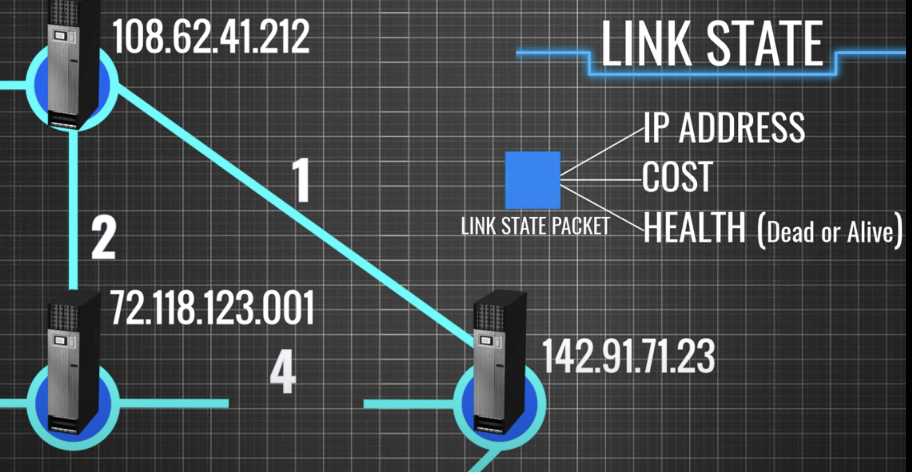

# Teema 21: Dünaamiline Marsruutimine (Dynamic Routing)

## Sissejuhatus

Dünaamiline marsruutimine on võrgumarsruutimise meetod, kus ruuterid vahetavad automaatselt marsruutimisinfot marsruutimisprotokollide abil. Erinevalt staatilisest marsruutimisest, kus administraator peab käsitsi kõik marsruudid konfigureerima, suudavad dünaamilised marsruutimisprotokollid automaatselt kohaneda võrgu topoloogia muutustega.


## Dünaamilise marsruutimise põhimõisted

- **Marsruutimisprotokoll**: Reeglistik, mille alusel ruuterid omavahel suhtlevad ja marsruutimisinfot vahetavad
- **Konvergents**: Aeg, mis kulub kõikide ruuterite marsruutimistabelite sünkroniseerimisele pärast võrgu muutust
- **Meetrika**: Väärtus, mille alusel määratakse parim tee sihtkoha võrku (nt hüpete arv, ribalaiuse, viivitus)
- **Administratiivne kaugus (AD)**: Väärtus, mis määrab marsruutimisprotokollide usaldusväärsuse järjekorra


## Marsruutimisprotokollide administratiivsed kaugused (Cisco)

| Marsruutimismeetod | Administratiivne kaugus |
|--------------------|-------------------------|
| Otseühendatud võrk | 0 |
| Staatiline marsruut | 1 |
| EIGRP kokkuvõte | 5 |
| BGP (väline) | 20 |
| EIGRP (sisemine) | 90 |
| IGRP | 100 |
| OSPF | 110 |
| IS-IS | 115 |
| RIP | 120 |
| EIGRP (väline) | 170 |
| BGP (sisemine) | 200 |
| Tundmatu sihtkoht | 255 (ei marsruutida) |

## Dünaamiliste marsruutimisprotokollide klassifikatsioon

### Sisemine vs välimine
- **IGP (Interior Gateway Protocol)**: Kasutatakse ühe autonoomse süsteemi (AS) piires (nt RIP, EIGRP, OSPF)
- **EGP (Exterior Gateway Protocol)**: Kasutatakse erinevate autonoomsete süsteemide vahel (nt BGP)

### Vektor-kaugus vs link-state
- **Vektor-kaugus (Distance-Vector)**: 
  - Ruuterid jagavad kogu oma marsruutimistabelit naabrite vahel
  - Lihtne seadistada, vähem resurssimahukas
  - Aeglasem konvergents
  - Näited: RIP, IGRP

- **Link-state (olekupõhine)**:
  - Ruuterid jagavad infot ainult otseühenduste kohta
  - Iga ruuter ehitab kogu võrgu topoloogilise kaardi
  - Kiirem konvergents, kuid vajab rohkem ressursse
  - Näited: OSPF, IS-IS

- **Täiustatud vektor-kaugus (Advanced Distance-Vector)**:
  - Hübriid eelnevatest, kombineerib mõlema eeliseid
  - Näide: EIGRP



### Klassipõhine vs klassivaba
- **Klassipõhine (Classful)**: Ei edasta alamvõrgu maski marsruutimis-uuendustes (nt RIPv1, IGRP)
- **Klassivaba (Classless)**: Edastab alamvõrgu maski marsruutimis-uuendustes (nt RIPv2, EIGRP, OSPF, BGP)

## Populaarsed dünaamilised marsruutimisprotokollid

### RIP (Routing Information Protocol)

RIP on üks vanemaid ja lihtsamaid marsruutimisprotokolle, mis põhineb vektor-kaugus algoritmil.

#### Põhiomadused:
- **Meetrika**: Hüpete arv (maksimaalselt 15 hüpet, 16 = lõpmatu)
- **Uuenduste sagedus**: Iga 30 sekundi järel
- **Administratiivne kaugus**: 120
- **Versioonid**: RIPv1 (klassipõhine) ja RIPv2 (klassivaba)

#### RIP konfigureerimine (Cisco):
```
Router(config)# router rip
Router(config-router)# version 2
Router(config-router)# network 192.168.1.0
Router(config-router)# network 10.0.0.0
Router(config-router)# no auto-summary
```

### OSPF (Open Shortest Path First)


OSPF on laialdaselt kasutatav link-state marsruutimisprotokoll, mis kasutab Dijkstra lühima tee algoritmi.

#### Põhiomadused:
- **Meetrika**: Kulu (cost), tavaliselt arvutatakse liidese ribalaiuse põhjal
- **Uuendused**: Toimuvad ainult muutuste korral või iga 30 minuti järel
- **Administratiivne kaugus**: 110
- **Struktuur**: Võib olla jagatud erinevateks aladeks (areas) hierarhia loomiseks


#### OSPF konfigureerimine (Cisco):
```
Router(config)# router ospf 1
Router(config-router)# network 192.168.1.0 0.0.0.255 area 0
Router(config-router)# network 10.0.0.0 0.0.0.3 area 0
```

### EIGRP (Enhanced Interior Gateway Routing Protocol)

EIGRP on Cisco loodud täiustatud vektor-kaugus protokoll, mis kombineerib vektor-kaugus ja link-state protokollide parimaid omadusi.


#### Põhiomadused:
- **Meetrika**: Kombinatsioon ribalaiusest, viivitusest, koormusest ja usaldusväärsusest
- **Uuendused**: Toimuvad ainult muutuste korral
- **Administratiivne kaugus**: 90 (sisene), 170 (väline)
- **Eelised**: Kiire konvergents, efektiivne ribalaiuse kasutus, VLSM (Variable Length Subnet Mask) tugi

#### EIGRP konfigureerimine (Cisco):
```
Router(config)# router eigrp 100
Router(config-router)# network 192.168.1.0
Router(config-router)# network 10.0.0.0
Router(config-router)# no auto-summary
```

### BGP (Border Gateway Protocol)

BGP on peamine marsruutimisprotokoll Internetis, mida kasutatakse autonoomsete süsteemide vahel.

#### Põhiomadused:
- **Tüüp**: Path-vector protokoll (tee-vektor)
- **Meetrika**: Mitmed atribuudid (AS teekond, alguspunkt, jne)
- **Ühendus**: Kasutab TCP porti 179 usaldusväärse ühenduse loomiseks
- **Kasutus**: Peamiselt ISP-de vahel või suurtes ettevõtetes

#### BGP konfigureerimine (Cisco):
```
Router(config)# router bgp 65000
Router(config-router)# neighbor 192.168.1.2 remote-as 65001
Router(config-router)# network 10.0.0.0 mask 255.255.255.0
```

## Dünaamilise marsruutimise eelised

- **Automaatne kohanemine**: Võrgu muutuste korral uuendatakse marsruutimistabelid automaatselt
- **Skaleeritavus**: Sobib suurte ja keerukate võrkude jaoks
- **Lihtsam haldamine**: Uue võrgu lisamisel on vaja konfigureerida vähem marsruute
- **Tõrkesiirdus**: Võimaldab automaatselt leida alternatiivse tee, kui põhitee on blokeeritud
- **Koormuse jaotamine**: Mõned protokollid (nt EIGRP, OSPF) võimaldavad liiklust jagada mitme tee vahel

## Dünaamilise marsruutimise puudused

- **Ressursikasutus**: Nõuab rohkem protsessori võimsust, mälu ja ribalaiust
- **Keerukus**: Konfigureerimine ja veaotsing võivad olla keerulisemad
- **Turvalisus**: Ilma täiendava turvalisuseta võib olla haavatavam rünnakutele
- **Ennustamatus**: Paketid võivad järgida erinevaid teid olenevalt võrgu olukorrast

## Õppejuhtum 1: OSPF kolme kontori võrgustikus

### Stsenaarium
Ettevõttel on kolm kontorit - peakontor, harukontor ja andmekeskus - mis on kõik ühendatud. Soovime konfigureerida OSPF nii, et kõik võrgud oleksid ligipääsetavad.

### Võrgu detailid

#### Võrgu diagramm


### OSPF konfiguratsioon

#### R1 (Peakontor) konfiguratsioon:

```
R1> enable
R1# configure terminal

! Käivitame OSPF protsessi ID-ga 1
R1(config)# router ospf 1

! Määrame ruuteri ID (soovituslik, kuid mitte kohustuslik)
R1(config-router)# router-id 1.1.1.1

! Lisame võrgud OSPF protsessi
! NB! Võrgud määratakse koos wildcard maskiga (vastupidine võrgumaskile)
R1(config-router)# network 192.168.1.0 0.0.0.255 area 0
R1(config-router)# network 10.0.12.0 0.0.0.3 area 0
R1(config-router)# network 10.0.13.0 0.0.0.3 area 0

R1(config-router)# exit
R1(config)# exit
R1# write memory
```

#### R2 (Harukontor) konfiguratsioon:

```
R2> enable
R2# configure terminal

! Käivitame OSPF protsessi ID-ga 1
R2(config)# router ospf 1

! Määrame ruuteri ID
R2(config-router)# router-id 2.2.2.2

! Lisame võrgud OSPF protsessi
R2(config-router)# network 192.168.2.0 0.0.0.255 area 1
R2(config-router)# network 10.0.12.0 0.0.0.3 area 0
R2(config-router)# network 10.0.23.0 0.0.0.3 area 1

R2(config-router)# exit
R2(config)# exit
R2# write memory
```

#### R3 (Andmekeskus) konfiguratsioon:

```
R3> enable
R3# configure terminal

! Käivitame OSPF protsessi ID-ga 1
R3(config)# router ospf 1

! Määrame ruuteri ID
R3(config-router)# router-id 3.3.3.3

! Lisame võrgud OSPF protsessi
R3(config-router)# network 192.168.3.0 0.0.0.255 area 2
R3(config-router)# network 10.0.13.0 0.0.0.3 area 0
R3(config-router)# network 10.0.23.0 0.0.0.3 area 1

R3(config-router)# exit
R3(config)# exit
R3# write memory
```

### Selgitus

OSPF konfiguratsioonis lõime kolm ala (area):
- **Area 0**: Põhiala (backbone area), kuhu kuuluvad peakontor ja ühendused teiste kontoritega
- **Area 1**: Harukontori ala
- **Area 2**: Andmekeskuse ala

Kõik alad on ühendatud area 0 kaudu, mis on OSPF hierarhia nõue. See võimaldab efektiivsemat marsruutimisinfo haldust, kuna täielik topoloogia info on vajalik ainult ala siseselt.

### Kontrollimine

OSPF konfiguratsiooni kontrollimiseks saab kasutada järgmisi käske:

1. **OSPF naabrite kuvamine:**
   ```
   R1# show ip ospf neighbor
   ```

2. **OSPF marsruutimistabeli kuvamine:**
   ```
   R1# show ip route ospf
   ```

3. **OSPF protsesside info kuvamine:**
   ```
   R1# show ip ospf
   ```

4. **OSPF liideste info kuvamine:**
   ```
   R1# show ip ospf interface
   ```

## Õppejuhtum 2: EIGRP konfigureerimine

### Stsenaarium
Kasutame sama võrgu topoloogiat, mis eelmises näites, kuid nüüd konfigureerime EIGRP marsruutimisprotokolli.

### EIGRP konfiguratsioon

#### R1 (Peakontor) konfiguratsioon:

```
R1> enable
R1# configure terminal

! Käivitame EIGRP protsessi AS-numbriga 100
R1(config)# router eigrp 100

! Lisame võrgud EIGRP protsessi
! NB! EIGRP puhul kasutatakse klassipõhiseid võrke, kui ei kasutata võrgumaski
R1(config-router)# network 192.168.1.0
R1(config-router)# network 10.0.0.0

! Keelame automaatse võrkude kokkuvõtte tegemise
R1(config-router)# no auto-summary

R1(config-router)# exit
R1(config)# exit
R1# write memory
```

#### R2 (Harukontor) konfiguratsioon:

```
R2> enable
R2# configure terminal

! Käivitame EIGRP protsessi AS-numbriga 100 (peab olema sama kõigil ruuteritel)
R2(config)# router eigrp 100

! Lisame võrgud EIGRP protsessi
R2(config-router)# network 192.168.2.0
R2(config-router)# network 10.0.0.0

! Keelame automaatse võrkude kokkuvõtte tegemise
R2(config-router)# no auto-summary

R2(config-router)# exit
R2(config)# exit
R2# write memory
```

#### R3 (Andmekeskus) konfiguratsioon:

```
R3> enable
R3# configure terminal

! Käivitame EIGRP protsessi AS-numbriga 100
R3(config)# router eigrp 100

! Lisame võrgud EIGRP protsessi
R3(config-router)# network 192.168.3.0
R3(config-router)# network 10.0.0.0

! Keelame automaatse võrkude kokkuvõtte tegemise
R3(config-router)# no auto-summary

R3(config-router)# exit
R3(config)# exit
R3# write memory
```

### Selgitus

EIGRP konfiguratsioon on tavaliselt lihtsam kui OSPF:
- **AS number**: Kõik samas EIGRP süsteemis olevad ruuterid peavad kasutama sama autonoomse süsteemi (AS) numbrit
- **Auto-summary**: Uuemates versioonides on automaatne kokkuvõte vaikimisi väljas, vanemas versioonides on see soovitatav keelata käsuga `no auto-summary`
- **Võrgud**: EIGRP puhul saab määrata klassipõhiseid võrke või täpsustada alamvõrku maski abil

### Kontrollimine

EIGRP konfiguratsiooni kontrollimiseks saab kasutada järgmisi käske:

1. **EIGRP naabrite kuvamine:**
   ```
   R1# show ip eigrp neighbors
   ```

2. **EIGRP marsruutimistabeli kuvamine:**
   ```
   R1# show ip route eigrp
   ```

3. **EIGRP topoloogia kuvamine:**
   ```
   R1# show ip eigrp topology
   ```

## Dünaamilise ja staatilise marsruutimise võrdlus

| Omadus | Staatiline marsruutimine | Dünaamiline marsruutimine |
|--------|---------------------------|---------------------------|
| **Konfigureerimine** | Käsitsi iga marsruudi jaoks | Automaatne pärast protokolli seadistamist |
| **Skaleeritavus** | Sobiv väikestele võrkudele | Sobiv suurtele ja keerukatele võrkudele |
| **Ressursikasutus** | Madal | Kõrgem (protsessori, mälu ja ribalaiuse kasutus) |
| **Kohanemisvõime** | Ei kohane automaatselt muutustega | Kohaneb automaatselt võrgu muutustega |
| **Rikketaluvus** | Puudub automaatne tõrkesiirdus | Võimaldab automaatset alternatiivse tee leidmist |
| **Lihtsus** | Lihtne mõista ja konfigureerida | Keerulisem mõista ja konfigureerida |
| **Turvalisus** | Turvalisem (info ei liigu võrgus) | Haavatavam ilma täiendava turvalisuseta |
| **Marsruudi valimine** | Fikseeritud, administraatori määratud | Dünaamiline, protokolli meetrika põhine |

## Millal kasutada dünaamilist marsruutimist?

- Keskmistes ja suurtes võrkudes (üle 10 ruuteri)
- Kui võrgu topoloogia muutub sageli
- Kui on vaja automaatset tõrkesiirdust
- Kui on mitu võimalikku teed sihtkohtadesse
- Kui soovitakse vähendada administratiivset koormust

## Hübriidlahendused: staatilise ja dünaamilise marsruutimise kombineerimine

Sageli on praktikas optimaalne kombineerida mõlemat marsruutimismeetodit:

1. **Staatilised vaikemarsruudid**: Määrata vaikimisi marsruut (default route) internetiühenduse jaoks
   ```
   R1(config)# ip route 0.0.0.0 0.0.0.0 203.0.113.1
   ```

2. **Marsruutide ümberjaotamine**: Staatiliste marsruutide importimine dünaamilisse protokolli
   ```
   R1(config)# router ospf 1
   R1(config-router)# redistribute static subnets
   ```

3. **Turvalised staatilised marsruudid**: Kriitiliste ühenduste jaoks staatiliste marsruutide kasutamine
   ```
   R1(config)# ip route 192.168.100.0 255.255.255.0 10.0.0.2
   ```

## Dünaamiliste marsruutimisprotokollide turvamine

### Autentimine

#### OSPF MD5 autentimine:
```
R1(config)# interface FastEthernet0/0
R1(config-if)# ip ospf authentication message-digest
R1(config-if)# ip ospf message-digest-key 1 md5 secretpassword
```

#### EIGRP MD5 autentimine:
```
R1(config)# key chain EIGRP-KEY
R1(config-keychain)# key 1
R1(config-keychain-key)# key-string secretpassword
R1(config-keychain-key)# exit
R1(config)# interface FastEthernet0/0
R1(config-if)# ip authentication mode eigrp 100 md5
R1(config-if)# ip authentication key-chain eigrp 100 EIGRP-KEY
```

### Passiivsed liidesed

Passiivsete liideste kasutamine aitab vältida marsruutimisinfo jagamist mitteusaldusväärsete võrkudega:

#### OSPF passiivne liides:
```
R1(config)# router ospf 1
R1(config-router)# passive-interface FastEthernet0/1
```

#### EIGRP passiivne liides:
```
R1(config)# router eigrp 100
R1(config-router)# passive-interface FastEthernet0/1
```

## Praktilised soovitused

1. **Protokolli valimine**: Valige marsruutimisprotokoll vastavalt võrgu vajadustele ja skaleeritavuse nõuetele
2. **Hierarhiline disain**: Kasutage OSPF alasid või EIGRP võrgukokkuvõtteid efektiivseks topoloogia haldamiseks
3. **Konvergentsi optimeerimine**: Konfigureerige protokolli parameetrid (timers) optimaalse konvergentsi saavutamiseks
4. **Autentimine**: Kasutage alati autentimist marsruutimisprotokollide turvamiseks
5. **Jälgimine**: Jälgige regulaarselt marsruutimistabeleid ja protokollide olekut

[](https://www.youtube.com/watch?v=gQtgtKtvRdo)
