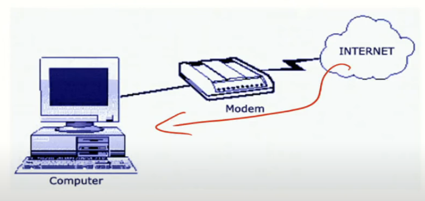
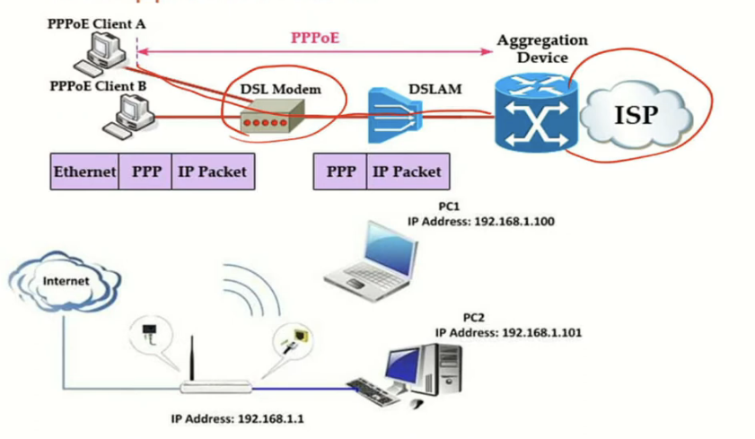
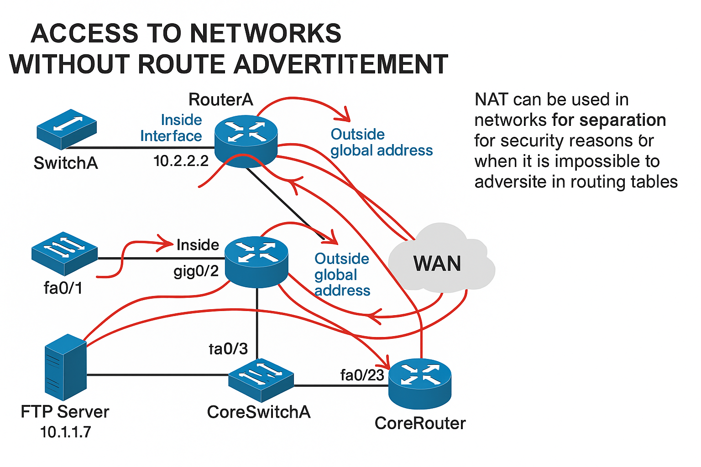

# Teema 22: Võrguaadresside teisendus. NAT. Static NAT, Dynamic NAT, PAT (Overload NAT).

## Kuidas pääseda privaatsetest võrkudest internetti?

Tänapäeva võrgutehnoloogiate üheks põhiprobleemiks on see, kuidas võimaldada paljudele seadmetele ligipääsu internetti, kui avalikke IP-aadresse on piiratud hulk. Nagu ma aasta jooksul rääkisin: "IP-aadressid hakkavad otsa saama ja praegu on nendega teatud raskusi."

### Interneti ühenduse ajalugu

[1977: The PC modem](https://en.wikipedia.org/wiki/Hayes_Microcomputer_Products)



Algselt, kui internetiga ühenduti modemi kaudu (Dial-up modemid), sai arvuti ühenduse ajal päris internetiaadressid. Need olid nn "valged aadressid", mis on unikaalsed kogu internetis, erinevalt eraadressidest (192.168.x.x, 172.16.x.x, 10.x.x.x), mida kasutatakse kohalikes võrkudes.

[](https://www.youtube.com/watch?v=PDE9b5iU8vI)

**kui kaua vanal heal ajal dial-up internetiga asjad aega võtsid**. Mõtle, et sul on 56k modem — see teeb umbes 7 KB/s.

### 📊 Näited (56k modemiga, \~7 KB/s):

| Asja tüüp          | Suurus | Aeg, mis kulub                |
| ------------------ | ------ | ----------------------------- |
| 🎬 1 film (700 MB) | 700 MB | umbes **1 ööpäev (28 tundi)** |
| 🌐 1 veebileht     | 1 MB   | umbes **2,5 minutit**         |
| 📁 1 MP3 laul      | 5 MB   | umbes **12 minutit**          |

Internetiühenduse viisid muutusid aja jooksul. Näiteks DSL-modemite puhul organiseeriti ühendus tavaliselt PPP (Point-to-Point Protocol) kaudu, kuid kasutaja arvuti sai endiselt avaliku IP-aadressi. Samuti toimis läbi valget addressi, mis anti kätte just ühendamise ajal.



### 🌐 **Mis on "valge IP-aadress"?**

"Valge IP-aadress" oli mõiste, mida kasutati eriti just Eestis ja teistes Ida-Euroopa riikides varajastel interneti aegadel. Me ütleme "Avalik IP whk AIP ".
[Telia AIP](https://www.telia.ee/ari/internet-ja-tookoht/internet-arikliendile)

Siin on lihtne seletus:

**Valge IP** (ehk *avalik IP-aadress*) tähendab seda, et sinu arvutil oli **otse internetti nähtav unikaalne aadress**.

---

### 🆚 Võrdlus:

| Tüüp         | Kirjeldus                                                                                                       |
| ------------ | --------------------------------------------------------------------------------------------------------------- |
| **Valge IP** | Avalik IP — su arvuti on **otse internetis** ja teised saavad sind näha/nõuda (nt mänguserver, kodu server jne) |
| **Hall IP**  | Era- või jagatud IP — sa oled **ruuteri taga peidus**, teistega sama IP (NAT-i taga)                            |

---

### 🕰️ **Miks see oluline oli tollal (90ndatel–2000ndate alguses)?**

* Kui sul oli **valge IP**, siis sa **said ise hostida servereid**, mängida otse sõpradega, teha veebilehti oma arvutist jne.
* **Tavaline dial-up** ei andnud sageli valget IP-d — see oli lisateenus.
* Mõnel ISP-l (nagu Starman, Elisa) sai **valge IP tellida lisatasu eest**.
* **"Hallis võrgus"** olles ei saanud teised sulle otse ligi — nt sõber ei saanud otse sinu arvutiga ühendada, vaid pidi keeruliselt mööda minema.


Kuid tekkisid kaks probleemi:
1. Kodudes hakati kasutama kommutaatoreid ja ruutereid, mis võimaldasid mitme arvuti samaaegset ühendamist
2. IP-aadressid hakkasid otsa saama

### 💡 Meeldetuletus

**Era-IP-aadresside vahemikud**  
Mida kasutatakse sisemistes võrkudes, näiteks koduvõrkudes või ettevõtte võrkudes?

### ❓ Küsimus

**Kuidas lasta internetile ligi kõiki eravõrgus (192.168.x.x) olevaid seadmeid,**  
kui internet ootab igaühelt *unikaalset avalikku aadressi*? 🤔

### Proxy vs NAT


Selleks on kaks peamist lahendust:

### **Proxy-server** 🌐:
| Kategooria       | Kirjeldus                                                                | Näide                                                                 |
|------------------|--------------------------------------------------------------------------|-----------------------------------------------------------------------|
| **Turvalisus**    | Vahendusserver, millel on ligipääs nii internetile kui ka privaatsesse võrku | Kui sa töötad kodus ja sinu töökoht on turvaline, siis kasutatakse vahendusserverit, et kaitsta tööandja võrku interneti ohtude eest. |
| **Protokollid**   | Võimaldab HTTP/HTTPS päringute edastamist                                | Kui sa külastad veebilehte, saadetakse see päring läbi proxy-serveri, et kaitsta sinu privaatsust ja turvalisust. |
| **Päringud**      | Võtab vastu kasutajate päringud ja teeb need oma nimel                  | Kui keegi veebis küsib, kas saad tasuta prooviversiooni, siis proxy-server saadab vastuse selle inimese nimel. |
| **Statistika**    | Kogub statistikat külastatud veebilehtede kohta                         | Proxy-server saab teada, milliseid veebilehti sa külastad ja tal võib olla arvestus nende lehtede kohta, et neid hiljem analüüsida. |
| **Kaitse**        | Kaitseb kohalikku võrku, kuna otsene juurdepääs internetile puudub      | Kui sa kodus kasutad vahendusserverit, siis su koduvõrk on kaitstud, kuna kõik internetipäringud lähevad läbi serveri, mitte otse sinu seadmetest. |
| **Protokollide haldus** | Võimaldab valida protokolle, mida lubatakse                          | Kui ettevõtte IT-osakond lubab ainult HTTPS-protokolli, siis proxy-server ei luba veebilehti, mis kasutavad ainult HTTP-d. |
| **Filtreerimine** | Võimaldab filtreerida külastatavaid veebilehti                          | Kui keegi püüab külastada sisu, mis on seotud alaealistele sobimatute materjalidega, saab proxy-server selle blokeerida. |
| **Liikluspiirangud** | Võimaldab piirata liiklust teatud viisil                               | Kui ettevõttes on palju inimesi, võib proxy-server piirata internetikasutust, et tagada, et keegi ei kasuta üleliia ribalaiust suurte failide allalaadimiseks. |
| **Serverite haldus** | Tavaliselt eraldi server või serverite klaster                        | Suurte ettevõtete puhul on võimalik, et nende serverite haldamiseks on terve klaster servereid, mis töötavad koos ühtse proxy-serveriga. |


### **NAT (Network Address Translation)** 🔄:
- 🌐 **Võimaldab privaatsete IP-aadressidega seadmetel suhelda internetiga**
- 🔄 **Teisendab privaatsed ("hallid") IP-aadressid avalikeks ("valgeteks") aadressideks**
- 🏠 **Toimib võrgu tasandil**, mitte ainult veebiprotokollide jaoks
- 📶 **Tavaliselt teostatakse marsruuterites**
- ✂️ **Pakettide lahkumisel võrgust** asendatakse "hall" IP-aadress "valge" aadressiga
- 🖥️ **Võimaldab mitmetel seadmetel** näida internetis ühe aadressina

#### ❓ Mis sa arvad, mis on proxy abielu?

## NAT-i tüübid


### 1. Staatiline NAT (Static NAT)


Staatiline NAT loob üks-ühele seose privaatse ja avaliku IP-aadressi vahel:
- Iga privaatne aadress on püsivalt seotud konkreetse avaliku aadressiga
- Kasutatakse peamiselt serverite jaoks, mis peavad olema väljastpoolt kättesaadavad
- Mõnel tootjal (nt Huawei) nimetatakse seda "Server NAT"

### 🚫 L3 switchid ja NAT: L3 switchid ei toeta NAT-i reeglina!!

#### ❓ Mis sa arvad, kas hardware NAT olemas?

Staatilise NAT-i puhul on määratud kindel sisevõrgu aadress kindlale välisvõrgu aadressile. Näiteks, kui server asub 192.168.1.2 aadressil, võib see olla seotud avaliku aadressiga 203.0.113.5.


Turvalisuse kaalutlustega seoses - kui seate staatilise NAT-i ja suunate kõik pordid väljapoole, tähendab see, et kõik internetist tulevad paketid jõuavad teie serverisse. See muudab teie seadme haavatavaks rünnakutele.

Seetõttu kasutatakse sageli **Port Mapping** lahendust, kus ainult teatud pordid (nt 80 või 443) on väljastpoolt kättesaadavad.

**Näide:**

* **Avalik IP (ruuteril):** 85.253.123.45
* **Serveri sisemine IP:** 192.168.1.100
* **Teenused:** Serveris jookseb näiteks veebiserver porti 80 kaudu.

**Ruuteris seadistad:**

| Avalik port | Sisemine IP   | Sisemine port |
| ----------- | ------------- | ------------- |
| 80          | 192.168.1.100 | 80            |

➡️ Kui keegi avab brauseris `http://85.253.123.45`, siis ruuter suunab selle liikluse **sinu serverisse** aadressiga `192.168.1.100:80`.

### 2. Dünaamiline NAT (Dynamic NAT)


Dünaamiline NAT kasutab avalike IP-aadresside kogumit (pool):
- Privaatsele võrgule eraldatakse mitu avalikku aadressi
- Aadressid määratakse dünaamiliselt vajaduse järgi
- Kui kasutaja ei saada pikka aega pakette, vabaneb aadress ja ootab järgmist kasutajat
- Sobib, kui ettevõttel on piiratud hulk avalikke aadresse ja kõik kasutajad ei vaja korraga internetiühendust

Näiteks, kui teil on 100 aadressi ja 150 töötajat, kuid te teate, et nad kõik ei kasuta internetti korraga, saate neid aadresse ühiselt kasutada.

Tänapäeval sellist lahendust praktiliselt ei kasutata, kuna ühe liidese jaoks on suur hulk väliseid IP-aadresse liiga ressursimahukas.

**See IP, mida näed saidil nagu [whatismyipaddress.com](https://whatismyipaddress.com/), ei ole tingimata "päriselt sinu" IP**, vaid pigem **sinu võrgu või ruuteri avalik IP-aadress**.

### 🔍 **Mis sa tegelikult näed sellisel lehel?**

Kui avad saidi nagu `whatismyipaddress.com`, siis see näitab:

* **Avalikku IP-aadressi**, millega sinu **ruuter või internetiühendus** on välismaailmaga ühendatud.
* See IP-aadress võib kuuluda:

  * Sinu **ISP-le** (nt Telia, Elisa, jne)
  * Sinu **ruuterile**, kui sul on avalik IP
  * Mõnikord isegi **VPN-teenusele**, kui kasutad VPN-i

### ✅ **Millal see on "päriselt sinu" IP?**

* Kui sul on **avalik staatiline IP**, otse sinu arvutile määratud (haruldane).
* Kui sul on **avalik IP ruuteril**, ja sa oled ainuke, kes seda kasutab.
* Kui sa EI kasuta NAT-i ega VPN-i.

> Leht nagu *whatismyipaddress.com* näitab **sinu ühenduse avalikku IP-d**, aga mitte tingimata **sinu seadme personaalset IP-d**. See on pigem “sinu maja aadress”, mitte “sinu toa number”.

### 3. PAT (Port Address Translation) või Overload NAT


PAT on kõige levinum NAT-i vorm:
- Mitu privaatset IP-aadressi teisendatakse üheks avalikuks aadressiks
- Eristab ühendusi pordi numbrite alusel
- Kui sisemine seade loob ühenduse, määratakse sellele unikaalne pordi number välisel liideselt
- Ruuter peab säilitama tõlketabelit, et teada, kuidas vastused õigesse kohta suunata
- Võimaldab sadadel seadmetel jagada üht avalikku IP-aadressi

### 🧠 **Kes annab seadmetele avaliku pordi NAT Overload (PAT) puhul?**

Selle määrab **ruuter ise**, millel on NAT/PAT lubatud.

Kui sisemine seade (nt. 192.168.1.10) loob ühenduse internetti (nt. `www.example.com:80`), teeb ruuter järgmise:

1. **Valib vaba pordi** oma avaliku IP külge — näiteks **50001**.

2. **Loob NAT-tabeli kirje**, mis ütleb:

   ```
   192.168.1.10:1333  <-->  203.0.113.5:50001
   ```

3. Kui vastus tuleb tagasi pordile 50001, suunatakse see õigesse sisemisse aadressi ja porti.

#### 🔄 See protsess:

* Toimub **dünaamiliselt**.
* Ruuter **valib ise vaba pordi** mingi kindla vahemiku seest (tavaliselt 1024–65535).
* Kui kõik pordid täis saavad (väga harva koduvõrgus), siis uued ühendused võivad oodata või katkeda.

---

### 🛠 Näide NAT-tabelist:

| Sisemine aadress | Sisemine port | Avalik IP   | Avalik port |
| ---------------- | ------------- | ----------- | ----------- |
| 192.168.1.10     | 1333          | 203.0.113.5 | 50001       |
| 192.168.1.11     | 1333          | 203.0.113.5 | 50002       |

### 📌 

> **Ruuter määrab ja haldab ise avalikke porte NAT Overload (PAT) puhul**. Kasutaja ei pea seda käsitsi tegema.


See on ressursimahukas operatsioon, eriti kui palju ühendusi on aktiivsed. Isegi kui te midagi ei tee, on teie arvutil avatud kümneid ühendusi (operatsioonisüsteemi teenused, sõnumisaatjad jne), ja iga brauseriaken lisab veel ühendusi. Iga ühendus vajab tõlketabelis kirjet.

### ICMP protokolli käsitlemine NAT-is

ICMP (Internet Control Message Protocol), mida kasutatakse näiteks **ping-käsu** puhul, erineb TCP- ja UDP-protokollidest selle poolest, et **ei kasuta porte**. See muudab ICMP käsitlemise NAT-i (võrguaadressi tõlke) puhul keerukamaks.

Kui seade saadab ICMP-päringu (nt ping), asendab ruuter saatja **privaatse IP-aadressi** oma **avaliku IP-aadressiga**. Ruuter peab seejuures meelde jätma teatud andmed, nagu **ICMP identifikaator** ja **sekventsnumber**, et suudaks hiljem tagasisaabuva vastuse õigesse sisemisse seadmesse suunata.

See on üks näidetest, kus NAT peab **protokolli spetsiifikat arvesse võtma**. Teine sarnane erijuhtum on **VoIP (IP-telefoni)**, mis nõuab samuti erilahendusi NAT-i käsitlemisel.


### ⚠️ ICMP ja NAT-i probleemid

* Kuna ICMP ei kasuta porte, on NAT-il raskem päringuid ja vastuseid korrektselt omavahel siduda.
* Ruuter peab jälgima ICMP paketi **identifikaatorvälja**, et teada saada, millise sisemise seadme päringuga on tegemist.
* Mõned NAT-seadmed ei toeta ICMP-pakettide korrektset tõlkimist või **blokeerivad need täielikult**, mis võib põhjustada järgmisi probleeme:

  * **Ping ei tööta** (vastuseid ei tule).
  * **Traceroute katkeb** või ei kuva kogu marsruuti.
  * **Võrgutõrked** ei jõua saatjani, mis raskendab veaotsingut.

### 🔐 Turvalisuse kaalutlused

Mõned võrguhaldajad otsustavad ICMP-liiklust teadlikult **blokeerida või piirata**, et kaitsta võrku skaneerimise, pahatahtlike rünnakute või ülekoormamise eest. Kuigi see suurendab turvalisust, võib see **raskendada võrgu diagnoosimist** ja jälgimist.

### 4. CGNAT (Carrier Grade NAT)

CGNAT on teenusepakkujate tasemel NAT:
- Teenusepakkuja transleerib klientide "hallist" aadressist teise "halli" aadressi
- See "hall" aadress transleeritakse seejärel avalikuks internetiaadressiks
- Võimaldab veelgi suuremat IP-aadresside kokkuhoidu

Varem sai teie koduruuter avaliku IP-aadressi, kuid see pole kuigi efektiivne. Tänapäeval kasutatakse sageli teist lähenemist, kus teie koduruuter saab IP-aadressi spetsiaalsest vahemikust (näiteks 100.64.x.x), mille teenusepakkuja siis transleerib avalikuks IP-aadressiks.

See tähendab, et kui külastate veebisaiti, mis näitab teie IP-aadressi, siis näete kas oma ruuteri välist aadressi (kui see saab avaliku IP) või hoopis teenusepakkuja NAT-i aadressi, mida jagatakse paljude klientide vahel.

## NAT-i tabel ja jälgimine


NAT-seade peab pidama tõlketabelit, et teada, kuidas vastused õigele seadmele suunata:
- **Inside local address** - seadme privaatne IP ja port
- **Inside global address** - avalik IP ja port, mida kasutatakse väljumisel
- **Outside global address** - sihtkoha IP ja port

See on oluline, et kui vastus tuleb tagasi, teaks ruuter, millisele sisemisele seadmele see suunata.

## PAT-i konfigureerimine Cisco seadmetel

PAT-i seadistamine Cisco ruuteril on suhteliselt lihtne:

1. Loo pääsuloend (access-list) võrkude jaoks, mida soovid NAT-i kaudu välja lasta:
```
access-list 90 permit 192.168.0.0 0.0.3.255
```
See lubab võrgud 192.168.0.0, 192.168.1.0, 192.168.2.0 ja 192.168.3.0.

2. Märgi, millised liidesed on sisemised (inside) ja millised välised (outside):
```
interface GigabitEthernet0/1
 ip nat inside

interface GigabitEthernet0/0
 ip nat outside
```

3. Konfigureeri NAT overload (PAT):
```
ip nat inside source list 90 interface GigabitEthernet0/0 overload
```
See käsk ütleb, et paketid, mis vastavad pääsuloendile 90 ja saabuvad sisemistest liidestest, tuleb transleerida ja välja saata GigabitEthernet0/0 liidesest, kasutades port-translatsiooni (overload).

4. Lisa vaikimisi marsruut:
```
ip route 0.0.0.0 0.0.0.0 203.0.113.254
```
See ütleb ruuterile, et kõik paketid, mille sihtkoht pole teada, tuleks saata gateway'le 203.0.113.254.

### Tõlketabeli vaatamine

Cisco ruuteril saate vaadata aktiivseid NAT-tõlkeid käsuga:
```
show ip nat translations
```


See käsk näitab kõiki aktiivseid NAT-tõlkeid, sealhulgas lähteallikas, sihtkoht ja pordid. Näiteks võite filtreerida tõlkeid konkreetse IP-aadressi järgi:
```
show ip nat translations | include 192.168.0.36
```

Tabelist näete sisemist IP-aadressi ja porti, välist IP-aadressi ja porti ning sihtkohta, kuhu paketid saadeti.


## NAT-i kasutamine ettevõttevõrgus

> NAT-i saab kasutada mitte ainult internetti pääsemiseks, vaid ka ettevõttevõrkude sees



* Tavaliselt NAT-i kasutatakse nii, et **sisemine IP (nt 192.168.1.10)** muudetakse **avalikuks IP-ks (nt 80.123.45.6)** enne kui see läheb internetti.
* Aga **samasugust trikki saab teha ka ettevõtte sees**, kui:

  * **Mitmed sisemised võrgud** ei ole nähtavad keskse võrgule (nt core-routerile).
  * Tahad hoida võrke **eraldi ja lihtsana** – ei lisa igat väikest võrku kogu võrgu marsruutimisse.

| Roll            | Näide IP         | Mis juhtub?                                  |
| --------------- | ---------------- | -------------------------------------------- |
| **Sisemine IP** | 10.2.2.11        | töötaja arvuti                               |
| **NAT IP**      | 10.140.1.2       | ruuter muudab selleks, enne kui saadab edasi |
| **Siht IP**     | 10.1.1.1         | TFTP server core-võrgus                      |
| **Kõik IP-d**   | on privaatvõrgus | midagi ei lähe internetti                    |


> **Nagu oleks “sisemine NAT”** – kasutatakse täpselt samamoodi nagu internetis, aga kogu liiklus jääb **ettevõtte võrgu sisse**.
> Lihtne viis hoida asjad korras ja kontrolli all.


## 🚫 **Piirang**

Kui kasutad **PAT-i** (Port Address Translation), siis:

> ✅ **Sisemine võrk saab algatada ühenduse**
>
> ❌ **Väline võrk ei saa ise alustada ühendust sisemise seadmega**

### 🧠 Näide:

* Seade `10.2.2.11` (töötaja arvuti) **saab minna** TFTP serveri `10.1.1.1` juurde.
* Aga TFTP server **ei saa ise ühenduda** `10.2.2.11` poole – ruuter ei tea, kes see seade on, ja millist porti kasutada.

### 🔒 Miks nii?

* Ruuter teeb NAT-tabeli **ainult siis**, kui **sisemine seade alustab ühendust**.
* Väliselt tulev pakett ei saa “siseneda”, sest NAT-tabelis **pole kirjet**, kellele see kuulub.

## 📌

> **PAT töötab ainult ühes suunas:**
> **Sisemiselt → Väliselt = OK**
> **Väliselt → Sisemiselt = EI tööta**

Kui vajad kahepoolset ühendust (nt server sisemises võrgus), tuleb kasutada **statilist NAT-i** või **port forwardingut**.

## ✅ NAT-i eelised vs ❌ puudused

| 🔍 Kategooria             | ✅ **Eelis**                                                      | ❌ **Puudus**                                                                       |
| ------------------------- | ---------------------------------------------------------------- | ---------------------------------------------------------------------------------- |
| **IP-aadresside kasutus** | Võimaldab **jagada üht avalikku IP-d** mitme seadme vahel        | IPv4 aadressid ei ole siiski “päriselt” piisavad – NAT on vaid ajutine lahendus    |
| **Turvalisus**            | Peidab **sisemist võrku**, väljastpoolt ei näe seadmeid          | Välised ühendused **ei saa alustada** ühendust sisemiste seadmetega                |
| **Lihtsus koduvõrgus**    | Kodused ruuterid teevad NAT-i **automaatselt**, töötab vaikimisi | Kui seadmeid on palju, ruuter **aeglustub või jookseb kokku**                      |
| **Võrgukoormus**          | Aitab kontrollida ja suunata liiklust keskse värava kaudu        | NAT **lisab koormust** ruuterile – iga ühendus tuleb ümber kirjutada               |
| **Protokollide tugi**     | Enamus tavalisi teenuseid töötab hästi NAT-iga                   | Mõned protokollid (**FTP, SIP, ICMP**) **ei tööta korralikult ilma lisaseadeteta** |
| **Ühenduse suund**        | **Sisemised seadmed saavad alati minna välja** (nt internetti)   | **Välised seadmed ei saa ise** alustada ühendust NAT-i taha                        |
| **Skaleeritavus**         | Toimib hästi väikestes või keskmistes võrkudes                   | Suured võrgud vajavad **kallimat ja võimsamat riistvara** NAT-i jaoks              |


### 💡

> **NAT lahendab IPv4 probleemid**, kuni IPv6 saab **laialdaselt kasutusele**.
> See on nagu "ajutine sillake", aga töötab seni, kuni päris lahendus (IPv6) on valmis.
