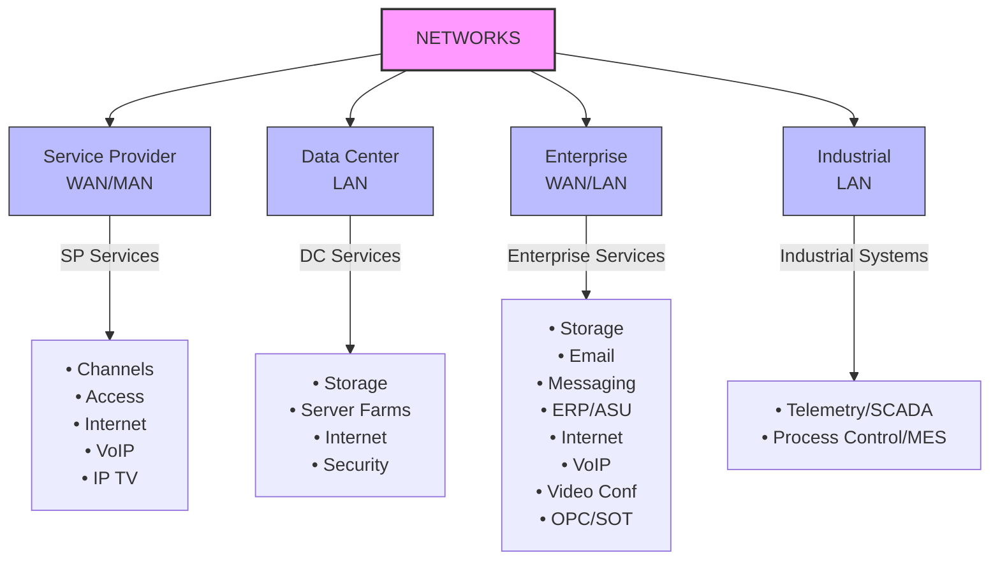

# **Teema 2: Arvutivõrkude ajalugu ja klassifikatsioon**

## **Sisu**

1. [Sissejuhatus](#sissejuhatus)
2. [Varajane ajastu: Mainframe'id ja terminalid](#varajane-ajastu-mainframeid-ja-terminalid)
3. [ARPANET: Interneti sünn](#arpanet-interneti-sünn)
4. [WAN: Laiad alad võrgud](#wan-laiad-alad-võrgud)
5. [LAN: Kohalikud võrgud](#lan-kohalikud-võrgud)
6. [Võrgutehnoloogiad ja standardid](#võrgutehnoloogiad-ja-standardid)
7. [Kohalike ja globaalsete võrkude konvergents](#kohalike-ja-globaalsete-võrkude-konvergents)
8. [Etherneti ajastu](#etherneti-ajastu)
9. [Uus aeg](#uus-aeg)
10. [Võrkude klassifikatsioon](#võrkude-klassifikatsioon)
11. [Kaasaegsed suundumused](#kaasaegsed-suundumused)
12. [Kokkuvõte](#kokkuvõte)

---

## **Sissejuhatus**

See teema jääb sageli kas tähelepanuta või käsitletakse pinnapealselt, kuigi võrkude arenguloo mõistmine aitab paremini mõista kaasaegseid tehnoloogiaid ja nende kasutamist. Alustame algusest.

---

## **Varajane ajastu: Mainframe'id ja terminalid**

Pildil on kujutatud klassikalist mainframe'i PDP-10, mis oli populaarne 1960-70ndatel. Sel ajal olid arvutid tohutud seadmed, mis võtsid enda alla terveid ruume. Nendega töötamiseks kasutati terminale — perifeerseid seadmeid, mis sisaldasid klaviatuuri, monitori ja printerit.

Esimene võrgutehnoloogiate eesmärk oli lihtsustada suhtlust mainframe'idega. Terminalid võisid paikneda mitte ainult ühe hoone sees, vaid ka naaberhoonetes või isegi teistes linnades. Telefoniliinide kasutamine suhtluseks oli esimene samm võrgupõhimõtte arendamisel. Idee oli selles, et seadmeid saaks hallata kaugelt.

This image illustrates the IBM Mainframe Computer. For more information, visit the [Source: IBM Mainframe Computer History](https://www.bosch.com/stories/ibm-mainframe-computer-history/).

---

## **ARPANET: Interneti sünn**

1969. aastal esitas USA kaitseministeerium ülesande luua võrk, mis suudaks töötada isegi tõsiste katastroofide, näiteks tuumasõja tingimustes. Nii sünnitas ARPANET — tänase interneti eelane. Võrgu aluseks olid suured mainframe'id (näiteks PDP-10), mida kasutasid juhtivad ülikoolid ja teaduskeskused, nagu Stanford, MIT ja Pentagon.

Need arvutid olid omavahel ühendatud pakettside tehnoloogia abil. ARPANET pani aluse sellistele kaasaegsetele protokollidele nagu TCP/IP. Võrk kasvas aja jooksul, ühendades aina rohkem sõlmi, ja 1990ndateks omandas internet tänasele sarnase formaadi.

#### Küsimus:
Kas leiad kaardilt Pentagoni?

This image shows the ARPANET logical map from March 1977. For more information, visit the [Source: ARPANET Logical Map](https://control.com/articles/the-history-of-arpanet/).

---

## **WAN: Laiad alad võrgud**

Paralleelselt ARPANETi arenguga hakkasid tekkima Wide Area Network'id (WAN) — laiad alad võrgud, mis ühendasid arvuteid suurtel vahemaadel. WAN-i kasutati mitte ainult interneti, vaid ka korporatiivsete eesmärkide jaoks. WAN-i peamine erinevus kohaliku võrgu (LAN) suhtes on nende ulatuslik jaotus. Nad võivad katta linnu, riike ja isegi kontinente.

WAN-i kasutamise näide võib olla võrk, mis ühendab ettevõtte kontoreid erinevates riikides.

This image illustrates a WAN port socket (CAT5 Ethernet RJ-45 cable), which is used to connect your Cable or DSL modem.  
Source: [D-Link EBR-310 User Manual](https://www.manualslib.com/manual/891175/D-Link-Ebr-310.html).

---

## **LAN: Kohalikud võrgud** ( Local Area Network)

This image represents a Local Area Network (LAN), which connects computers within a small zone, such as a room, office block, or campus. Networking has been an essential part of LAN systems since the concept of connected machines became popular in the 1950s.  
Source: [Understanding Local Area Networks (LANs)](https://dev.to/).

1970ndatel tekitas tehnoloogiline murrang arvutite tootmises võimaluse luua suhteliselt odavaid ja funktsionaalseid miniarvuteid. See andis tõuke kohalike võrkude (Local Area Networks, LAN) arengule, mis ühendasid arvuteid ühe kontori või hoone sees.

Väike- ja keskmise suurusega ettevõtted mõistsid kiiresti kohalike võrkude eeliseid. Need võimaldasid kasutada ühist failiserverit, printereid ja andmebaase, välistades vajaduse andmete edastamiseks disketiga. Kuid LAN-i areng alguses oli kaootiline: eksisteeris palju kokkusobimatuid standardeid, võrguprotokolle ja operatsioonisüsteeme.

---

## **Võrgutehnoloogiad ja standardid**

1980ndate lõpuks muutus olukord. Välja töötati ühtseid standardeid nagu Ethernet, Arcnet, Token Ring. Need tehnoloogiad tagasid erinevate tootjate seadmete ühilduvuse, mis lihtsustas oluliselt võrkude loomist. Ethernet sai kohalike võrkude aluseks ja TCP/IP — protokolliks globaalsete võrkude jaoks.

Ethernet, a key wired networking technology, was developed in the 1970s by Robert Metcalfe at Xerox PARC.  
Source: [Timeline of Computer History - 1973](https://www.computerhistory.org/timeline/1973/).

---

## **Kohalike ja globaalsete võrkude konvergents**

1990ndate lõpus hakkasid kohalikud ja globaalsed võrgud aktiivselt suhtlema. Ethernet hakkas kasutama mitte ainult kohalikus, vaid ka globaalses võrgus. TCP/IP protokoll, mis loodi interneti jaoks, hakati rakendama ka LAN-is. See võimaldas kohalikel võrkudel internetiga ühenduda, tagades juurdepääsu e-postile, veebisaitidele ja muudele teenustele.

---

## **Etherneti ajastu**

2000ndate alguseks sai Ethernet domineerivaks tehnoloogiaks. See tagas kõrged andmeedastuskiirused (10 Mbit/s, hiljem 100 Mbit/s, 1 Gbit/s ja rohkem). Vananenud tehnoloogiad, nagu Frame Relay, kadusid järk-järgult. Internetist sai elu lahutamatu osa ja veebiserverite ilmumine 1990ndatel muutis selle kasutajasõbralikuks ja kättesaadavaks.

Understanding the evolution of Ethernet provides insight into its development from a groundbreaking technology in the 1970s to the backbone of modern wired networking.  
Source: [Understanding the Evolution of Ethernet](https://www.techtarget.com/searchnetworking/feature/Understanding-the-evolution-of-Ethernet).

---

## **Uus aeg**

1990ndate lõpus sai Ethernetist kohalike võrkude peamine tehnoloogia. Etherneti perekonda kuuluvad:
- **Ethernet:** kiirus 10 Mbit/s,
- **FastEthernet:** kiirus 100 Mbit/s,
- **GigabitEthernet:** kiirus 1000 Mbit/s.

Peamine protokoll oli ja on IP.

Web-tehnoloogia areng ja kulude vähenemine andsid hoogu LAN-i ja WAN-i konvergentsile.

- **1990ndad:** WEB ja e-posti kasutuselevõtt.
- **2000ndad:** mõõdetav mobiilsete terminalide kasv, interaktiivsete teenuste, mängude ja voogedastuse ilmumine.
- **2010ndad:** IoT (Internet of Things) ja IoE (Internet of Everything) kontseptsioonide tekkimine.

 

### Question:
What is 2G ? Why was the 2G network created ?

---

## **Võrkude klassifikatsioon**

Kaasaegsed võrgud saab jagada mitmeks tüübiks:

1. **Territoriaalse katvuse järgi:**
   - **WAN:** globaalsed võrgud.
   - **LAN:** kohalikud võrgud.
   - **MAN:** linna võrgud (Metropolitan Area Network), mis ühendavad linna infrastruktuuri.

2. **Edastusmeediumi järgi:**
   - Juhtmega
   - Juhtmevaba

3. **Tehnoloogia ja ülesannete järgi:**
   - Sideoperaatorite võrgud (Service Provider)
   - Korporatiivvõrgud (Enterprise Network)
   - Tööstusvõrgud (Industrial)

Kasutusvaldkondade järgi:
- **Sideoperaatorite võrgud:** sideliinid, juurdepääs internetile, VoIP, IP-televisioon.
- **Korporatiivvõrgud:** failihaldus, post, äritegevuse juhtimissüsteemid (ERP), videokonverentsid.
- **Tööstusvõrgud:** telemeetria ja tehnoloogiliste protsesside juhtimine.

### Question:
What type of network do you have at home? Is it a wired Ethernet network, a wireless Wi-Fi network, or a combination of both?

[Networks Classification - Slide 12](https://www.slideshare.net/slideshow/networks-classification/42998147#12)

This resource provides a detailed classification of different types of networks, including their characteristics and uses.

---

## **Kaasaegsed suundumused**

Tänapäeval areneb internet pidevalt. 2010ndatel muutusid populaarseks videosaidid nagu YouTube ning sotsiaalmeediaplatvormid. See kiirendas kõrge kiirusega võrkude arengut. 2020ndatel on esile tõusnud IoT (Internet of Things), mis võimaldab võrku ühendada selliseid seadmeid nagu nutikad kodumasinad ja turvasüsteemid.

---

## **Kokkuvõte**

Võrkude ajalugu on teekond alates suurtest mainframe'idest kuni kaasaegsete kõrge kiirusega internetiühendusteni. Selle arengu mõistmine aitab paremini mõista kaasaegseid tehnoloogiaid ja nende tuleviku perspektiive. Internet on muutunud elutähtsaks osaks meie elus ning selle areng jätkub iga aastaga.
