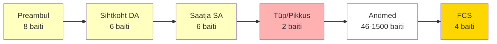
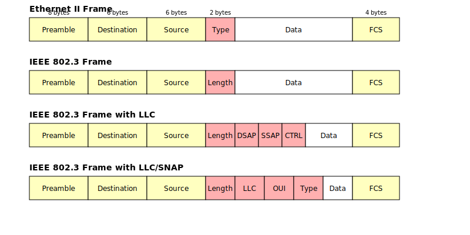
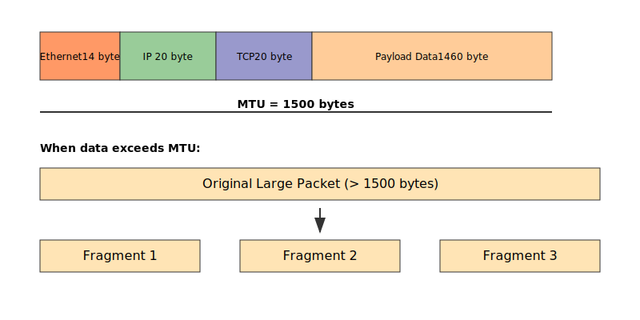

# Teema 6: Ethernet - Kuidas see töötab ja miks see on võrguadministraatorile oluline

## 1. Võrgu põhimõisted

### 1.1 Võrgu operatsioonisüsteem (Network Operating System, NOS)


*Image source: [TechTarget](https://www.techtarget.com/)*

Võrgu operatsioonisüsteem on tänapäeva arvutivõrkude keskne komponent. See ei ole pelgalt tavaline operatsioonisüsteem, vaid spetsiaalselt võrgukeskkonna jaoks optimeeritud tarkvara, mis võimaldab arvutitel ja muudel seadmetel suhelda.

#### Põhiülesanded:
1. Ressursside jagamine võrgus olevate seadmete vahel.
2. Võrguteenuste haldamine ja koordineerimine.
3. Turvalisuse tagamine ja kasutajate autentimine.
4. Võrguprotokollide tugi ja haldamine.

Tänapäeval on kõik populaarsemad operatsioonisüsteemid (Windows, Linux, macOS, Android, iOS) võrguvõimelised. See tähendab, et nad suudavad hästi hallata nii sissetulevat kui väljaminevat võrguliiklust.

### 1.2 Host ehk võrguseade

Host on iga seade, mis on arvutivõrku ühendatud. See võib olla personaalarvuti, server, nutitelefon, printer või isegi nutikas koduseade.

#### Olulisemad omadused:
1. **Identifitseerimine**: Igal hostil on unikaalne identifikaator võrgus, nagu MAC-aadress ja IP-aadress.
2. **Võrguliides**: Host peab omama vähemalt ühte võrguliidest (NIC), et võrguga ühenduda.
3. **Protokollitugi**: Host peab toetama vajalikke võrguprotokolle, et teiste seadmetega edukalt suhelda.

Lisateabe saamiseks võrgus olevate hostide rolli kohta vaadake [Vikipeedia artiklit võrguhostide kohta](https://en.wikipedia.org/wiki/Host_%28network%29).

### 1.3 Võrguliides (NIC)

Võrguliides ehk võrgukaart on riistvaraline komponent, mis võimaldab seadmel võrguga ühenduda. See täidab olulist rolli andmevahetuses.

#### Funktsioonid:
1. **Andmete puhverdamine**: Puhverdab saadetavaid ja vastuvõetavaid andmeid, et tagada sujuv andmevahetus.
2. **Protokollide tugi**: Toetab erinevaid võrguprotokolle ja suudab osaliselt töödelda neid riistvaraliselt.
3. **MAC-aadressi haldamine**: Sisaldab tehases määratud unikaalset MAC-aadressi.


*Image source: [Wikipedia Commons](https://commons.wikimedia.org/wiki/File:Network_card.jpg)*

---

## 2. Mis on Ethernet Frame?

Ethernet frame on nagu digitaalne ümbrik, mis sisaldab võrgus saadetavaid andmeid. See on põhiline andmete transportimise viis arvutivõrkudes.



| Osa | Inglise nimi | Suurus | Mida teeb? |
|-----|--------------|---------|------------|
| Preambul | Preamble + SFD | 8 baiti | Ütleb "Tähelepanu, sõnum algab!" |
| Sihtkoht (DA) | Destination Address | 6 baiti | Kellele sõnum läheb |
| Saatja (SA) | Source Address | 6 baiti | Kes sõnumi saatis |
| Tüp/Pikkus | Type/Length | 2 baiti | Mis tüüpi info järgneb või kui pikk see on |
| Andmed | Data | 46-1500 baiti | Tegelik sõnum |
| Kontroll (FCS) | Frame Check Sequence | 4 baiti | Kontrollib, kas sõnum jõudis kohale vigadeta |

### 2.1 Neli peamist frame'i tüüpi



1. **Ethernet II (DIX)**
   - Kõige levinum tänapäeval.
   - Kasutab Type välja (>1500) näitamaks, mis tüüp info järgneb.

2. **IEEE 802.3**
   - Kasutab Length välja näitamaks, kui palju andmeid järgneb.
   - Lihtsam kui Ethernet II, aga vähem võimalusi.

3. **IEEE 802.3 LLC**  
   - Lisab DSAP, SSAP ja CTRL väljad (lisaüksikasjad andmete suunamiseks).

4. **IEEE 802.3 LLC/SNAP**
   - Kõige keerulisem versioon.
   - Lisab SNAP laienduse erinevate protokollide kasutamiseks.

#### **Meelespea**  
1. **Kõik algab Preambuli ja SFD-ga** (kokku 8 baiti).  
2. **Igal seadmel on oma MAC-aadress** (DA ja SA).  
3. **Type/Length** näitab, mis järgneb.  
4. **FCS** kontrollib vigu.  
5. Tänapäeval kasutatakse põhiliselt **Ethernet II (DIX)** versiooni.  

#### **Praktiline näide** 

Kui saadad e-maili:  
1. **Sinu arvuti** on saatja (**SA**).  
2. **E-maili server** on sihtkoht (**DA**).  
3. **Andmed** on sinu e-mail.  
4. **Type** ütleb, et tegemist on e-mailiga.  
5. **FCS** kontrollib, kas kõik jõudis kohale.  

[](https://www.youtube.com/watch?v=gApiTj4PBq4)  
*Source: [YouTube Video: Ethernet Frame Structure](https://www.youtube.com/watch?v=gApiTj4PBq4)*

---

## 3. MTU (Maximum Transmission Unit)

MTU ehk Maximum Transmission Unit on nagu postipaki suuruse piirang - see määrab ära, kui suure "paki" võid korraga võrgus saata.

### Levinud MTU suurused

| Võrgutüp | MTU Suurus | Märkused |
|-----------|------------|-----------|
| Ethernet | 1500 baiti | Kõige tavalisem |
| PPPoE | 1492 baiti | Kodune internetiühendus |
| ADSL | 1432 baiti | Vanem internetiühendus |
| WiFi | 1500 baiti | Traadita võrk |

Kujuta ette, et saadad suurt fotot sõbrale:
1. Tavaline interneti (Ethernet) MTU on 1500 baiti
2. Kui sinu foto on suurem (ja tavaliselt ongi!), siis see jaotatakse väiksemateks tükkideks:
   - Esimene tükk: kuni 1500 baiti
   - Teine tükk: järgmised 1500 baiti
   - Ja nii edasi...

| Komponent | Suurus | Selgitus | Analoogia |
|-----------|---------|-----------|-----------|
| **Ethernet päis** | 14 baiti | Määrab lähte- ja sihtkoha | Nagu kirja aadress |
| **IP päis** | 20 baiti | Võrguaadressid ja marsruutimine | Nagu postiindeks |
| **TCP päis** | 20 baiti | Andmevoo kontroll | Nagu paki järjekorranumber |
| **Andmed** | 1460 baiti | Tegelik saadetav info | Nagu kirja sisu |
| **KOKKU** | 1500 baiti | Maksimaalne paketi suurus | Nagu maksimaalne postipaki suurus |

#### Miks see oluline on?

1. **Kiirus**: Väiksemad paketid liiguvad võrgus kiiremini ja tekitavad vähem probleeme
2. **Töökindlus**: Kui üks väike pakk läheb kaduma, tuleb ainult see üks uuesti saata
3. **Võrgu sujuvus**: Kõik seadmed võrgus "teavad" seda piirangut ja oskavad sellega arvestada

#### MTU osad (1500 baiti kokku):



---

## 4. Etherneti protokoll

### 4.1 MAC-aadressid

MAC-aadress (Media Access Control address) on unikaalne füüsiline identifikaator, mille määrab seadme tootja ja mida kasutatakse võrguliidese tuvastamiseks. MAC-aadressid on vajalikud andmete edastamiseks Etherneti kaudu, kuna need tagavad igale võrguseadmele unikaalse aadressi.

#### MAC-aadressi struktuur

| Osa | Kirjeldus |
|-----|-----------|
| Tootja identifikaator (OUI) | Esimesed 24 bitti (3 baiti) |
| Seadme unikaalne ID | Viimased 24 bitti (3 baiti) |

#### MAC-aadressi formaat

```
00:1A:2B:3C:4D:5E    (kooloniga eraldatud)
00-1A-2B-3C-4D-5E    (sidekriipsuga eraldatud)
001A.2B3C.4D5E       (punktiga eraldatud)
```

---

# Võrguseadmete vahelise andmeedastuse viisid

Selles peatükis vaatame, kuidas võrguseadmed omavahel suhtlevad ja millised on erinevad andmete saatmise võimalused.

## 1. Andmeedastuse tüübid


*Unicast, Multicast ja Broadcast andmeedastuse põhimõtted*

| Tüüp | Kirjeldus | Tavaline kasutus | Näide |
|------|-----------|------------------|--------|
| **Unicast** | Üks-ühele suhtlus, nagu isiklik vestlus | Tavaline veebis surfamine, printimine, failide saatmine | Arvuti saadab faili konkreetsele printerile |
| **Multicast** | Üks-paljudele suhtlus, nagu huviringi meililist | Võrguseadmete vaheline suhtlus, video voogedastus | Cisco seadmed suhtlevad omavahel (CDP protokoll) |
| **Broadcast** | Üks-kõigile suhtlus, nagu avalik teadaanne | Võrgus seadmete otsimine | ARP päring: "Kus asub IP-ga X seade?" |


*MAC-aadresside tüüpide võrdlus ja nende kasutamine võrgus*


## 2. MAC-aadressi struktuur

### 2.1 MAC-aadressi esimese okteti tähendus

| Bitt | Väärtus | Tähendus |
|------|----------|-----------|
| **1. bitt** | 0 | Unicast aadress |
| | 1 | Multicast aadress |
| **2. bitt** | 0 | Globaalne (IEEE määratud) |
| | 1 | Kohalik (administraatori määratud) |

See struktuur võimaldab võrguseadmetel kiiresti otsustada, kuidas antud seadmega suhelda. Näiteks kui seade näeb MAC-aadressi, mille esimene bitt on 1, teab ta kohe, et see sõnum on mõeldud grupile seadmetele, mitte ühele konkreetsele seadmele.

### 2.2 Spetsiaalsed võrguaadressid

Multicast aadresside näited ja nende kasutusprotokollid:

| **Ethernet multicast aadress** | **Kasutatav protokoll** |
|---------------------------------|----------------------------------------------|
| 01-00-0C-CC-CC-CC | Cisco Discovery Protocol (CDP), VTP |
| 01-80-C2-00-00-00 | Spanning Tree Protocol (STP) |
| 01-80-C2-00-00-03 | Link Layer Discovery Protocol (LLDP) |
| 01-80-C2-00-00-0E | Spanning Tree Protocol (provider bridges) |
| 01-00-5E-00-00-00 kuni 01-00-5E-7F-FF-FF | IPv4 Multicast (RFC 1112) |

*Märkus: Kõik MAC-aadressid on esitatud kuueteistkümnendsüsteemis (hex)*

---

# 5. CSMA/CD Protokoll ja Andmeedastus

CSMA/CD (Carrier Sense Multiple Access with Collision Detection) on Etherneti võrkude aluspõhimõte, mis võimaldab mitmel seadmel jagada sama füüsilist meediumit tõhusalt ja korrastatult.

## 5.1 CSMA/CD toimimispõhimõtted

| Põhimõte | Kirjeldus |
|----------|-----------|
| **Kandesageduse Kuulamine** (Carrier Sense) | Seade kontrollib enne saatmist, kas võrguliin on vaba |
| **Mitmikjuurdepääs** (Multiple Access) | Mitmed seadmed jagavad sama füüsilist kanalit |
| **Kokkupõrgete Tuvastamine** (Collision Detection) | Tuvastatakse ja lahendatakse samaaegsed edastused |


*Joonis: Kokkupõrke tekkimine CSMA/CD võrgus*

### Kokkupõrke lahendamise protsess:
1. Kokkupõrke tuvastamine
2. JAM-signaali saatmine
3. Ootamine juhusliku aja (Binary Exponential Backoff)

---

## 5.2 Etherneti tehnilised piirangud

| Parameeter | Piirang | Selgitus |
|------------|---------|-----------|
| **Minimaalne raami suurus** | 64 baiti | 46 baiti andmeid + 18 baiti juhtväljad |
| **10 Mbit/s maksimaalne ulatus** | 2500 m | Põhineb signaali levimisajal |
| **100 Mbit/s maksimaalne ulatus** | 250 m | Kiiruse kasvades ulatus väheneb |
| **1 Gbit/s maksimaalne ulatus** | 25 m | Kiiruse kasvades ulatus väheneb veelgi |

### Klassikalise Etherneti omadused:
- Toetab ringhäälingut (sarnaselt WiFi-ga)
- Võimalikud on kokkupõrked (sarnaselt WiFi-ga)
- Madal andmeedastuskiirus võrreldes tänapäevaste lahendustega
- Kaabli hooldamine nõuab eriteadmisi

*Märkus: Tänapäeval kasutatakse peamiselt täisdupleks-ühendusi, kus CSMA/CD pole vajalik*

---


## 10BASE-T (IEEE 802.3i)

### Üleminek Koaksiaalilt Keerdpaarkaablitele

- **Koaksiaalkaabli Probleemid**:
  - Kaablirikete tuvastamine oli keeruline ja hooldamine vaevaline.
- **Keerdpaarkaablite Kasutuselevõtt**:
  - 1980ndatel hakati kasutama keerdpaarkaableid ja võrgurepeaatoreid, mis lihtsustasid hooldust.
  - Idee põhines telefonifirmade varasemal kogemusel ja kohandati edukalt kohalike võrkude jaoks.

### Ajaloolised Etapid

- **1988**: AT&T tutvustas StarLAN 10 standardit kiirusega 10 Mbit/s.
- **1990**: IEEE võttis vastu 10BASE-T standardi (IEEE 802.3i-1990, CL14).


---

## CSMA/CD Rakendamine

Näiteks kontorivõrgus, kus mitmed arvutid jagavad sama kaablit, aitab CSMA/CD vältida andmepakettide kokkupõrkeid:

1. Kui arvuti A soovib andmeid saata, kuulab see esmalt liini.
2. Kui liin on vaba, alustab arvuti A andmete saatmist.
3. Kui samal ajal alustab ka arvuti B, tekib kokkupõrge.
4. Mõlemad arvutid tuvastavad kokkupõrke, saadavad JAM-signaali ja ootavad juhuslikult määratud aja.

### Tänapäevane Kontekst

CSMA/CD on olnud ülioluline Etherneti võrkude arengus, kuid selle tähtsus on vähenenud suuremahuliste võrkude ja switchide kasutuselevõtuga. Tänapäeval kasutatakse sageli **full-duplex** ühendusi, kus kokkupõrkeid ei esine.

---

## 10Base-T Hub ja Võrgusõlmede Ühendamine

10Base-T hub imiteerib koaksiaalkaablivõrku, kus keerdpaarkaablite füüsiliselt eraldiseisvad lõigud moodustavad loogiliselt ühe jagatud keskkonna. Kõik CSMA/CD algoritmi reeglid jäävad kehtima.

### Andmeedastus ja Portide Töö

Iga võrgukaart ühendatakse hubiga kahe keerdpaari kaudu:

- **TX (saatepaar)**: Kasutatakse andmete saatmiseks ning ühendab arvuti hulgimajale (hub).  
- **RX (vastuvõtupaar)**: Kasutatakse andmete vastuvõtmiseks hulgimajalt.  

Repeater (kordaja) võtab signaale vastu ühest sisendpordist, taastab need ja edastab kõikidesse väljunditesse, välja arvatud porti, kust signaal algselt tuli. **Loopback (tagasiside)** ei ole lubatud, kuna see põhjustaks võrgu ummistumise.

### Link Integrity Test (LIT)

10Base-T standard nõuab füüsilise ühenduse testimiseks **Link Integrity Test (LIT)** impulsside kasutamist. Kui võrguseade tuvastab, et LIT impulssid edastatakse ja vastuvõetakse korrektselt, loetakse ühendus toimivaks. Tavaliselt tähistab töötavat ühendust roheline LED-tuli seadme pordi juures.

---


## FastEthernet 100BASE-TX IEEE 802.3u

### FastEtherneti Standardi Vastuvõtmine

1995. aasta mais võttis IEEE vastu FastEtherneti spetsifikatsiooni. See oli oluline samm võrguarhitektuuri arengus, võimaldades andmeedastuse kiirust 100 Mbps ning pakkudes tagurpidi ühilduvust 10 Mbps Ethernetiga.

### Keerukam Füüsilise Taseme Arhitektuur

FastEtherneti füüsiline kiht jagati mitmeks alamkihiks, et toetada erinevaid kaablitüüpe:

- **Optiline kiudkaabel**  
- **Kahe paari keerdpaar (Cat5)**  
- **Nelja paari keerdpaar (Cat3)**  


#### Füüsilise Taseme Kihid

1. **Physical Coding Sublayer (PCS):** Kodeerib andmed efektiivseks edastamiseks (nt MLT-3 kodeering 100BASE-TX puhul).  
2. **Physical Medium Attachment (PMA):** Teisendab digitaalset andmevoogu elektrilisteks või optilisteks signaalideks.  
3. **Medium Dependent Interface (MDI):** Füüsiline liides, mis ühendab võrguadapteri kaabliga (näiteks RJ-45 pistik).

---

### Režiimide Võrdlus

| **Režiim**                | **Kaabli Kategooria**    | **Keerdpaaride Arv**        |
|---------------------------|--------------------------|-----------------------------|
| 10Base-T                 | Cat3                    | 2                           |
| 10Base-T (full-duplex)   | Cat3                    | 2                           |
| 100Base-TX               | Cat5                    | 2                           |
| 100Base-TX (full-duplex) | Cat5                    | 2                           |
| 100Base-T4               | Cat3                    | 4                           |

---


### Auto-Negotiation

**Auto-Negotiation** on tehnoloogia, mis võimaldab võrguseadmetel automaatselt valida parima töörežiimi (kiirus ja duplex-režiim).

- **Funktsioon:** Võimaldab seadmetel vahetada teavet oma võimekuste kohta.  
- **Tehnoloogia:** Kasutatakse **FastLinkPulse (FLP)** signaale.  
- **Tähtsus:** Minimeerib konfiguratsioonivigu ja optimeerib võrguühendust, võimaldades seadmetel koos tõrgeteta töötada.  

---

### Täisdupleks Režiim

Võrgusõlmed, mis toetavad 100BASE-FX ja 100BASE-TX spetsifikatsioone, võivad töötada **täisdupleks režiimis** (*full-duplex mode*). Selles režiimis ei kasutata CSMA/CD meetodit ning puudub kokkupõrgete mõiste. Iga võrgusõlm saab samaaegselt andmeid edastada ja vastu võtta läbi eraldi kanalite **Tₓ** ja **Rₓ**.

- **Kasutuspiirang**: Täisdupleks režiimi saab kasutada ainult siis, kui võrguadapter on ühendatud kommutaatoriga või otse kommutaatorite vahel.
- **Kiirus**: Täisdupleks ühenduses tagab standard 100Base-FX andmeedastuskiiruse kuni **200 Mb/s**.
- **Kokkupõrke vältimine**: Silmuseid (loop) ei ole lubatud.

---

+The+goals+of+the+Gigabit+Ethernet:.jpg)


## Gigabit Ethernet IEEE 802.3z (1998) ja IEEE 802.3ab (1999)

Gigabit Ethernet tõi kaasa märkimisväärse edasimineku andmeedastuse kiirustes.

### IEEE 802.3z (1998)
- Esmakordselt tutvustati **varjestatud keerdpaari (STP)** kaableid, mille laineimpedants oli 150 oomi.  
- Maksimaalne segmendi pikkus oli vaid **25 meetrit**, sobides peamiselt lühikesteks ühendusteks samas ruumis.

### Gigabit Etherneti Kaabeldusspetsifikatsioon

Gigabit Ethernet standardid pakuvad erinevaid kaabeldustüüpe ja maksimaalseid kaugusi, mis sõltuvad keskkonnast ja kasutatavast kaablist.

| **GE Type**      | **Wiring Type**                                   | **Pairs** | **Cable Length** |
|-------------------|--------------------------------------------------|-----------|-------------------|
| 1000BASE-CX      | Shielded twisted pair (STP)                      | 1         | 25 m             |
| 1000BASE-T       | EIA/TIA Category 5 UTP                           | 4         | 100 m            |
| 1000BASE-SX      | Multimode fiber (MMF) with 62.5-micron core, 850-nm laser | 1       | 275 m            |
|                   | MMF with 50-micron core, 850-nm laser            | 1         | 550 m            |
| 1000BASE-LX/LH   | MMF with 62.5-micron core, 1300-nm laser          | 1         | 550 m            |
|                   | MMF with 50-micron core, 1300-nm laser           | 1         | 550 m            |
|                   | SMF with 9-micron core, 1300-nm laser            | 1         | 10 km            |
| 1000BASE-ZX      | SMF with 9-micron core, 1550-nm laser             | 1         | 70 km            |
|                   | SMF with 8-micron core, 1550-nm laser            | 1         | 100 km           |

---


Auto-MDI(X) (Auto Medium Dependent Interface Crossover) on Gigabit Etherneti võrguühenduse funktsioon, mis automaatselt tuvastab ja kohandab Ethernet-ühenduse saatmis- ja vastuvõtuviigud. See kõrvaldab vajaduse spetsiaalsete ristkaablite järele sarnaste seadmete ühendamisel.

Gigabit Etherneti puhul on Auto-MDI(X) eriti oluline, kuna:
1. Töötab suurematel kiirustel (1000 Mbps)
2. Ühendus kasutab samaaegselt kõiki nelja juhtmepaari
3. Iga paar on kahesuunaline, võimaldades nii saatmist kui vastuvõtmist

See funktsioon muudab ühendamise "plug and play" tüüpi tegevuseks - kasutaja ei pea muretsema, millist tüüpi Ethernet-kaablit seadmete ühendamisel kasutada, kuna pordid konfigureerivad end automaatselt õigeks suhtluseks.

---

### Gigabit Ethernet IEEE 802.3ab (1999)

Gigabit Ethernet IEEE 802.3ab standard tõi kaasa märkimisväärseid uuendusi kaabeldusvõimalustes ja andmeedastuse efektiivsuses, muutes võrgud kiiremaks ja usaldusväärsemaks.

Kategooria 5 kaabel suudab pakkuda sagedusriba kuni **100 MHz**, võimaldades selle kaudu edastada andmeid kiirusega **1000 Mbit/s**. Selle saavutamiseks jaotatakse andmevoog **neljaks paralleelseks andmesuunaks**, igaüks kiirusega **250 Mbit/s**. Kõik neli paari töötavad samaaegselt, et saavutada vajalik Gigabit Etherneti kiirus.


---

## 2.5GBASE-T ja 5GBASE-T Ethernet


### Vahekiirusega Etherneti Tutvustus

2014. aastal tutvustasid **NBASE-T (Cisco)** ja **MGBASE-T (Broadcom)** standardeid, mis võimaldavad andmeedastust kiirustel **2,5 Gbps** ja **5 Gbps**, täites tühimiku 1 Gbps ja 10 Gbps Etherneti vahel.

### Põhijooned

- **Tagasiühilduvus**: Ühildub olemasolevate Cat 5e ja Cat 6 kaablitega, mis vähendab uuenduskulusid.  
- **Kiirused**: Pakub vahekiirusi 2,5 Gbps ja 5 Gbps kuni 100 meetri kaugusel.  
- **Rakendused**:
  - Kõrge kiirusega Wi-Fi tugijaamad (802.11ac/ax).  
  - Kaasaegsed ettevõttevõrgud, kus 10 Gbps pole vajalik või liiga kallis.  

### Standardiseerimine

2016. aastal võeti need standardid vastu kui **IEEE 802.3bz**, pakkudes:  
- **2.5GBASE-T**: 2,5 Gbps Cat 5e või parema kaabliga.  
- **5GBASE-T**: 5 Gbps Cat 6 kaabliga.

---

# Power-over-Ethernet (PoE)

Power-over-Ethernet edastab voolu ja andmeid üle sama Etherneti kaabli.

## Ajalugu

| Aasta | Sündmus |
|-------|----------|
| 2000 | Esimene PoE lahendus (Cisco) |
| 2003 | IEEE 802.3af standard (PoE) |
| 2009 | IEEE 802.3at standard (PoE+) |

## Standardid ja Kasutusalad

| Standard | Võimsus | Kaabel | Kasutusala |
|----------|---------|---------|------------|
| 802.3af (PoE) | 15.4W | CAT3+ | IP-telefonid, Wi-Fi AP |
| 802.3at (PoE+) | 25.5W | CAT5+ | IP-kaamerad, LED ekraanid |

## Energiaklassid

| Klass | Võimsus (W) | Näide |
|-------|-------------|--------|
| 0 | 0.44-12.95 | Üldseadmed |
| 1 | 0.44-3.84 | VoIP telefon |
| 2 | 3.84-6.49 | IP-kaamera |
| 3 | 6.49-12.95 | Wi-Fi AP |
| 4 | 12.95-25.5 | PTZ kaamera |

## Näide: IP-kaamera ühendamine


## Passiivne PoE vs Standard PoE

| Omadus | Passiivne PoE | Standard PoE |
|---------|--------------|--------------|
| Pinge | Muudetav (5-48V) | Fikseeritud 48V |
| Protokoll | Puudub | IEEE 802.3af/at |
| Hind | Odavam | Kallim |
| Kaitse | Piiratud | Täielik |
| Kasutusala | Lihtsad seadmed | Profiseadmed |

## Näide: Passiivne PoE Skeem
```
[Toiteplokk] -> [PoE Injektor] === CAT5e === [PoE Splitter] -> [Seade]
   12V DC    ->    12V + Data   ==========>    12V + Data   ->   12V
```

## Eelised/Puudused

| Eelised | Puudused |
|---------|----------|
| Üks kaabel | Piiratud võimsus |
| Keskne UPS | Kallim riistvara |
| Lihtne install | Kaabli max pikkus 100m |

