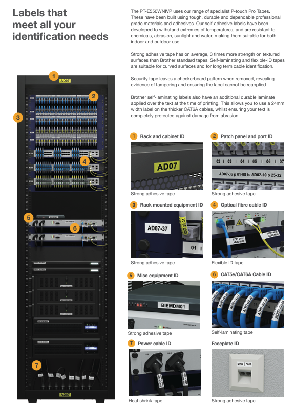

# Teema 7.1: Ethernet-kaablite tüübid ja kategooriad. Cat3, Cat5, Cat6, UTP, FTP, S/FTP

## 1. Keerdpaarkaabli põhimõtted

Keerdpaarkaabel (Twisted Pair) on võrgukaabel, mis koosneb neljast keerdpaarist juhtmetest. Iga paar on erineva keerdesammuga, mis aitab vähendada elektromagnetilist interferentsi.

### Kaabli põhikomponendid:
- Väliskest (PVC)
- HDPE isolatsioon
- Rebimiskindel niit
- Vaskjuhtmed

## 2. Kaablite tüübid varjestuse järgi

### UTP (Unshielded Twisted Pair)
- Varjestuseta keerdpaarkaabel
- Kõige levinum tüüp
- Sobilik tavakasutuseks siseruumides

### FTP (Foiled Twisted Pair)
- Fooliumvarjestusega keerdpaarkaabel
- Parem kaitse väliste häirete eest
- Soovitatav keskkondades, kus esineb elektromagnetilist müra

### STP (Shielded Twisted Pair)
- Põimitud varjestusega keerdpaarkaabel
- Väga hea kaitse häirete eest
- Kasutatakse tööstuskeskkondades

### S/FTP (Screened Foiled Twisted Pair)
- Kombineeritud varjestusega (foolium + põimitud varjestus)
- Maksimaalne kaitse häirete eest
- Kasutatakse kriitilistes keskkondades

## 3. Kaablite kategooriad

### Cat3
- Sagedus: 16 MHz
- Kasutus: Peamiselt telefoniliinideks
- Andmeedastuskiirus: kuni 10 Mbit/s

### Cat5
- Sagedus: 100 MHz
- Kasutus: Fast Ethernet (100BASE-TX)
- Andmeedastuskiirus: kuni 100 Mbit/s

### Cat5e
- Sagedus: 100 MHz
- Kasutus: Gigabit Ethernet (1000BASE-T)
- Täiustatud spetsifikatsioonid võrreldes Cat5-ga
- Kõige levinum kategooria tänapäeval

### Cat6
- Sagedus: 250 MHz
- Kasutus: 10 Gigabit Ethernet (10GBASE-T)
- Sisaldab eraldajat (spline) paremaks signaaliedastuseks
- Maksimaalne pikkus 10 Gbit/s korral: 55m

### Cat6a
- Sagedus: 500 MHz
- Kasutus: 10 Gigabit Ethernet täispikkuses
- Maksimaalne pikkus 10 Gbit/s korral: 100m

## 4. Praktilised soovitused

### Kaabli valimine
- Siseruumidesse tavaliselt UTP Cat5e või Cat6
- Välistingimustesse varjestatud kaablid (FTP/STP)
- Tööstuskeskkonda S/FTP Cat6a või kõrgem

### Paigaldamine
- Maksimaalne soovitatav pikkus: 100m
- Vältige teravaid paindeid
- Hoidke eemal elektrikaablitest
- Kasutage kvaliteetseid konnektoreid

### Testimine ja veaotsing
- Kasutage kaablitesterit
- Kontrollige konnektorite ühendusi
- Veenduge õiges pingepaaris (pinout)
- Jälgige maksimaalset lubatud pikkust

## 5. Kaabli märgistused ja standardid

- ISO/IEC 11801 rahvusvaheline standard
- ANSI/TIA/EIA Ameerika standard
- Kaablil peab olema märgitud:
  - Kategooria
  - Varjestuse tüüp
  - Tootja
  - Meetritähised

### Patch Panel
Patch panel on efektiivne ja paindlik võrgu seade, mis aitab andmekeskuse või serveriruumi korrastada ning muudab kaabelduse tõstmist, lisamist või muutmist tulevikus palju lihtsamaks. Iga port ühendub patch-kaabli kaudu teise pordiga hoone sees. Ärikasutuses võimaldab patch panel kiirelt suhelda ühest kontorist teise.

### Full Rack ja Half Rack

### Fibers

### Labeling

