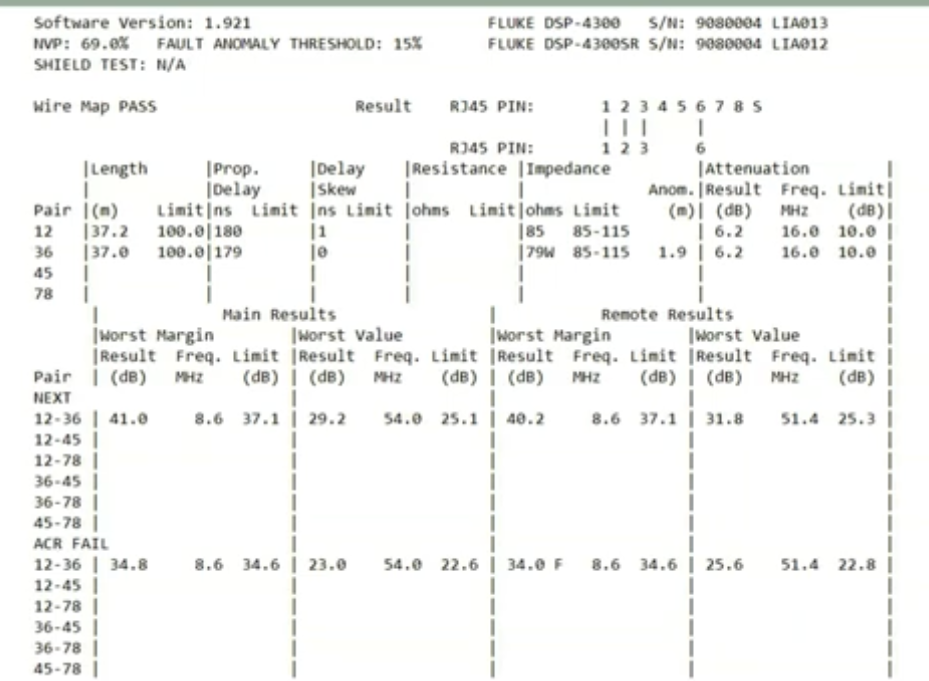
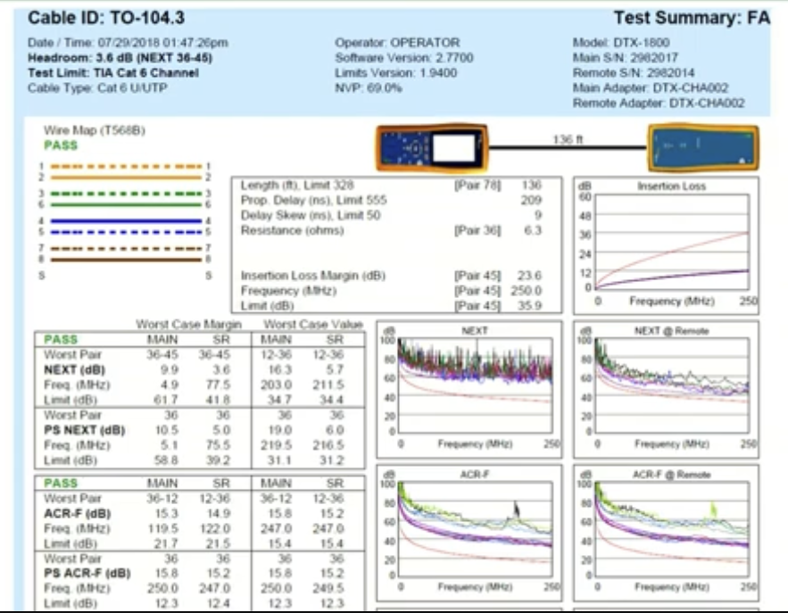

# Teema 7.2: Keerdpaarkaabli füüsiliste parameetrite mõõtmine. NEXT, ACR, FEXT, ELFEXT, PS-NEXT, PS-FEXT.

## 1. Põhiparameetrite Tabel

| Parameeter | Lihtne Selgitus | Mida Näitab? | Tüüpiline Väärtus | Mis Juhtub Kui On Halb? |
|------------|-----------------|--------------|-------------------|------------------------|
| Lainetakistus (Impedance) | Kaabli "vastupanu" elektrisignaalile | Kui hästi kaabel sobib seadmetega | 100Ω (±15%) | Signaal põrkab tagasi, ühendus on ebastabiilne |
| Sumbumine (Attenuation) | Signaali nõrgenemine teel | Kui palju signaal teel nõrgeneb | Oleneb pikkusest | Signaal on vastuvõtjas liiga nõrk |
| NEXT | Müra samast otsast | Kui palju üks paar segab teist | >30dB (mida suurem, seda parem) | Andmeedastus aeglustub või katkeb |
| FEXT | Müra teisest otsast | Kui palju üks paar segab teist kauge otsa juures | >30dB (mida suurem, seda parem) | Probleemid gigabit-kiirustel |
| ACR | Signaali ja müra suhe | Kas kasulik signaal on müras eristatav | >10dB (mida suurem, seda parem) | Andmete ülekanne muutub võimatuks |
| Return Loss | Signaali tagasipeegeldumine | Kui palju signaal tagasi põrkab | <10% tagasipeegeldust | Täisdupleks side häiritud |

## 2. Praktilised Nõuanded

### Millal Mõõta?
- Uue võrgu paigaldamisel
- Kui võrk töötab aeglaselt
- Kui esineb ühenduse katkemisi
- Seadmete vahetamisel

### Tüüpilised Probleemide Põhjused
1. Kaabli Vigastused:
   - Liiga järsk painutus
   - Muljumine
   - Liigne venitamine

2. Paigalduse Vead:
   - Vale konnektori paigaldus
   - Liiga palju lahtikeerutud paare
   - Elektrikaablite lähedus

3. Keskkonna Mõjud:
   - Niiskus
   - Elektromagnetiline müra
   - Temperatuuri kõikumised

## 3. Kiire Kontroll-leht

✓ Kas kaabel on terve?
✓ Kas konnektorid on korralikult paigaldatud?
✓ Kas kaabel on elektrikaablitest piisavalt kaugel?
✓ Kas kaabli pikkus on lubatud piires?
✓ Kas kaabli kategooria vastab vajadustele?

## 4. Kategooriate Võrdlus

| Kategooria | Maksimaalne Kiirus | Tüüpiline Kasutus |
|------------|-------------------|-------------------|
| Cat 5e     | 1 Gbps            | Koduvõrk          |
| Cat 6      | 10 Gbps (55m)     | Ärivõrk           |
| Cat 6a     | 10 Gbps (100m)    | Andmekeskus       |

## 5. Probleemide Leidmine

| Sümptom | Võimalik Põhjus | Kontrollida |
|---------|----------------|-------------|
| Aeglane ühendus | Suur sumbumine | Kaabli pikkus, vigastused |
| Katkendlik ühendus | Halb NEXT/FEXT | Konnektorid, kaabli kvaliteet |
| Ühepoolne ühendus | Return Loss probleem | Konnektorid, kaabli painutused |
| Andmete vigad | ACR probleem | Üldine kaabli kvaliteet |

