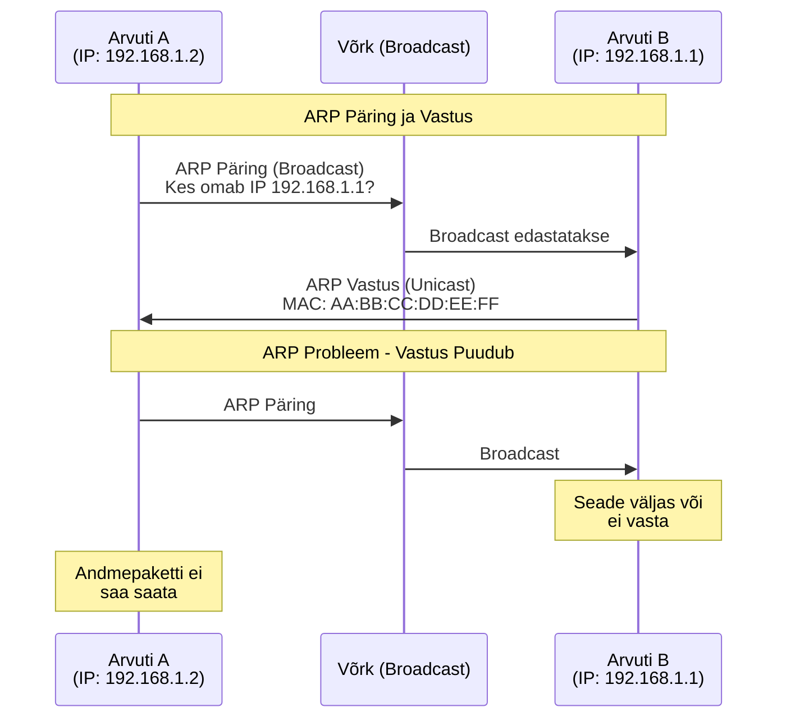
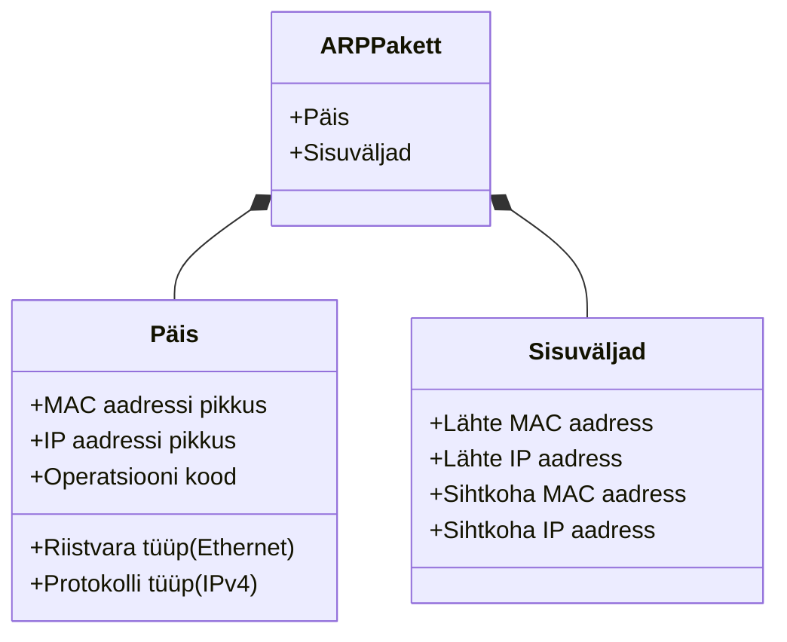
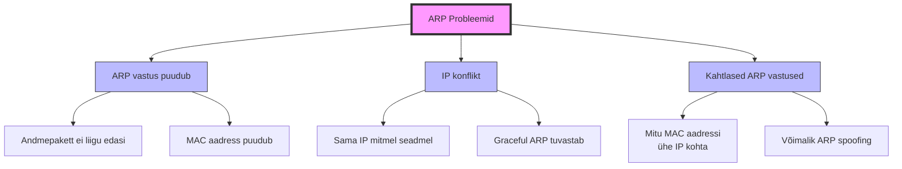
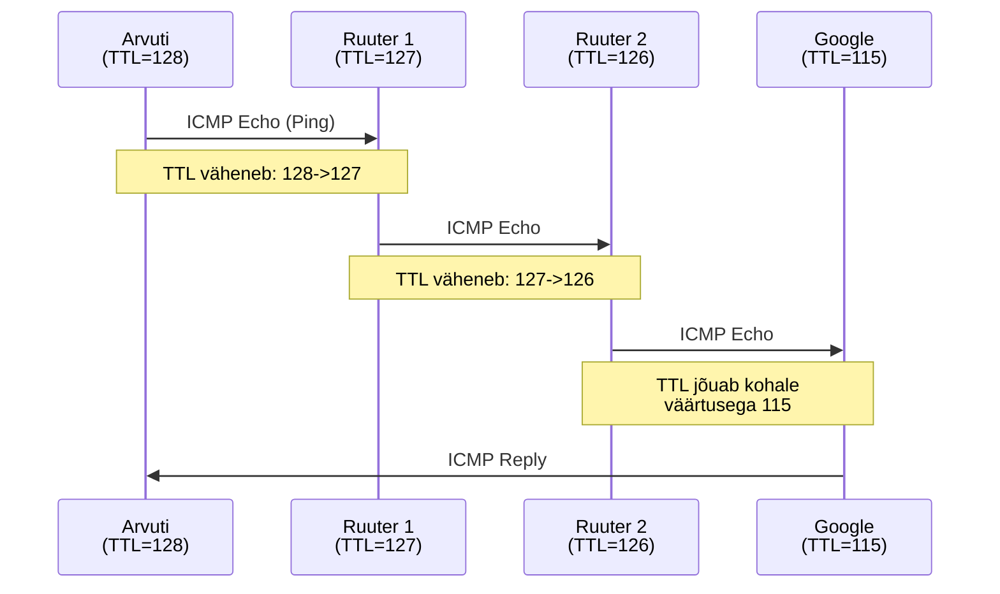
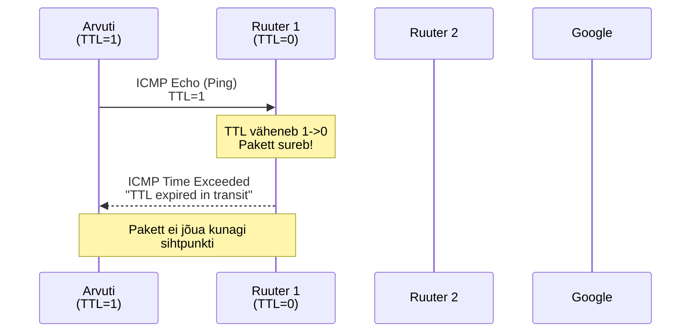
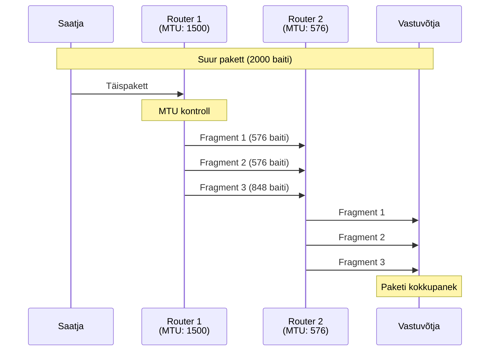
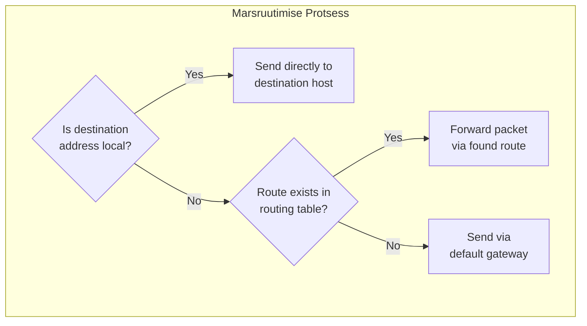
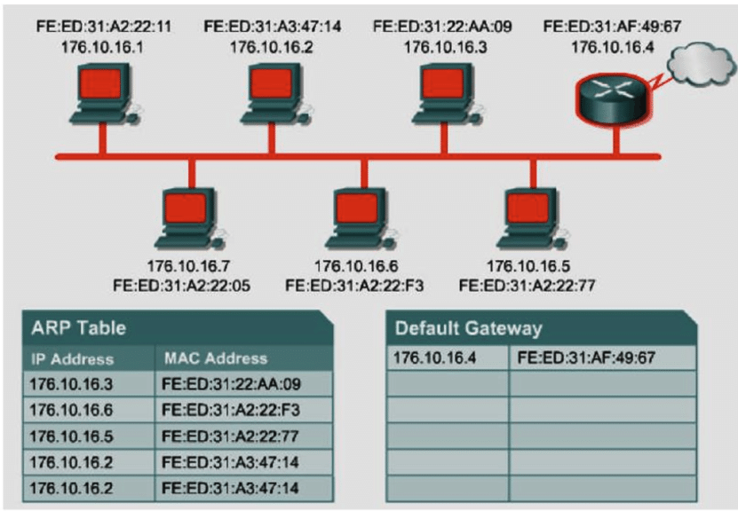
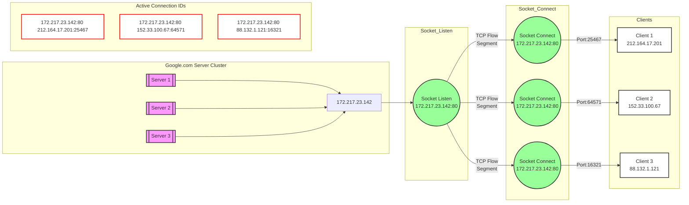

# Teema 8: TCP/IP protokolli ülevaade. Kuidas ARP töötab.

## Sissejuhatus
TCP/IP protokollide kogum on võrgusuhtluse selgroog, mida kasutatakse laialdaselt interneti ja kohalike võrkude toimimiseks. Selle loengu käigus tutvume TCP/IP stäki põhielementidega, sealhulgas andmepakettide struktuuri, nende edastamise ja juhtimise protsessidega.

TCP/IP stäkk koosneb mitmest kihist, millest igaühel on kindel roll võrgusuhtluse tagamisel. Näiteks rakendustasandi protokollid, nagu HTTP ja FTP, vastutavad kasutajarakenduste suhtluse eest, samas kui võrgu- ja transporditasandi protokollid, nagu IP ja TCP, tagavad andmete edastamise võrgu kaudu.

---

## TCP/IP stäkk ja põhiprotokollid

TCP/IP stäkk koosneb neljast põhikihist:
| Kiht | Kirjeldus | Protokollid |
|------|-----------|-------------|
| Rakendustase | Vastutab kasutajarakenduste ja teenuste eest | HTTP, FTP, DNS |
| Transporditase | Hoolitseb andmeedastuse usaldusväärsuse ja vigade parandamise eest | TCP, UDP |
| Võrgutase | Juhib pakettide marsruutimist ja aadressimist | IP |
| Linktase | Tagab andmete edastamise ühes võrgu segmendis | Ethernet, ARP |

---

## Inkapsulatsioon

Inkapsulatsioon on protsess, mille käigus lisatakse iga kihi andmetele vastav päis (header), et need saaksid õigesti edastatud ja tuvastatud.


Näide inkapsulatsioonist:
1. **Etherneti kaader** sisaldab lähte- ja sihtkoha MAC-aadresse
2. **IP-pakett** sisaldab lähte- ja sihtkoha IP-aadresse ning muid metaandmeid
3. **TCP või UDP segment** tagab andmete transpordi rakenduste vahel
4. Andmed edastatakse füüsilise võrgu kaudu, kus iga kiht eemaldab saadud paketi päise ja töötleb sisu vastavalt oma funktsioonidele
---

## ARP (Address Resolution Protocol)
ARP on hädavajalik protokoll, mis teisendab IP-aadressid füüsilisteks MAC-aadressideks. See protsess on vajalik, kuna Etherneti protokoll kasutab suhtlemiseks MAC-aadresse.

## ARP tööpõhimõte
1. Kui seade soovib saata andmeid, kuid ei tea sihtkoha MAC-aadressi, saadab ta ARP-päringu (broadcast): "Kes on IP-aadressiga X?"
2. Sihtseade vastab: "Mina olen IP-aadress X ja minu MAC-aadress on Y."
3. Vastus salvestatakse ARP-tabelisse teatud ajaks, et vältida pidevaid päringuid.


*Image Source: [ARP – The Address Resolution Protocol](https://www.flackbox.com/arp-the-address-resolution-protocol)*


## ARP probleemid ja lahendused

Võrguliikluse töökindluse tagamisel on oluline mõista ja lahendada ARP-ga seotud probleeme:

**ARP vastuse puudumine**
- Kui seade ei saa ARP vastust, jääb andmepaketi saatmine ootele
- Põhjuseks on puuduv teave sihtkoha seadme MAC-aadressi kohta
- Lahendus: kontrollige võrguühendusi ja sihtseadme olekut

**IP-aadresside konfliktid** 
- Sama IP-aadressi kasutamine mitme seadme poolt põhjustab ebastabiilsust
- "Graceful ARP" mehhanism aitab konflikte automaatselt tuvastada
- Seadmed saavad probleemi avastamisel kohe reageerida ja olukorra lahendada

**Ebatavalised ARP vastused**
- Mitme erineva MAC-aadressi sidumine ühe IP-ga viitab probleemidele
- Võib olla märk ARP spoofingust või valesti seadistatud seadmetest
- Vajalik võrguliikluse monitooring ja turvameetmete rakendamine

## ARP Suhtlusprotsess



## ARP ja RARP paketi formaat



## ARP-pakett

**Päise komponendid:**
- Protokolli tüübi info (nt Ethernet, IPv4)
- Kasutatavate aadresside tüübid (MAC ja IP)

**Sisuväljad:**
- Lähte MAC-aadress: Saatja füüsiline võrguaadress
- Lähte IP-aadress: Saatja IP-aadress 
- Sihtkoha MAC-aadress: ARP päringus tühi väli
- Sihtkoha IP-aadress: Otsitava seadme IP-aadress

### ARP Probleemide Ülevaade



## Töömehhanismid

**ARP päring (request):**
- Saadetakse broadcast-sõnumina kogu võrku
- Küsimus: "Kes on selle IP-aadressi omanik?"

**ARP vastus (reply):**
- Saadetakse unicast-sõnumina otse pärijale
- Sisaldab küsitud IP-le vastavat MAC-aadressi

## RARP-pakett

RARP (Reverse Address Resolution Protocol) võimaldab MAC-aadressi põhjal IP-aadressi määramist:

**Põhiväljad:**
- Lähte MAC-aadress: IP-aadressi vajava seadme füüsiline aadress
- Sihtkoha MAC-aadress: IP-aadresse määrava RARP serveri aadress

## Praktiline näide

ARP suhtlus võrgus:

```
# ARP päring (broadcast):
Who has 192.168.1.1? Tell 192.168.1.2

# ARP vastus (unicast): 
192.168.1.1 is at AA:BB:CC:DD:EE:FF
```

  
*Image Source: [Practical Networking - ARP Request](https://www.practicalnetworking.net/stand-alone/arp-request-reply/)*

  
*Image Source: [Practical Networking - ARP Response](https://www.practicalnetworking.net/stand-alone/arp-request-reply/)*


### ARP - The Address Resolution Protocol (Video)

[](https://www.youtube.com/watch?v=Cx7foWGm5fo)  
*Watch on YouTube: [ARP - The Address Resolution Protocol](https://www.youtube.com/watch?v=Cx7foWGm5fo)

---

## IP-paketi ülesehitus

IP-pakett on võrguliikluse põhiüksus, mis koosneb kahest peamisest osast:

**IP-paketi päis**
- Versiooninumber (IPv4 või IPv6)
- Paketi pikkus baitides
- TTL (Time To Live) - eluiga võrgus
- Protokollikood transpordiprotokolli määramiseks
- Kontrollsumma vigade tuvastamiseks
- Lähte- ja sihtkoha IP-aadressid

**IP-paketi andmeosa**
- Sisaldab edastatavaid andmeid
- Maksimaalne suurus sõltub võrgu MTU-st
- Vajadusel fragmenteeritakse väiksemateks osadeks

Teen IP paketi väljade selgituse tabelina ja lisan ka visuaalse struktuuri:

## IPv4 Packet Header

  
*Image Source: [NetworkLessons - IP Packet Header Fields](https://networklessons.com)*


## IP Paketi Väljade Tabel

| Väli | Suurus | Väärtused | Kirjeldus |
|------|---------|-----------|-----------|
| Version | 4 bitti | 4 | IPv4 versiooninumber |
| Header Length (IHL) | 4 bitti | 5-15 | Päise pikkus 32-bitistes ühikutes (min 20B, max 60B) |
| Type of Service | 8 bitti | - | QoS märgistus paketi prioriteedi määramiseks |
| Total Length | 16 bitti | 20-65535 | Kogu paketi suurus baitides (päis + andmed) |
| Identification | 16 bitti | - | Fragmentide grupeerimise ID |
| Flags | 3 bitti | - | Fragmenteerimise kontrollbitid |
| Fragment Offset | 13 bitti | - | Fragmendi positsioon originaalpaketis |
| Time to Live | 8 bitti | 0-255 | Maksimaalne lubatud hopide arv |
| Protocol | 8 bitti | - | Järgmise kihi protokoll (TCP=6, UDP=17) |
| Header Checksum | 16 bitti | - | Päise kontrollsumma vigade tuvastamiseks |
| Source IP | 32 bitti | - | Lähtekoha IP aadress |
| Destination IP | 32 bitti | - | Sihtkoha IP aadress |
| Options | Muutuv | - | Valikulised lisaväljad |

## Flags (Lipud)

| Bitt | Nimi | Kirjeldus |
|------|------|-----------|
| 0 | Reserveeritud | Alati 0 |
| 1 | DF (Don't Fragment) | 1 = Ära fragmenteeri |
| 2 | MF (More Fragments) | 1 = Järgnevad veel fragmendid |

### Näide: "Don't Fragment" Biti Testimine Windowsis

```bash
ping -f -l 2000 hkhk.edu.ee
```

#### Selgitus:
- `-f`: Määrab "Don't Fragment" (Ära Fragmenteeri) biti
- `-l 2000`: Paketi suurus baitides (antud juhul 2000)

#### Väljund:
- **Edukas:**
```
Reply from [IP]: bytes=2000 time=XXms TTL=XX
```
- **Ebaõnnestunud:**
```
Packet needs to be fragmented but DF set.
```

> 💡 **Nõuanne:** See test aitab tuvastada MTU probleeme võrgus. Kui test ebaõnnestub, on paketi suurus suurem kui võrgu MTU.

## Levinumad Protokollikoodid

| Protokoll | Väärtus | Kasutus |
|-----------|---------|---------|
| ICMP      | 1       | Võrgu kontrolli- ja veateated |
| TCP       | 6       | Usaldusväärne andmeedastus |
| UDP       | 17      | Kiire, kontrollimata andmeedastus |

[RFC 1700 - Assigned Numbers](https://www.rfc-editor.org/rfc/rfc1700.html), [Wikipedia: List of IP Protocol Numbers](https://en.wikipedia.org/wiki/List_of_IP_protocol_numbers)

  
*Image Source: [NetworkLessons - Wireshark Capture of IP Header Fields](https://networklessons.com)*


## Time To Live (TTL)

TTL (Time To Live) on IP paketi eluea määraja, mis takistab pakettide lõputut ringlemist võrgus. Iga võrguseade (ruuter), mis paketti edastab, vähendab TTL väärtust ühe võrra.

### Tavaline Ping Google'ile

```bash
# Windows
C:\> ping google.com

Pinging google.com [142.250.74.110] with 32 bytes of data:
Reply from 142.250.74.110: bytes=32 time=15ms TTL=115
Reply from 142.250.74.110: bytes=32 time=14ms TTL=115
Reply from 142.250.74.110: bytes=32 time=15ms TTL=115
Reply from 142.250.74.110: bytes=32 time=14ms TTL=115
```



### TTL=1 Ping Näide (Pakett Sureb)

```bash
# Linux/Mac
$ ping -t 1 google.com

PING google.com (142.250.74.110) 56(84) bytes of data.
From router.local (192.168.1.1) icmp_seq=1 Time to live exceeded
From router.local (192.168.1.1) icmp_seq=2 Time to live exceeded
From router.local (192.168.1.1) icmp_seq=3 Time to live exceeded
```



### TTL Vaikeväärtused Erinevates Operatsioonisüsteemides

| Operatsioonisüsteem | Vaikimisi TTL |
|---------------------|---------------|
| Windows | 128 |
| Linux | 64 |
| macOS | 64 |
| Cisco IOS | 255 |

### Miks TTL On Oluline?

1. **Võrgutsüklite Vältimine**
   - Kaitseb võrku lõputute marsruutimistsüklite eest
   - Väldib võrgu ülekoormust vigase konfiguratsiooni korral

2. **Võrgu Diagnostika**
   - `traceroute` käsk kasutab TTL-i marsruudi kaardistamiseks
   - Aitab tuvastada võrguprobleemide asukohta

3. **Võrgu Turvalisus**
   - Piirab pahatahtlike pakettide levikut võrgus
   - Aitab tuvastada võrgutopograafiat

## IP Fragmentatsioon



IP-fragmentatsioon on protsess, kus suured andmepaketid jagatakse väiksemateks osadeks:

**Fragmentatsiooni põhjused:**
- Võrgu MTU (Maximum Transmission Unit) piirang
- Erinevad võrguseadmed võivad toetada erinevaid MTU suurusi
- Tagab andmete edastamise läbi piiratud läbilaskevõimega võrkude

  

**Fragmentatsiooni protsess:**
1. Algne pakett jagatakse väiksemateks osadeks
2. Iga fragment saab unikaalse identifikaatori
3. Sihtkohas fragmendid tuvastatakse ja pannakse õiges järjekorras kokku
4. Kui mõni fragment puudub, tuleb kogu pakett uuesti saata

**Märkused:**
- Fragmentatsioon võib suurendada võrgu koormust
- Võib põhjustada viivitusi andmeedastuses
- Moodsad võrgud püüavad fragmentatsiooni vältida Path MTU Discovery mehhanismi abil

---

### IP Põhiomadused

* IP töötab ilma loogiliste ühenduste loomiseta hostide vahel: see kasutab aadresse, mis on paigutatud IP-paketi päisesse, et edastada pakette nende saajateni. **Edastustee valik nimetatakse marsruutimiseks.**

* IP kasutab päise välju datagrammide **fragmenteerimiseks ja taastamiseks**, kui see on vajalik nende edastamiseks läbi väikese paketisuurusega võrkude.

* **Andmete kättesaamise kinnitust ei nõuta.** See tähendab, et saatjat ja vastuvõtjat ei teavitata paketi kadumisest või pakettide vale järjekorra vastuvõtmisest.

### Marsruutimise protsess
Kui IP tuvastab, et sihtkoha aadress on lokaalne, saadetakse pakett otse sihtkoha hostini. Vastasel juhul:
- Kontrollitakse marsruutimistabelit marsruudi olemasolu kohta sihtkoha hostini
- Kui marsruut leitakse, edastatakse pakett leitud marsruudi järgi
- Vastasel juhul saadetakse pakett vaikimisi lüüsi (default gateway) kaudu



 

## 💡 Küsimus

**Kuidas ma saan Google'i MAC-aadressi teada?**

## UDP (User Datagram Protocol) - Kasutaja Datagrammi Protokoll

Väike vihje: UDP-d on lihtsam "vaikida hetkeks" kui pidevalt midagi küsida (nagu teeb TCP).


*Miks nii?* UDP lihtsalt saadab andmeid küsimata, kas need kohale jõudsid. See on nagu rääkimine - sa ei küsi iga sõna järel "Kas sa said aru?", vaid lihtsalt räägid edasi. 

UDP on lihtne, kompaktne ja väga kiire protokoll, mille IP-identifikaator on 17 (0x11). Selle transporditaseme protokolli eesmärk on andmete edastamine rakenduste vahel ilma garanteeritud kohaletoimetamiseta. See ei loo loogilist ühendust, ei nummerda ega järjesta pakette.

Peamised omadused:
- Ei taga andmete kadumise vältimist edastamisel
- Ei taga datagrammide õiget järjestust vastuvõtmisel
- Ei taga sõnumite dubleerimise vältimist
- Omab lihtsat teostust
- Omab kõrget töökiirust
- Sobib kasutamiseks usaldusväärsetes kanalites
- Kasutatakse reaalajas liikluse edastamiseks (hääl, video)

## UDP-paketi formaat (UDP Packet Format)

UDP andmeühik koosneb UDP päisest (header) ja andmeväljast (data field), mis sisaldab rakenduskihi paketti.


Olulised detailid:
- Esimesed 8 baiti moodustavad UDP päise, millele järgnevad sõnumi andmed
- Datagrammi pikkuse väli näitab kogu UDP-sõnumi pikkust, kaasa arvatud UDP päis
- Mõõdetakse baitides

Maksimaalsed suurused:
- UDP-datagrammi maksimaalne pikkus (ilma minimaalse IP päiseta): 65535 - 20 = 65515 baiti
- Maksimaalne andmete pikkus UDP-sõnumis: 65515 - 8 = 65507 baiti


## UDP protokolli kasutamine ja tuntud pordid (UDP Protocol Usage and Well-Known Ports)

UDP protokolli kasutatakse järgmistel juhtudel:
- Kui edastatavate andmete maht on nii väike, et ühenduse loomise ja usaldusväärsuse jälgimise kulud oleksid suuremad kui kõigi andmete uuesti saatmine
- Päring-vastus tüüpi rakendustes, kus vastust saab lugeda päringu kättesaamise kinnituseks
- Rakendustes, kus on olemas oma meetodid andmete usaldusväärse edastamise tagamiseks ja seda ei nõuta transpordiprotokollidelt

RFC-1700 (1994) standardist mõned määratud pordid:
| Port | Protokoll | Teenus | Kirjeldus |
|------|-----------|---------|-----------|
| 53 | UDP/TCP | DNS | Domeeninimed |
| 67 | UDP | bootps | BOOTP ja DHCP - server |
| 68 | UDP | bootps | BOOTP ja DHCP - klient |
| 69 | UDP | tftp | Lihtsustatud failiedastus |
| 161 | UDP | SNMP | Haldusprotokooll |

*Praktiline näide:* DNS kasutab porti 53, sest kiire päring-vastus mudel on tõhusam kui täieliku TCP ühenduse loomine iga päringuga.

## **Transpordikiht** (**L4**). **Usaldusväärse andmeedastuse protokoll** (**TCP**)

Usaldusväärse andmeedastuse tagamiseks transpordikihis kasutatakse **TCP** protokolli (**Transmission Control Protocol**) – **usaldusväärne vooprotokoll**, mis nõuab **loogiliste ühenduste** loomist.

TCP usaldusväärsus tagatakse **positiivse kinnituse ja taasedastuse mehhanismiga** (**Positive Acknowledgment with Retransmission**, **PAR**). PAR-süsteem kordab andmete saatmist seni, kuni saajalt saabub kinnitus andmete kättesaamise kohta.

Andmeid edastatakse **baidivoogudena** (**Flow**) ja neid saab edastada mõlemas suunas.

TCP suhtlevate moodulite andmevahetuse põhiüksuseks on **segment** (**Segment**).

Iga segment sisaldab **järjekorranumbrit** voos ja **kontrollsummat**, mille abil saaja kontrollib andmete terviklikkust.

## **TCP-ühenduse lõpp-punktid ja ühenduse loomine**

**Sokkel** (Socket) on abstraktne objekt, mis esindab ühenduse lõpp-punkte. **Sokkel** on programmiline liides, mis tagab andmevahetuse protsesside vahel.



## TCP Ühenduse olekud

### Peamised olekud:

| Olek           | Kirjeldus                                                                 |
|-----------------|--------------------------------------------------------------------------|
| **LISTEN**      | Server ootab sissetulevaid ühendusi. Sokkel on valmis ühendusi vastu võtma. |
| **ESTABLISHED** | Ühendus on aktiivne. Toimub andmevahetus. Võimalik kahepoolne suhtlus.   |
| **TIME_WAIT**   | Ootab, et tagada FIN-paketi jõudmine sihtpunkti. Vaikimisi ooteaeg: 2 MSL (Maximum Segment Life). |
| **CLOSED**      | Ühendus on täielikult lõpetatud. Ressursid on vabastatud.                |


### Netstat käsk ühenduste vaatamiseks:
```bash
netstat -n
```
```
Proto Recv-Q Send-Q Local Address           Foreign Address         State
tcp        0      0 172.217.23.142:80       212.164.17.201:25467   ESTABLISHED
tcp        0      0 172.217.23.142:80       152.33.100.67:64571    ESTABLISHED
tcp        0      0 172.217.23.142:80       88.132.1.121:16321     ESTABLISHED
```

Need on kõige tavalisemad olekud, mida võib näha TCP ühenduste jälgimisel.

## TCP Ühenduse lõpp-punktid

## Lõpp-punkti definitsioon
Ühenduse lõpp-punkt koosneb kahest komponendist:
```
<sõlm> : <port>
```
kus:
- `<sõlm>` - võrgusõlme IP-aadress
- `<port>` - antud sõlme TCP pordi number

## Ühenduste identifitseerimine

- Iga ühendus identifitseeritakse kahe lõpp-punkti paariga
- Üks lõpp-punkt võib osaleda mitmes ühenduses
- Segadust ei teki, kuna TCP protokollis on kõik ühendused seotud konkreetse lõpp-punktide paariga, mitte ainult pordi numbritega

## Loogiline ühendus

TCP protokoll nõuab loogilise ühenduse loomist, mis tähendab eelnevat "kokkulepet" kahe arvuti lõpp-punktide vahel. Need "läbirääkimised" toimuvad rakenduste vahel, mis käivitatakse arvutites, mille vahel ühendus luuakse:

### Passiivne ühenduse loomine (Listen)
- Üks rakendus teostab passiivse ühenduse avamise funktsiooni (Listen)
- Annab teada, et on valmis sissetulevaid ühendusi vastu võtma
- Pärast seda määrab operatsioonisüsteem TCP-pordi numbri antud ühenduse jaoks

### Aktiivne ühenduse loomine (Connect)
- Teine rakendus, mis töötab virtuaalse kanali teises otsas, pöördub operatsioonisüsteemi poole aktiivse ühenduse avamise taotlusega (Connect)


# TCP Segmendi Päis (TCP Segment Header)


*IP packets carry TCP segments, which carry chunks of the TCP data stream.*

**Source:** [O'Reilly Media](https://www.oreilly.com/api/v2/epubs/1565925092/files/httpatomoreillycomsourceoreillyimages96904.png)


## Väljad:

## TCP Segmendi Põhiväljad (TCP Segment Main Fields)

| Väli (eesti) | Väli (inglise) | Bittide asukoht | Kirjeldus |
|--------------|----------------|-----------------|------------|
| Saatja port | Source Port | 0-15 | Pordi number arvutist-saatjast |
| Vastuvõtja port | Destination Port | 16-31 | Pordi number arvutist-vastuvõtjast |
| Järjekorranumber | Sequence Number (SN) | | Kasutatakse fragmentide kokkupanekuks |
| Kinnituse number | Acknowledgment Number (AS=SN+1) | | Paketi vastuvõtu kinnituse number |
| Päise pikkus | TCP Header Length | | Määrab TCP päise pikkuse |
| Kontrollsumma | Checksum | | Andmete terviklikkuse kontroll |
| Lisaparameetrid | Additional Parameters | | Muutuva pikkusega väli |

### TCP/IP Kapseldamine (Encapsulation):
```
[ ... | IP | TCP | ... ]
```

## TCP Segmendi Kontrollbittide ja Väljad

### Reserveeritud väli (Reserved)
- Reserveeritud tulevikus kasutamiseks

### Kontrollbitid (Code bits)
| Bitt | Nimetus | Kirjeldus |
|------|----------|-----------|
| URG | Kiireloomuline | Kiireloomulise sõnumi märgis |
| ACK | Kinnitus | Segmendi vastuvõtu kinnitus |
| PSH | Push | Märgib puhvri kohest tühjendamist |
| RST | Reset | Ühenduse taastamise päring |
| SYN | Sünkroniseerimine | Kasutatakse andmeloendurite sünkroniseerimiseks ühenduse loomisel |
| FIN | Lõpetamine | Märgib viimase baidi saavutamist andmevoos |

### Täiendavad väljad
| Väli | Kirjeldus |
|------|-----------|
| Window | Vastuvõetavate plokkide arv vastuvõtja poolt |
| Checksum | Kontrollsumma päise ja andmepaketi terviklikkuse kontrolliks |
| Urgent pointer | URG bitiga koos näitab kiireloomuliste andmete lõppu, ignoreerides puhvri täitumist |
| Options | Muutuva pikkusega väli lisafunktsioonide jaoks (nt maksimaalse segmendi suuruse määramiseks) |
| Padding | Täiteväli päise suuruse viimiseks 32-bitiste sõnade täisarvuni |

## TCP Kolmepoolne Käepigistus (Three-way Handshake)

Kaks poolt sünkroniseerivad baitide nummerdamise süsteemid, vahetades SYN-segmente käepigistuse käigus. Ühendus initsialiseeritakse kolme andmevahetusega.


**Source:** [Connection establishment](https://i.sstatic.net/y17TW.png)


### Ühenduse loomise etapid:
1. **Aktiivne avamine**
   - Klient → Server: SYN_SENT
   - Saadetakse SYN J

2. **Passiivne avamine**
   - Server → Klient: SYN_RCVD
   - Saadetakse SYN K, ACK J+1

3. **Ühenduse kinnitamine**
   - Klient → Server: ESTABLISHED
   - Saadetakse ACK K+1

### Ühenduse lõpetamise etapid:
1. **Aktiivne sulgemine**
   - FIN_WAIT_1
   - FIN_WAIT_2
   - TIME_WAIT
   
2. **Passiivne sulgemine**
   - CLOSE_WAIT
   - LAST_ACK
   - CLOSE

### ❗ TCP Järjenumber

TCP kasutab **järjenumbreid**, et tagada andmevoo terviklikkus ja õige järjekord. Selle abil saab vastuvõtja kontrollida, kas kõik andmepaketid on kohale jõudnud ja õiges järjekorras. 🚀

---

### 📖 **Näide**

#### **Olukord:**
Sul on tekstifail, mille suurus on **6000 baiti**. 🖥️ TCP jagab faili väiksemateks tükkideks (pakettideks), kus iga pakett sisaldab **1000 baiti**.

#### **Pakettide Järjenumbrid:**
- 📦 **Pakett 1:** Järjenumber **0–999**
- 📦 **Pakett 2:** Järjenumber **1000–1999**
- 📦 **Pakett 3:** Järjenumber **2000–2999**
- 📦 Jne...

---

### 🎯 **Kuidas see toimib?**
1. **📤 Saatmine:** TCP saadab paketid vastuvõtjale ükshaaval.
2. **🔍 Vastuvõtt ja kontroll:** Vastuvõtja ootab näiteks paketti järjenumbriga **1000–1999**. Kui järgmine pakett hüppab otse **2000–2999** peale, saab ta aru, et pakett **2** on kadunud. ❌
3. **✅ Kinnitus (ACK):** Vastuvõtja saadab kinnituse: "Olen saanud kuni **999**." Saatja edastab uuesti puuduva paketi.

---

### 📚 **Reaalse Elu Analoogia**

Kujuta ette, et saadad sõbrale raamatu **lehekülgede vahemikega**:
- 📄 **Leht 1:** **1–100 sõna**
- 📄 **Leht 2:** **101–200 sõna**
- 📄 **Leht 3:** **201–300 sõna**

Kui sõber saab ainult:
- **Leht 1:** **1–100**
- **Leht 3:** **201–300**, 

siis ta kirjutab: "📬 *Palun saada uuesti vahemik **101–200**!*"  
Pärast seda on kõik korras. ✅

---

### 🤔 **Miks see oluline on?**
- 🎯 TCP tagab, et kõik andmed saabuvad tervikuna ja õigel ajal. 
- 🚨 Kui midagi läheb valesti, korrigeeritakse see automaatselt.

**Ja voilà! TCP tagab täiusliku andmevoo, isegi kui teel on segadus.** 🎉


**Source:** [Data transfer process](https://www.researchgate.net/profile/Abbas-Miry/publication/340247809/figure/fig1/AS:873937277837312@1585374292225/Data-transfer.jpg)


**Source:** [Connection Termination](https://www.researchgate.net/profile/Abbas-Miry/publication/340247809/figure/fig2/AS:873937277825026@1585374292255/Connection-termination-using-three-way-handshaking.ppm)

---

## ICMP (Internet Control Message Protocol) ✨

**Lühidalt:** ICMP on IP-protokolli osa, mille eesmärk on võrgus esinevate vigade ja erijuhtude kohta teada anda. See ei ole andmeühendusprotokoll, vaid kontrollsõnumite jaoks loodud mehhanism. ICMP on osa IP-paketi päisest – natuke nagu tagasiside mehhanism! 📊


### Kuidas ICMP töötab? 🔢
ICMP sõnum koosneb:
- **Tüüp (Type):** Sõnumi olemus (nt Ping-päring). 🔍
- **Kood (Code):** Tüübi detailid. 🔑
- **Kontrollsumma:** Veakontroll. ✔️
- **Andmed:** Võib sisaldada algset IP-paketi päist, et vea allikat tuvastada. 🕵️

### Levinud ICMP tüübid ja koodid ✨
| **Tüüp** | **Kood** | **Kirjeldus**             |
|----------|----------|---------------------------|
| 0        | 0        | Eho-vastus (Ping vastus)  |
| 3        | 0        | Võrk pole kättesaadav     |
| 3        | 1        | Seade pole kättesaadav    |
| 8        | 0        | Eho-päring (Ping päring)  |
| 11       | 0        | Aegumise teade (TTL = 0)  |

### Milleks ICMP? ❓
- **Ping:** Kontrollib, kas host vastab ja kui kiiresti. ⏳
- **Traceroute:** Jälgib teekonda sihtkohta ja toob välja võrguprobleemid. 🌐


### Pingi põhimõte 🚀
1. Saadetakse ICMP eho-päring (**tüüp 8, kood 0**). ⤴️
2. Vastusena saadakse eho-vastus (**tüüp 0, kood 0**). 🌐
3. Arvutatakse edasi-tagasi teekonna aeg (RTT). 📅

### Fun Fakt: Kust tuli „Ping” nimi? 🎧
See sai inspiratsiooni allveelaevade sonarist („ping” heli!), mida kuuleb tihti filmides. Idee oli, et sõnum läheb „välja” ja tuleb tagasi, nagu sonarilaine. 🚢

---

## 😂 **Jokes from OSI to ICMP** 🌐


- **"I know a great joke about UDP, but it's not guaranteed to reach you."** 📬  
- **"I know a great joke about TCP, and if it doesn’t reach you, I’ll tell it again."** 🔁 
- **"Did you reply to the ICMP joke?"** 📨  


