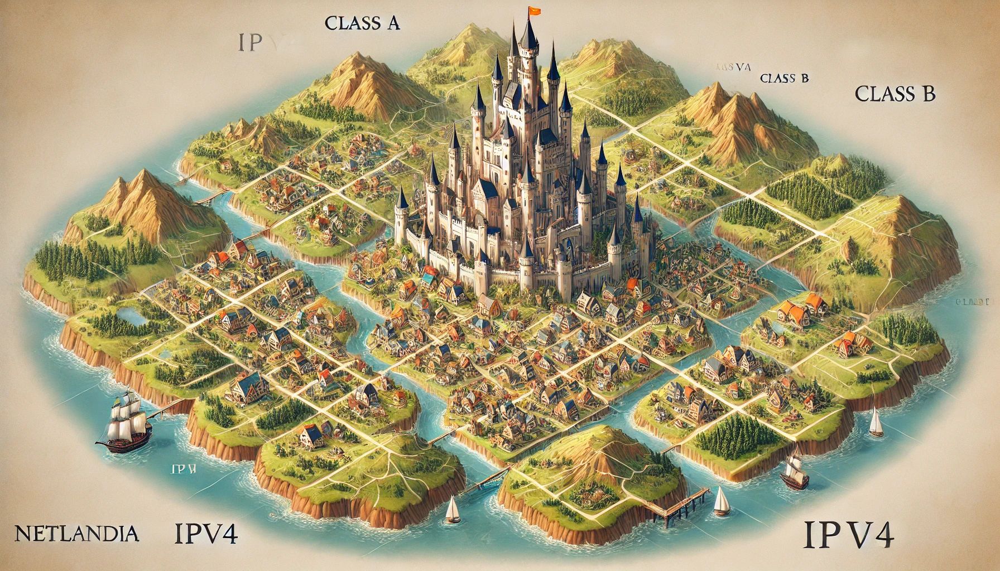
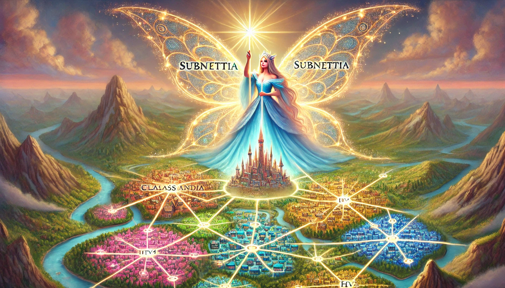
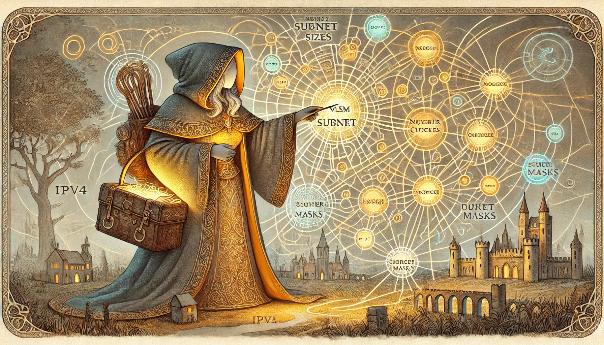
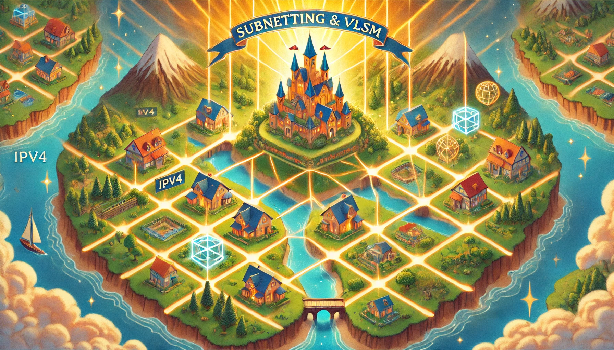

### **Once Upon a Time in the Land of IP**
In the magical kingdom of **Netlandia**, there lived a powerful wizard called **King Addresson**, who ruled over a realm full of numbers called **IPv4**. Each citizen in the kingdom was given a house (an IP address), and they lived happily for a while.

#### **The Problem with Crowded Kingdoms**
King Addresson decided to divide his kingdom into **classes** (A, B, C, D, and E) to organize his people:
- **Class A**: Big cities for giants with huge fields (for large organizations).
- **Class B**: Medium-sized towns.
- **Class C**: Cozy villages for smaller communities.

But soon, there was trouble! Many villages and towns ran out of houses because they had too many people (too many devices). At the same time, the big cities had so many unused houses that they stood empty.

---

### **The Wise Wizard’s Solution**
One day, a clever fairy named **Subnettia** came to the king and whispered, "Why not divide your big cities, towns, and villages into smaller neighborhoods? You can call this **subnetting**! By doing this, every place will have the exact number of houses it needs."

King Addresson agreed. Subnettia waved her magic wand and said:

- "Large cities can share their space and give small villages room to grow."
- "I will use something magical called a **subnet mask**, which tells each neighborhood how many houses it should have."

The people of Netlandia cheered because they could now use their land efficiently.

---

### **The Adventure of VLSM**
But as Netlandia grew larger, a wandering traveler called **VLSM (Variable Length Subnet Masking)** came to the kingdom. She said:

"Why stick to the same neighborhood sizes when you can **custom-fit** them? Give each street exactly the number of houses they need — no more, no less! Use different masks for different areas!"

Subnettia and VLSM joined forces. They taught Netlandia to:
- Use small neighborhoods for little families (small networks).
- Use large neighborhoods for bustling markets (big networks).

---

### **Happily Ever After**
With subnetting and VLSM working their magic, every part of Netlandia thrived:
- Devices got the exact number of IP addresses they needed.
- No houses were wasted, and every citizen had a place to live.

And so, the kingdom of Netlandia grew wisely and efficiently, happily ever after.

