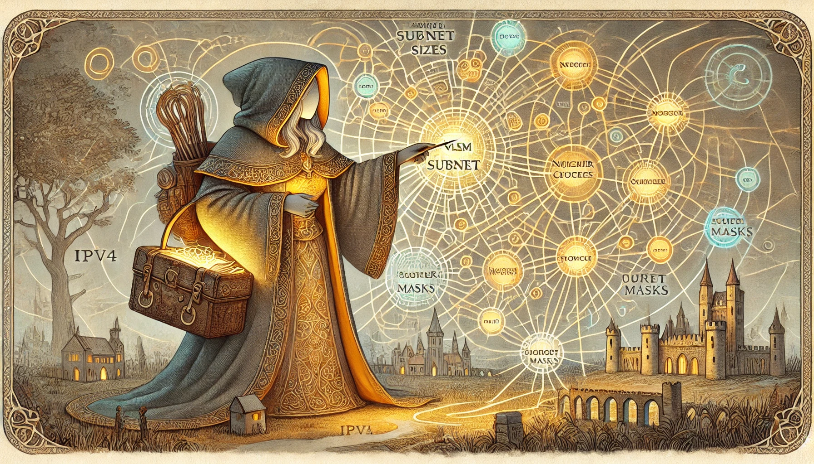
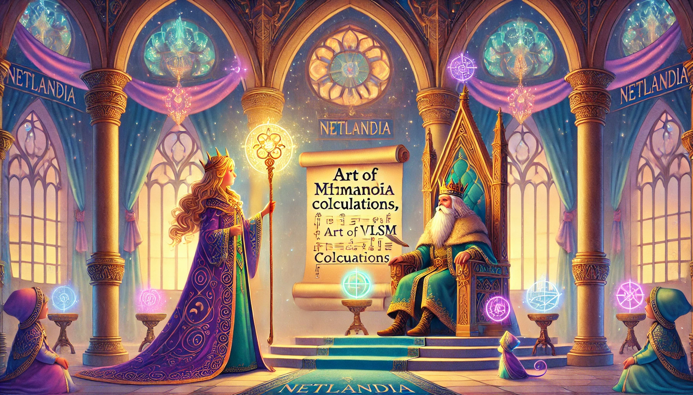
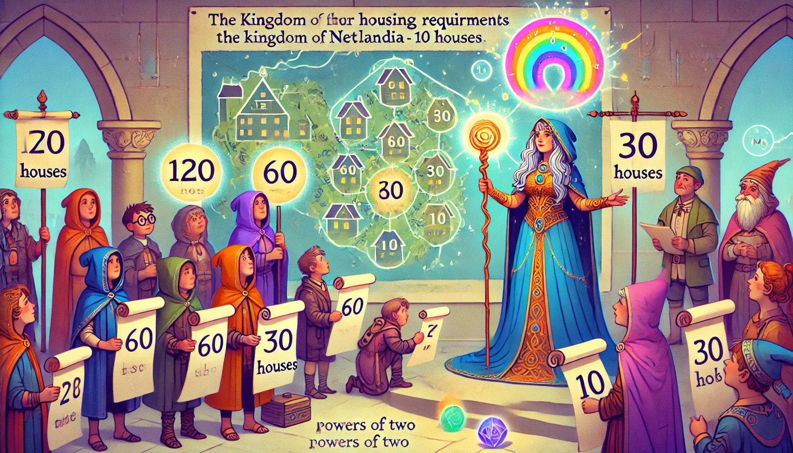
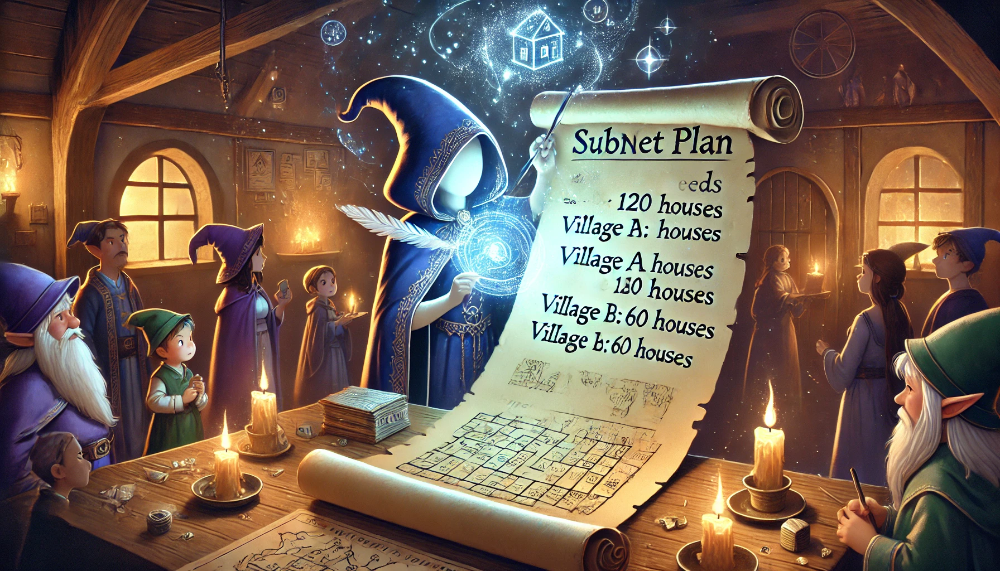
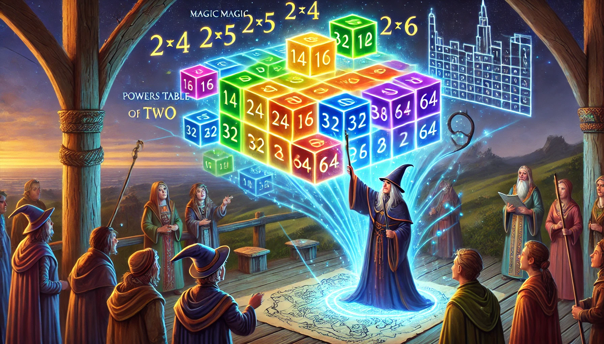
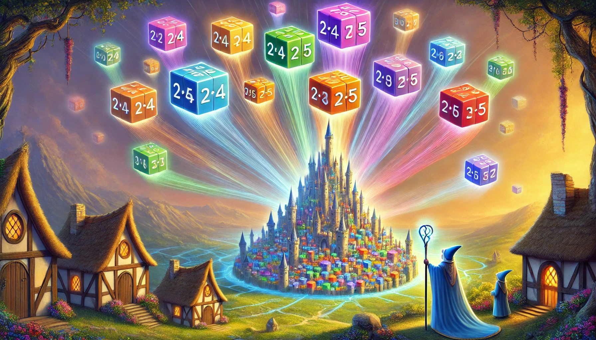
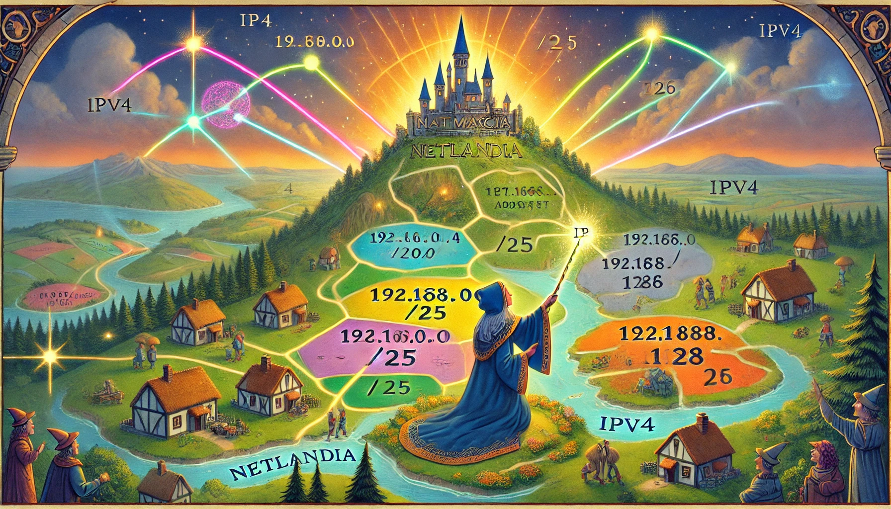
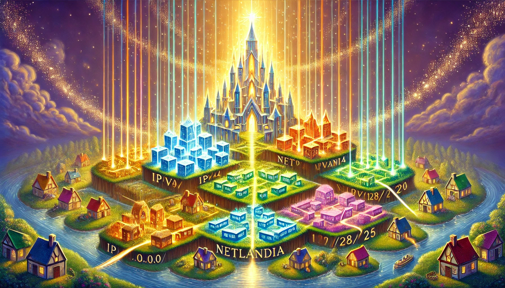
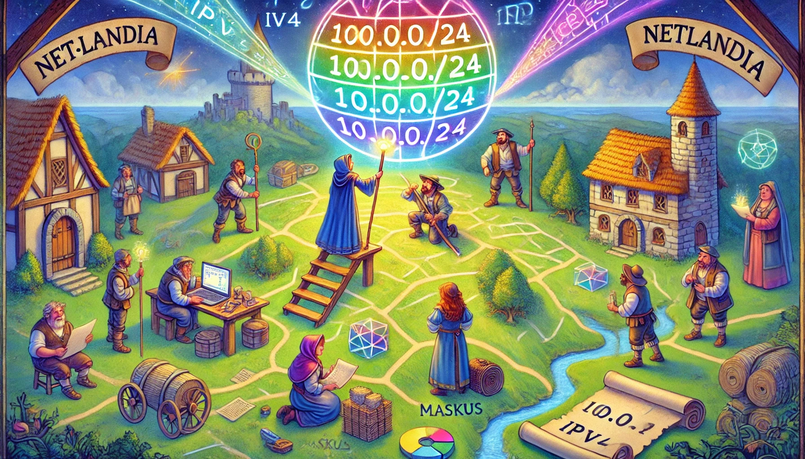
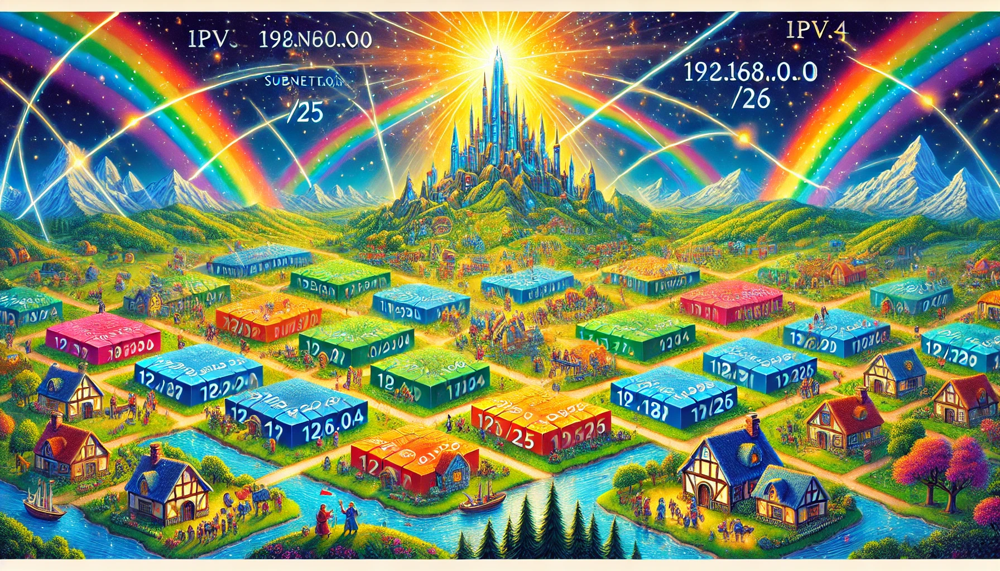

### **Once Upon a Time in the Land of IP**
In the magical kingdom of **Netlandia**, there lived a powerful wizard called **King Addresson**, who ruled over a realm full of numbers called **IPv4**. Each citizen in the kingdom was given a house (an IP address), and they lived happily for a while.

#### **The Problem with Crowded Kingdoms**
King Addresson decided to divide his kingdom into **classes** (A, B, C, D, and E) to organize his people:
- **Class A**: Big cities for giants with huge fields (for large organizations).
- **Class B**: Medium-sized towns.
- **Class C**: Cozy villages for smaller communities.

But soon, there was trouble! Many villages and towns ran out of houses because they had too many people (too many devices). At the same time, the big cities had so many unused houses that they stood empty.

---

### **The Wise Wizard’s Solution**
One day, a clever fairy named **Subnettia** came to the king and whispered, "Why not divide your big cities, towns, and villages into smaller neighborhoods? You can call this **subnetting**! By doing this, every place will have the exact number of houses it needs."

King Addresson agreed. Subnettia waved her magic wand and said:

- "Large cities can share their space and give small villages room to grow."
- "I will use something magical called a **subnet mask**, which tells each neighborhood how many houses it should have."

The people of Netlandia cheered because they could now use their land efficiently.

---

### **The Adventure of VLSM**
But as Netlandia grew larger, a wandering traveler called **VLSM (Variable Length Subnet Masking)** came to the kingdom. She said:

"Why stick to the same neighborhood sizes when you can **custom-fit** them? Give each street exactly the number of houses they need — no more, no less! Use different masks for different areas!"

Subnettia and VLSM joined forces. They taught Netlandia to:
- Use small neighborhoods for little families (small networks).
- Use large neighborhoods for bustling markets (big networks).

---

### **Happily Ever After**
With subnetting and VLSM working their magic, every part of Netlandia thrived:
- Devices got the exact number of IP addresses they needed.
- No houses were wasted, and every citizen had a place to live.

And so, the kingdom of Netlandia grew wisely and efficiently, happily ever after.

---

### **A New Problem in Netlandia**

Just when the people thought all was well, another problem emerged. One day, the royal messenger hurried into King Addresson’s court.

“Your Majesty! Villages have started fighting over land. Some say they don’t have enough houses, while others claim there’s too much empty space going to waste!”

The King frowned. “How can this be? Subnettia and VLSM solved our problems. Did we not divide the land fairly?”

The messenger hesitated. “We used fixed neighborhood sizes, sire. But some neighborhoods grew smaller, and others grew larger. We’re running into trouble again.”

---

### **Mathmagician Maskus to the Rescue**

The news spread across Netlandia until it reached the wise **Mathmagician Maskus**, a scholar who could solve any land-related puzzle. She packed her **bag of subnet masks**, hopped on her trusty abacus carriage, and rushed to the palace.

---

“Your Majesty, what you need is **a flexible map that adjusts for each village's true needs. We call this the Art of VLSM Calculations.** Let me guide your land managers!”

The villagers gathered in the castle square as Maskus began her lesson.

---

### **The Art of Calculating VLSM**
Mathmagician Maskus guided the villagers to calculate subnet sizes using three steps: gathering requirements, finding powers of two, and assigning addresses.

“First, we must calculate how much land each village truly needs,” Maskus began, unrolling a fresh parchment map.  
"Start with the **biggest villages** and work your way down.”

#### **Step 1: Gather the Requirements**
Maskus stood in the center of the town square and asked, “How many houses do the villages need?”  
The villagers eagerly responded:  

- **Village A:** “120 houses!”  
- **Village B:** “60 houses!”  
- **Village C:** “30 houses!”  
- **Village D:** “10 houses!”

“Good,” said Maskus. “Always list your needs from the largest to the smallest. That way, we’ll start with the biggest neighborhoods to ensure they fit.”

With her glowing quill, she wrote down the housing needs on a scroll titled **"Subnet Plan."**  

---

#### **Step 2: Choose Powers of Two**
Maskus waved her staff, revealing a glowing diagram in the air: **the Magic Table of Powers of Two**.  
“To calculate the size of each neighborhood, we need to fit the houses into the smallest block size that’s a power of two,” she explained.

She demonstrated:
- **Village A:** Needs 120 → Next power of two = \(2^7 = 128\) houses.  
- **Village B:** Needs 60 → Next power of two = \(2^6 = 64\) houses.  
- **Village C:** Needs 30 → Next power of two = \(2^5 = 32\) houses.  
- **Village D:** Needs 10 → Next power of two = \(2^4 = 16\) houses.  

“This way, every village will have just enough space—no more, no less!”

The villagers marveled at how magical math could be so precise.

---

### **Step 3: Assigning Addresses**
Mathmagician Maskus now brought out the **kingdom map**, showing all available land: `192.168.0.0/24`.  
"Let’s carve out the land for each village step by step," she announced, her staff glowing.

- **Village A** received the first block: `192.168.0.0/25` (128 houses).  
- **Village B** took the next space: `192.168.0.128/26` (64 houses).  
- **Village C** followed with: `192.168.0.192/27` (32 houses).  
- **Village D** was assigned the final piece: `192.168.0.224/28` (16 houses).

“No space wasted, no overlap,” Maskus declared proudly.

The kingdom map shimmered, showing the newly organized neighborhoods.

The villagers cheered as their once-chaotic map became an organized, efficient layout.

---

### **A Tricky Test**
But Maskus wasn’t done yet. She pointed to a **blank map** on the parchment and said,  
“Here’s a new challenge for all of you: Divide `10.0.0.0/24` among four villages needing:
- 200 houses  
- 100 houses  
- 50 houses  
- 25 houses  

Start with the largest and work downward. Let’s see if you’ve mastered my magic!”

The villagers scratched their heads but soon got to work, calculating powers of two, aligning subnets, and checking their results.

Their work turned the blank map into a new vision for the growing villages.

---

### **Netlandia Perfected**
After hours of diligent work, the villagers finally completed the challenge. Maskus reviewed their map and smiled.  
“You’ve done it!” she exclaimed. “You now know the art of VLSM!”

As a reward, she raised her glowing staff and a **magical map** of Netlandia appeared in the sky. Each neighborhood was labeled with its **IP range and subnet mask**, shining like constellations.

Netlandia was now a thriving, harmonious realm where every bit of land was used wisely.

The villagers cheered for Mathmagician Maskus, thanking her for her wisdom. Netlandia would live happily and efficiently ever after.
