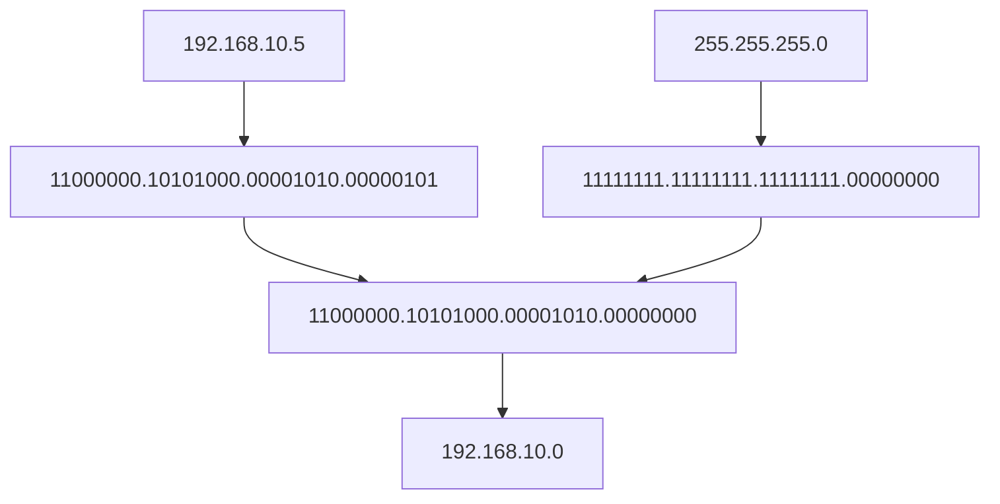
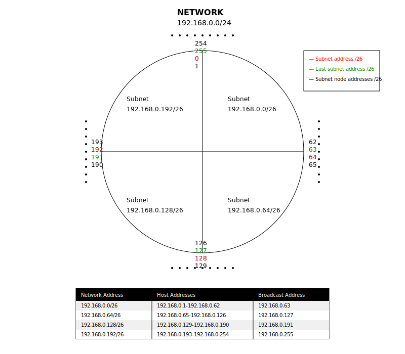
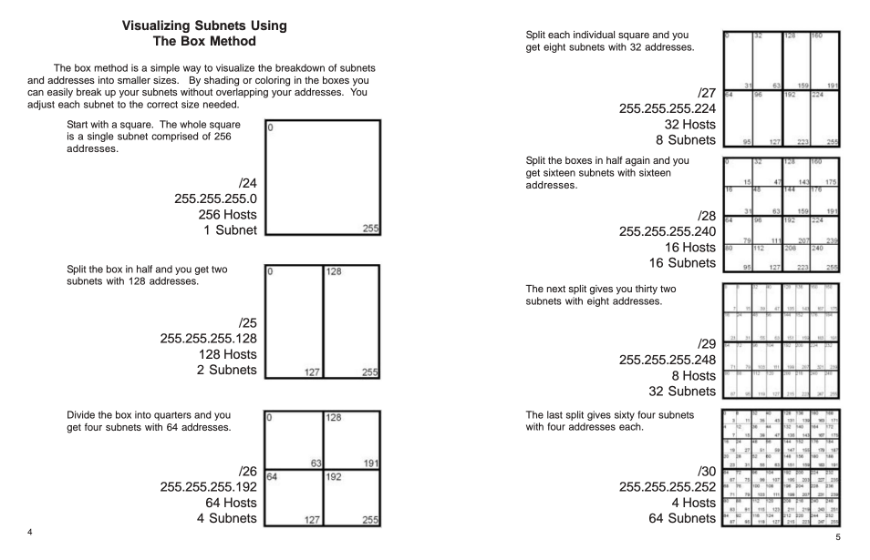
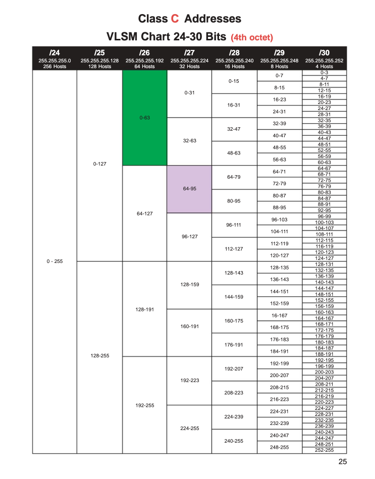
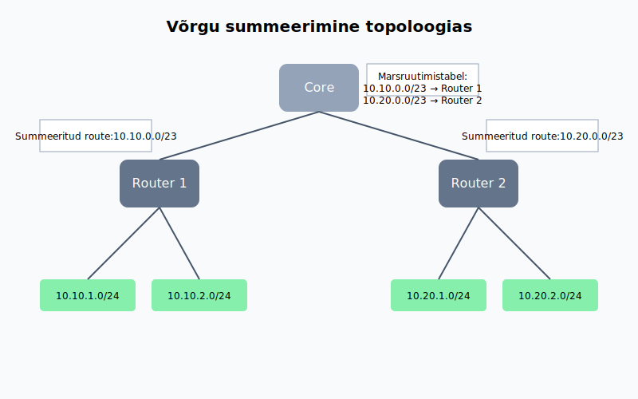
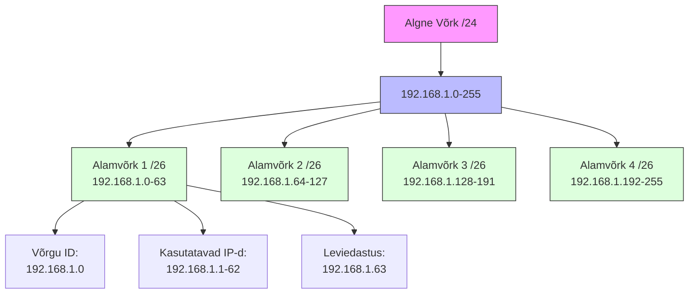
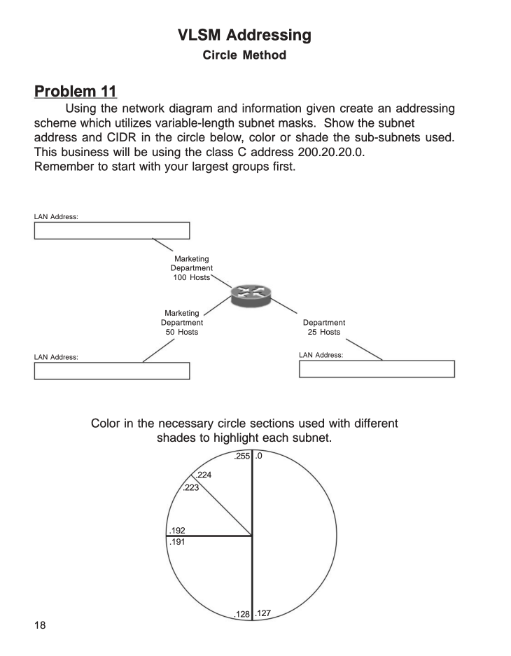
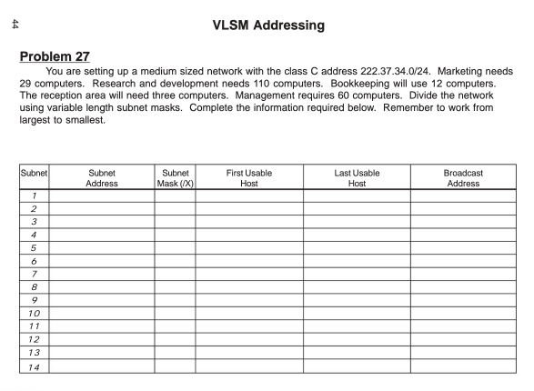

# Teema 9: IP-aadressid: Klassid, CIDR, VLSM ja Privaat/Hallid IP-d

## IP-aadressid: Klassid, CIDR, VLSM ja Privaat/Hallid IP-d

### 🌐 Sissejuhatus IP-aadressidesse
IP-aadressid on fundamentaalsed võrgu suhtluses, võimaldades seadmetel teineteist tuvastada ja omavahel suhelda. Kui MAC-aadressid haldavad kohalikku võrgu suhtlust, siis IP-aadressid võimaldavad struktureeritud ja hierarhilist marsruutimist laiemates võrkudes, nagu internet.

### 🧱 IP-aadresside põhialused


| **Funktsioon**          | **Kirjeldus**                                  |
|-------------------------|------------------------------------------------|
| **Struktuur**           | Koosneb 4 oktetist (32 bitti), mis on eraldatud punktidega (nt 192.168.1.1). |
| **Binaarne esitus**      | Iga oktett võib ulatuda vahemikku 0 kuni 255 ja esitatakse 8 bitina. |
| **Subnet**              | IP-aadresside grupeeritud vahemikku nimetatakse subnet'iks. |

#### IPv4 Aadress
| **Esitus**              | **Näide**                                     |
|-------------------------|------------------------------------------------|
| **Detsimaalne formaat** | 128.10.2.30                                   |
| **Binaarne formaat**    | 10000000 00001010 00000010 00011110           |

- **Subnet(alamvõrk)**: IP-aadressid, mis on grupeeritud järjestikusteks aadressideks, nimetatakse IP-võrkudeks (subnet'id). Kõik ühe subnet'i IP-d jagavad sama numbrilist väärtust aadressi esimeses osas.


> ### 🛠️ Meeldetuletus 🧠
> **🔹 Bitt**  
> Bitt on arvuti väikseim ühik. Tavaliselt esitatakse seda numbritega 0️⃣ ja 1️⃣.
>
> **🔸 Bait**  
> Bait koosneb 8️⃣ bitist. Seda kasutatakse süsteemi salvestusmahu määramisel. 💾  
> Bait on kõige levinum mõiste arvutiteaduses. 💻 Sellega saab esitada 2^8 = 256 erinevat väärtust. 🔢


### 📜 Ajaloolised IP-aadresside klassid


Alguses jagati IP-aadressid klassideks nende jaotamise määratlemiseks:

Siin on selgitus "klassipõhise adresseerimise" (Classful Addressing) kohta, mis oli algne viis IP-aadresse jagada võrgu- ja hostiosaks:

### **Klassipõhine IP-aadresside jaotus**
IP-aadressid (IPv4) jagatakse 5 klassi: A, B, C, D ja E. Need klassid määravad, kuidas aadress jagatakse võrgu- ja hostiosaks.

| **Klass** | **Võrgu vahemik (IP)**       | **Võrgu vahemik (numbriliselt)** | **Võrgu bitid** | **Hosti bitid** | **Hostide arv**          | **Kasutus**                             |
|-----------|-------------------------------|----------------------------------|-----------------|----------------|--------------------------|-----------------------------------------|
| **A**     | 1.0.0.0 – 127.255.255.255     | 1–127                           | 8 bitti         | 24 bitti        | ~16,777,214 (2^24 - 2)   | Suured võrgud (nt. andmekeskused)       |
| **B**     | 128.0.0.0 – 191.255.255.255   | 128–191                         | 16 bitti        | 16 bitti        | ~65,534 (2^16 - 2)       | Keskmise suurusega võrgud               |
| **C**     | 192.0.0.0 – 223.255.255.255   | 192–223                         | 24 bitti        | 8 bitti         | ~254 (2^8 - 2)           | Väikesed võrgud (nt. koduvõrgud)        |
| **D**     | 224.0.0.0 – 239.255.255.255   | 224–239                         | -               | -               | -                        | Multicast (grupiedastused)              |
| **E**     | 240.0.0.0 – 255.255.255.255   | 240–255                         | -               | -               | -                        | Eksperimentaalne (pole avalikus kasutuses) |

Tänapäeval **klassipõhist (classful) aadressiruumi jaotust enam ei kasutata**, kuna see asendati paindlikuma **CIDR-i** (Classless Inter-Domain Routing) süsteemiga. Siiski langeb ajalooliselt määratletud **klass C** vahemikuga, mida sageli kasutatakse koduvõrkudes.

#### **🔑 Klass C:**  
📍 **Vahemik:** 192.0.0.0 – 223.255.255.255  
📍 **Tüüpiline kasutus:** Väikesed võrgud (256 aadressi võrgus).  
📍 **Koduvõrkudes:** Peamiselt **192.168.x.x** alavõrgud.  

💡 **Lihtne meelde jätta:** Koduvõrgud nagu **192.168.0.0/16** kuuluvad ajalooliselt klass C aadressiruumi. Kui mõelda **klass C**, siis saab seda seostada tavaliste koduvõrkudega! 🏡

---

### **🚀 Miks klassipõhine süsteem välja vahetati?**  
❌ Klassipõhine süsteem oli liiga jäik:  
- **Klass A**: Liiga palju aadresse, ressursid raiskus. 🗑️  
- **Klass C**: Liiga väike suurtele organisatsioonidele. 🏢  

✅ **CIDR** tõi paindlikkuse ja võimaldas efektiivsemat aadresside jaotust! 💡  

---

### 🌐 **IPv4 aadresside ammendumine**  
IPv4 kasutab **32-bitiseid aadresse**, andes ligikaudu **4,3 miljardit unikaalset aadressi**. Interneti plahvatusliku kasvu tõttu hakkas see varu ammenduma. Selle lahendamiseks võeti kasutusele:  
- **IPv6** – peaaegu piiramatu aadressiruum. 🌍  
- **NAT (Network Address Translation)** – aadresside jagamine koduvõrkudes. 🔄
 

**Source**: The number of connected IoT devices is estimated to grow to 40 billion by 2030. [IoT Analytics](https://iot-analytics.com/) 
 
---

### **Ehk võrkude suurused ja klassid olid:** 🌐

| **Klass** | **Võrkude arv** | **Hostide arv võrgu kohta** |  
|-----------|----------------|----------------------------|  
| **A**     | 126            | 16,777,214 🟢            |  
| **B**     | 16,384         | 65,534 🟡                 |  
| **C**     | 2,097,152      | 254 🔵                    |  

- **Klass A**: Suured võrgud, palju aadresse.  
- **Klass B**: Keskmised võrgud.  
- **Klass C**: Väiksed võrgud, tihti koduvõrkudes kasutatav.  

---

### **Reserveeritud aadressid** 🛑  

Siin on tabel, mis võtab kokku **reserveeritud IP-vahemikud, MIDA EI SAA KASUTADA KOHALIKUS VÕRGUS**:
| **#** | **IP-aadress/Kontseptsioon** | **Kirjeldus** | **Näide** |
|-------|----------------------------------|-------------------------------------------------------------------------------------------------|-----------------------|
| 1 | **Tagasiühenduse aadress (Loopback)** | Reserveeritud tagasiühenduse testimiseks sama seadme piires. Sõnumid ei välju seadmest. | `127.0.0.1` |
| 2 | **0.0.0.0 (Määramata aadress)** | Näitab initsialiseerimata või määratlemata aadressi. Kasutatakse sageli DHCP-s ja marsruutimistabelites. | `0.0.0.0` |
| 3 | **Võrgu aadress** | Tähistab IP-aadressi võrguosa. Hosti bitid on kõik seatud `0`-le. | `195.33.19.0` |
| 4 | **Leviedastuse aadress (Broadcast)** | Kasutatakse pakettide saatmiseks kõigile hostidele võrgus. Hosti bitid on kõik seatud `1`-le. | `195.33.19.255` |
| 5 | **Piiratud leviedastuse aadress** | Kasutatakse pakettide saatmiseks kõigile seadmetele kohalikus võrgus, kuid mitte kaugemale. | `255.255.255.255` |
---
## Võrgumask

### **Mis on prefiks?** 🧩

**Prefiks** on alternatiivne viis subnet mask'i esitamiseks. See näitab, mitu bitti IP-aadressist kuulub võrguosale (network). Seda tähistatakse kaldkriipsu `/` ja numbri abil (nt **/24**).

#### **Seos subnet mask'iga**  
- **Prefiks**: /24  
- **Subnet mask**: 255.255.255.0  
Mõlemad tähendavad sama asja: võrguosa koosneb esimesest 24 bitist.

#### **Näited**:  
- **/24** = 255.255.255.0 → 256 aadressi  
- **/16** = 255.255.0.0 → 65,536 aadressi  
- **/22** = 255.255.252.0 → 1024 aadressi  

#### **Miks kasutada prefiksit?** 🚀  
See on **kompaktsem** ja lihtsam viis subnet mask'i kirjutamiseks

---

### Milleks võrgumask? 🔍

**Võrgumaski põhiroll**
- IP-aadressi juurde käib alati ka mask
- Mask määrab ära, kuidas IP-aadress jaguneb:
  - Võrguosa (Network portion)
  - Hostiosa (Host portion)

**Praktiline kasutus seadmetes** 💻
Kui seade peab saatma andmepaketti, toimub järgmine kontroll:

1. **Sihtkoha tuvastamine:**
   - Kas pakett läheb sisevõrku või välisvõrku?
   - Seade võtab sihtaadressi ja arvutab oma maskiga

2. **Otsuste tegemine:**
   - Kui tulemus = enda võrk → käsitleb sisevõrgu paketina
   - Kui tulemus ≠ enda võrk → käsitleb välisvõrgu paketina

3. **Edasine tegutsemine:**
   - Sisevõrgu puhul: kasutatakse ARP protokolli
   - Välisvõrgu puhul: suunatakse Default Gateway'le (ruuterile)

1. **Võrgumaski ülesehitus:**
   - Koosneb neljast okteti (8-bitisest numbrist)
   - Iga oktet on vahemikus 0-255
   - Tavaliselt on järjestikku kas 255 või 0


---

### Praktiline Näide:

Oletame, et oled IT-administraator ja pead leidma, millisesse võrku kuulub arvuti IP-aadressiga 192.168.10.5.



## Lähteandmed
- Arvuti IP: 192.168.10.5
- Võrgumask: 255.255.255.0

### 1. LIHTNE MEETOD (kiirem)
1. Vaatame võrgumaski numbreid:
   - Kus on 255, seal jäävad IP numbrid samaks
   - Kus on 0, seal lähevad IP numbrid nulliks
   
2. Seega:
   - 192 (mask 255) → 192 jääb
   - 168 (mask 255) → 168 jääb
   - 10 (mask 255) → 10 jääb
   - 5 (mask 0) → muutub 0-ks

3. Vastus: 192.168.10.0 - see ongi võrguaadress!

### 2. PÕHJALIK MEETOD (täpsem)
1. Teisendame IP binaarkujule:
   ```
   192.168.10.5 = 11000000.10101000.00001010.00000101
   ```

2. Teisendame maski binaarkujule:
   ```
   255.255.255.0 = 11111111.11111111.11111111.00000000
   ```

3. Teeme AND tehte (1 ja 1 = 1, kõik muu = 0):
   ```
   11000000.10101000.00001010.00000101 (IP)
   11111111.11111111.11111111.00000000 (mask)
   ------------------------------------ (AND)
   11000000.10101000.00001010.00000000
   ```

4. Teisendame tagasi kümnendarvuks:
   ```
   11000000.10101000.00001010.00000000 = 192.168.10.0
   ```

## Võrgu 192.168.10.0/24 aadresside tabel

| IP Aadress | Otstarve | Kas saab seadmele määrata? |
|------------|----------|---------------------------|
| 192.168.10.0 | Võrgu aadress (Network Address) - identifitseerib võrku | ❌ Ei |
| 192.168.10.1 - 192.168.10.254 | Seadmete aadressid (arvutid, telefonid, printerid jne) | ✅ Jah |
| 192.168.10.255 | Broadcast aadress - kasutatakse teadete saatmiseks kõigile võrgu seadmetele | ❌ Ei |

- **Kasutatavaid IP-aadresse**: 254 (2-254)
- **Reserveeritud aadresse**: 2 (võrgu ja broadcast aadress)
- **Kokku aadresse**: 256 (0-255)

NB! 1111 1111 = 255 (binaaris) , saame numbrid 0 kuni 255 -> kokku 256 numbrit

---

## 🔢 CIDR (Classless Inter-Domain Routing)

CIDR (Classless Inter-Domain Routing) võeti kasutusele, et lahendada probleeme, mis tekkisid klassipõhise IP-aadresseerimisega. Klassipõhine süsteem (klass A, B, C jne) oli jäik ja ebaefektiivne, eriti IP-aadresside jagamisel. 

### 📌 Põhjused, miks CIDR kasutusele võeti:
1. **IP-aadresside raiskamine 🗑️**: Klassipõhine aadresseerimine jaotas IP-aadresse kindlateks plokkideks (nt klass A, B, C). See tähendas, et väiksemad võrgud pidid kasutama rohkem IP-aadresse, kui neil tegelikult vaja oli. Näiteks klass A võrgus oli saadaval üle 16 miljoni IP-aadressi, isegi kui vajadus oli vaid mõnesaja järgi. 😵‍💫

2. **Marsruutimistabelite koormus 🛠️**: Iga võrgu marsruut pidi olema eraldi salvestatud ruuterite marsruutimistabelites. Suured ja jäigad aadressiplaanid tegid ruuterite töö keeruliseks ja aeglaseks, kuna neil tuli töödelda väga suuri tabelimahte. 📋

3. **Internetikasutuse kasv 🌐**: 1990. aastate alguses hakkas Internet kiiresti kasvama ja klassipõhine süsteem ei suutnud rahuldada nõudlust uute IP-aadresside järele. Ilma muudatusteta oleks IPv4-aadressid kiiresti otsa saanud. 🚀

4. **Paindlikum aadressiruum 🧩**: CIDR võimaldab IP-aadresse jagada väiksemateks või suuremateks plokkideks vastavalt vajadusele. Näiteks saab CIDR-i abil määrata võrgule täpselt vajaliku arvu aadresse, kasutades prefiksimärget (nt /22). See vähendas raiskamist ja optimeeris aadressiruumi kasutamist. 📏

### 🔍 Kuidas CIDR töötab?
CIDR loob paindliku aadressijaotuse, kasutades subnet mask'i (või prefiksimärget, nt /24). See tähendab, et IP-vahemikud, mis on üksteisega lähestikku, saab grupeerida üheks marsruudiks. Näiteks mitu väikest võrku saab esitada ühe suurema maskiga, vähendades ruuterite marsruutimistabeli mahtu ja parandades süsteemi efektiivsust. ⚙️

CIDR-i kasutuselevõtt oli revolutsiooniline samm Interneti-skaalautuvuse ja aadressiruumi parema haldamise suunas. 🚦

### 🧮 CIDR Võrdlus: Tavaline vs. Optimeeritud Marsruutimine

#### 1️⃣ Klassikaline Lähenemine (Ilma CIDR-ita)
Kujuta ette, et pead hallata järgmisi alamvõrke ruuteris:

**Marsruutimistabel**:
```
192.168.0.0/24
192.168.1.0/24
192.168.2.0/24
192.168.3.0/24
```

**Mida see tähendab?** 🤔
- Iga alamvõrk vajab eraldi kirjet
- Ruuter peab haldama 4 eraldi võrgukirjet
- Suurem ressursikasutus ja aeglasem töötlemine
- Rohkem mälukasutust marsruutimistabelis

#### 2️⃣ Optimeeritud Lähenemine (CIDR-iga)
Sama võrgustiku saab esitada palju efektiivsemalt:

**Marsruutimistabel**:
```
192.168.0.0/22
```

**Eelised** ✨
- Üks kirje katab kõik neli alamvõrku
- Väiksem marsruutimistabel
- Kiirem pakettide töötlemine
- Efektiivsem mälukasutus

> 💡 **Võti:** CIDR võimaldab mitme järjestikuse võrgu koondamist üheks suuremaks üksuseks, muutes võrguhalduse märkimisväärselt efektiivsemaks.

---

## ✂️ Võrgu Segmenteerimine ehk Fikseeritud Võrgumask ( Subnetting).

- **Kõik alamvõrgud on sama suurusega.**
- **Ühtne võrgumask** rakendub kõigile alamvõrkudele.
- **Raiskab IP-aadresse kui alamvõrgud ei vaja võrdset hulka aadresse.**

#### Näide:
Meil on võrk **192.168.45.0/24** ja peame selle jagama 4 alamvõrguks.
- Võrgumask kõigile alamvõrkudele: `/26` (64 aadressi igaühes).
- Alamvõrgud:
  - Alamvõrk 1: 192.168.45.0 - 192.168.45.63 (/26)
  - Alamvõrk 2: 192.168.45.64 - 192.168.45.127 (/26)
  - Alamvõrk 3: 192.168.45.128 - 192.168.45.191 (/26)
  - Alamvõrk 4: 192.168.45.192 - 192.168.45.255 (/26)

**Probleem**: Kui üks alamvõrk vajab ainult 5 aadressi ja teine 120, olete sunnitud IP-aadresse raiskama.

  

## ✂️ VLSM - Variable Length Subnet Masking (Muutuva Pikkusega Alamvõrgu Maskeerimine)

- **Iga alamvõrk on erineva suurusega**, vastavalt vajadusele.
- Võimaldab määrata täpselt vajaliku arvu aadresse, kasutades **erinevaid võrgumaske** igale grupile.
- **Säästab IP-aadresse.**

#### Näide:
Meil on võrk **192.168.45.0/24** ja järgmised vajadused:
- Grupp 1: 120 inimest
- Grupp 2: 62 inimest
- Grupp 3: 25 inimest
- Teised: Väikesed grupid (10, 5, jne.)

VLSM kasutamine:
- Grupp 1: `/25` (128 aadressi, 192.168.45.0 - 192.168.45.127)
- Grupp 2: `/26` (64 aadressi, 192.168.45.128 - 192.168.45.191)
- Grupp 3: `/27` (32 aadressi, 192.168.45.192 - 192.168.45.223)
- Väiksemad grupid: `/28`, `/29`, `/30`, jne.

---

### Peamised Erinevused

| Aspekt | Tavaline Segmenteerimine | VLSM |
|-----------------------|-----------------------------|--------------------------------|
| **Alamvõrgu Suurus** | Kõik alamvõrgud on võrdsed | Alamvõrgud on muutuva suurusega |
| **Aadresside Efektiivsus** | Raiskab IP-sid väiksemate gruppide jaoks | Säästab IP-sid täpsete vajaduste järgi |
| **Võrgumask** | Sama kõigile alamvõrkudele | Kasutatakse erinevaid võrgumaske |

### Miks VLSM on Parem:
Kuna gruppidel on **erinevad suurused**, on VLSM sobiv valik. See tagab IP-aadresside tõhusa kasutamise, rahuldades samal ajal iga grupi vajadused.

---

  
**Võrdlus erinevate subnettimise lähenemiste vahel:** See pilt kujutab subnettimist teistsuguse vaatenurga alt, näidates, kuidas subneti plokid saab visuaalselt rühmitada ja korraldada.

---

  
**Subnettimise spikker:** See spikker on kiire juhend, mis aitab arvutada ja mõista subneti suurusi ning nendele vastavaid prefiksi pikkusi.

### Võrgumaskide tabel ja kasutusvõimalused

Võrgumaskide tabel on võrguinseneride jaoks oluline tööriist, mida kasutatakse võrgu segmentatsiooni ja aadresside haldamisel. See sarnaneb korrutustabeliga, mida insenerid peavad sageli käsitlema. Tavaliselt on sellised tabelid kergesti ligipääsetavad ja tihti nähtaval kohal, näiteks kinnitatuna kontori seinale.

---

## Võrgumaski tähistused
Maski saab esitada kahes vormingus:
- **Detsimaalne kujul:** `255.255.255.0`
- **Prefiksina:** `/24`

Mõlemad tähistused viitavad samale võrgule, kuid seadmetes võivad nõuded varieeruda. Näiteks:
- **Cisco seadmed** nõuavad täielikku detsimaalset maski.
- **Juniper või Huawei seadmed** toetavad lihtsustatud prefiksi kasutust (nt `/24`).

---

## Maskide kasutamine praktilistes ülesannetes
1. **Väikeste võrkude loomiseks:** Kui vajate ühendamiseks ainult paari aadressi (nt kahe seadme vahel), saate kasutada maske nagu `/30` või `/31`.
2. **Suurte võrkude haldamiseks:** Maskid nagu `/16` või `/22` sobivad suurte segmentide jaoks, kuid neid kasutatakse peamiselt aadressiruumi optimeerimiseks.
3. **Universaalne mask `/0`:** Viitab kogu IP-aadressi ruumile, mida kasutatakse marsruutimise kontekstis.

## Marsruutimistabel ja maskide laiendus
Marsruutimistabelis võivad esineda erineva suurusega võrgud:
- **Mask `/0`:** Kogu aadressiruum (kasutatakse vaikimarsruudina).
- **Mask `/22`:** Füüsilise võrgu suurim segment (1024 aadressi).
- **Mask `/16` ja suuremad:** Kasutatakse suuremate võrkude agregatsiooniks.

## Soovitused
- **Kalkulaatorid:** Soovitatav on kasutada võrgu- ja marsruutimaskide kalkulaatorit, mis aitab kiiremini arvutada vajalikke aadressiruume ja maske. Enamik insenere kasutab selliseid kalkulaatoreid mobiilirakendustena.
- **Maskide meelespidamine:** Kuigi kalkulaator on mugav, on oluline osata maske lugeda ja arvutada ka käsitsi.
- **Tööriistad erinevate seadmete jaoks:** Enne võrgu konfigureerimist uurige, millist maski esitamise vormingut teie seadmed toetavad.


Mõned huvitavad aadressid tabelis, mida tasub lähemalt analüüsida. Vaatleme neid eraldi:

---

### 1. **Maskid: `255.255.255.255` ja `255.255.255.254`**
   - **`255.255.255.255` (CIDR: `/32`)**:
     - See on spetsiifiline mask, mis tähistab ühte IP-aadressi. Seda kasutatakse peamiselt punkt-ühendusena seadmetel (nt loopback-aadressid) või väga kitsaste filtrite rakendamiseks tulemüürides.
     - Võrk sisaldab ainult ühte IP-aadressi, st pole võimalik lisada rohkem seadmeid.
     - Kasutatakse tavaliselt spetsiaalsetel juhtudel, kus on vaja konkreetset ainsat aadressi esile tõsta.

   - **`255.255.255.254` (CIDR: `/31`)**:
     - Võrk koosneb kahest aadressist, kuid tegelikult on need spetsiaalsed. Seda maski kasutatakse sageli punkt-punkt-ühendustes, kus traditsioonilisi võrguaadresse pole vaja raisata.
     - Ühe aadressiga märgitakse ühte liidest ja teine jääb vastaspoolele. Pole vajadust võrgu- ega ringlussaadetiste (broadcast) aadressi järele.
     - Näide: kasutusel kaabeltelevisiooni või ISP-de liideste puhul, mis ühendavad seadmeid otse.

### 2. **Aadress `0.0.0.0` (CIDR: `/0`)**
   - **`0.0.0.0/0`** viitab **kõigile võimalikele aadressidele** IPv4 ruumis.
   - Seda kasutatakse tavaliselt vaikesuunamiste (default route) määramiseks marsruutimistabelites.
   - Kui määratakse `0.0.0.0/0` marsruut, ütleb see seadmele: "Kui konkreetset marsruuti pole leitud, saata andmed sellele liinile."
   - Näide kasutusest:
     - Interneti värav (gateway) ruuterites. Kui liiklus ei sobi ühelegi teisele marsruudile, saadetakse see määratud vaikimarsruudile.
---
### **🌐 Autonoomsed (eravõrgud): RFC 3330 🏠**


RFC 3330 määratleb spetsiaalsed IP-aadressiruumid, mis on **privaatvõrkudele** reserveeritud. Need aadressid on nagu 🎫 tasuta piletid võrgu loomisel – neid saab kasutada kodus, ettevõtetes või muudes eravõrkudes, **ilma registreerimiseta**. 🌟 Aga tähelepanu: **internetis neid aadresse ei kasutata** 🚫, kuna pakkujad blokeerivad need.

---


### **📋 Privaatvõrgu aadressivahemikud**
1. **10.0.0.0/8** (mask: 255.0.0.0) 🏢
   - **Suur privaatvõrk** – ideaalne ettevõtete jaoks.
   - Võid luua tohutuid sisevõrke, sest selles vahemikus on **16,777,216 aadressi**! 🤯

2. **172.16.0.0 – 172.31.0.0/12** (mask: 255.240.0.0) 🏬
   - Keskmise suurusega võrgud, **1,048,576 aadressi**. 💻
   - Sobib serveritele ja väiksematele organisatsioonidele. 🎯

3. **192.168.0.0 – 192.168.255.0/16** (mask: 255.255.0.0) 🏠
   - Kõige **populaarsem koduvõrkude vahemik**! 🛋️
   - Kui su ruuter ütleb: "Minu aadress on `192.168.1.1`," oled õiges kohas! 🚀

---

### **🛠️ Teised erivõrgud**
1. **⚡ Automaathäälestuse aadressivahemik: 169.254.0.0/16**
   - Kui seade ei saa DHCP kaudu aadressi, määratakse automaatselt aadress **sellest vahemikust**.  
     👉 Näiteks: "Hei, ma ei saanud aadressi! Siin on minu varuaadress!" 🆘  
   - Ei suunata internetti. 🛑 Kohalikuks kasutuseks ainult!

2. **💼 Provider NAT (RFC 6598): 100.64.0.0/10**
   - Teenusepakkujate **salajane võrguruum**! 🤐
   - Suurtele ettevõtetele ja ISP-dele (Interneti-teenuse pakkujatele) mõeldud.

---

### **🔧 Kasutus ja piirangud**
- 📜 **Privaatvõrgud on tasuta!** Kuid **avalikus internetis need ei tööta**. Kui proovid privaatvõrgu aadressiga internetti minna, ütleb su pakkuja: "Ei-ei, mitte täna!" 🙅‍♂️
- Privaatvõrkude õigesti seadistamine väldib segadust ja IP-aadresside konflikte. 🔄


**Küsimus:**  
Kas kaardil on näha, kus asuvad privaatvõrgu IP-d (nt 10.0.0.0/8, 172.16.0.0/12, 192.168.0.0/16)? Kui jah, millises piirkonnas need asuvad?  

---

### **🎮 Praktilised näited**
- Koduruuter määrab aadressi: **`192.168.0.1`** – "Tere tulemast minu võrku!" 🎉
- **`10.0.0.1`**: Suur ettevõte? Pole probleemi, kõik jääb su võrku. 🏢
- **NAT (Network Address Translation)**: See on nagu võluvõti 🔑, mis võimaldab privaatvõrkudel avaliku IP kaudu internetti pääseda. 💫

---

### **🔍 Huvitavad tähelepanekud**
- **Automaathäälestuse aadressid** (`169.254.x.x`) on nagu signaal võrguühenduse probleemidest: "Houston, meil on probleem!" 🚀
- **Provider NAT**-i vahemik (`100.64.0.0/10`) sobib suurtel ISP-del, aga *pssst* – ka sina võid seda oma võrgus kasutada. 🤫
- Internetis ringlevad ainult ametlikult registreeritud aadressid 📡, kuid privaatvõrgud jäävad just sinu salajaseks mänguväljakuks. 🤹‍♀️

 

Diagramm näitab:
- All: üksikud /24 võrgud
- Keskel: ruuterid 1 ja 2 summeerivad oma võrgud /23-ks
- Üleval: Core ruuter näeb ainult summeeritud marsruute
- Tulemus: väiksem marsruutimistabel, efektiivsem võrk
---
## Erinevad viisid alamvõrkude arvutamiseks

1. **Binaarne Meetod:**
   ```
   192.168.1.50 = 11000000.10101000.00000001.00110010
   /26 mask    = 11111111.11111111.11111111.11000000
   ```
   - Võrgu osa: Esimesed 26 bitti
   - Hosti osa: Viimased 6 bitti (32-26bitti)
   - Eelis: Täpne, näitab täpselt bittide jaotust
   - Puudus: Aeganõudev

I'll help you create a nicely formatted table in Markdown for your README.

| Description | Value |
|------------|-------|
| IP Address (Decimal) | 192.168.1.50 |
| IP Address (Binary) | 11000000.10101000.00000001.00110010 |
| Subnet Mask (Decimal) | 255.255.255.192 (/26) |
| Subnet Mask (Binary) | 11111111.11111111.11111111.11000000 |
| Network Part (First 26 bits) | 11000000.10101000.00000001.00 |
| Host Part (Last 6 bits) | 110010 (last 6 bits) |

2. **Kiirmeetod:**
   ```
   /26 puhul:
   - 32-26 = 6 bitti hostidele
   - 2^6 = 64 aadressi kokku
   - 64 - 2 = 62 kasutatavat hosti
   ```
   - Eelis: Kiire arvutada
   - Puudus: Ei näita võrgu struktuuri

3. **Maski Meetod:**
   ```
   /26 mask: 255.255.255.192
   Alamvõrgu suurus = 256 - 192 = 64
   ```
   - Võrgu aadressid: .0, .64, .128, .192
   - Eelis: Hea suurte võrkude puhul
   - Puudus: Vajab oktettide teadmist

4. **Tabelimeetod:**
   
   | CIDR | Mask       | Alamvõrgu suurus |
   |------|------------|------------------|
   | /24  | 255.255.255.0   | 256 |
   | /25  | 255.255.255.128 | 128 |
   | /26  | 255.255.255.192 | 64  |
   | /27  | 255.255.255.224 | 32  |

Praktiline näide:
1. IP: 192.168.1.50/26
2. Kiirmeetodiga:
   - 64 aadressi alamvõrgus
   - Alamvõrgu piirid: 0-63, 64-127, 128-191, 192-255
   - 50 kuulub esimesse alamvõrku (0-63)
3. Võrgu ID: 192.168.1.0
4. Broadcast: 192.168.1.63
5. Kasutatavad IP-d: 192.168.1.1 - 192.168.1.62

Soovitused:
- Algajatele: Alusta kiirmeetodiga
- Võrguadministraatoritele: Õpi kõik meetodid
- Eksamiteks: Harjuta binaarset meetodit
- Igapäevaseks kasutamiseks: Kasuta tabelimeetodit




1. Hostide arvu leidmine alamvõrgus:
   Valem on: Hostide arv = 2^(32-prefiksi_pikkus) - 2

/24 alamvõrgu puhul:
- 2^(32-24) - 2 = 2^8 - 2 = 254 kasutatavat hosti
- Kokku aadresse: 256 (koos võrgu ja leviedastuse aadressidega)

/26 alamvõrgu puhul:
- 2^(32-26) - 2 = 2^6 - 2 = 62 kasutatavat hosti
- Kokku aadresse: 64 (koos võrgu ja leviedastuse aadressidega)

Siin on selge ülevaatlik tabel:

| Võrgumask | Kokku IP-sid | Kasutatavaid Hoste | Võrgu ID | Leviedastus |
|-----------|--------------|-------------------|-----------|-------------|
| /24       | 256         | 254               | .0        | .255        |
| /26       | 64          | 62                | .0, .64, .128, .192 | .63, .127, .191, .255 |

Ülalolev diagramm näitab, kuidas /24 võrk jagatakse neljaks /26 alamvõrguks. Iga /26 alamvõrk:
- Sisaldab 64 aadressi kokku
- Omab 62 kasutatavat hosti aadressi
- Sisaldab 1 võrgu ID ja 1 leviedastuse aadressi

Näiteks esimeses /26 alamvõrgus (192.168.1.0-63):
- Võrgu ID: 192.168.1.0
- Kasutatavad hostid: 192.168.1.1 kuni 192.168.1.62
- Leviedastuse aadress: 192.168.1.63

---

### 🎯 **VLSM Ülesanne Klassis**  

  

#### **💡 Mida teha?**  
1. Kasuta antud võrgudiagrammi ja kujunda **täiuslik aadressimisskeem** muutuvapikkusega subnet maskidega (VLSM).  
2. **Leia subnetid ja CIDR-id**, et kõik alamvõrgud oleksid ideaalselt paigutatud.  
3. Täida allolev ring värvide või varjutustega, et **iga subnet paistaks silma**. ✨  

--- 



#### **💡 Ülesande kirjeldus:**
- Kasutades antud klass C aadressi **223.27.34.0/24**, seadista võrk, mis vastab järgmistele vajadustele:
  - **Marketing**: 29 arvutit.
  - **Research and Development**: 14 arvutit.
  - **Accounting**: 7 arvutit.
  - **Miscellaneous Components**: 2 arvutit.
- Täida tabel, määrates iga subneti:
  - **Subnet Aadress**
  - **Subnet Mask (CIDR kujul)**
  - **Esimene ja viimane kasutatav hostiaadress**
  - **Broadcast-aadress**

#### **📝 Mida teha?**
1. Leia iga alamvõrgu jaoks vajalik aadressiruum vastavalt vajalike hostide arvule.
2. Kasuta **VLSM-i** (Variable Length Subnet Mask), alustades suurimatest alamvõrkudest (Marketing) ja liikudes väiksemate poole.
3. Täida tabel sammhaaval, et kindlustada kõik alamvõrgud mahuvad aadressiruumi.

Here’s the updated, more **engaging** version with **examples** for host calculations (10000, 1000, 500) in **Class A, B, and C** networks! It includes **tables**, **questions**, **calculation steps**, and **fun emojis**.

---

## 🌍 Subnetting ja VLSM – Klassid A, B ja C 🚀  

🧑‍💻 Õpime, kuidas subnettimine töötab **klassi A, B ja C** IP-aadressidel.

### ❓ Saab subnettida teises ja kolmandas oktetis? 🤔  
- **Klass A ja B:** ✅ Jah, saab subnettida teises ja kolmandas oktetis!  
- **Klass C:** ❌ Kahjuks mitte – subnettimine toimub ainult **neljandas oktetis**.  

---

## 🧮 Arvutused ja näited  

### 📌 Kui vajad 10 000 hosti subnetis
#### **Arvutame vajaliku subnet maski:**  
\[
2^h - 2 \geq 10 000
\]
- \( h = 14 \) (sest \( 2^{14} = 16 384 \))  
- Vajaliku subnet mask: **/18 (255.255.192.0)**  

#### Näide (Klass B):
| **Võrk**         | **Subnet Mask**    | **Maksimaalne hostide arv** | **Samm kolmandas oktetis** |
|------------------|--------------------|-----------------------------|----------------------------|
| 172.16.0.0/18    | 255.255.192.0      | 16 382                      | 64 kolmandas oktetis       |
| 172.16.64.0/18   | 255.255.192.0      | 16 382                      |                            |
| 172.16.128.0/18  | 255.255.192.0      | 16 382                      |                            |

---

### 📌 Kui vajad 1000 hosti subnetis
#### **Arvutame vajaliku subnet maski:**  
\[
2^h - 2 \geq 1000
\]
- \( h = 10 \) (sest \( 2^{10} = 1024 \))  
- Vajaliku subnet mask: **/22 (255.255.252.0)**  

#### Näide (Klass B):
| **Võrk**         | **Subnet Mask**    | **Maksimaalne hostide arv** | **Samm neljandas oktetis** |
|------------------|--------------------|-----------------------------|----------------------------|
| 172.16.0.0/22    | 255.255.252.0      | 1022                        | 4                          |
| 172.16.0.4/22    | 255.255.252.0      | 1022                        |                            |
| 172.16.0.8/22    | 255.255.252.0      | 1022                        |                            |

---

### 📌 Kui vajad 500 hosti subnetis
#### **Arvutame vajaliku subnet maski:**  
\[
2^h - 2 \geq 500
\]
- \( h = 9 \) (sest \( 2^9 = 512 \))  
- Vajaliku subnet mask: **/23 (255.255.254.0)**  

#### Näide (Klass C):
| **Võrk**         | **Subnet Mask**    | **Maksimaalne hostide arv** | **Samm neljandas oktetis** |
|------------------|--------------------|-----------------------------|----------------------------|
| 192.168.1.0/23   | 255.255.254.0      | 510                         | 2                          |
| 192.168.1.2/23   | 255.255.254.0      | 510                         |                            |

---

### 🚀 Kiired reeglid ja valemid:
1. **Subnettimiseks vajaliku hostide arvu valem:**  
   \[
   2^h - 2 \geq Hostide arv
   \]
2. **Alamvõrkude arv valem:**  
   \[
   2^n \text{ (kus } n = \text{ laenatud bitid)}
   \]
3. **Alamvõrgu samm:** \( 256 - Subnet Maski väärtus \)

---

# IP-aadresside haldamise soovitused

## 1. Planeeri summeeritavad võrgublokid
- **Miks?** Lihtsustab marsruutimist, vähendab marsruutimistabeli suurust
- **Näide:**  
  ```
  HEA: 
  Filiaal A: 10.10.0.0/24
  Filiaal B: 10.20.0.0/24 
  Summeerub: 10.0.0.0/22

  HALB:
  Filiaal A: 10.1.0.0/24, 10.5.0.0/24
  Filiaal B: 10.2.0.0/24, 10.6.0.0/24
  Ei summeeru lihtsalt
  ```

## 2. Jäta laienemisvaru
- **Põhimõte:** 4 blokki tööks + 4 blokki reservi
- **Näide:**
  ```
  Filiaal saab: 10.20.0.0/22
  Kasutusel: 10.20.0.0/24 kuni 10.20.3.0/24
  Reservis: 10.20.4.0/24 kuni 10.20.7.0/24
  ```

## 3. Kasuta loogilist struktuuri
- **Põhimõte:** Oktetid näitavad asukohta/otstarvet
- **Näide:**
  ```
  10.FILIAAL.TEENUS.0/24
  10.20.1.0/24 = Filiaal 20, kasutajad
  10.20.2.0/24 = Filiaal 20, serverid
  ```

## 4. Dokumenteeri professionaalselt
- Kasuta keskset andmebaasi/süsteemi
- **Mitte Excel**, vaid spetsiaalsed IP-halduse tööriistad
- Taga meeskonnale reaalajas ligipääs

## 5. Väldi levinud vigu
```
HALB praktika:
10.1.1.0/24 (Tallinn, kasutajad)
10.5.7.0/24 (Tallinn, serverid)
10.2.3.0/24 (Tartu, kasutajad)
- Pole summeeritav
- Raske aru saada
- Keeruline hallata

HEA praktika:
10.10.0.0/24 (Tallinn, kasutajad)
10.10.1.0/24 (Tallinn, serverid)
10.20.0.0/24 (Tartu, kasutajad)
- Loogiline struktuur
- Lihtne summeerida
- Selge ülevaade
```
