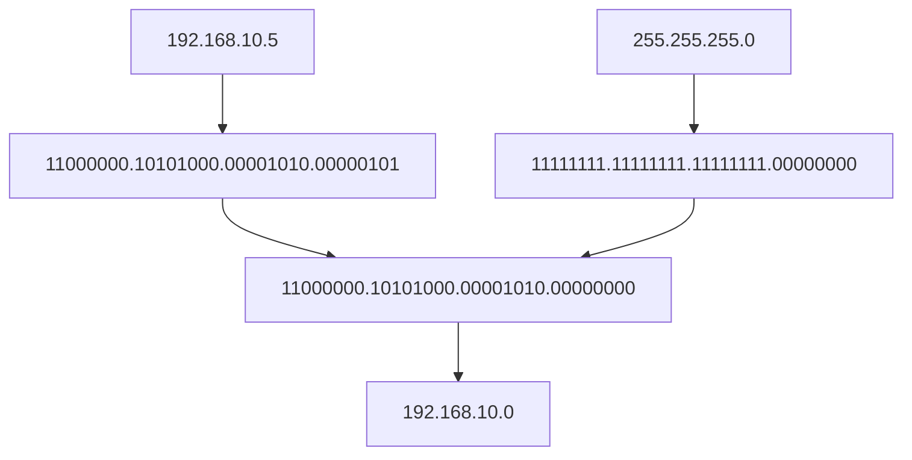

# Teema 9: IP-aadressid: Klassid, CIDR, VLSM ja Privaat/Hallid IP-d

## IP-aadressid: Klassid, CIDR, VLSM ja Privaat/Hallid IP-d

### 🌐 Sissejuhatus IP-aadressidesse
IP-aadressid on fundamentaalsed võrgu suhtluses, võimaldades seadmetel teineteist tuvastada ja omavahel suhelda. Kui MAC-aadressid haldavad kohalikku võrgu suhtlust, siis IP-aadressid võimaldavad struktureeritud ja hierarhilist marsruutimist laiemates võrkudes, nagu internet.

### 🧱 IP-aadresside põhialused


| **Funktsioon**          | **Kirjeldus**                                  |
|-------------------------|------------------------------------------------|
| **Struktuur**           | Koosneb 4 oktetist (32 bitti), mis on eraldatud punktidega (nt 192.168.1.1). |
| **Binaarne esitus**      | Iga oktett võib ulatuda vahemikku 0 kuni 255 ja esitatakse 8 bitina. |
| **Subnet**              | IP-aadresside grupeeritud vahemikku nimetatakse subnet'iks. |

#### IPv4 Aadress
| **Esitus**              | **Näide**                                     |
|-------------------------|------------------------------------------------|
| **Detsimaalne formaat** | 128.10.2.30                                   |
| **Binaarne formaat**    | 10000000 00001010 00000010 00011110           |

- **Subnet(alamvõrk)**: IP-aadressid, mis on grupeeritud järjestikusteks aadressideks, nimetatakse IP-võrkudeks (subnet'id). Kõik ühe subnet'i IP-d jagavad sama numbrilist väärtust aadressi esimeses osas.


> ### 🛠️ Meeldetuletus 🧠
> **🔹 Bitt**  
> Bitt on arvuti väikseim ühik. Tavaliselt esitatakse seda numbritega 0️⃣ ja 1️⃣.
>
> **🔸 Bait**  
> Bait koosneb 8️⃣ bitist. Seda kasutatakse süsteemi salvestusmahu määramisel. 💾  
> Bait on kõige levinum mõiste arvutiteaduses. 💻 Sellega saab esitada 2^8 = 256 erinevat väärtust. 🔢


### 📜 Ajaloolised IP-aadresside klassid


Alguses jagati IP-aadressid klassideks nende jaotamise määratlemiseks:

Siin on selgitus "klassipõhise adresseerimise" (Classful Addressing) kohta, mis oli algne viis IP-aadresse jagada võrgu- ja hostiosaks:

### **Klassipõhine IP-aadresside jaotus**
IP-aadressid (IPv4) jagatakse 5 klassi: A, B, C, D ja E. Need klassid määravad, kuidas aadress jagatakse võrgu- ja hostiosaks.

| **Klass** | **Võrgu vahemik (IP)**       | **Võrgu vahemik (numbriliselt)** | **Võrgu bitid** | **Hosti bitid** | **Hostide arv**          | **Kasutus**                             |
|-----------|-------------------------------|----------------------------------|-----------------|----------------|--------------------------|-----------------------------------------|
| **A**     | 1.0.0.0 – 127.255.255.255     | 1–127                           | 8 bitti         | 24 bitti        | ~16,777,214 (2^24 - 2)   | Suured võrgud (nt. andmekeskused)       |
| **B**     | 128.0.0.0 – 191.255.255.255   | 128–191                         | 16 bitti        | 16 bitti        | ~65,534 (2^16 - 2)       | Keskmise suurusega võrgud               |
| **C**     | 192.0.0.0 – 223.255.255.255   | 192–223                         | 24 bitti        | 8 bitti         | ~254 (2^8 - 2)           | Väikesed võrgud (nt. koduvõrgud)        |
| **D**     | 224.0.0.0 – 239.255.255.255   | 224–239                         | -               | -               | -                        | Multicast (grupiedastused)              |
| **E**     | 240.0.0.0 – 255.255.255.255   | 240–255                         | -               | -               | -                        | Eksperimentaalne (pole avalikus kasutuses) |

Tänapäeval **klassipõhist (classful) aadressiruumi jaotust enam ei kasutata**, kuna see asendati paindlikuma **CIDR-i** (Classless Inter-Domain Routing) süsteemiga. Siiski langeb ajalooliselt määratletud **klass C** vahemikuga, mida sageli kasutatakse koduvõrkudes.

#### **🔑 Klass C:**  
📍 **Vahemik:** 192.0.0.0 – 223.255.255.255  
📍 **Tüüpiline kasutus:** Väikesed võrgud (256 aadressi võrgus).  
📍 **Koduvõrkudes:** Peamiselt **192.168.x.x** alavõrgud.  

💡 **Lihtne meelde jätta:** Koduvõrgud nagu **192.168.0.0/16** kuuluvad ajalooliselt klass C aadressiruumi. Kui mõelda **klass C**, siis saab seda seostada tavaliste koduvõrkudega! 🏡

---

### **🚀 Miks klassipõhine süsteem välja vahetati?**  
❌ Klassipõhine süsteem oli liiga jäik:  
- **Klass A**: Liiga palju aadresse, ressursid raiskus. 🗑️  
- **Klass C**: Liiga väike suurtele organisatsioonidele. 🏢  

✅ **CIDR** tõi paindlikkuse ja võimaldas efektiivsemat aadresside jaotust! 💡  

---

### 🌐 **IPv4 aadresside ammendumine**  
IPv4 kasutab **32-bitiseid aadresse**, andes ligikaudu **4,3 miljardit unikaalset aadressi**. Interneti plahvatusliku kasvu tõttu hakkas see varu ammenduma. Selle lahendamiseks võeti kasutusele:  
- **IPv6** – peaaegu piiramatu aadressiruum. 🌍  
- **NAT (Network Address Translation)** – aadresside jagamine koduvõrkudes. 🔄
 

**Source**: The number of connected IoT devices is estimated to grow to 40 billion by 2030. [IoT Analytics](https://iot-analytics.com/) 
 
---

### **Ehk võrkude suurused ja klassid olid:** 🌐

| **Klass** | **Võrkude arv** | **Hostide arv võrgu kohta** |  
|-----------|----------------|----------------------------|  
| **A**     | 126            | 16,777,214 🟢            |  
| **B**     | 16,384         | 65,534 🟡                 |  
| **C**     | 2,097,152      | 254 🔵                    |  

- **Klass A**: Suured võrgud, palju aadresse.  
- **Klass B**: Keskmised võrgud.  
- **Klass C**: Väiksed võrgud, tihti koduvõrkudes kasutatav.  

---

### **Reserveeritud aadressid** 🛑  

Siin on tabel, mis võtab kokku **reserveeritud IP-vahemikud, MIDA EI SAA KASUTADA KOHALIKUS VÕRGUS**:
| **#** | **IP-aadress/Kontseptsioon** | **Kirjeldus** | **Näide** |
|-------|----------------------------------|-------------------------------------------------------------------------------------------------|-----------------------|
| 1 | **Tagasiühenduse aadress (Loopback)** | Reserveeritud tagasiühenduse testimiseks sama seadme piires. Sõnumid ei välju seadmest. | `127.0.0.1` |
| 2 | **0.0.0.0 (Määramata aadress)** | Näitab initsialiseerimata või määratlemata aadressi. Kasutatakse sageli DHCP-s ja marsruutimistabelites. | `0.0.0.0` |
| 3 | **Võrgu aadress** | Tähistab IP-aadressi võrguosa. Hosti bitid on kõik seatud `0`-le. | `195.33.19.0` |
| 4 | **Leviedastuse aadress (Broadcast)** | Kasutatakse pakettide saatmiseks kõigile hostidele võrgus. Hosti bitid on kõik seatud `1`-le. | `195.33.19.255` |
| 5 | **Piiratud leviedastuse aadress** | Kasutatakse pakettide saatmiseks kõigile seadmetele kohalikus võrgus, kuid mitte kaugemale. | `255.255.255.255` |
---
## Võrgumask

### **Mis on prefiks?** 🧩

**Prefiks** on alternatiivne viis subnet mask'i esitamiseks. See näitab, mitu bitti IP-aadressist kuulub võrguosale (network). Seda tähistatakse kaldkriipsu `/` ja numbri abil (nt **/24**).

#### **Seos subnet mask'iga**  
- **Prefiks**: /24  
- **Subnet mask**: 255.255.255.0  
Mõlemad tähendavad sama asja: võrguosa koosneb esimesest 24 bitist.

#### **Näited**:  
- **/24** = 255.255.255.0 → 256 aadressi  
- **/16** = 255.255.0.0 → 65,536 aadressi  
- **/22** = 255.255.252.0 → 1024 aadressi  

#### **Miks kasutada prefiksit?** 🚀  
See on **kompaktsem** ja lihtsam viis subnet mask'i kirjutamiseks

---

### Milleks võrgumask? 🔍

**Võrgumaski põhiroll**
- IP-aadressi juurde käib alati ka mask
- Mask määrab ära, kuidas IP-aadress jaguneb:
  - Võrguosa (Network portion)
  - Hostiosa (Host portion)

**Praktiline kasutus seadmetes** 💻
Kui seade peab saatma andmepaketti, toimub järgmine kontroll:

1. **Sihtkoha tuvastamine:**
   - Kas pakett läheb sisevõrku või välisvõrku?
   - Seade võtab sihtaadressi ja arvutab oma maskiga

2. **Otsuste tegemine:**
   - Kui tulemus = enda võrk → käsitleb sisevõrgu paketina
   - Kui tulemus ≠ enda võrk → käsitleb välisvõrgu paketina

3. **Edasine tegutsemine:**
   - Sisevõrgu puhul: kasutatakse ARP protokolli
   - Välisvõrgu puhul: suunatakse Default Gateway'le (ruuterile)

1. **Võrgumaski ülesehitus:**
   - Koosneb neljast okteti (8-bitisest numbrist)
   - Iga oktet on vahemikus 0-255
   - Tavaliselt on järjestikku kas 255 või 0


---

### Praktiline Näide:

Oletame, et oled IT-administraator ja pead leidma, millisesse võrku kuulub arvuti IP-aadressiga 192.168.10.5.



## Lähteandmed
- Arvuti IP: 192.168.10.5
- Võrgumask: 255.255.255.0

### 1. LIHTNE MEETOD (kiirem)
1. Vaatame võrgumaski numbreid:
   - Kus on 255, seal jäävad IP numbrid samaks
   - Kus on 0, seal lähevad IP numbrid nulliks
   
2. Seega:
   - 192 (mask 255) → 192 jääb
   - 168 (mask 255) → 168 jääb
   - 10 (mask 255) → 10 jääb
   - 5 (mask 0) → muutub 0-ks

3. Vastus: 192.168.10.0 - see ongi võrguaadress!

### 2. PÕHJALIK MEETOD (täpsem)
1. Teisendame IP binaarkujule:
   ```
   192.168.10.5 = 11000000.10101000.00001010.00000101
   ```

2. Teisendame maski binaarkujule:
   ```
   255.255.255.0 = 11111111.11111111.11111111.00000000
   ```

3. Teeme AND tehte (1 ja 1 = 1, kõik muu = 0):
   ```
   11000000.10101000.00001010.00000101 (IP)
   11111111.11111111.11111111.00000000 (mask)
   ------------------------------------ (AND)
   11000000.10101000.00001010.00000000
   ```

4. Teisendame tagasi kümnendarvuks:
   ```
   11000000.10101000.00001010.00000000 = 192.168.10.0
   ```

## Võrgu 192.168.10.0/24 aadresside tabel

| IP Aadress | Otstarve | Kas saab seadmele määrata? |
|------------|----------|---------------------------|
| 192.168.10.0 | Võrgu aadress (Network Address) - identifitseerib võrku | ❌ Ei |
| 192.168.10.1 - 192.168.10.254 | Seadmete aadressid (arvutid, telefonid, printerid jne) | ✅ Jah |
| 192.168.10.255 | Broadcast aadress - kasutatakse teadete saatmiseks kõigile võrgu seadmetele | ❌ Ei |

- **Kasutatavaid IP-aadresse**: 254 (2-254)
- **Reserveeritud aadresse**: 2 (võrgu ja broadcast aadress)
- **Kokku aadresse**: 256 (0-255)

NB! 1111 1111 = 255 (binaaris) , saame numbrid 0 kuni 255 -> kokku 256 numbrit

---

## 🔢 CIDR (Classless Inter-Domain Routing)

CIDR (Classless Inter-Domain Routing) võeti kasutusele, et lahendada probleeme, mis tekkisid klassipõhise IP-aadresseerimisega. Klassipõhine süsteem (klass A, B, C jne) oli jäik ja ebaefektiivne, eriti IP-aadresside jagamisel. 

### 📌 Põhjused, miks CIDR kasutusele võeti:
1. **IP-aadresside raiskamine 🗑️**: Klassipõhine aadresseerimine jaotas IP-aadresse kindlateks plokkideks (nt klass A, B, C). See tähendas, et väiksemad võrgud pidid kasutama rohkem IP-aadresse, kui neil tegelikult vaja oli. Näiteks klass A võrgus oli saadaval üle 16 miljoni IP-aadressi, isegi kui vajadus oli vaid mõnesaja järgi. 😵‍💫

2. **Marsruutimistabelite koormus 🛠️**: Iga võrgu marsruut pidi olema eraldi salvestatud ruuterite marsruutimistabelites. Suured ja jäigad aadressiplaanid tegid ruuterite töö keeruliseks ja aeglaseks, kuna neil tuli töödelda väga suuri tabelimahte. 📋

3. **Internetikasutuse kasv 🌐**: 1990. aastate alguses hakkas Internet kiiresti kasvama ja klassipõhine süsteem ei suutnud rahuldada nõudlust uute IP-aadresside järele. Ilma muudatusteta oleks IPv4-aadressid kiiresti otsa saanud. 🚀

4. **Paindlikum aadressiruum 🧩**: CIDR võimaldab IP-aadresse jagada väiksemateks või suuremateks plokkideks vastavalt vajadusele. Näiteks saab CIDR-i abil määrata võrgule täpselt vajaliku arvu aadresse, kasutades prefiksimärget (nt /22). See vähendas raiskamist ja optimeeris aadressiruumi kasutamist. 📏

### 🔍 Kuidas CIDR töötab?
CIDR loob paindliku aadressijaotuse, kasutades subnet mask'i (või prefiksimärget, nt /24). See tähendab, et IP-vahemikud, mis on üksteisega lähestikku, saab grupeerida üheks marsruudiks. Näiteks mitu väikest võrku saab esitada ühe suurema maskiga, vähendades ruuterite marsruutimistabeli mahtu ja parandades süsteemi efektiivsust. ⚙️

CIDR-i kasutuselevõtt oli revolutsiooniline samm Interneti-skaalautuvuse ja aadressiruumi parema haldamise suunas. 🚦

### 🧮 CIDR Võrdlus: Tavaline vs. Optimeeritud Marsruutimine

#### 1️⃣ Klassikaline Lähenemine (Ilma CIDR-ita)
Kujuta ette, et pead hallata järgmisi alamvõrke ruuteris:

**Marsruutimistabel**:
```
192.168.0.0/24
192.168.1.0/24
192.168.2.0/24
192.168.3.0/24
```

**Mida see tähendab?** 🤔
- Iga alamvõrk vajab eraldi kirjet
- Ruuter peab haldama 4 eraldi võrgukirjet
- Suurem ressursikasutus ja aeglasem töötlemine
- Rohkem mälukasutust marsruutimistabelis

#### 2️⃣ Optimeeritud Lähenemine (CIDR-iga)
Sama võrgustiku saab esitada palju efektiivsemalt:

**Marsruutimistabel**:
```
192.168.0.0/22
```

**Eelised** ✨
- Üks kirje katab kõik neli alamvõrku
- Väiksem marsruutimistabel
- Kiirem pakettide töötlemine
- Efektiivsem mälukasutus

> 💡 **Võti:** CIDR võimaldab mitme järjestikuse võrgu koondamist üheks suuremaks üksuseks, muutes võrguhalduse märkimisväärselt efektiivsemaks.

---

## ✂️ Võrgu Segmenteerimine ehk Fikseeritud Võrgumask ( Subnetting).

- **Kõik alamvõrgud on sama suurusega.**
- **Ühtne võrgumask** rakendub kõigile alamvõrkudele.
- **Raiskab IP-aadresse kui alamvõrgud ei vaja võrdset hulka aadresse.**

#### Näide:
Meil on võrk **192.168.45.0/24** ja peame selle jagama 4 alamvõrguks.
- Võrgumask kõigile alamvõrkudele: `/26` (64 aadressi igaühes).
- Alamvõrgud:
  - Alamvõrk 1: 192.168.45.0 - 192.168.45.63 (/26)
  - Alamvõrk 2: 192.168.45.64 - 192.168.45.127 (/26)
  - Alamvõrk 3: 192.168.45.128 - 192.168.45.191 (/26)
  - Alamvõrk 4: 192.168.45.192 - 192.168.45.255 (/26)

**Probleem**: Kui üks alamvõrk vajab ainult 5 aadressi ja teine 120, olete sunnitud IP-aadresse raiskama.

  

## ✂️ VLSM - Variable Length Subnet Masking (Muutuva Pikkusega Alamvõrgu Maskeerimine)

- **Iga alamvõrk on erineva suurusega**, vastavalt vajadusele.
- Võimaldab määrata täpselt vajaliku arvu aadresse, kasutades **erinevaid võrgumaske** igale grupile.
- **Säästab IP-aadresse.**

#### Näide:
Meil on võrk **192.168.45.0/24** ja järgmised vajadused:
- Grupp 1: 120 inimest
- Grupp 2: 62 inimest
- Grupp 3: 25 inimest
- Teised: Väikesed grupid (10, 5, jne.)

VLSM kasutamine:
- Grupp 1: `/25` (128 aadressi, 192.168.45.0 - 192.168.45.127)
- Grupp 2: `/26` (64 aadressi, 192.168.45.128 - 192.168.45.191)
- Grupp 3: `/27` (32 aadressi, 192.168.45.192 - 192.168.45.223)
- Väiksemad grupid: `/28`, `/29`, `/30`, jne.

---

### Peamised Erinevused

| Aspekt | Tavaline Segmenteerimine | VLSM |
|-----------------------|-----------------------------|--------------------------------|
| **Alamvõrgu Suurus** | Kõik alamvõrgud on võrdsed | Alamvõrgud on muutuva suurusega |
| **Aadresside Efektiivsus** | Raiskab IP-sid väiksemate gruppide jaoks | Säästab IP-sid täpsete vajaduste järgi |
| **Võrgumask** | Sama kõigile alamvõrkudele | Kasutatakse erinevaid võrgumaske |

### Miks VLSM on Parem:
Kuna gruppidel on **erinevad suurused**, on VLSM sobiv valik. See tagab IP-aadresside tõhusa kasutamise, rahuldades samal ajal iga grupi vajadused.

---

  
**Võrdlus erinevate subnettimise lähenemiste vahel:** See pilt kujutab subnettimist teistsuguse vaatenurga alt, näidates, kuidas subneti plokid saab visuaalselt rühmitada ja korraldada.

---

  
**Subnettimise spikker:** See spikker on kiire juhend, mis aitab arvutada ja mõista subneti suurusi ning nendele vastavaid prefiksi pikkusi.

---

### 🎯 **VLSM Ülesanne Klassis**  

  

#### **💡 Mida teha?**  
1. Kasuta antud võrgudiagrammi ja kujunda **täiuslik aadressimisskeem** muutuvapikkusega subnet maskidega (VLSM).  
2. **Leia subnetid ja CIDR-id**, et kõik alamvõrgud oleksid ideaalselt paigutatud.  
3. Täida allolev ring värvide või varjutustega, et **iga subnet paistaks silma**. ✨  

--- 


#### **💡 Ülesande kirjeldus:**
- Kasutades antud klass C aadressi **223.27.34.0/24**, seadista võrk, mis vastab järgmistele vajadustele:
  - **Marketing**: 29 arvutit.
  - **Research and Development**: 14 arvutit.
  - **Accounting**: 7 arvutit.
  - **Miscellaneous Components**: 2 arvutit.
- Täida tabel, määrates iga subneti:
  - **Subnet Aadress**
  - **Subnet Mask (CIDR kujul)**
  - **Esimene ja viimane kasutatav hostiaadress**
  - **Broadcast-aadress**

#### **📝 Mida teha?**
1. Leia iga alamvõrgu jaoks vajalik aadressiruum vastavalt vajalike hostide arvule.
2. Kasuta **VLSM-i** (Variable Length Subnet Mask), alustades suurimatest alamvõrkudest (Marketing) ja liikudes väiksemate poole.
3. Täida tabel sammhaaval, et kindlustada kõik alamvõrgud mahuvad aadressiruumi.

---

### 🛡 NAT (Network Address Translation)
NAT võimaldab privaatsetel IP-del suhelda internetis, teisendades need ruuteri kaudu avalikuks IP-ks. See säästab IP-aadressiruumi ja parandab turvalisust.

| **NAT Tüüp**            | **Kirjeldus**                                |
|-------------------------|----------------------------------------------|
| **Staatiline NAT**      | Üks-ühele kaardistamine.                    |
| **Dünaamiline NAT**     | Avalike IP-de vahemik.                      |
| **PAT**                 | Mitme-ühele kaardistamine (Port Address Translation). |

### 🎯 Kokkuvõte
- **🗂 Klassid**: Ajalooline ja ebatõhus kaasaegsete võrkude jaoks.
- **🖩 CIDR ja VLSM**: Tagavad paindliku ja tõhusa IP jaotuse.
- **🏠 Privaatne IP-d**: Kasutatakse sisevõrkudes.
- **📡 Erilised aadressid**: Sisaldavad loopback'i, APIPA-d, multicast'i ja broadcast'i.
- **🔄 NAT**: Sillad privaatsete ja avalike võrkude vahel.

Nende kontseptsioonide mõistmine tagab tõhusa ja skaleeritava võrgukujunduse kaasaegseteks rakendusteks. 🚀

