**Teema 9: IP-aadressid: Klassid, CIDR, VLSM ja Privaat/Hallid IP-d

## IP-aadressid: Klassid, CIDR, VLSM ja Privaat/Hallid IP-d

### 🌐 Sissejuhatus IP-aadressidesse
IP-aadressid on fundamentaalsed võrgu suhtluses, võimaldades seadmetel teineteist tuvastada ja omavahel suhelda. Kui MAC-aadressid haldavad kohalikku võrgu suhtlust, siis IP-aadressid võimaldavad struktureeritud ja hierarhilist marsruutimist laiemates võrkudes, nagu internet.

### 🧱 IP-aadresside põhialused


| **Funktsioon**          | **Kirjeldus**                                  |
|-------------------------|------------------------------------------------|
| **Struktuur**           | Koosneb 4 oktetist (32 bitti), mis on eraldatud punktidega (nt 192.168.1.1). |
| **Binaarne esitus**      | Iga oktett võib ulatuda vahemikku 0 kuni 255 ja esitatakse 8 bitina. |
| **Subnet**              | IP-aadresside grupeeritud vahemikku nimetatakse subnet'iks. |

#### IPv4 Aadress
| **Esitus**              | **Näide**                                     |
|-------------------------|------------------------------------------------|
| **Detsimaalne formaat** | 128.10.2.30                                   |
| **Binaarne formaat**    | 10000000 00001010 00000010 00011110           |

- **Subnet(alamvõrk)**: IP-aadressid, mis on grupeeritud järjestikusteks aadressideks, nimetatakse IP-võrkudeks (subnet'id). Kõik ühe subnet'i IP-d jagavad sama numbrilist väärtust aadressi esimeses osas.


> ### 🛠️ Meeldetuletus 🧠
> **🔹 Bitt**  
> Bitt on arvuti väikseim ühik. Tavaliselt esitatakse seda numbritega 0️⃣ ja 1️⃣.
>
> **🔸 Bait**  
> Bait koosneb 8️⃣ bitist. Seda kasutatakse süsteemi salvestusmahu määramisel. 💾  
> Bait on kõige levinum mõiste arvutiteaduses. 💻 Sellega saab esitada 2^8 = 256 erinevat väärtust. 🔢


### 📜 Ajaloolised IP-aadresside klassid ( NOT USED!!!!)


Alguses jagati IP-aadressid klassideks nende jaotamise määratlemiseks:

Siin on selgitus "klassipõhise adresseerimise" (Classful Addressing) kohta, mis oli algne viis IP-aadresse jagada võrgu- ja hostiosaks:

---

### **Klassipõhine IP-aadresside jaotus**
IP-aadressid (IPv4) jagatakse 5 klassi: A, B, C, D ja E. Need klassid määravad, kuidas aadress jagatakse võrgu- ja hostiosaks.

| **Klass** | **Võrgu vahemik (IP)**       | **Võrgu vahemik (numbriliselt)** | **Võrgu bitid** | **Hosti bitid** | **Hostide arv**          | **Kasutus**                             |
|-----------|-------------------------------|----------------------------------|-----------------|----------------|--------------------------|-----------------------------------------|
| **A**     | 1.0.0.0 – 127.255.255.255     | 1–127                           | 8 bitti         | 24 bitti        | ~16,777,214 (2^24 - 2)   | Suured võrgud (nt. andmekeskused)       |
| **B**     | 128.0.0.0 – 191.255.255.255   | 128–191                         | 16 bitti        | 16 bitti        | ~65,534 (2^16 - 2)       | Keskmise suurusega võrgud               |
| **C**     | 192.0.0.0 – 223.255.255.255   | 192–223                         | 24 bitti        | 8 bitti         | ~254 (2^8 - 2)           | Väikesed võrgud (nt. koduvõrgud)        |
| **D**     | 224.0.0.0 – 239.255.255.255   | 224–239                         | -               | -               | -                        | Multicast (grupiedastused)              |
| **E**     | 240.0.0.0 – 255.255.255.255   | 240–255                         | -               | -               | -                        | Eksperimentaalne (pole avalikus kasutuses) |

Tänapäeval **klassipõhist (classful) aadressiruumi jaotust enam ei kasutata**, kuna see asendati paindlikuma **CIDR-i** (Classless Inter-Domain Routing) süsteemiga. Siiski langeb ajalooliselt määratletud **klass C** vahemikuga, mida sageli kasutatakse koduvõrkudes.

#### **🔑 Klass C:**  
📍 **Vahemik:** 192.0.0.0 – 223.255.255.255  
📍 **Tüüpiline kasutus:** Väikesed võrgud (256 aadressi võrgus).  
📍 **Koduvõrkudes:** Peamiselt **192.168.x.x** alavõrgud.  

💡 **Lihtne meelde jätta:** Koduvõrgud nagu **192.168.0.0/16** kuuluvad ajalooliselt klass C aadressiruumi. Kui mõelda **klass C**, siis saab seda seostada tavaliste koduvõrkudega! 🏡

---

### **🚀 Miks klassipõhine süsteem välja vahetati?**  
❌ Klassipõhine süsteem oli liiga jäik:  
- **Klass A**: Liiga palju aadresse, ressursid raiskus. 🗑️  
- **Klass C**: Liiga väike suurtele organisatsioonidele. 🏢 

✅ **CIDR** tõi paindlikkuse ja võimaldas efektiivsemat aadresside jaotust! 💡  

---

### 🌐 **IPv4 aadresside ammendumine**  
IPv4 kasutab **32-bitiseid aadresse**, andes ligikaudu **4,3 miljardit unikaalset aadressi**. Interneti plahvatusliku kasvu tõttu hakkas see varu ammenduma. Selle lahendamiseks võeti kasutusele:  
- **IPv6** – peaaegu piiramatu aadressiruum. 🌍 
- **NAT (Network Address Translation)** – aadresside jagamine koduvõrkudes. 🔄
 

**Source**: The number of connected IoT devices is estimated to grow to 40 billion by 2030. [IoT Analytics](https://iot-analytics.com/) 
 
---

### **Ehk võrkude suurused ja klassid olid:** 🌐

| **Klass** | **Võrkude arv** | **Hostide arv võrgu kohta** |  
|-----------|----------------|----------------------------|  
| **A**     | 126            | 16,777,214 🟢            |  
| **B**     | 16,384         | 65,534 🟡                 |  
| **C**     | 2,097,152      | 254 🔵                    |  

- **Klass A**: Suured võrgud, palju aadresse.  
- **Klass B**: Keskmised võrgud.  
- **Klass C**: Väiksed võrgud, tihti koduvõrkudes kasutatav.  

---

### **Reserveeritud aadressid** 🛑  

Here’s a table summarizing **reserved IP ranges, CAN'T BE USED in LOCAL NETWORK:

Based on the content from your image, here's a table summarizing the five IP address usage types mentioned in the text:

| **#** | **IP Address/Concept**           | **Description**                                                                                 | **Example**           |
|-------|----------------------------------|-------------------------------------------------------------------------------------------------|-----------------------|
| 1     | **Loopback Address**             | Reserved for loopback testing within the same device. Messages do not leave the device.        | `127.0.0.1`           |
| 2     | **0.0.0.0 (Unspecified Address)** | Indicates an uninitialized or undefined address. Often used in DHCP and routing tables.        | `0.0.0.0`             |
| 3     | **Network Address**              | Indicates the network portion of an IP address. The host bits are all set to `0`.              | `195.33.19.0`         |
| 4     | **Broadcast Address**            | Used to send packets to all hosts on the network. The host bits are all set to `1`.            | `195.33.19.255`       |
| 5     | **Limited Broadcast Address**    | Used to send packets to all devices on the local network but not beyond.                       | `255.255.255.255`     |

---
## Võrgumask

### **Mis on prefiks?** 🧩

**Prefiks** on alternatiivne viis subnet mask'i esitamiseks. See näitab, mitu bitti IP-aadressist kuulub võrguosale (network). Seda tähistatakse kaldkriipsu `/` ja numbri abil (nt **/24**).

#### **Seos subnet mask'iga**  
- **Prefiks**: /24  
- **Subnet mask**: 255.255.255.0  
Mõlemad tähendavad sama asja: võrguosa koosneb esimesest 24 bitist.

#### **Näited**:  
- **/24** = 255.255.255.0 → 256 aadressi  
- **/16** = 255.255.0.0 → 65,536 aadressi  
- **/22** = 255.255.252.0 → 1024 aadressi  

### **Miks kasutada prefiksit?** 🚀  
See on **kompaktsem** ja lihtsam viis subnet mask'i kirjutamiseks

---

### Milleks võrgumask?

Iga kord kui täidate IP-aadressi, lisate ka maski. Mask näitab kuidas jaguneb IP-aadress hosti ja võrgu osaks.

**Milleks seda arvutamist vaja?**
Iga kord kui seade saadab paketti, peab ta tuvastama:
- Kas see on minu sisemise või välimise võrgu jaoks?
- Kui ta võtab aadressi ja enda maskiga arvutab:
  - Saab enda võrgu = järelikult sisevõrk
  - Ei saa enda võrku = järelikult välisvõrk, peab pöörduma ruuteri/gateway poole

Kui saadetakse enda võrku  - kasutatakse ARPi protokoli
Kui saadetakse välja - appi läheb Default Gateway

Nii lihtne see ongi!

1. **Võrgumaski ülesehitus:**
   - Koosneb neljast okteti (8-bitisest numbrist)
   - Iga oktet on vahemikus 0-255
   - Tavaliselt on järjestikku kas 255 või 0


---

### Praktiline Näide:

Oletame, et oled IT-administraator ja pead leidma, millisesse võrku kuulub arvuti IP-aadressiga 192.168.10.5.

```mermaid
graph TD
    subgraph "1. Algandmed"
        A[IP: 192.168.10.5]
        B[Mask: 255.255.255.0]
    end
    
    subgraph "2. Binaarkuju"
        C["IP:  11000000.10101000.00001010.00000101"]
        D["Mask: 11111111.11111111.11111111.00000000"]
    end
    
    subgraph "3. AND operatsioon"
        E["AND = 11000000.10101000.00001010.00000000"]
    end
    
    subgraph "4. Tulemus"
        F[Võrguaadress: 192.168.10.0]
    end
    
    A --> C
    B --> D
    C --> E
    D --> E
    E --> F
```



## Lähteandmed
- Arvuti IP: 192.168.10.5
- Võrgumask: 255.255.255.0

### 1. LIHTNE MEETOD (kiirem)
1. Vaatame võrgumaski numbreid:
   - Kus on 255, seal jäävad IP numbrid samaks
   - Kus on 0, seal lähevad IP numbrid nulliks
   
2. Seega:
   - 192 (mask 255) → 192 jääb
   - 168 (mask 255) → 168 jääb
   - 10 (mask 255) → 10 jääb
   - 5 (mask 0) → muutub 0-ks

3. Vastus: 192.168.10.0 - see ongi võrguaadress!

### 2. PÕHJALIK MEETOD (täpsem)
1. Teisendame IP binaarkujule:
   ```
   192.168.10.5 = 11000000.10101000.00001010.00000101
   ```

2. Teisendame maski binaarkujule:
   ```
   255.255.255.0 = 11111111.11111111.11111111.00000000
   ```

3. Teeme AND tehte (1 ja 1 = 1, kõik muu = 0):
   ```
   11000000.10101000.00001010.00000101 (IP)
   11111111.11111111.11111111.00000000 (mask)
   ------------------------------------ (AND)
   11000000.10101000.00001010.00000000
   ```

4. Teisendame tagasi kümnendarvuks:
   ```
   11000000.10101000.00001010.00000000 = 192.168.10.0
   ```

## Võrgu 192.168.10.0/24 aadresside tabel

| IP Aadress | Otstarve | Kas saab seadmele määrata? |
|------------|----------|---------------------------|
| 192.168.10.0 | Võrgu aadress (Network Address) - identifitseerib võrku | ❌ Ei |
| 192.168.10.1 - 192.168.10.254 | Seadmete aadressid (arvutid, telefonid, printerid jne) | ✅ Jah |
| 192.168.10.255 | Broadcast aadress - kasutatakse teadete saatmiseks kõigile võrgu seadmetele | ❌ Ei |

- **Kasutatavaid IP-aadresse**: 254 (2-254)
- **Reserveeritud aadresse**: 2 (võrgu ja broadcast aadress)
- **Kokku aadresse**: 256 (0-255)

NB! 1111 1111 = 255 (binaaris) , saame numbrid 0 kuni 255 -> kokku 256 numbrit

---

## 🔢 CIDR (Classless Inter-Domain Routing)

CIDR (Classless Inter-Domain Routing) võeti kasutusele, et lahendada probleeme, mis tekkisid klassipõhise IP-aadresseerimisega. Klassipõhine süsteem (klass A, B, C jne) oli jäik ja ebaefektiivne, eriti IP-aadresside jagamisel. 

### 📌 Põhjused, miks CIDR kasutusele võeti:
1. **IP-aadresside raiskamine 🗑️**: Klassipõhine aadresseerimine jaotas IP-aadresse kindlateks plokkideks (nt klass A, B, C). See tähendas, et väiksemad võrgud pidid kasutama rohkem IP-aadresse, kui neil tegelikult vaja oli. Näiteks klass A võrgus oli saadaval üle 16 miljoni IP-aadressi, isegi kui vajadus oli vaid mõnesaja järgi. 😵‍💫

2. **Marsruutimistabelite koormus 🛠️**: Iga võrgu marsruut pidi olema eraldi salvestatud ruuterite marsruutimistabelites. Suured ja jäigad aadressiplaanid tegid ruuterite töö keeruliseks ja aeglaseks, kuna neil tuli töödelda väga suuri tabelimahte. 📋

3. **Internetikasutuse kasv 🌐**: 1990. aastate alguses hakkas Internet kiiresti kasvama ja klassipõhine süsteem ei suutnud rahuldada nõudlust uute IP-aadresside järele. Ilma muudatusteta oleks IPv4-aadressid kiiresti otsa saanud. 🚀

4. **Paindlikum aadressiruum 🧩**: CIDR võimaldab IP-aadresse jagada väiksemateks või suuremateks plokkideks vastavalt vajadusele. Näiteks saab CIDR-i abil määrata võrgule täpselt vajaliku arvu aadresse, kasutades prefiksimärget (nt /22). See vähendas raiskamist ja optimeeris aadressiruumi kasutamist. 📏

### 🔍 Kuidas CIDR töötab?
CIDR loob paindliku aadressijaotuse, kasutades subnet mask'i (või prefiksimärget, nt /24). See tähendab, et IP-vahemikud, mis on üksteisega lähestikku, saab grupeerida üheks marsruudiks. Näiteks mitu väikest võrku saab esitada ühe suurema maskiga, vähendades ruuterite marsruutimistabeli mahtu ja parandades süsteemi efektiivsust. ⚙️

CIDR-i kasutuselevõtt oli revolutsiooniline samm Interneti-skaalautuvuse ja aadressiruumi parema haldamise suunas. 🚦

#### 🧮 Näide **CIDR-iga** ja **ilma CIDR-ita**

#### **Ilma CIDR-ita**:
Oletame, et sul on järgmised alamvõrgud, mida on vaja ruuteris hallata:
- **192.168.0.0/24**
- **192.168.1.0/24**
- **192.168.2.0/24**
- **192.168.3.0/24**

Igaüks neist on eraldi võrk ja ruuter peab need kõik eraldi kirjetena marsruutimistabelis hoidma:
Ruuteril on nüüd neli kirjet, mis tähendab suuremat tabelit ja rohkem töötlemist.
**Marsruutimistabel**:
- 192.168.0.0/24
- 192.168.1.0/24
- 192.168.2.0/24
- 192.168.3.0/24

#### **CIDR-iga**:
Kõik need alamvõrgud saab summariseerida üheks suuremaks võrguks: **192.168.0.0/22**.
CIDR-iga saab ruuter need neli alamvõrku esitada ühe kirjena. See vähendab marsruutimistabeli suurust ja optimeerib ruuteri tööd.

**Marsruutimistabel**:
- 192.168.0.0/22

---

## ✂️ Subnetting (Fixed Subnet Mask)

- **All subnets are the same size.**
- **Single Subnet Mask** is applied across all subnets.
- **Wastes IPs if the subnets don’t need equal addresses.**

#### Example:
We have the network **192.168.45.0/24** and need to divide it into 4 subnets.

- Subnet mask for all subnets: `/26` (64 addresses each).
- Subnets:
  - Subnet 1: 192.168.45.0 - 192.168.45.63 (/26)
  - Subnet 2: 192.168.45.64 - 192.168.45.127 (/26)
  - Subnet 3: 192.168.45.128 - 192.168.45.191 (/26)
  - Subnet 4: 192.168.45.192 - 192.168.45.255 (/26)

**Problem**: If one subnet only needs 5 addresses and another needs 120, you're forced to waste IPs.


  

## ✂️ VLSM (Variable Length Subnet Masking)

- **Each subnet has a different size**, based on need.
- Allows you to assign only as many addresses as required, using **different subnet masks** for each group.
- **Saves IP addresses.**

#### Example:
We have the network **192.168.45.0/24** and the following needs:
- Group 1: 120 people
- Group 2: 62 people
- Group 3: 25 people
- Others: Small groups (10, 5, etc.)

Using VLSM:
- Group 1: `/25` (128 addresses, 192.168.45.0 - 192.168.45.127)
- Group 2: `/26` (64 addresses, 192.168.45.128 - 192.168.45.191)
- Group 3: `/27` (32 addresses, 192.168.45.192 - 192.168.45.223)
- Smaller groups: `/28`, `/29`, `/30`, etc.

---

### Key Differences
| Aspect                | Subnetting                  | VLSM                          |
|-----------------------|-----------------------------|--------------------------------|
| **Subnet Size**       | All subnets are equal.      | Subnets have variable sizes.  |
| **Address Efficiency**| Wastes IPs for smaller groups. | Conserves IPs by fitting exact needs. |
| **Subnet Mask**       | Same for all subnets.       | Different subnet masks used.  |

### Why VLSM is Better:
For your task, since the groups have **different sizes**, VLSM is the appropriate choice. It ensures efficient use of IP addresses while meeting each group's requirements.

---

  
**Võrdlus erinevate subnettimise lähenemiste vahel:** See pilt kujutab subnettimist teistsuguse vaatenurga alt, näidates, kuidas subneti plokid saab visuaalselt rühmitada ja korraldada.

---

  
**Subnettimise spikker:** See spikker on kiire juhend, mis aitab arvutada ja mõista subneti suurusi ning nendele vastavaid prefiksi pikkusi.

---

### 🎯 **VLSM Ülesanne Klassis**  

  

#### **💡 Mida teha?**  
1. Kasuta antud võrgudiagrammi ja kujunda **täiuslik aadressimisskeem** muutuvapikkusega subnet maskidega (VLSM).  
2. **Leia subnetid ja CIDR-id**, et kõik alamvõrgud oleksid ideaalselt paigutatud.  
3. Täida allolev ring värvide või varjutustega, et **iga subnet paistaks silma**. ✨  

--- 


#### **💡 Ülesande kirjeldus:**
- Kasutades antud klass C aadressi **223.27.34.0/24**, seadista võrk, mis vastab järgmistele vajadustele:
  - **Marketing**: 29 arvutit.
  - **Research and Development**: 14 arvutit.
  - **Accounting**: 7 arvutit.
  - **Miscellaneous Components**: 2 arvutit.
- Täida tabel, määrates iga subneti:
  - **Subnet Aadress**
  - **Subnet Mask (CIDR kujul)**
  - **Esimene ja viimane kasutatav hostiaadress**
  - **Broadcast-aadress**

#### **📝 Mida teha?**
1. Leia iga alamvõrgu jaoks vajalik aadressiruum vastavalt vajalike hostide arvule.
2. Kasuta **VLSM-i** (Variable Length Subnet Mask), alustades suurimatest alamvõrkudest (Marketing) ja liikudes väiksemate poole.
3. Täida tabel sammhaaval, et kindlustada kõik alamvõrgud mahuvad aadressiruumi.

---
### 🛡 NAT (Network Address Translation)
NAT võimaldab privaatsetel IP-del suhelda internetis, teisendades need ruuteri kaudu avalikuks IP-ks. See säästab IP-aadressiruumi ja parandab turvalisust.

| **NAT Tüüp**            | **Kirjeldus**                                |
|-------------------------|----------------------------------------------|
| **Staatiline NAT**      | Üks-ühele kaardistamine.                    |
| **Dünaamiline NAT**     | Avalike IP-de vahemik.                      |
| **PAT**                 | Mitme-ühele kaardistamine (Port Address Translation). |

### 🎯 Kokkuvõte
- **🗂 Klassid**: Ajalooline ja ebatõhus kaasaegsete võrkude jaoks.
- **🖩 CIDR ja VLSM**: Tagavad paindliku ja tõhusa IP jaotuse.
- **🏠 Privaatne IP-d**: Kasutatakse sisevõrkudes.
- **📡 Erilised aadressid**: Sisaldavad loopback'i, APIPA-d, multicast'i ja broadcast'i.
- **🔄 NAT**: Sillad privaatsete ja avalike võrkude vahel.

Nende kontseptsioonide mõistmine tagab tõhusa ja skaleeritava võrgukujunduse kaasaegseteks rakendusteks. 🚀

