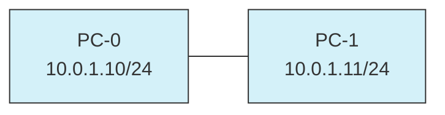

# Part 1: Basic Network Connectivity Between Two PCs

## Objective
To establish a direct connection between two computers and verify basic network connectivity using IPv4 addressing.

## Topology Diagram

## Network Device Table

| Device | Interface | IP Address | Subnet Mask | Default Gateway |
|--------|-----------|------------|-------------|-----------------|
| PC-0   | NIC       | 10.0.1.10  | 255.255.255.0 | N/A           |
| PC-1   | NIC       | 10.0.1.11  | 255.255.255.0 | N/A           |

## Instructions

1. **Creating the Network Topology**:
   - Open Cisco Packet Tracer
   - Add two PC devices from the End Devices panel
   - Name them PC-0 and PC-1

2. **Connecting the Devices**:
   - Select the appropriate connection type (crossover cable)
   - Click on PC-0 and select the FastEthernet port
   - Click on PC-1 and select the FastEthernet port to complete the connection

3. **Configuring IP Addresses**:
   - For PC-0:
     - Open PC-0 by double-clicking on it
     - Go to Desktop tab > IP Configuration
     - Set IP address to 10.0.1.10
     - Set Subnet Mask to 255.255.255.0
     - Leave Default Gateway blank

   - For PC-1:
     - Open PC-1 by double-clicking on it
     - Go to Desktop tab > IP Configuration
     - Set IP address to 10.0.1.11
     - Set Subnet Mask to 255.255.255.0
     - Leave Default Gateway blank

4. **Testing Connectivity**:
   - On PC-0, open Command Prompt
   - Run `ipconfig` to verify IP configuration
   - Run `ping 10.0.1.11` to test connectivity to PC-1
   - On PC-1, perform similar verification

## Expected Results
- The `ipconfig` command should display the correct IP configuration
- The ping should be successful with replies from the other PC
- The connection indicators on the topology should turn green

## Explanation

This basic network setup demonstrates several fundamental networking concepts:

1. **Direct PC-to-PC Connection**: 
   - Two computers can be directly connected using a crossover cable (represented by the dashed line)
   - No additional networking devices (switches/routers) are needed for this simple connection

2. **IPv4 Addressing**:
   - Each device requires a unique IP address within the same subnet
   - The 10.0.1.0/24 subnet is used (private IP range)
   - No default gateway is needed since both computers are on the same network segment

3. **Network Testing Tools**:
   - The `ipconfig` command displays network configuration
   - The `ping` command tests connectivity by sending ICMP echo requests

This first part serves as the foundation for more complex network topologies and concepts that will be built upon in the subsequent parts of the lab project.