# Part 2: Network Connectivity Using Switches

## Objective
To establish network connectivity between two PCs through network switches, demonstrating basic LAN configuration and switch operation.

## Topology Diagram

```mermaid
graph TD
    subgraph " "
        PC0["PC-0<br/>🖥 IP: 10.20.1.10/24<br/>Port: Fa0/1"]:::pc
        PC1["PC-1<br/>🖥 IP: 10.20.1.11/24<br/>Port: Fa0/1"]:::pc
        SW1["Switch-1<br/>2960-24TT<br/>🟢 Fa0/1 (to PC-0)<br/>🔵 Fa0/23 (to SW2)"]:::switch
        SW2["Switch-2<br/>2960-24TT<br/>🟢 Fa0/1 (to PC-1)<br/>🔵 Fa0/23 (to SW1)"]:::switch
    end

    PC0 ---|Fa0/1| SW1
    PC1 ---|Fa0/1| SW2
    SW1 ---|Fa0/23| SW2

    classDef pc fill:#d4f1f9,stroke:#333,stroke-width:1px;
    classDef switch fill:#c5e8b7,stroke:#333,stroke-width:1px;
    class PC0,PC1 pc;
    class SW1,SW2 switch;

```

## Network Device Table

### Device IP Configuration

| Device | Interface | IP Address  | Subnet Mask   | Default Gateway |
|--------|-----------|-------------|---------------|-----------------|
| PC-0   | NIC       | 10.20.1.10  | 255.255.255.0 | N/A             |
| PC-1   | NIC       | 10.20.1.11  | 255.255.255.0 | N/A             |

### Switch Port Configuration

| Device   | Port  | Connection To | Port Type | VLAN |
|----------|-------|--------------|-----------|------|
| Switch-1 | Fa0/1  | PC-0         | Access    | 1    |
| Switch-1 | Fa0/23 | Switch-2     | Access    | 1    |
| Switch-2 | Fa0/1  | PC-1         | Access    | 1    |
| Switch-2 | Fa0/23 | Switch-1     | Access    | 1    |

## Instructions

1. **Creating the Network Topology**:
   - Open Cisco Packet Tracer
   - Add two PC devices from the End Devices panel
   - Add two Cisco 2960-24TT switches from the Network Devices panel
   - Name them PC-0, PC-1, Switch-1, and Switch-2 respectively

2. **Connecting the Devices**:
   - Use straight-through cables to connect:
     - PC-0 to Switch-1 (PC NIC to FastEthernet0/1)
     - PC-1 to Switch-2 (PC NIC to FastEthernet0/1)
   - Use a straight-through cable to connect:
     - Switch-1 FastEthernet0/23 to Switch-2 FastEthernet0/23

3. **Configuring IP Addresses**:
   - For PC-0:
     - Open PC-0 by double-clicking on it
     - Go to Desktop tab > IP Configuration
     - Set IP address to 10.20.1.10
     - Set Subnet Mask to 255.255.255.0
     - Leave Default Gateway blank

   - For PC-1:
     - Open PC-1 by double-clicking on it
     - Go to Desktop tab > IP Configuration
     - Set IP address to 10.20.1.11
     - Set Subnet Mask to 255.255.255.0
     - Leave Default Gateway blank

4. **Switch Configuration**:
   - No specific configuration is needed for the switches in this basic setup
   - Switches will operate in their default configuration
   - All ports are in VLAN 1 by default

5. **Testing Connectivity**:
   - On PC-0, open Command Prompt
   - Run `ipconfig` to verify IP configuration
   - Run `ping 10.20.1.11` to test connectivity to PC-1
   - On PC-1, perform similar verification

## Expected Results
- The `ipconfig` command should display the configured IP addresses
- The ping should be successful with replies from the other PC
- The connection indicators on the topology should turn green after a brief initialization period

## Explanation

This network setup demonstrates several important networking concepts:

1. **Switch Operation**:
   - Switches operate at Layer 2 (Data Link Layer) of the OSI model
   - They use MAC addresses to forward frames between connected devices
   - Switches build a MAC address table by learning which devices are connected to which ports
   - When a frame arrives, the switch checks its MAC address table and forwards the frame only to the appropriate port

2. **LAN Connectivity**:
   - Multiple switches can be connected to extend a LAN
   - PCs connected to different switches can communicate as if they were on the same segment
   - No router is needed since all devices are in the same subnet (10.20.1.0/24)

3. **Direct vs. Indirect Connectivity**:
   - Unlike Part 1, the PCs are not directly connected to each other
   - Traffic must flow through the switches, which demonstrates how most real networks operate
   - This provides scalability as more devices can be added to either switch

4. **Cable Selection**:
   - Straight-through cables are used (not crossover) because:
     - PCs (DTE) connect to switches (DCE)
     - Modern switches have auto-MDIX capability which can detect and adjust for cable type

This setup lays the groundwork for understanding more complex networks with VLANs, inter-VLAN routing, and other advanced concepts covered in subsequent parts of the lab.